## **Architecture Des Applications Web**

+ Le but de ce chapitre est de clarifier la conception et la creation d'architectures d'infrastructures pour améliorer votre efficacité lors de la création d'applications Web.
+ Le public principal est constitué d'architectes de solutions et de responsables du développement.
+ Le guide fournit des conseils au niveau de la conception pour l'architecture et la conception d'applications `Web` basés sur `AWS et Containers`.
+ L'accent est mis sur le partitionnement de l'application en différents niveaux tels que le `niveau Web, le niveau Base de données et l'équilibrage de charge, etc`.
+ Le cœur d'une application `Web` est sa logique côté serveur et nous avons besoin qu'elle reste sécurisée et hautement disponible.

+ L'application doit être à plusieurs niveaux et non sur une seule machine.

<h1 style="color: red;">Ne mettez pas vos œufs dans le même panier.</h1>

+ Moyens:

    + **Ne faites pas tout dépendre d'une seule chose.**
    + **Ne mettez pas toutes ressources dans une seule chose.**
    + **Ne dépendez pas de votre réussite sur un seul plan.**
    + **Ne concentrez pas vos tous efforts dans un seul domaine.**

+ `La couche d'application Web` elle-même peut être composés de nombreuses couches distinctes.
+ L'exemple typique est une `architecture à trois couches` composée de présentation, de gestion et de données.
+ La figure illustre `l'architecture d'une application Web` avec des composants communs regroupés par différents domaines de préoccupation.

+ Ce chapitre traite de quelques conceptions architecturales utilisés pour les applications Web. 
+ Chaque conception fournit un ou plusieurs exemples de solutions architecturales pour une application Web moderne.

## **ARCHITECTURE DES APPLICATIONS WEB 1**

### **1. Le Concept Client et Serveur**

+ `Le développement Web` est une question de communication et de partage d'informations. Dans ce cas, communication entre deux parties, via le protocole `HTTP`:

  + `Le serveur` : Cette partie est responsable du service des pages.
  + `Le client` : Cette partie demande des pages au serveur et affiche à l'utilisateur. Dans la plupart des cas, le `client` est un navigateur `Web`.
  + `L'Utilisateur` : L'utilisateur utilise le `Client` pour surfer sur le `Web`, remplir des formulaires, regarder des vidéos en ligne, etc.

### **2. Equilibrage de Charge**

+ `L'équilibrage de charge` fait référence à une répartition efficace et habile du trafic réseau entrant sur un groupe de serveurs `back-end`, également appelé `batterir de serveurs ou pool de serveurs`.
+ Les sites `Web` modernes à fort traffic doivent répondre à des centaines de milliers, voire des millions, de requêtes simultanées d'utilisateurs ou de clients et renvoyer le texte, les images, la vidéo ou les données d'applications correctes, le tout de manière rapide et fiable.
+ Pour évoluer de manière rentable afin de répondre à ces volumes élevés, les meilleures pratiques informatiques modernes nécessitent généralement l'ajout de serveurs supplémentaires.

#### **2.1 Equilibreur de Charge**

+ Un `équilibreur de charge` agit comme un `agent du trafic` qui agi agit comme un contrôleur de trafic devant vos serveurs et achemine les demandes des clients sur tous les serveurs capables de répondre à ces demandes d'une manière qui maximise la vitesse et l'utilisation de la capacité et garantit qu'aucun serveur n'est surchagé ou surmené,ce qui dégrader les performances du serveur ou laisser tomber l'ensemble du serveur.
+ Si un seul serveur tombe en panne l'équilibreur redirige le trafic vers les serveurs en ligne restants. 
+ Lorsqu'un nouveau serveur est ajouté au groupe de serveurs, l'équilibreur de charge commence automatiquement à lui envoyer des requêtes.
+ De cette manière, un équilibreur de charge remplit les fonctions suivantes :
  + Distribue efficacement les requêtes des clients ou la charge réseau sur plusieurs serveurs.
  + Assure une haute disponibilité et fiabilité en envoyant des requêtes uniquement aux serveurs en ligne.
  + Offre la flexibilité d'ajouter ou de soustraire des serveurs comme la demande l'exige.

#### **2.2 Algorithmes d'équilibrage de charge**

+ Il existe différents algorithmes d'équilibrage de charge disponibles et chacun offre des avantages différents; le choix de la méthode d'équilibrage de charge dépend de vos besoins :

  + `Round Robin` : Les requêtes sont réparties séquentiellement sur le groupe de serveurs.
  + `Moins de connexions` : Une nouvelle demande est envoyée au serveur avec le moins de connexions actuelles aux clients. La capacité informatique relative de chaque serveur est prise en compte pour déterminer celui qui a le moins de connexions.
  + `Hachage IP` : L'`adresse IP` du client est utilisé pour déterminer quel serveur reçoit la demande.

#### **2.3 Configuration Dynamique des Groupes de Serveurs**

+ Pour une application en évolution rapide, de nouveaux serveurs doivent être ajoutés ou supprimés de manière constante.
+ Ceci est courant dans les environnements tels qu'`Amazon Elastic Compute Cloud (EC2)`, qui permet aux utilisateurs de payer uniquement pour la capacité de calcul qu'ils utilisent réellement, tout en garantissant que la capacité augmente en réponse aux pics de trafic.
+ Dans de tels environnements, il est très utile que l'équilibreur de charge puisse ajouter ou supprimer dynamiquement des serveurs du groupe sans interrompre les connexions existantes. 

#### **2.4 Equilibrage de Charge Matériel et Logiciel**

+ Les fournisseurs de solutions matérielles chargent des logiciels propriétaires sur la machine qu'ils fournissent, qui utilise souvent des processeurs spécialisés.
+ Pour faire face à l'augmentation du trafic sur votre site `Web`, vous devez acheter des machines plus nombreuses ou plus grandes auprès du fournisseur.
+ Les solutions logicielles fonctionnent généralement du matériel standard, ce qui les rend moins coûteuses et plus flexibles.
+ Vous pouvez installer le logiciel sur le matériel de votre choix ou dans des environnements cloud comme `AWS EC2`.

<h4 style="color: red;"> Remarque : Nous incluons ici Nginx comme équilibreur de charge</h4>

#### **2.5 NGINX/ NGINX plus comme Equilibreur de Charge**

+ `NGINX+ et NGINX` sont utilisés par de nombreux développeurs pour les solutions d'équilibrage de charge pour les sites `Web` à fort trafic tels que `Dropbox,Netflix, Zynga,NGINX+ et NGINX` pour diffuser le contenu de manière rapide, fiable et sécurisée.
+ Lorsque vous incluez `NGINX+` comme équilibreur de charge devant vos batteries d'applications et de serveurs `Web`, cela augmente l'efficacité, les performances et la fiabilité de votre site `Web`.
+ `NGINX+` vous aide à maximiser à la fois la satisfaction client et le routeur sur vos investissements informatiques.

#### **2.6 Comment Configurer Nginx Comme Equilibreur de Charge ?**

+ Les étapes nécessitent que l'utilisateur dispose des privilèges `root` sur votre serveur privé virtuel `(VPS)`.
+ Avant de configurer l'équilibrage de charge `nginx`, vous devez avoir installé `nginx` sur votre `VPS`. 
  + Vous pouvez l'installer rapidement avec `apt-get`:
  

#### **2.7 Module Upstream**

+ Afin de mettre en place un équilibreur de charge `round robin`, nous devons utiliser le module `mount nginx`.
+ Nous intégrerons la configuration dans les paramètres `nginx`.
+ Allez-y et ouvrez la configuration de votre site `Web`(utilisation de l'hôte virtuel générique par défaut):
  

+ Nous devons aussi ajouter la configuration d'équilibrage de charge au fichier. Nous devons d'abord inclure le module `Upstream` qui ressemble à ceci :
  

### **2.8 Redémarrer Nginx**

+ Tant que tous les serveurs privés virtuels sont en place, vous devriez maintenant constater que l'équilibreur de charge commencera à repartir également les visiteurs sur les serveurs liés.

#### **2.9.1 Directives**

+ La section précédente expliquait comment répartir équitablement la charge sur plusieurs serveurs virtuels.
+ Cependant, il existe de nombreuses raisons pour lesquelles cette méthode n'est peut-être la plus efficace pour travailler avec des données.
+ Il existe plusieurs directives que nous utiliser pour diriger plus efficacement les visiteurs du site.

#### **2.9.2 Les poids**

+ Une façon de commencer à attribuer les utilisateurs avec plus de précision consiste à attribuer un poids spécifique à certaines machines.
+ `Nginx` nous permet d'attribuer un numéro spécifiant la proportion de trafic qui doit être dirigée vars chaque serveur.
  

+ Le `poids` par défaut est `1`. Avec un `poids` de `2`, le `backend 2` recevra par exemple plus de  trafic que le `backend 1` et le `backend 3`, avec un `poids` de `4`, traitera deux fois plus de trafic que le `backend 2` et 4 fois autant que le `bacend 1`.

#### **2.9.3 Hachage**

+ Le `Hachage IP` permet aux serveurs de répondre aux clients en fonction de leur `adresse IP`, renvoyant les visiteurs vers le même `VPS` à chaque visite(sauf si ce serveur est en panne).
+ Si un serveur est inactif, il doit être marqué comme étant inactif. 
+ Toutes les `adresses IP` censés être acheminées vers le serveur en panne sont ensuite redirigées vers un autre serveur.
  

#### **2.9.4 Nombre Maximum d'échecs**
+ Sur la base des paramètres de `round robin` par défaut, `nginx` continuera à envoyer des données aux serveurs privés virtuels, même si les serveurs ne répondent pas.
+ Les échecs maximum peuvent automatiquement empêcher cela en rendant les serveurs qui ne répondent pas inopérants pendant une durée définie.
+ Il existe deux facteurs associés au nombre maximal d'échecs : `max_fails` et `fail_timeout`.
+ Le nombre maximum d'échecs fait référence au nombre maximum de tentatives infructueuses de connexion à un serveur avant qu'il ne soit considérécomme inactif.
+ `Fail_timeout` spécifie la durée pendant laquelle le serveur est considéré comme inopérant.
+ Une fois le délai expiré, de nouvelles tentatives pour accéder au serveur recommenceront.
+ La valeur du délai d'expiration par défaut est de 10s.
  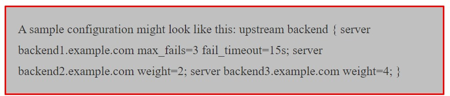

## **3. Serveur HTTP Apache**

+ Le serveur `HTTP Apache`est un logiciel de serveur `Web` multiplateforme gratuit et open source, publié selon les termes d'`Apache`.
+ `Apache` est developpé et maintenu par une communauté ouverte de développeurs sous l'`Apache Software Foundation`.
+ Le projet développe et maintient `HTTP Open Source` pour les systèmes d'exploitations modernes, notamment `UNIX et Windows`.
+ Le serveur `Web Apache HTTP` reste le serveur `Web` le plus utilisé au monde.

#### **Windows d'installation du Serveur HTTP Apache :**

+ Télécharger le serveur `HTTP Apache` du programme d'installation ici :
 + [Téléchargement](http://httpd.apache.download.cgi)
+ Assurez-vous de télécharger : `apache_2.2.16-win32-x86-no_ssl MSI`.
+ Remarque : la version du serveur `HTTP Apache` peut être différente au moment de votre installation.

#### **Installation du Serveur HTTP Apache Linux(Ubuntu)**
+ Sur `Ubuntu`, vous pouvez installer le serveur `HTTP Apache` avec la commande suivante.
  

### **4. Serveur Tomcat**
+ `Tomcat` également developpé par [Apache](http://www.apache.org), est une implémentation de référence standard pour les `servlets Java et JSP`.
+ Il peut être utilisé de manière autonome en tant que `Serveur Web` ou être connecté à un serveur Web tel qu'`Apache, Netscape Entreprise Server ou Microsoft Internet Information Server`.
+ Il existe de nombreuses versions de `Tomcat`. Ici, nous utilisons `Tomcat 5.5.9` comme exemple.
+ Les mêmes étapes devraient également s'appliquer à toutes les versions ultérieures de `Tomcat`.
+ `Remarque :` Pour utiliser `Tomcat`, nous avons besoin de `JDK` installé sur notre système.

#### **Configuration du JDK**

**1.** Cette étape implique le téléchargement d'une implémentation du kit de développement logiciel (SDK) Java et la configuration appropriée de la variable d'environnement `PATH`.

**2.** Vous pouvez télécharger le `SDK` depuis le site `Java d'Oracle` - Téléchargements `Java SE`.

**3.** Une fois que vous avez téléchargé votre implémentation Java, suivez les instructions données pour installer et configurer l'installation. Enfin, définissez les variables d'environnements `PATH` et `JAVA HOME` pour qu'elles fassent référence au répertoire contenant `java` et `javac`, généralement `java_install_dir/bin` et `java_install_dir` respectivement.

**4.** Si vous exécutez `Windows` et installez le `SDK` dans `C:\jdk1.8.0_60`, vous devez ajouter la ligne suivante dans votre fichier `C:\autoexec.bat`.

**5.** Définissez `PATH = C:\jdk1.8.0_60\bin;%PATH%`

**6.** Définissez `JAVA_HOME=C:\jdk1.8.0_60\bin`

#### **Installation de Tomcat**

+ **Linux**
  
+ (Installez la version requise de Tomcat)

+ **Windows**
  + Télécharger la dernière version de [Tomcat](https://tomcat.apache.org/)
  + Une fois l'installation téléchargée, décompressez la distribution binaire dans un emplacement pratique.
  + Par exemple, dans `C:\apache-tomcat-5.5.29` sous `Windows` ou `/usr/local/apache-tomcat-5.5.29` sous `LINUX/UNIX` et créez la variable d'environnement `CATALINA_HOME` pointant vers ces emplacements.

+ **Démarrer Tomcat**

  + Tomcat peut être démarré en exécutant les commandes suivantes sur la machine Windows :
    + `%CATALINA_HOME%\bin\startup.bat` ou
    + `C:\apache-tomcat-5.5.29\bin\startup.bat`
  
  + `Tomcat` peut être démarré en exécutant les commandes suivantes sur la machine `UNIX(Solaris, Linux, etc.)`
    + `$ cd CATALINA_HOME/bin/`
    + `$ ./startup.sh` 
    + ou `$ cd C/usr/local/apache-tomcat-5.58.29/bin/` puis `$ ./startup.sh` .
+ Tomcat seront disponibles en visitant `http://localhost:8080/`

### **5. Base de données**

+ `Une base de données` est une application distincte qui stocke une collection de données.
+ Chaque base de données dispose d'une `API` distinctes pour créer, accéder, gérer, rechercher et répliquer les données qu'elle contient. 
+ D'autres types de magasins de données peuvent être également utilisés, tels que des `fichiers sur le système de fichiers ou de grandes tables de hachage en mémoire`, mais la récupération et l'écriture des données ne seraient pas aussi rapides et faciles avec ce type de systèmes.

+ Eh bien, il existe aujourd'hui des tonnes de types de bases de données. 
+ De nombreuses entreprises développent leurs propres bases de données pour les adapter à leurs besoins.
+ Tout d'abord, il y a les bases de données relationnelles, c'est là que l'industrie a commencé, elles utilisent des schémas de type `table` et stocke les données sur disque.
+ Ce type de bases de données est très efficace des données commerciales. Par exemple `MySQL, Postgres, SQL Server, etc`.
+ Ensuite, il y a les bases de données `NoSQL`. Ce type de bases de données couvre un grand nombre de technologies dans lesquelles vous pouvez trouver des bases de données clés-valeur.
+ Vous trouverez des bases de données comme `MongoDB, Cassandra, Neo4j`.
+ Remarque: Ici, nous avons utilisé la base de données relationnelle `MySQL`.

+ Nous utilisons des `systèmes de bases de données relationnelles (SGBDR)` pour stocker et gérer d'énormes volumes de données.
+ C'est ce qu'on appelle une `base de données relationnelle` car toutes les données sont stockées dans différentes tables et les relations sont établies à l'aide de clés primaires ou d'autres clés appelés `clés étrangères`.
+ `Un système de gestion de base de données relationnelle (SGBDR)` est un logiciel qui vous permet d'implémenter une base de données avec des tables, des colonnes et des index.
+ Garantit l'intégrité référentielle entre les lignes de différentes tables. 
+ Met à jour les index automatiquement.
+ Interprète une requête `SQL` et combine les informations de diverses tables.

#### **5.1 Base de données MySQL**
+ `MySQL` est le système de gestion de base de données `SQL` relationnelle `Open Source` le plus populaire.
+ `MySQL` est l'un des meilleurs `SGBDR` utilisés pour développer diverses applications logicielles basés sur le `Web`.

**Windows**

+ L'installation par défaut sur n'importe quelle version de `Windows` est désormais beaucoup plus simple qu'avant, car `MySQL` est désormais soigneusement fourni avec un programme d'installation.
+ Téléchargez simplement le package d'installation, décompressez-le n'importe où et exécutez le fichier [setup.exe](https://dev.mysql.com/downloads/installer/)
+ Le programme d'installation par défaut `setup.exe` vous guidera à travers le processus trivial et installera par défaut tout sous `C:\mysql`.

**Linux :**
+ Pour l'installer, mettez simplement à jour l'index du package sur votre serveur et installez le package par défaut avec `apt-get`.
  

+ **Remarque:** Ici, nous utilisons `Linux` comme `système d'exploitation`.

**Liste de quelques commandes MYSQL**
  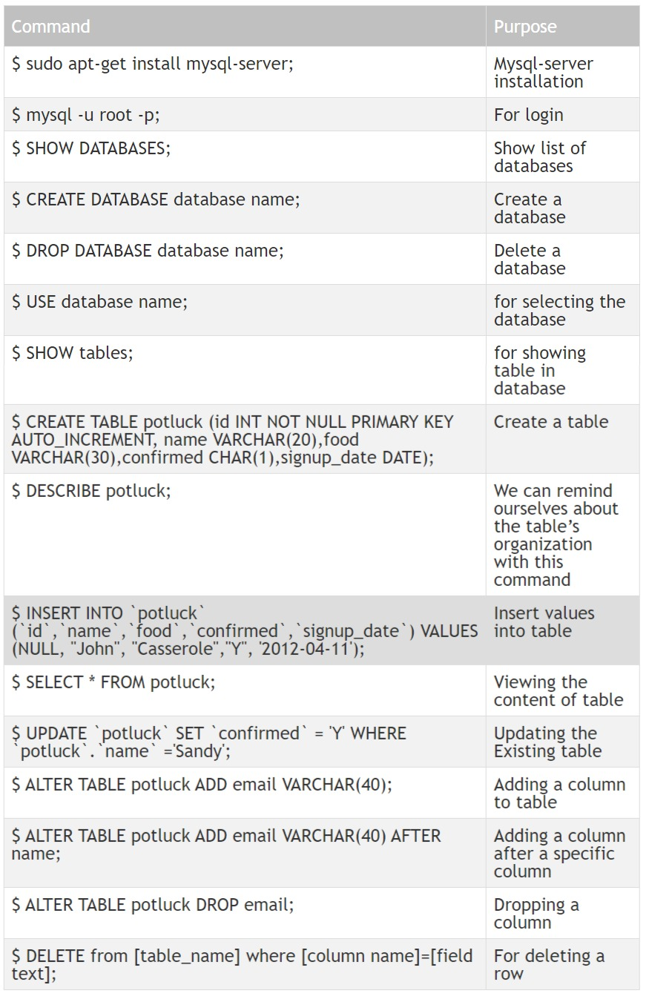

### **Architecture Des Applications WEB 2**

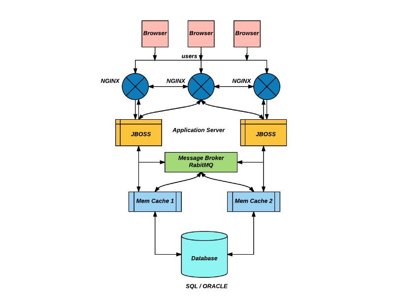

#### **Navigateur Web**
+ Les navigateurs Web les plus populaires utilisés sont `Mozilla Firefox, Google Chrome, Microsoft Internet Explorer, Apple Safari et le navigateur Opéra`.
+ Ces navigateurs sont gratuits et disponibles pour téléchargement et utilisation.
+ Les navigateurs Web permettent aux utilisateurs d'afficher les ressources stockées sur un serveur.
+ Par exemple, si vous visitez `www.google.com`, vous consultez en réalité un fichier affiché à l'aide d'un navigateur Web.
+ Ce fichier est redirigé à l'aide du langage de balisage hypertexte, ou `HTML` en abrégé.
+ Ces fichiers ou page `Web` comme on les appelle communément, sont extrait du `serveur Web`, puis traduit par le navigateur `Web`.
+ Si vous ne disposez pas d'un navigateur `Web` et essayez d'afficher le fichier `HTML`, vous verrez de nombreuses lignes de code qui peuvent ne pas avoir de sens pour l'utilisateur moyen.
+ Le navigateur traduira ces lignes de code, ce qui les rendra facilement lisibles pour l'utilisateur.

<h4 style="color: red;">Remarque: Web Application Architecture 1 donne une idée claire pour installer et configurer Nginx en tant qu'équilibreur de charge. Reportez-vous à l'architecture d'application Web 1.</h4>

#### **JBOSS**

+ `JBOSS` est un serveur d'applications, c'est le serveur d'applications Open Source le plus utilisé sur le marché.
+ L'architecture de serveur hautement flexible et facile à utiliser a fait `JBOSS` le choix idéal pour les utilisateurs débutant avec `J2EE`, ainsi que pour les architectes séniors à la recherche d'une plateforme middleware personnalisable.
+ Les distributions du binaire du serveur et du code source sont disponibles dans le référentiel [SourceForge](http://sourceforge.net/projects/jboss).
+ La disponibilité immédiate du code source vous permet de déboguer le serveur, d'apprendre son fonctionnement interne et de créer des versions personnalisées pour votre usage personnel ou professionnel.

+ Ce chapitre est un didacticiel étape par étape qui vous montrera comment installer et configurer `JBOSS 4.0`.
+ Plus précisément, vous apprendrez comment :

  + Obtenir les binaires mis à jour à partir du site du projet `JBOSS SourceForge`.
  + Installer le binaire.
  + Tester l'installation.
  
+ Vous découvrirez également :

  + La structure du répertoire d'installation.
  + Les fichiers de configuration clés qu'un administrateur peut souhaiter à utiliser pour personnaliser l'installation de `JBOSS`.
  + Obtention du code source de la version 4.0 à partir du référentiel `CVS SourceForge`.
  + Construire la distribution du serveur.
  
**Obtenir Les Fichiers Binaires**

+ La version la plus récente de `JBOSS` est disponible sur la page des fichiers de projet [SourceForge JBoss](http://sourceforge.net/projects/jboss)
+ Vous trouverez également les versions précédentes ainsi que les versions bêta et candidates des versions à venir.

**Conditions préalables**

+ Avant d'installer et d'exécuter le serveur, vérifiez votre système pour vous assurer que vous disposez d'une installation `JDK 1.4+` fonctionnelle.
+ Le moyen le plus simple de procéder consiste à exécuter la commande via la commande `java -version` pour vous assurer que l'exécutable `Java` se trouve dans votre chemin et que vous utilisez la version `1.4`.
+ Par exemple, exécuter cette commande avec un `JDK 1.4.1` produirait un numéro de version comme celui-ci.
  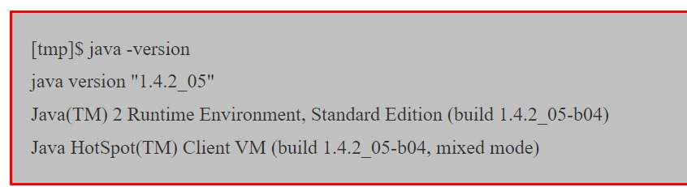

**Installation Du Package Binaire**
+ Une fois que vous avez l'archive binaire que vous souhaitez installer, utilisez l'outil `JDK jar (ou tout autre outil d'extraction ZIP)` pour extraire le contenu de l'archive `jboss-4.0.1.zip` dans un emplacement de votre choix.
+ L'archive `jboss-4.0.1.tgz` est un fichier `tar` compressé qui nécessite un `tar` compatible avec `Gnutar` qui peut gérer les noms de chemins longs dans l'archive.
+ Les binaires `tar` par défaut sur `Solaris` et `OS X` ne prennent actuellement pas en charge les noms de chemin longs.
+ Les processus d'extraction créera un répertoire `jboss-4.0.1`. La section suivante explore le contenu de ce répertoire.

**Structure Du Répertoire**
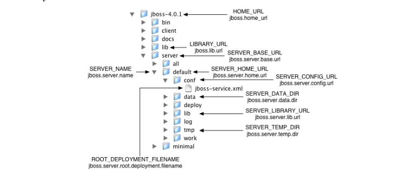

**L'ensemble De Fichiers De Configuration Du Serveur Par Défaut**
+ Le répertoire `JBOSS_DIST/server` contient un ou plusieurs ensembles de fichiers de configuration.
+ L'ensemble de fichiers de configuration `JBOSS` par défaut se trouve dans le répertoire `JBOSS_DIST/server/default`.
+ `JBOSS` vous permet d'ajouter plusieurs jeux de configuration afin qu'un serveur puisse facilement être exécuté à l'aide d'autres configurations.
+ La création d'un nouvel ensemble de fichiers de configuration commence généralement par la copie de l'ensemble de fichiers par défaut dans un nouveau répertoire, puis par la modification de fichiers de configuration comme vous le souhaitez.
  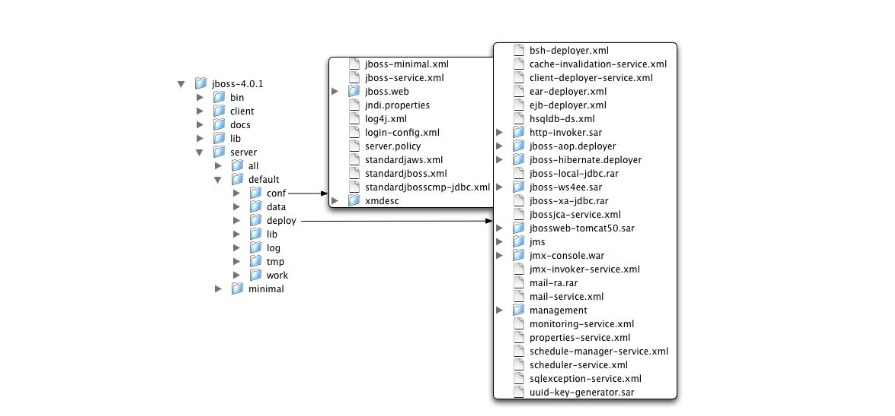

**Tests D'installation De Base**

+ Une fois que vous avez installé la distribution `JBOSS`, il est judicieux d'effectuer un simple test de démarrage pour valider qu'il n'ya pas de problèmes majeurs avec votre combinaison `Java VM/Système d'exploitation`.
+ Pour tester votre installation, accédez au répertoire `JBOSS_DIST/bin` et exécutez le script `run`.bat` ou `run.sh` selon votre système d'exploitation.
  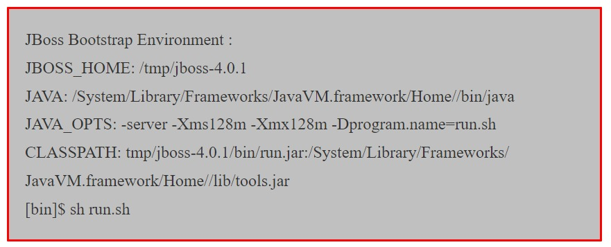

#### **RabbitMQ**
+ `RabbitMQ` est un logiciel de courtage de message open source (parfois appelé middleware orienté message) qui implémente le protocole `AMQP(Advanced Message Queuing Protocol)`.
+ Le serveur `RabbitMQ` est écrit dans le langage de programmation `Erlang` et est construit sur le framework `Open Telecom Platform` pour le `clustering et le basculement`.
  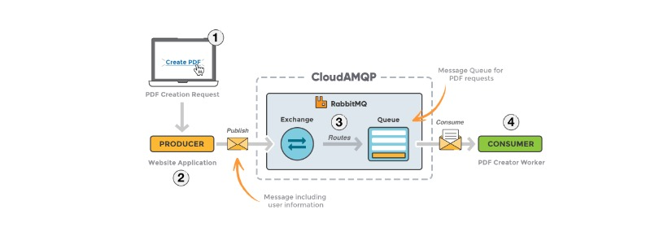

+ **Remarque :** Pour le guide d'installation de `RabbitMQ` suivez le lien indiqué :

  + https://www.rabbitmq.com/configure.html
  
+ **Remarque :** Pour des exemples de codes `RabbitMQ`, suivez le lien indiqué :

  + https://www.rabbitmq.com/getstarted.html
  

#### **Memcached**

+ `Memcached` est un système de mise en cache d'objets à mémoire distribuée gratuit et open source, hautes performances, de nature générique, mais destiné à être utilisé pour accélérer les `applications Web` dynamiques en allégeant la charge de base de données.
+ `Memcached` est un magasin clé-valeur en mémoire pour de petits morceaux de données arbitraires(chaînes, objets) provenant des résultats d'appels de base de données, d'appels d'API ou de rendu de page.
+ `Memcached` est simple mais puissant.
+ Sa conception simple favorise un déploiement rapide, une facilité de développement et résout de nombreux problèmes rencontrés avec les grands caches de données.
+ Son `API` est disponible pour les langues les plus populaires.

**Installer Memcached Sur Ubuntu**
+ Pour installer `Memcached` sur `Ubuntu`, accédez au terminal et tapez les commandes suivantes :
  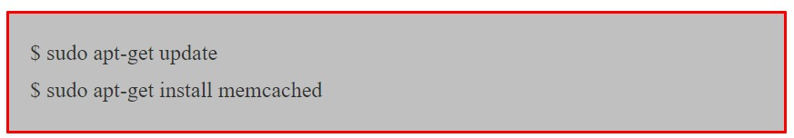

**Confirmation de l'installation De Memcached**
+ Pour vérifier si `Memcached` est actuellement en cours d'exécution ou non, exécutez la commande ci-dessous:
  

+ Cette commande devrait montrer que `Memcached` s'exécute sur le port par défaut `11211`.
+ Pour exécuter le `serveur Memcached` sur un autre port, exécutez la commande suivante:
  

+ Il doit démarrer le serveur et écouter sur le port `TCP 11111` et le port `UDP 11111` en tant que processus démon.
+ Cette commande est expliqué ci-dessous:
  + `-p` est pour le numéro de port `TCP`
  + `-U` est pour le numéro de port `UDP`
  + `-u` est pour le nom d'utilisateur
  + `-d` exécute `Memcached` en tant que processus démon.

+ Vous pouvez exécuter plusieurs instances du serveur `Memcached` via une seule installation.
  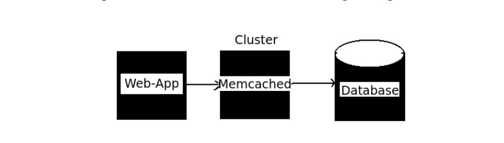

**Pourquoi Utilisons-nous Memcached ?**

1. Mise en cache.

  + 1.1. Requête de banque de données.
  + 1.2. Utiliser le jeton d'authentification et les données de session.
  + 1.3. Appels d'API ou autres données informatiques.

2. Partage de données entre instances d'application.

**Pourquoi avons-nous besoin de Memcached ?**
1. Améliorer les performances d'applications.
2. Réduire le coût des applications.

### **Architecture Des Applications WEB 3**
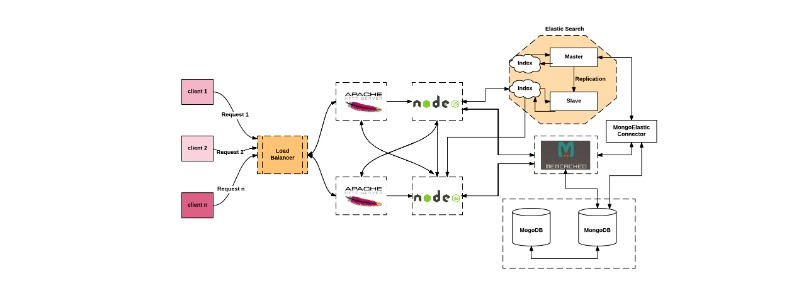

+ Cette architecture décrit une approche de conception d'applications Web lourdes pour une structure logicielle robuste, concurrente, à tolérance de pannes et distribuée.
+ Une application est robuste lorsqu'elle peut fonctionner de manière cohérente avec des données incohérentes.
+ Par exemple: une application cartographique est robuste lorsqu'elle peut analyser des adresses dans différents formats avec diverses fautes d'orthographe et renvoyer un emplacement utile.
+ Cette architecture d'application Web contient `l'équilibrage de charge, un gestionnaire de contenu statique, un gestionnaire de contenu dynamique(NodeJS), une recherche élastique(pour l'indéxation), Memcached, une base de données NoSQL(MongoDB).`

**Equilibreur de charge :**
<h4 style="color: red;">Remarque : Web Application Architecture 1 donne une idée claire pour l'installation et la configuration de Nginx en tant qu'équilibreur de charge. Reportez-vous à l'architecture d'application Web 1.</h4>

**Serveur HTTP Apache**
<h4 style="color: red;">Remarque : Web Application Architecture 1 donne une idée pour l'installation et la configuration du serveur HTTP Apache pour gérer le contenu statique de l'application. Reportez-vous à Web Application Architecture 1 pour plus de détails sur le serveur HTTP Apache.</h4>

**Serveur NodeJS**
+ `NodeJS` est un runtime `JavaScript` construit sur le moteur `JavaScript V8 de Chrome`.
+ `NodeJS` utilise une modèle d'`E/S` non bloquant et piloté par les événements qui rend léger et efficace.

  1. `NodeJS` n'est rien d'autre que du `JavaScript` exécuté sur le serveur.
  2. Utilisez-le pour créer une application puissante, rapide et évolutive.
  3. `NodeJS` utilise un modèle d`E/S` non bloquant et piloté par les événements.
  4. `NodeJS` utilise un modèle `thread` unique avec boucle d'événements.
  5. Les applications `NodeJS` ne mettent jamais de données en mémoire tampon. Ces applications génèrent simplement les données en morceaux.

**Exécution NodeJS**

+ Le code source écrit dans le fichier source sera uniquement du code `javascript` normal.
+ L'interpréteur `Node.js` sera utilisé pour interpréter et exécuter votre code `javascript`.
+ La distribution `Node.js` se présente sous la forme d'un binaire installable pour les systèmes d'exploitation `SunOS, Linux, Mac OS X et Windows` avec les architectures de processeur `x86 32bits(386) et 64 bits(amd64)`.
+ La section suivante vous explique comment installer la distribution binaire `Node.js` sur différents systèmes d'exploitation. 

**Télécharger Les Archives NodeJS**

+ Téléchargez la dernière version du fichier d'archive installable `Node.js` à partir de (https://nodejs.org/en/).
+ Au moment de la rédaction de ce didacticiel, voici les versions disponibles sur différentes systèmes d'exploitation.
  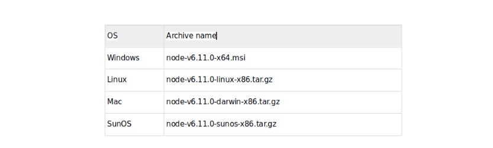

+ Ajoutez `/usr/local/nodejs/bin` à la variable d'environnement `PATH`

<h4 style="color: red;">Remarque : Sous Linux, nous pouvons effectuer l'installation directement à partir su shell Linux en utilisant le gestionnaire de packages apt. commandes suivantes.</h4>

+ Si le package contenu dans les référentiels répond à vos besoins, c'est tout ce que vous devez faire pour configurer `Node.js`.
+ Dans la plupart des cas, vous souhaiterez également installer `npm`, qui est le gestionnaire de packages `Node.js`. Vous pouvez le faire en tapant:
  

**Vérifier l'installation : Execution d'un fichier**
1. Ouvrez le terminal sous Linux et l'invite de commande sous Windows et utilisez la commande suivante.
   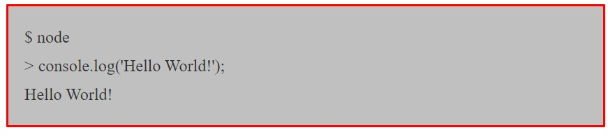

2. Créez un fichier nommé `app.js` sur votre machine `(Windows ou Linux)` ayant le code suivant.
   

+ Exécutez maintenant le fichier `app.js` à l'aide de l'interpréteur `Node.js` pour voir le résultat :
  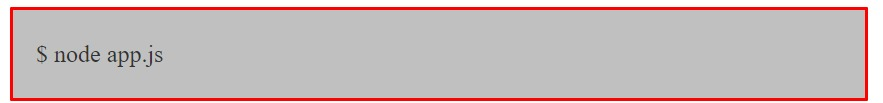

**Création d'une application Node.js**

+ Dans l'exemple ci-dessus, nous avons crée un exemple d'application pour exécuter `Hello World!`.
+ Dans le terminal imprimer `Hello World` sur un terminal n'est plus si excitant.
+ Passons à l'étape suivante et écrivons un programme qui répond à `Hello World` via `Http`.
+ Nous appellerons un fichier `hello_http.js` et y mettrons le code suivant :
  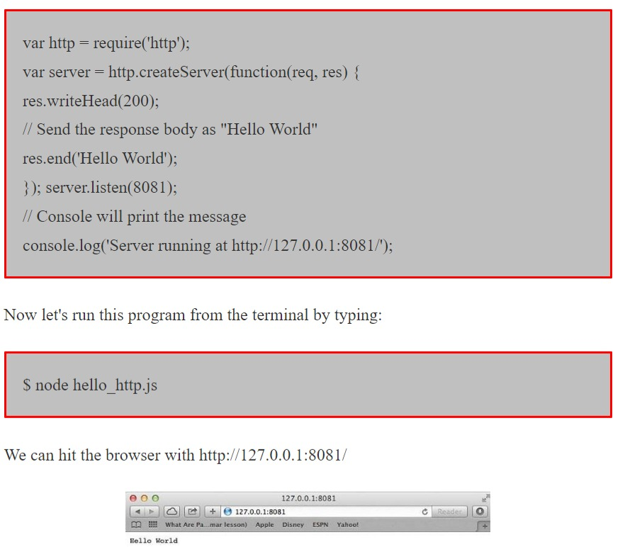

### **Elasticsearch**

+ `Elasticsearch` est un moteur de recherche et d'analyse en texte intégral distribué et open source en temps réel.
+ `Elasticsearch` est capable d'obtenir des réponses de recherches rapides car, au lieu de rechercher directement le texte, il recherche plutôt un index.
+ `Elasticsearch` est developpé en `Java`. `Elasticsearch` utilise les objets `JSON` comme réponses, ce qui permet d'appeler le serveur `Elasticsearch` avec un grand nombre de langages de programmation différents.

**Installation d'Elasticsearch**
+ Les étapes d'installation d'`Elasticsearch` sont les suivantes :

+ **Etape 1** - Vérifier et vérifiez que la version minimale de votre `Java` est installée sur votre ordinateur, il doit s'agir de `Java 7` ou d'une version plus mis à jour. Vous pouvez vérifier en procédant comme suit :
  + **Remarque :** Veuillez vous assurer que `JAVA_HOME` est défini, veuillez le définir dans les variables d'environnement sur `C:\ProgamFiles\Java\jre1.8.0_31` ou l'emplacement où vous avez installé `Java`.

+ Dans le système d'exploitation d'exploitation Windows(à l'aide de l'invite de commande).
  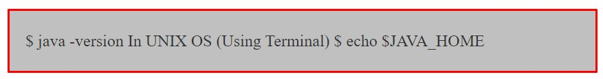

+ **Etape 2** - Téléchargez la dernière version d'`Elasticsearch` depuis : https://www.elastic.co/downloads/elasticsearch.

  + Pour le système d'exploitation Windows, téléchargez le fichier `ZIP`.
  + Pour le système d'exploitation `UNIX`, téléchargez le fichier `TAR`.
  + Pour le système d'exploitation `DEBIAN`, téléchargez le fichier `DEB`.
  + Pour `Red Hat` et d'autres distributions `Linux`, téléchargez le fichier `RPN`.
  + Les utilitaires `APT` et `YUM` peuvent également être utilisés pour installer `Elasticsearch` dans de nombreuses distributions `Linux`.
  
+ **Etape 3** - Le processus d'installation d'`Elasticsearch` est très simple et décrit ci-dessous pour différentes systèmes d'exploitation.

  + Systèmes d'exploitation Windows - Décompressez le package `zip` et `Elasticsearch` est installé.
  + `UNIX OS` - Extrayez le fichier `tar` dans n'importe quel emplacement et `Elasticsearch` est installé.

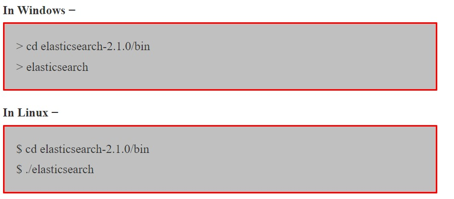

**Etape 5**
+ Le port par défaut de l'interface `Web Elasticsearch 9200` ou pouvez le modifier en modifiant `http.port` dans le fichier `elasticsearch.yml` présent dans le repertoire `bin`.
+ Vous pouvez vérifier si le serveur est opérationnel en parcourant `http://localhost:9200`.
+ Il renverra un objet `JSON` qui contient les informations sur `Elasticsearch` installé de la manière suivante :
  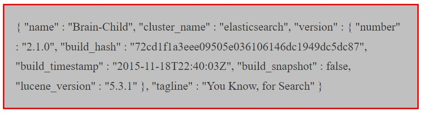

<h4 style="color: red;">Remarque : la description et l'installation de Memcached sont donnés dans l'architecture d'application Web-2. Veuillez référer à l'architecture d'application Web-2 pour plus de détails.</h4>

### **MongoDB**

+ `MongoDB` est une base de données open source orientée document. 
+ `MongoDB` est l'une des bases de données `NoSQL` les plus utilisés. 
+ `MongoDB` est écrit en `C++`.
+ Toutes les applications modernes nécessitent du `Big Data`, un développement rapide de fonctionnalités, un déploiement flexible et les anciens systèmes de bases de données ne sont pas assez compétents. 
+ `MongoDB` est donc conçu pour répondre à ces exigences.
  
**Fonctionnalité Prise en Charge par MongoDB :**

1. **Prise en charge des requêtes ad hoc** - Dans `MongoDB`, vous pouvez effectuer une recherche par champ, par plage et prend également en charge les recherches d'expressions régulières.
2. **Indexation** - Vous pouvez indexer n'importe quel champ d'un document.
3. **Réplication** - `MongoDB` prend en charge la réplication maître-esclave.
4. **Duplication des données** - `MongoDB` peut fonctionner sur plusieurs serveurs. Les données sont dupliquées pour maintenir le système opérationnel et également conserver son état de fonctionnement en cas de panne matérielle.
5. **Sans schéma.**
6. **Evolutivité.**
7. **Performances.**
8. **Haute disponibilité.**
9. Passage de déploiements de serveur unique à de grandes architectures multisites complexes.

**Installer MongoDB Sous Windows**

+ Pour installer `MongoDB` sur `Windows`, téléchargez d'abord la dernière version de `MongoDB` depuis : https://www.mongodb.org/downloads.
+ Assurez-vous d'obtenir la version correcte de `MongoDB` en fonction de votre version `Windows`.
+ Les versions 32 bits de `MongoDB` ne prennent en charge que les bases de données inférieures à `2 Go` et conviennent uniquement à des fins de test et d'évaluation.
+ Extrayez maintenant votre fichier téléchargé sur le lecteur `c:\` ou tout à autre emplacement.
+ Assurez-vous que le nom du dossier extrait est `mongodb-win32-i386-[version] ou mongodb-win32-x86_64-[-version]`.
+ `[version]` est la version de téléchargement de `MongoDB`.
+ Ensuite, ouvrez l'invite de commande et exécutez la commande suivante:
  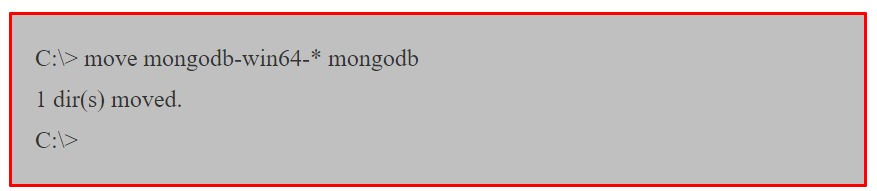

+ Dans le cas où vous avez extrait `MongoDB` à un emplacement différent, accédez ce chemin en utilisant la commande `cd FOLDER/DIR` et exécutez maintenant le processus indiqué ci-dessus.
+ `MongoDB` nécessite un dossier de données pour stocker des fichiers.
+ L'emplacement par défaut du répertoire de données `MongoDB` est `c:\data\db`.
+ Vous devez donc créer ce dossier à l'aide de l'invite de commande. Exécutez la séquence de commande suivante.
  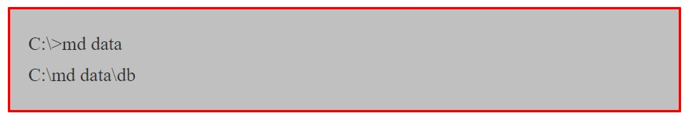

+ Si vous devez installer `MongoDB` à un emplacement différent, vous devez spécifier un autre chemin pour `\data\db` en définissant le chemin `dbpath` dans `mongod.exe`.
+ Pour la même chose, exécutez les commandes suivantes.
+ Dans l'invite de commande, accédez au repertoire `bin` présent dans le dossier d'installation de `MongoDB`.
+ Supposons que le nom du dossier d'installation soit `D:\Software\mongodb`.
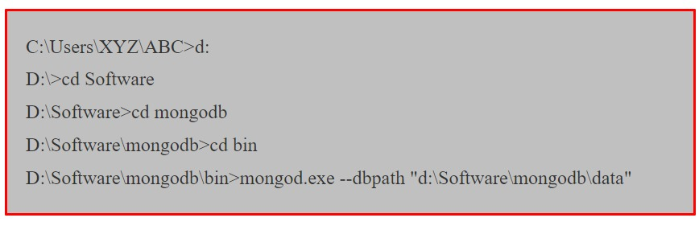

+ Le résultat affichera un message d'attente de connexions sur la sortie de la console, ce qui indique que le processus `mongod.exe` avec succès. Exécuter `MongoDB`:
  + Maintenant, pour exécuter `MongoDB`, vous devez ouvrir une autre invite de commande et exécuter la commande suivante.
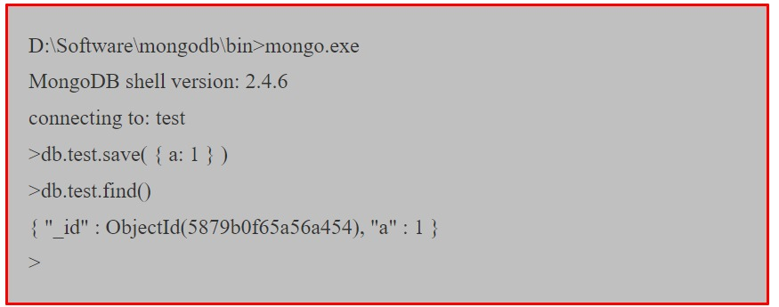

+ Cela montrera que `MongoDB` est installé et exécuté avec succès. 
+ La prochaine fois que vous exécuterez `MongoDB`, vous devrez émettre uniquement des commandes.
  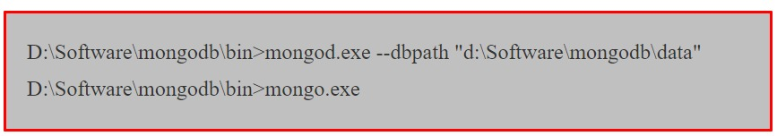

**Installez MongoDB sur Ubuntu**

+ Importez la clé publique utilisée par le système de gestion des packages.
+ Exécutez la commande suivante pour importer la clé `GPG` publique `MongoDB`.
  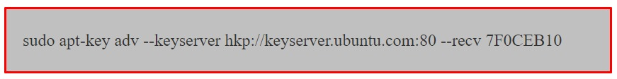

+ Créez un fichier de liste pour `MongoDB`, créez un fichier `/etc/apt/sources.list.d/mongodb.list` à l'aide de la commande suivante.
  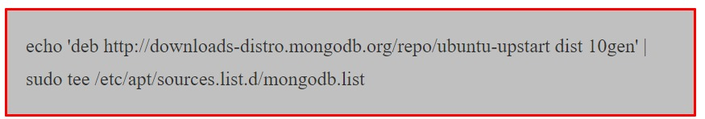

+ Exécutez maintenant la commande suivante pour mettre à jour le référentiel.
  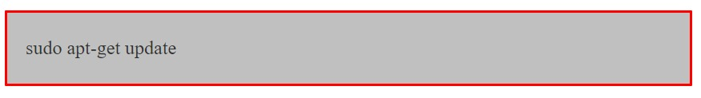

**Installez les Packages MongoDB**
+ Vous pouvez installer soit la dernière version stable de `MongoDB`, soit une version spécifique `MongoDB`.
+ Installez la dernière version stable de `MongoDB`. Exécutez la commande suivante.
  

+ Installez ensuite `MongoDB` à l'aide de la commande suivante. Pour installer une version spécifique, vous devez spécifier chaque package de composants individuellement ainsi que le numéro de version, comme dans l'exemple suivant :
  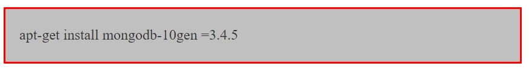

+ Dans l'installation ci-dessus, la version 3.4.5 est actuellement publiée dans la& version `MongoDB`.
+ Assurez-vous de toujours installer la dernière version. `MongoDB` est maintenant installé avec succès.

**Démarrer MongoDB**
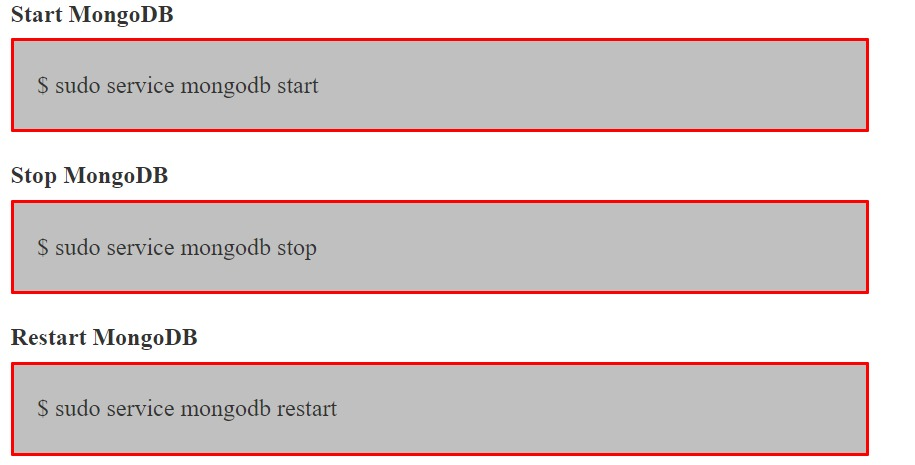

**Pour utiliser les répertoires de données**

+ exécuter la commande suivante : `mongo`. Cela vous connectera à l'exécution de l'instance `MongoDB`.
+ Supprimer les packages.
+ Supprimer tout les packages `MongoDB` que vous aviez précédemment installés : `sudo apt-get purge mogodb-org*`.

**Supprimer les répertoires de données**

### **Technologies Utilisées Pour Une Application Web**

#### **Front End(Dans le navigateur de l'utilisateur)**

1) `HTML` pour la structure d'une seule page `Web`.
2) `CSS` pour la conception des élements d'une seule page `Web`, souvent comme référentiel pour de nombreuses pages `Web` afin de maintenir la cohérence.
3) `JavaScript` natif ou des bibliothèques comme `JQuery`. `AJAX` qui permet d'interagir avec l'utilisateur et le système `backend` tout en restant sur la même page.
4) Autres technologies spéciales, par exemple `Flash Movie Addins ou autres`, le plus souvent remplacées par `HTML5`.

#### **Backend (Sur le serveur de l'hébergeur de la page Web) :**

1) Système d'exploitation (par exemple `Linux`).
2) Serveur d'application `Web` (par exemple `Apache`).
3) Base de données, par exemple `MySQL, MongoDB ou autre`.
4) `PHP, Java, Python et NodeJS et autres langages` pour exécuter des requêtes sur la base de données, etc.

**Resumé**

1. Toute conception architecturale inclut de nombreux points tels que de quelles parties (conceptuelles) se compose notre application ? Comment les différentes parties communiquent-elles entre elles? Comment dépendent-ils les uns des autres?
2. Une architecture bien définie se compose de nombreux composants qui communiquent main dans la main avec une plus grande précision et moins de tolérance aux pannes.
3. Une architecture d'application `Web` comprend de nombreux services tels que l'équilibreur de charge, le courtier de message (`ActiveMQ/rabbitMQ`), `Elasticsearch`, le serveur `Web`(`Tomcat`), le serveur d'applications(`JBOSS`), `NodeJS` et différents langages de programmation de haut niveau tels que `Java, PHP, Python et JavaScript, etc`.
4. Ci-dessus, trois conceptions architecturales d'applications Web différents sont donnés pour comprendre la conception d'applications `Web` en temps réel.

**Conclusion**

+ L'objectif du chapitre était de fournir une compréhension de la conception avec les informations de base nécessaires aux applications `Web`.
+ Chaque conception architecturale sera différente en fonction des exigences et des installations(technologies) utilisés.
+ De nos jours, la croissance des applications `Web` nécessite donc à la fois des architectures évolutives et des concepts appropriés pour la programmation simultanée.

