# Services Web Amazon

## Qu'est-ce que le cloud computing ?

+ Le `cloud computing` est la fourniture à la demande de puissance de calcul, de stockage de base de données, d'applications et d'autres ressources informatiques via une plate-forme de `services cloud` via `Internet` avec une `tarification`.


### Quels sont les différents types de clouds ?

+ Nous avons trois types `d'infrastructure cloud`

    + **Cloud Privé**
  
        + `L'infrastructure cloud` est prévue pour un usage exclusif par une seule organisation comprenant plusieurs consommateurs (par exemple, des unités commerciales).
        + Il peut être détenu, géré et exploité par l'organisation, un tiers ou une combinaison de ceux-ci, et il peut exister sur site ou hors site.
    
    + **Cloud Public**
  
        + `L'infrastructure cloud` est prévue pour une utilisation ouverte par le grand public.
        + Il peut être détenu, géré et exploité par une entreprise, une université ou un organisme gouvernemental, ou une combinaison de ceux-ci.
        + Il existe chez le fournisseur cloud.

    + **Cloud Hybride**
  
        + `L'infrastructure cloud` est une composition de deux ou plusieurs infrastructures cloud distinctes (privées, communautaires ou publiques) qui restent des entités uniques, mais sont liées entre elles par une technologie standardisée ou propriétaire qui permet la portabilité des données et des applications(par exemple, cloud bursting pour l'équilibrage de charge entre des clouds).

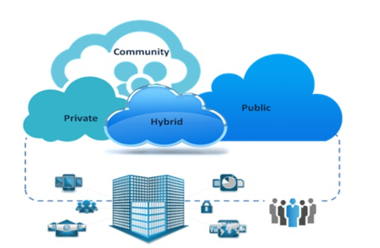

# Modèles de services cloud :

### Logiciel En Tant Que Service (SaaS) :

+ Le `Logiciel En tant Que Service` vous fournit un produit complet qui est exécuté et géré par le fournisseur de services.
+ Dans la plupart des cas, les personnes faisant référence à `Software as a service` font reférence aux applications des utilisations finaux.
+ Avec une offre `SaaS`, vous n'avez pas à penser à la manière dont le service est maintenu ou à la manière dont l'infrastructure sous-jacente est gérée, il vous suffit de penser à la façon dont vous utiliserez ce logiciel en particulier.
+ Un exemple de courant d'application `SaaS` est la messagerie Web où vos pouvez envoyer et recevoir des e-mails sans avoir gérer les ajouts de fonctionnalités au produit de messagerie ou à gérer les serveurs et les systèmes d'exploitation sur lesquels le programme de messagerie s'exécute.
+ Exemple : `Google Apps, Salesforce, Workday, Concur, Citrix, Cisco WebEx`.

### Plateforme En Tant Que Service (Paas)

+ Les `Plateformes En Tant Que Service` éliminent le besoin pour les organisations de gérer l'infrastructure sous-jacente (généralement le matériel et les systèmes d'exploitation) et vous permettent de vous concentrer sur le déploiement et la gestion de vos applications.
+ Cela vous aide à être plus efficace car vous n'avez pas à vous soucier de l'approvisionnement en ressources, de la planification des capacités, de la maintenance des logiciels, des correctifs ou de toute autre tâche lourde et indifférente impliqué dans l'exécution de votre application.
+ Example : `Beanstalk`


### Infrastructure En Tant Que Service (IaaS)

+ L' `Infrastructure En Tant Que Service`, parfois abrégé en `IaaS`, contient les éléments de base de l'informatique dans le `cloud` et donne généralement accès aux fonctionnalités réseau, aux ordinateurs (virtuels ou sur matériel dédié) et l'espace de stockage de données. 
+ L' `Infrastructure En Tant Que Service` vous offre le plus haut niveau de flexibilité et de contrôle de gestion sur vos ressources informatiques et est très similaire aux ressources informatiques et développeurs connaissent aujourd'hui.
+ Exemple : `AWS EC2, Microsoft Azure, Google Compute Engine, Joyent`.


# Avantages et inconvénients du cloud computing

+ Comme indiqué précédemment, `vagrant` est outil de ligne de commande et l'invite de commande `Windows` est tout simplement lente à exécuter des commandes `vagrant`.
+ Nous aurons donc besoin d'un meilleur utilitaire de ligne de commande, l'un d'eux est `Git Bash`.


+ **Avantages :**

    + `Mise en oeuvre facile :` l'hébergement `cloud` permet aux entreprises de conserver les mêmes applications et processus métier sana avoir à gérer les aspects techniques du `backend`. Facilement gérable via internet, une infrastructure `cloud` est accessible facilement et rapidement aux entreprises.
    + `Accessibilité :` accédez à vos données n'importe où et à tout moment. Une `infrastructure cloud Internet` maximise la productivité et l'efficacité de l'entreprise en garantissant que votre application est toujours accessible. Cela permet une collaboration et un partage faciles entre les utilisateurs situés à plusieurs endroits.
    + `Aucun matériel requis :` puisque tout sera hébergé dans le `cloud`, un centre de stockage physique nécessaire. Cependant, une sauvegarde pourrait être utile en cas de sinistre qui pourrait stagner la productivité de votre entreprise.
    + `Coût par personne :` les frais généraux technologiques sont réduits au minimum grâce aux services d'hébergement `cloud`, permettant aux entreprises d'utiliser le temps et les ressources supplémentaires pour améliorer l'infrastructure de l'entreprise.

+ **Désavantage :**

    + `Vous n'avez plus le contrôle :` lorsque vous déplacez des services vers le cloud, vous transmettez vos données et informations. Les entreprises qui disposent d'un personnel informatique interne ne seront pas en mesure de gérer elles-mêmes les problèmes. Cependant, `Stratosphère Networks` dispose d'un service d'assistance en direct 24h/24 et 7j/7 qui peut résoudre immédiatement tout problème.
    + `Il se peut que vous ne disposiez pas de toutes les fonctionnalités` : tous les services `cloud` ne sont pas identiques. Certains fournisseurs de cloud ont tendance à proposer des versions limitées et à activer uniquement les fonctionnalités les plus populaires, de sorte que vous ne recevrez peut-être pas toutes les fonctionnalités ou personnalisations souhaitées. Avant de vous inscrire, assurez-vous de savoir ce que propose votre fournisseur de services cloud.
    + `Cela ne signifie pas que vous devez supprimer les serveurs :` vous avez peut-être moins de serveurs à gérer, ce qui signifie moins de tâches à gérer pour votre personnel. Même s'il peut sembler coûteux de disposer de centres de données et d'une infrastructure `cloud`, la redondance est essentielle pour la sauvegarde et la restauration.
    + `Pas de redondance :` un serveur `cloud` n'est ni redondant ni sauvegardé. Comme la technologie peut échouer ici et là, évitez de vous brûler en souscrivant à un plan de redondance. Même s'il s'agit d'un coût supplémentaire, dans la plupart des cas, cela en vaudra la peine.
    + `Problèmes de bande passante :` pour des performances idéales, les clients doivent planifier en conséquence et en pas regrouper de grandes quantités de serveurs et de périphériques de stockage dans un petit ensemble de centres de données.


## Qu'est-ce qu'AWS ?

+ `Amazon Web Services (AWS)` est une plate-forme de services cloud sécurisée offrant une puissance de calcul, un stockage de base de données, une diffusion de contenu et d'autres fonctionnalités pour aider les entreprises à évoluer et à se développer.
+ Découvrez comment des millions de clients exploitent actuellement les produits et solutions `Cloud AWS` pour créer des applications sophistiquées offrant une flexibilité, une évolutivité et une fiabilité accrues.

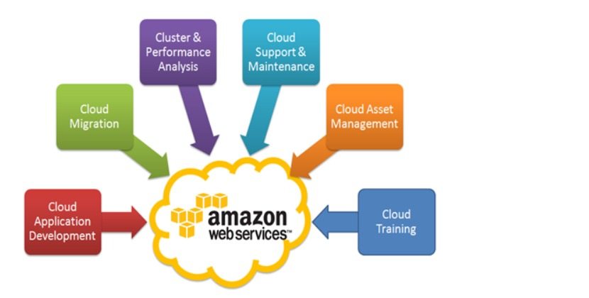

## Régions et zones de disponibilité

+ Les `ressources de cloud computing d'Amazon` sont hébergées dans plusieurs emplacements dans le monde.
+ Ces emplacements sont composés de régions et zones de disponibilité.
+ Chaque région est une zone géographique distincte. Chaque région possède plusieurs emplacements isolés appelés `zones de disponibilité`.
+ Pour la plupart des `services AWS` que vous utilisez, vous serez invité à sélectionner une région dans laquelle vous souhaitez déployer le service.
+ Chaque région est complètement isolée des autres et fonctionne également de manière indépendante.
+ Une liste des régions et des zones de disponibilité et donnée ci-dessous à titre de référence :


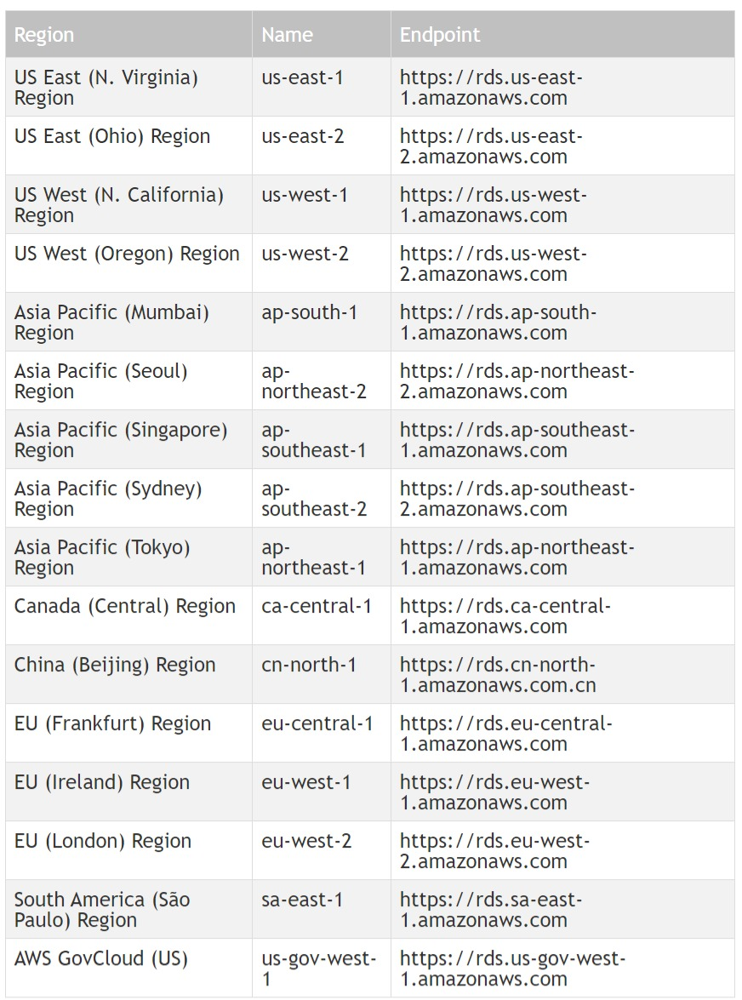

+ Chaque région est divisée en une ou plusieurs `zones de disponibilité (AZ)` et prononcée comme `AZees`.
+ Une `AZ` est un emplacement isolé à l'intérieur d'une région. 
+ Les `AZ` sont constitués d'un ou plusieurs centres de données physiques qui hébergent les services `AWS`.
+ Tout comme pour les régions, même les `AZ` ont des codes correspondants pour les identifier. Il s'agit généralement de noms de régionaux suivis d'une valeur numérique.
+ Par exemple, si vous sélectionnez et utilisez `us-east-1`, qui est la région de Virginie du Nord, les `AZ` seront repertoriés comme `us-esat-1b, us-east-1c, us-east-1d, etc`.
+ Les `AZ` sont très importants du point de vue de la conception et du déploiement. En tant que centres de données, ils sont plus que capables de pannes et de temps d'arrêt.
+ Il est donc toujours recommandé de répartir vos ressources sur plusieurs zones de disponibilité et de concevoir vos applications de manière à ce qu'elles puissent rester disponibles même si une zone de disponibilité est complètement hors ligne.
+ Un point important à noter ici est qu'`AWS` vous fournira toujours les services et produits en tant que client; cependant, il est de votre devoir de concevoir et de distribuer vos applications de manière à ce qu'elles ne subissent aucune panne ou panne potentielle.
+ La structure ci-dessous représente les `régions` et leurs `zones de disponibilité`.


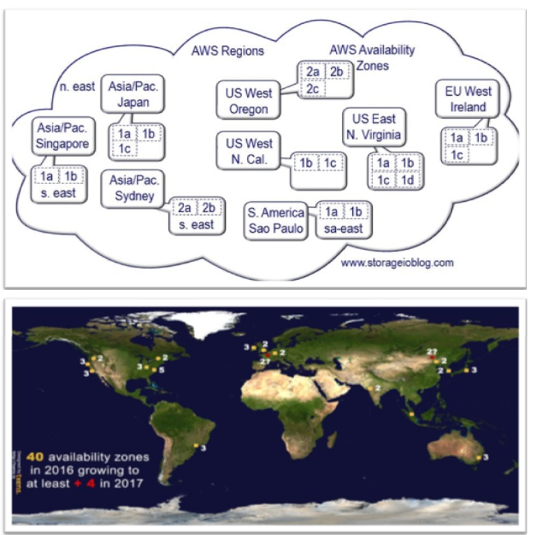


+ `AMAZON RDS` vous offre la possibilité de placer des ressources, telles que des instances et des données, à plusieurs emplacements.

+ **Note :**

    + `AWS` ne réplique pas automatiquement les ressources entre les régions. C'est à l'utilisateur final de mettre en place le `processus de réplication`.

# Services AWS

+ `AWS` nous fournit de nombreux services que nous pouvons utiliser pour construire notre infrastructure sur le `Cloud AWS`.
+ Notre objectif en matière de `DevOps` sera d'exploiter les services `SysOps` fournis par `AWS`.
+ Il existe de nombreux autres services consommés directement par les développeurs et ce n'est pas l'objectif de ce livre.
+ `AWS` propose également certains services liés au `DevOps`, tels que `codecommit, codedeploy, cloudformation, etc ..`, qui seraient hors de portée de ce livre.
+ Dans ce chapitre, nous examinerons les services `AWS` mentionnés ci-dessous.

  + `IAM`
  + `EC2`
  + `VPC`
  + `S3`
  + `RDS`
  + `Beanstalk`
  + `Cloudwatch`
  + `Route53`


# IAM

#### A) Sécurité, identité et conformité :

+ `AWS Identity and Access Management (IAM)` est un service `Web` qui permet aux clients `Amazon Web Services (AWS)` de gérer les utilisateurs et les autorisations des utilisateurs dans `AWS`.
+ Le service est destiné aux organisations comptant plusieurs ou systèmes dans le `Cloud` qui utilisent des produits `AWS` tels qu'`Amazon EC2, Amazon SimpleDB et AWS Management Console`.
+ Avec `IAM`, vous pouvez gérer de manière centralisée les utilisateurs, les informations d'identification de sécurité telles les `clés d'accès et les autorisations` qui contrôlent les ressources `AWS` auxquelles les utilisateurs peuvent accéder.


#### B) Création d'un utilisateur IAM :

+ Connectez-vous au compte `AWS => Services => IAM`


+ Sélectionner `users => Add user => username`

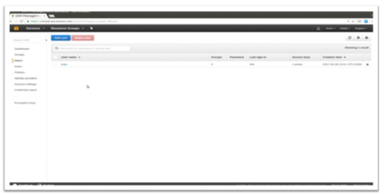

+ Sélectionnez l'une des options `Accès` par programmation (accès basé sur une clé `AWS-CLI`) ou `AWS Managment Console access`.


+ Si vous sélectionnez l'accès à `AWS Management Console`, vous devez sélectionner un mot de passe généré automatiquement ou un mot de passe personnalisé.
+ Cliquer sur `Next Permissions` 


#### 1. Joindre la politique à l'utilisateur

+ Par défaut, les utilisateurs `IAM` ne sont pas autorisés à créer ou à modifier des ressources `Amazon EC2`, ni à effectuer des tâches à l'aide de l'`API Amazon EC2`. (Cela signifie qu'ils ne peuvent pas non plus le faire à l'aide d' `Amazon EC2 console ou CLI`).
+ Lorsque vous attachez une stratégie à un utilisateur ou à un groupe d'utilisateurs, elle autorise ou refuse aux utilisateurs l'autorisation d'effectuer les tâches spécifiées sur les ressources spécifiés.
+ Ainsi, lors de la création d'un utilisateur, nous devons attribuer les stratégies qui doivent être exécutées par un utilisateur particulier.
+ Il existe des stratégies prédéfinies dans `IAM`, nous pouvons attacher les stratégies existantes ou créer une nouvelle stratégie.
+ Ici, dans cet exemple, nous attachons un accès administrateur dans lequel l'utilisateur obtient toutes les autorisations d'administrateur.

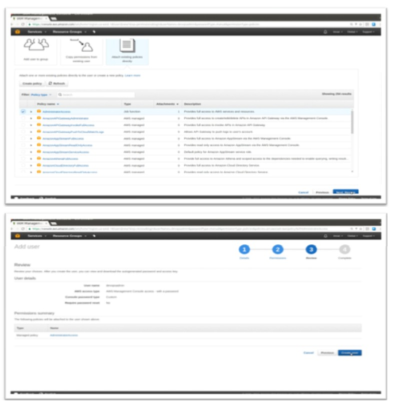

+ Après avoir créé l'utilisateur, nous obtenons un fichier `download.csv`, qui contient les informations d'identification de l'utilisateur et l'`URL` pour se connecter à la console `AWS`.


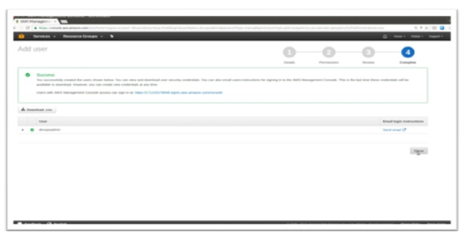


#### Configuration de MFA

+ `AWS Multi-factor Authentification (MFA)` est une bonne pratique simple qui ajoute une couche de protection supplémentaire en plus de votre nom d'utilisateur et de votre mot de passe.
+ Avec `MFA` activé, lorsqu'un utilisateur se connecte à un site `Web AWS`, il lui sera demandé de saisir son nom d'utilisateur et son mot de passe (le premier facteur : ce qu'il connaît), ainsi qu'un code d'identification de son appareil `AWS MFA` (le deuxième facteur) - ce qu'ils ont).
+ Pris ensemble, ces multiples facteurs offrent une sécurité accrue pour les paramètres et les ressources de votre compte `AWS`.
+ Vous pouvez activer `MFA` pour votre compte `AWS` et pour les utilisateurs `IAM` individuels que vous avez crées sous votre compte.
+ `MFA` peut également être utilisé pour contrôler l'accès aux `API` du service `AWS`.


+ Cliquez sur `username`
+ Cliquez sur `Assigned MFA Service`

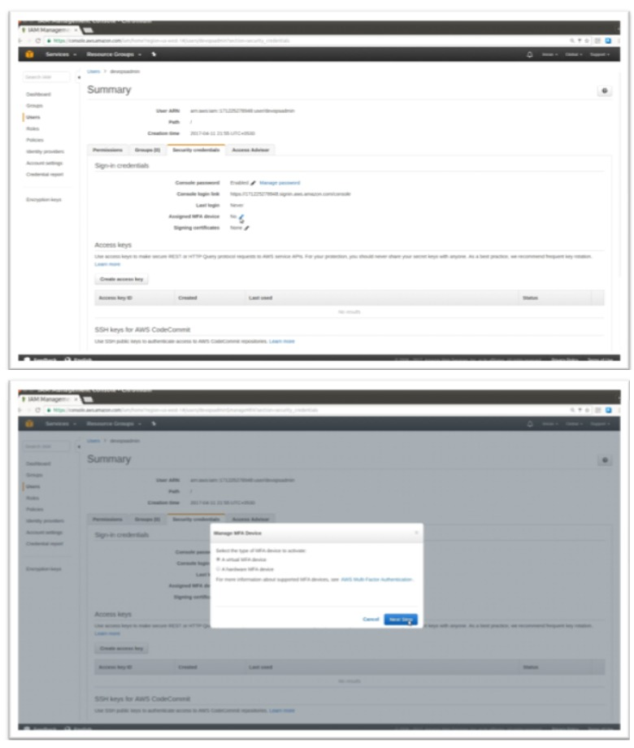


+ Téléchargez `Google Authenticator` sur votre smartphone.
+ Ouvrez `Google Authentificator`
+ Cliquez sur le symbole plus
+ Scannez le code-barres
+ Entrez le code d'authentification1
+ Entrez le deuxième code d'authentification


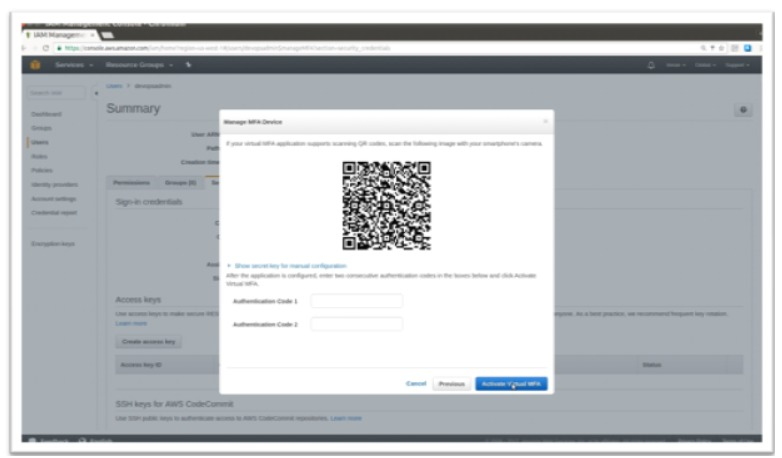

+ Utilisez `l'URL` en surbrillance pour que votre utilisateur se connecte au compte `AWS` avec l'utilisateur `IAM`.

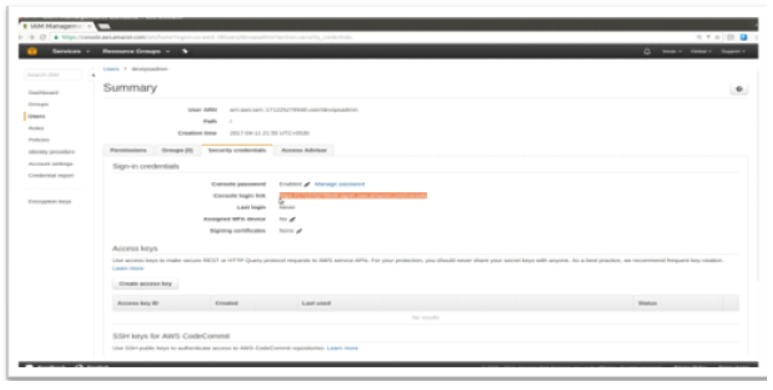


# AMAZON EC2

+ `Amazon Elastic Compute Cloud (Amazon EC2)` est un `service Web` qui fournit une capacité de calcul sécurisée et redimensionnable dans le cloud.
+ Il est conçu pour faciliter le `cloud computing` à l'échelle du `Web` pour les développeurs.
+ L'interface de service Web simple d'`Amazon EC2` vous permet d'obtenir et de configurer de la capacité avec un minimum de frictions.
+ Il vous offre un contrôle total sur vos ressources informatiques et vous permet de fonctionner sur l'environnement informatique éprouvé `Amazon`.
+ `Amazon EC2` réduit le temps requis pour obtenir et démarrer de nouvelles instances de serveur à quelques minutes, ce qui vous permet d'adapter rapidement la capacité, la hausse comme à la baisse, à mesure que vos besoins informatiques évoluent.
+ `Amazon EC2` fournit aux développeurs les outils nécessaires pour créer des applications résilientes aux pannes et les isoler des scénarios de panne courants.


#### Avantages d'EC2

+ Informatique élastique à l'échelle du Web.
+ Entièrement isolé
+ Services d'hébergement cloud flexibles
+ Intégré
+ Fiable
+ Sécurisé
+ Peu coûteux
+ Facile à démarrer

#### Types d'instances Amazon EC2

+ `Amazon EC2` propose une large sélection de types d'instances optimisés pour s'adapter à différents cas d'utilisation.
+ Les types d'instances comprennent différentes combinaisons de capacité de processeur, de mémoire, de stockage et de réseau et vous offrent la flexibilité de choisir la combinaison de ressources appropriée pour vos applications.
+ Chaque type d'instance comprend une ou plusieurs tailles d'instances, vous permettant d'adapter vos ressources aux exigences de votre charge de taravail cible.


#### Différents types d'instances

+ **1. Usage général : t2, m4, m3**

**`T2`**

+ L'instance `T2` reçoit des crédits `CPU` en continu à un taux en fonction de la taille de l'instance.
+ Les instances `T2` accumulent des crédits `CPU` lorsqu'elles sont inactives et utilisent des crédits `CPU` lorsqu'elles sont actives.
+ Les instances `T2` constituent un bon choix pour les charges de travail qui n'utilisent pas la totalité du processeur de manière fréquente ou cohérente, mais ont parfois besoin d'éclater (par exemple, les serveurs Web, les environnements de développement et les bases de données).


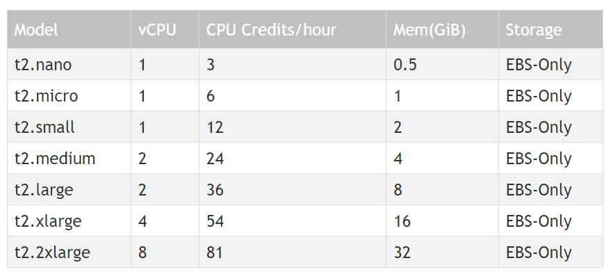

**`M4`**

+ Les instances `M4` constituent la dernière génération d'instances à usage général.
+ Cette famille offre un équilibre entre les ressources de calcul, de mémoire et de réseau et constitue un bon choix pour de nombreuses applications.


**`M3`**
+ Cette famille comprend les types d'instances `M3` et fournit un équilibre entre les ressources de calcul, de mémoire et de réseau, et constitue un bon choix pour de nombreuses applications.


+ **2. Calcul optimisé : c4, c3**

**`C4`**

+ Les instances `C4` constituent la dernière génération d'instances optimisés pour le calcule, dotées des processeurs les plus performantes et du rapport `prix/performances` de calcul le plus bas d'`EC2`.

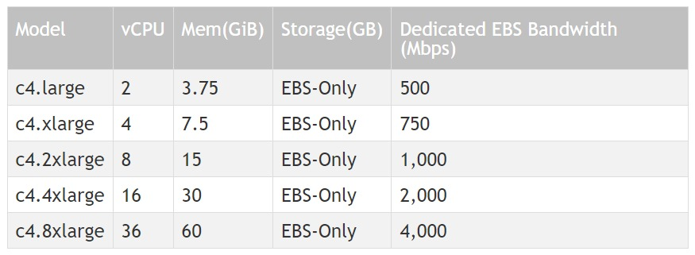

**`C3`**

+ Les instances `C3` vous fourniront les processeurs les plus performants et les performances de `calcul/prix` les plus basses par rapport à toutes autres instances `Amazon EC2`.
+ Les instances `C3` disposent également d'une mise en réseau améliorée et d'un stockage d'instance basé sur `SSD`.


+ **3. Mémoire optimisée : x1, r4, r3**

**`X1`**

+ Les instances `X1` sont optimisées pour les applications en mémoire à grande échelle de classe entreprise et ont le prix par `Gio de RAM` le plus bas parmi les types d'instances `Amazon EC2`.


**`R4`**

+ Les instances `R4` sont optimisées pour les applications gourmandes en mémoire et offrent un meilleur prix par `Gio de RAM que R3`.


**`R3`**

+ Les instances `R3` sont optimisés pour les applications gourmandes en mémoire et offrent un prix inférieur par `Gio de RAM`.

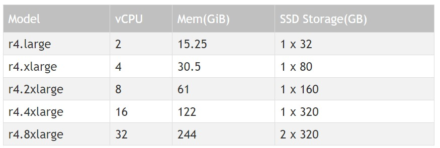

+ **4. Instances de calcul accéléré : p2, g2, f1**


**`G2`**
+ Les instances `G2` sont optimisés pour les applications gourmandes en graphiques.

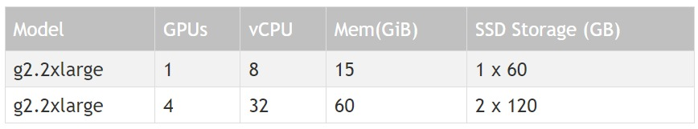

**`F1`**

+ Les instances `F1` offrent une accélération matérielle personnalisable avec des réseaux prédiffusés programmables sur `site (FPGA)`.

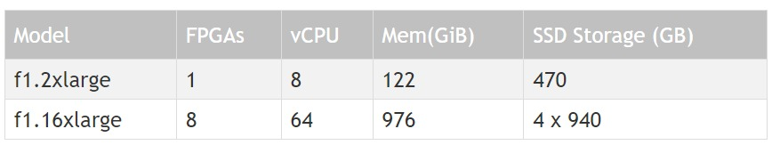

+ **Stockage optimisé : I3, D2**

**`I3`**

+ Instances d'`E/S` élévées. Cette famille comprend les instances de stockages élévées qui fournissent un stockage d'instance soutenu par `SSD Non-Volatile Memory Express (NVMe)` optimisé pour une faible latence, des performances d'`E/S` aléatoires très élévées, un débit de lecture séquentiel élevé et fournissent des données d'`IOPS` élévées faible coût.

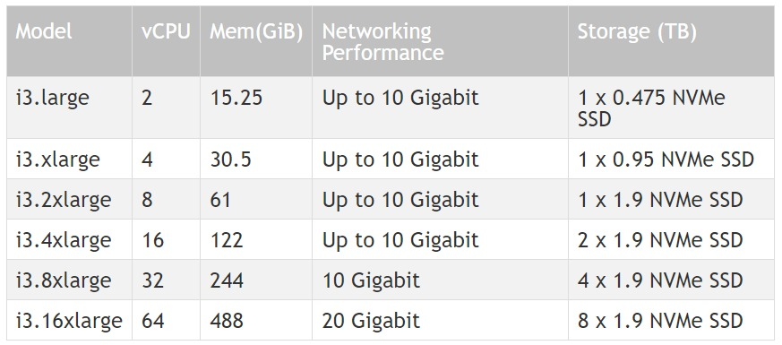

**`D2`**

+ Les instances `D2` disposent jusqu'à `48 To` de stockage local sur disque dur, offrent un débit de disque élevé et offrent le prix par débit de disque le plus bas sur `Amazon EC2`.

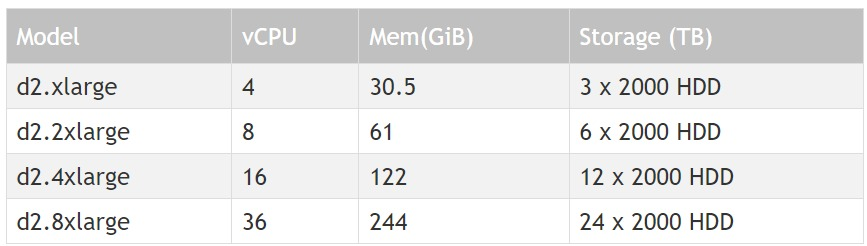

#### Tarification Amazon EC2

+ L'essai d'`Amazon EC2` est gratuit. Il existe quatre façons de payer pour les instances `Amazon EC2` : à la demande, instances réservées et instances ponctuelles.
+ Vous pouvez également payer pour des hôtes dédiés qui vous fournissent une capacité d'instance `EC2` sur des serveurs physiques dédiés à votre usage.


#### Ala demande : les instances à la demande sont recommandées pour :
+ Utilisateurs qui préfèrent le faible coût et la flexibilité d'`Amazon EC2` sans aucun paiement initial ni engagement à long terme.
+ Applications avec des charges de travail à court terme, pointues ou imprévisibles qui ne peuvent pas être interrompues.
+ Applications développées ou testées sur `Amazon EC2` pour la première fois.

**`Instances Spot` - `Les instances Spot Amazon EC2` vous permettent d'enchérir sur la capacité informatique `Amazon EC2` disponible jusqu'à 90% de réduction sur le prix à la demande.**

<br/>

**Les instances ponctuelles sont recommandées pour :**

+ Applications avec une utilisation en régime permanent.
+ Applications pouvant nécessiter une capacité réservée.
+ Les clients qui peuvent s'engager à utiliser `EC2` sur une durée de `1 ou 3 ans` pour réduire leurs coûts informatiques totaux.


**`Hôtes dédiés` - Un `hôte dédié` est un serveur `EC2` physique dédié à votre usage. Les hôtes dédiés peuvent vous aider à réduire les coûts en vous permettant d'utiliser vos licences logicielles existantes liés au serveur, notamment Windows Server, SQL Server et SUSE Linux Enterprise Server.**

+ Peut être acheté à la demande (toutes les heures)
+ Peut être acheté sous forme de reservation jusqu'à 70% de réduction sur le prix à la demande.


#### Groupes de sécurité :

+ Le `groupe de sécurité` agit comme un `pare-feu` pour les instances `Amazon EC2` associées, contrôlant à la fois le traffic entrant et sortant au niveau de l'instance.
+ Lorsque vous lancez une instance, vous associez un ou plusieurs `groupe de sécurité` à l'instance.
+ Vous ajoutez des `règles` à chaque `groupe de sécurité` qui autorisent le trafic vers ou depuis ses instances associées.
+ Vous pouvez modifier les règles d'un groupe de sécurité à tout moment; les nouvelles règles sont automatiquement appliquées à toutes les instances associées au groupe de sécurité.
+ Lorsque nous décidons d'autoriser automatiquement ou non le traffic à atteindre une instance, nous évaluons toutes les règles de tous les groupes de sécurité associés à l'instance.

#### Paire de Clés

+ `Amazon EC2` utilise la `cryptographie à clé publique` pour chiffrer et déchiffrer les informations de connexion.
+ La `cryptographie à clé publique` utilise une `clé publique` pour chiffrer une donnée, telle qu'un mot de passe, depuis le destinataire utilise une `clé privée`pour déchiffrer les données.
+ Les `clés publiques et privées` sont appelées `paire de clés`.
+ Pour vous connecter à votre instance, vous devez créer une paire de clés, spécifier le nom de la paire de clés lorsque vous lancez l'instance et fournir la clé privée lorsque vous vous connectez via `SSH`.
+ Avec les instances `Windows`, vous utilisez une `paire de clés` pour obtenir le mot de passe administrateur, puis vous connectez à l'aide de `RDP`.


#### Création d'une instance EC2.

+ `AWS Marketplace` contient différents types d'`Amazon Machine Images (AMI)` comme `Centos, Ubuntu, Amazon Linux, Windows, ... etc`.

    + Connectez-vous à `AWS Management Console` et configurez votre compte `root`
    + Lancez une instance `Amazon EC2`
    + Dans le tableau de bord d'`Amazon EC2`, sélectionnez `Lancer l'instance` pour créer et configurer votre machine virtuelle.
    + Configurer l'instance
    + Dans `AWS marketplace`, sélectionnez votre `AMI` requise (Ex : `Centos AMI`)


**Choisissez un type d'instance : dans l'assistant, choisissez un type d'instance, nous recommandons `t2.micro` (éligible au niveau gratuit)**

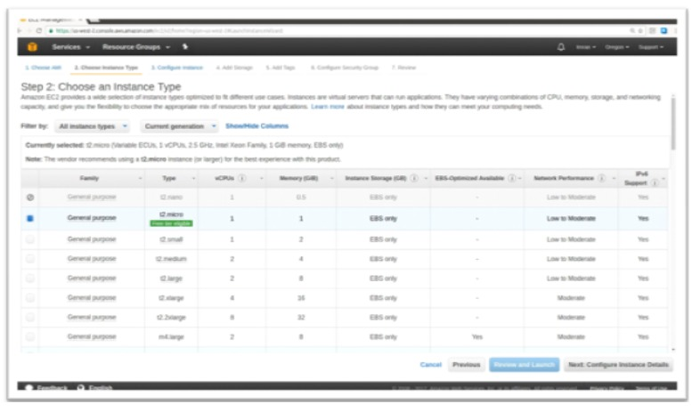

**Configurez les détails de l'instance avec tous les paramètres par défaut.**


**Groupe de sécurité : Nous devons créer un groupe de sécurité afin de contrôler le trafic vers votre instance.**

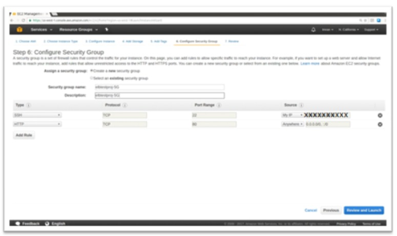

**Lancer l'instance : Vérifiez la configuration de votre instance et choisissez `Lancer`**

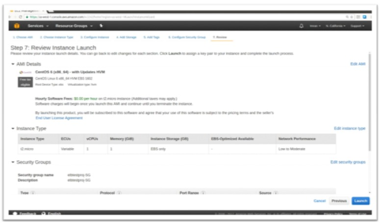


**Créer une paire de clés : sélectionnez `Créer une nouvelle paire de clés` et attribuer un nom. Le fichier de paire de clés (.pem) sera téléchargé : automatiquement - enregistrez-le dans un endroit sûr car nous utiliserons plus tard ce fichier pour nous connecter à l'instance. Enfin, choisissez `Lancer les instances` pour terminer la configuration.**


**Connectez-vous à l'instance `EC2`, passez à l'utilisateur `root`, créez un utilisateur et ouvrez le fichier `sudoers` comme indiqué ci-dessous :**


**Recherchez l'entrée pour l'utilisateur `root`, en dessous, ajoutez une entrée similaire pour votre utilisateur.**


**Ouvrez le fichier `SSHD_CONFIG` pour activer l'authentification par mot de passe**


**Redémarrez le service `SSHD`. Et maintenant vous pouvez vous connecter à votre utilisateur.**

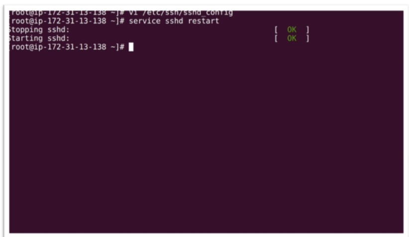


# AMAZON EBS


+ `Amazon Elastic Store (Amazon EBS)` fournit des volumes de stockage de blocs persistants à utiliser avec les instances `Amazon ECS` dans le cloud `AWS`.
+ Chaque volume `AMAZON EBS` est automatiquement repliqué dans sa zone de disponibilité pour vous protéger contre les pannes de composants, offrant ainsi une haute disponibilité et durabilité.
+ Les volumes `AMAZON EBS` offrent les performances cohérentes et à faible latence nécessaires à l'exécution de vos charges de travail avec `AMAZON EBS`, vous appuyez augmenter ou réduire votre utilisation en quelques minutes, tout en payant un prix bas uniquement pour ce que vous fournissez.

+ Certaines des fonctionnalités et avantages clés que les `volume EBS` ont à offrir : 
  + Des volumes hautes performances
  + Disponibilité
  + Capacité de cryptage
  + Capacités d'instantané
  + Gestion des accès
  + Volumes élastiques


+ **Remarque :** les `volumes EBS` ne peuvent pas être copiés d'une région `AWS` à une autre. Pour rendre un volume disponible en dehors de la zone de disponibilité, vous pouvez créer un instantané et restaurer cet instantané sur un nouveau volume n'importe où dans cette région. Vous pouvez copier des instantanés vers d'autres régions, puis les restaurer sur de nouveaux volumes, ce qui facilite l'exploitation de plusieurs régions `AWS` pour l'expansion géographique, la migration du centre de données et la reprise après sinistre.


### Types de volume Amazon EBS

+ Il existe 3 différentes de volumes `EBS`, chacun avec ses propres ensembles de caractéristiques de performances et coûts associés.

#### 1) Volumes A Usage Général (SSD)
+ Ce volume offre des performances de base `3 IOPS/Gio`, avec la possibilité d'atteindre `3000 IOPS` pendant les périodes prolongées.
+ Les volumes `GP2` sont idéaux pour un large éventail de cas d'utilisation tels que les volumes de démarrage, les bases de données de petite et moyenne taille et les environnements de développement et de test.
+ Les volumes `GP2` prennent en charge jusqu'à `10 000 IOPS et 160 Mo/s` de débit.

#### 2) Volumes IOPS Provisionnés (SSD)

+ Avec les volumes `SSD IOPS` provisionnés (iol), vous pouvez provisionner un niveau spécifique de performance d'`E/S`.
+ Les volumes `Io1` prennent en charge jusqu'à `20 000 IOPS et 320 Mo/s` de débit.
+ Cela vous permet d'évoluer de manière prévisible jusqu'à des dizaines de milliers d'`IOPS` par instance `EC2`.

#### 3) Volumes Magnétiques

+ Les `volumes magnétiques` sont soutenus par des disques magnétiques et conviennent aux charges de travail où les données sont rarement consultées et aux scénarios dans lesquels un stockage à faible coût pour de petites tailles de volumes est important.
+ Ces volumes fournissent environ `100 IOPS` en moyenne, avec une capacité de rafale allant jusqu'à des centaines d'`IOPS` par instance `EC2`.


### Création, Attache, Formatage et Montage d'un Volume EBS sur une instance EC2 : 

+ Avant de commencer à savoir comment créer un volume, créons une instance `EC2` de `CentOS 6`.
+ Pour afficher et accéder aux volumes `EBS` de votre compte à l'aide d'`AWS Management Console`, sélectionnez simplement l'option `Volumes` dans le volet de navigation du tableau de bord `EC2`.
+ Cliquez sur `Volumes` dans le volet de gauche, nous pouvons voir le tableau de bord de gestion des volumes.
+ A partir de là, sélectionnez l'option `Créer` un volume.

  + Cela fera apparaître le tableau de bord de création de volume comme indiqué ci-dessous :
    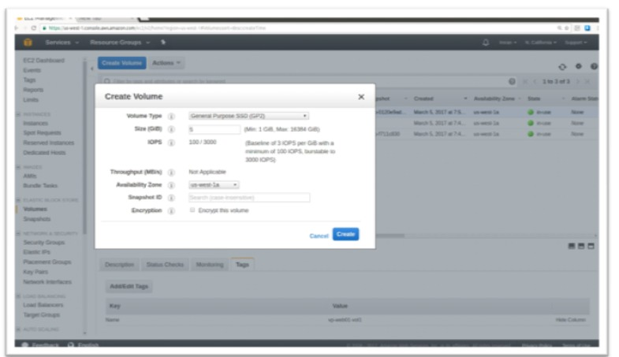
  + Remplissez les détails requis dans la boîte de dialogue. Créer un volume. Ici, j'ai crée un exemple de volume à usage général de 5 Go.
  + Après avoir rempli les paramètres de configuration, sélectionnez `Créer` pour terminer le processus de création de volume. Le nouveau volume prendra quelques minutes pour être disponible, comme le montre la figure ci-dessous. Une fois le volume crée, nous pouvons désormais attacher ce volume à votre instance en cours d'exécution.
    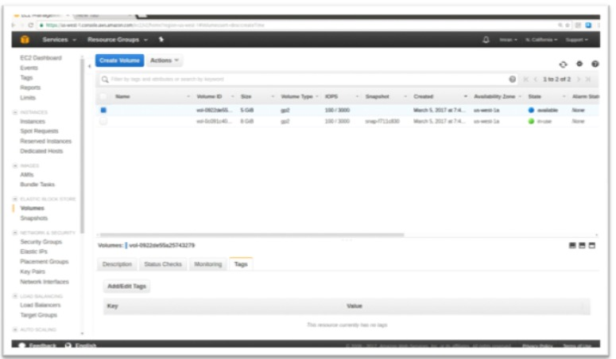
  + Le volume crée est disponible pour utilisation. Nous marquerons le volume par un nom qui sera utilisé pour une identification future.
    
  + Enfin, attachez le volume à l'instance `EC2`. Nous pouvons attacher plusieurs volumes à une seule instance à la fois, chaque volume ayant un nom de périphérique unique. Certains de ces noms de périphériques sont reservés, par exemple, `/dev/sdal` est reservé au volume du périphérique racine.
  + Pour attacher un volume, sélectionnez le volume disponible pour l'utilisation dans le tableau de bord `Gestion des volumes`. Sélectionnez ensuite l'onglet `Actions` et cliquez sur l'option `Attacher un volume`. Cela fera apparaître la boite de dialogue `Attacher un volume`, comme indiqué ci-dessous :
    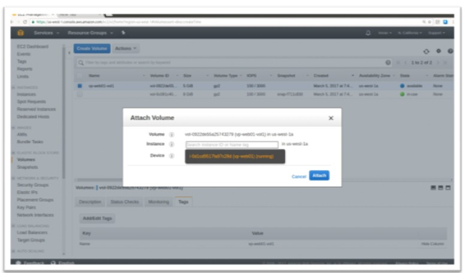
  + Tapez votre `ID` d'instance dans le champ `Instance` et fournissez un nom approprié dans le champ `Périphérique` comme indiqué. Ici, j'ai fourni le nom de périphérique recommandé `/dev/sdf` pour ce volume. Cliquez sur `Joindre` une fois que vous avez donné les détails. Le processus de rattachement du volume prend quelques minutes. Vous êtes maintenant prêt à rendre le volume accessible depuis votre instance.
  

#### Montage du volume sur l'instance

+ Une fois le volume attaché à une instance, vous pouvez le formater et l'utiliser comme n'importe quel autre périphérique bloc.
+ Ici, j'utilise la même instance `EC2 (CentOS6)` que nous avons créée précédemment. Pour commencer, connectez-vous à l'instance en cours d'exécution à l'aide de `SSH`.
+ Comme il s'agit d'une machine `CentOS` par défaut, elle se connectera à l'utilisateur `CentOS`.
+ Alors, exécutez la commande suivante pour vous connecter à l'utilisateur `root` et exécutez la commande pour répertorier les partitions de votre instance.
+ Vous devriez voir une partition `/dev/xvda` par défaut avec sa table de partition et une partition de disque non formatée portant le nom `/dev/xvdf`, comme indiqué dans la capture d'écran suivante.
+ La commande `/dev/xvdf` est le volume `EBS` nouvellement ajouté qui doit être formaté.

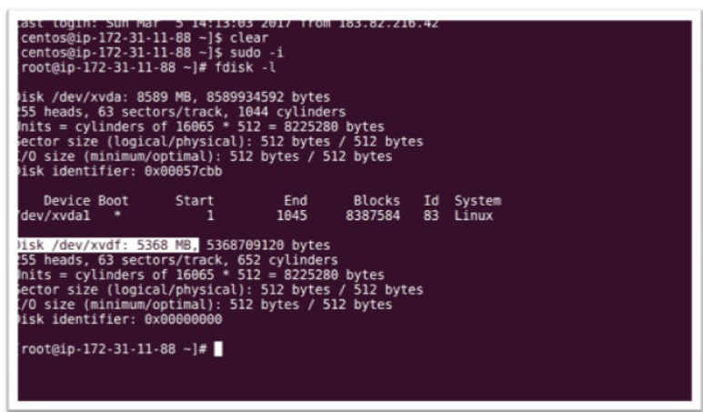

+ Créez maintenant une nouvelle partition avec la partition de disque disponible, comme indiqué ci-dessous.

```
#Fdisk/Dev/Xvdf
```

1. Utilisez `m` pour répertorier les différentes options pouvant être utilisées dans `fdisk`.

2. Utilisez `p` pour répertorier d'abord les informations sur la partition et 

3. Utilisez `n` pour créer une nouvelle partition.


Suivez les étapes indiquées dans la capture d'écran ci-dessous.


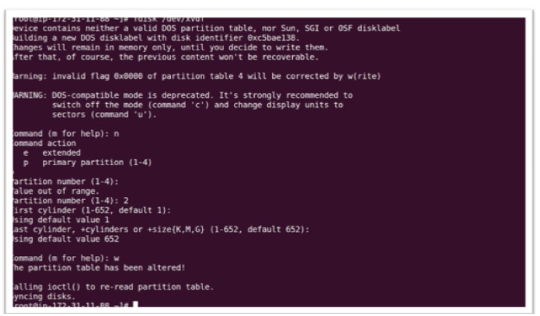


Après avoir créé la partition, nous devons la formater avec un système de fichiers de votre choix. Ici, j'ai choisi le système de fichiers `ext4`.

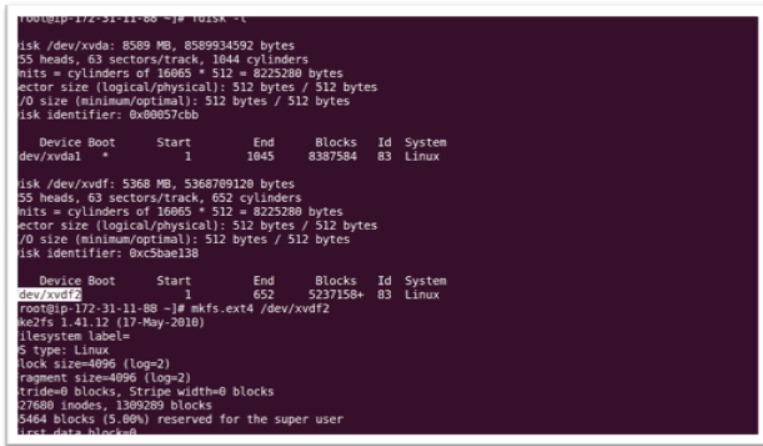

Une fois le formatage terminé, nous pouvons montrer cette partition dans un répertoire. Créez un répertoire et montez-le sur un volume comme indiqué ci-dessous :

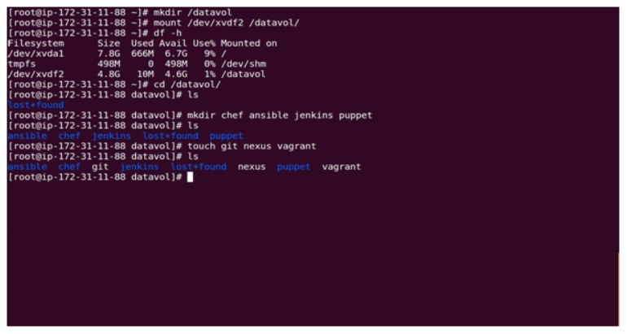

#### Restauration de sauvegarde

+ Nous créerons une situation dans laquelle nous devrons restaurer les données perdues. Nous supprimerons quelques fichiers du point de montage après avoir effectué la sauvegarde, puis restaurerons les données supprimées.


#### Sauvegardez le volume EBS en prenant son instantané :

+ `Amazon EBS` offre la possibilité d'enregistrer des instantanés ponctuels de vos volumes sur `Amazon S3`.
+ Les instantanés `Amazon EBS` sont stockés de manière incrémentielle : seuls les blocs qui ont été modifiés après votre dernier instantané sont enregistrés et vous n'êtes facturé que pour les blocs modifiés.
+ Si vous disposez d'un appareil avec `100 Go` de données mais que seulement `5 Go` ont changé après votre dernier instantané, un instantané suivant ne consomme que `5 Go` supplémentaire et vous n'êtes facturé que pour les `5 Go` supplémentaires de stockage, même si le premier et le dernier instantané semblent terminés.
+ Lorsque vous supprimez un instantané, vous supprimez uniquement les données qui ne sont pas nécessaires à un autre instantané.
+ Tous les instantanés actifs contiennent toutes les informations nécessaires pour restaurer le volume à l'instant où cet instantané a été pris. 
+ Le temps de restauration des données modifiées sur le volume de travail est le même pour tous les instantanés.

<br/>

+ Les instantanés peuvent être utilisés pour instancier et plusieurs nouveaux volumes, augmenter la taille d'un volume ou déplacer des volumes entre les zones de disponibilité.
+ Lorsqu'un nouveau volume est créé, vous pouvez choisir de le créer sur la base d'un instantané `Amazon EBS` existant. Dans ce scénario, le nouveau volume commence comme une réplique exacte de l'instantané.

<br/>

+ Voici les principales fonctionnalités des instantanés `Amazon EBS` : 

<br/>

1. Accès immédiat aux données de volume `Amazon EBS`.
2. Redimensionnement des volumes `Amazon EBS`.
3. Partage d'instantanés `Amazon EBS`.
4. Copie d'instantanés `Amazon EBS` dans les régions `AWS`.

<br/>

+ Pour créer un instantané à partir d'`AWS Management Console`, accédez au tableau de bord de gestion des volumes, sélectionnez le volume, cliquez sur `Actions` et cliquez sur `Créer un instantané`.

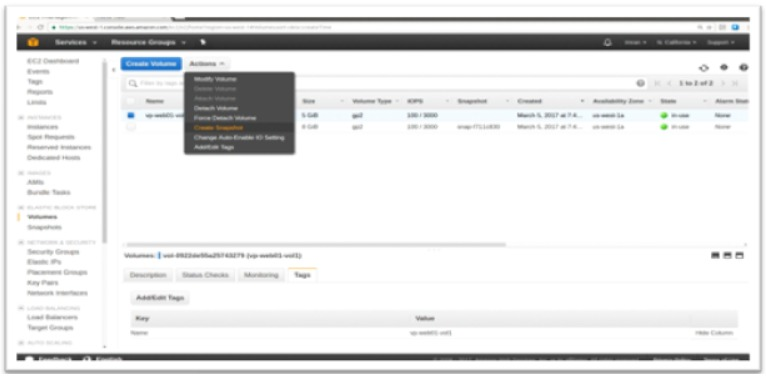

+ **Remarque :** Il est recommandé d'arrêter votre instance avant de prendre un instantané si vous prenez un instantané de son volume racine.
+ Vous verrez la boîte de dialogue `Créer un instantané` comme indiqué dans la capture d'écran suivante. Fournissez un nom et une description appropriés pour votre nouvel instantané. Ici, il n'y a pas de cryptage pour votre instantané car le volume n'est pas crypté. Les instantanés des volumes seront chiffrés automatiquement.
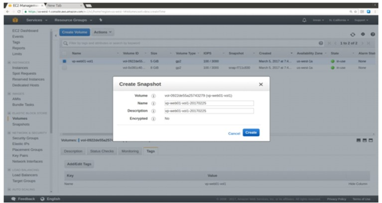

+ Après avoir rempli les détails requis, cliquez sur `Créer` pour terminer le processus d'instantané. Le processus prendra quelques minutes.
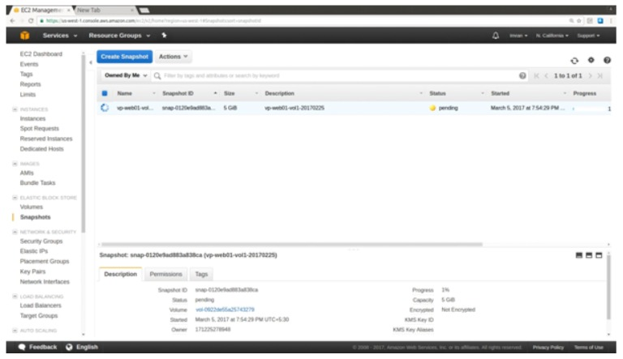

+ Après avoir créé l'instantané, nous supprimerons quelques fichiers du point de montage.
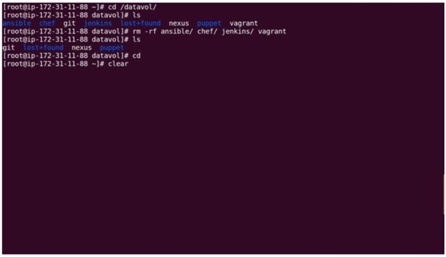


#### Créer un volume à partir d'un instantané et redimensionner

+ Maintenant, si nous voulons récupérer les données perdues, nous devrons créer un nouveau volume à partir d'un instantané et remplacer l'ancien volume par le nouveau.
+ Nous augmenterons également la taille du volume. Cliquez sur les `Instantanés` dans le volet gauche du tableau de bord `EC2`, sélectionnez l'instantané à partir duquel le nouveau volume doit être créé, cliquez sur `Actions` et sélectionnez `Créer un volume`, vous obtiendrez une boîte de dialogue contextuelle de création de volume comme indiqué ci-dessous : 

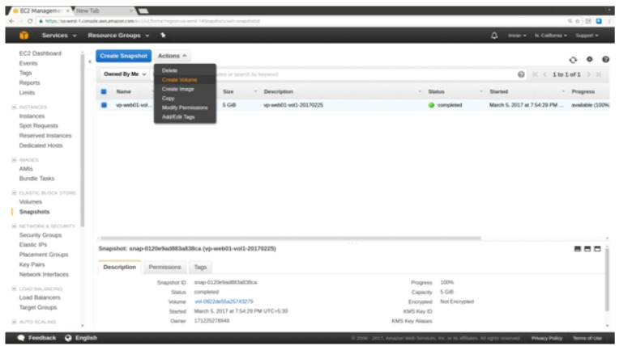

+ Remplissez les détails pour créer un nouveau volume. Ici, la taille du nouveau volume doit être supérieure à `5 Go` car nous avons crée cet instantané à partir d'un volume de `5 Go` attaché à l'instance.
+ Et la zone de disponibilité doit être la même que celle où l'instance est créée. Une fois cela fait, cliquez sur `Créer` pour terminer le processus.

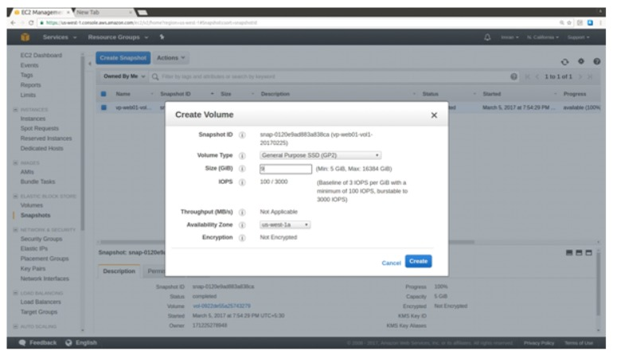

+ Marquez l'ancien volume avec l'extension `-old` pour l'identification et marquez le nouveau volume avec un autre nom indiqué ci-dessous :
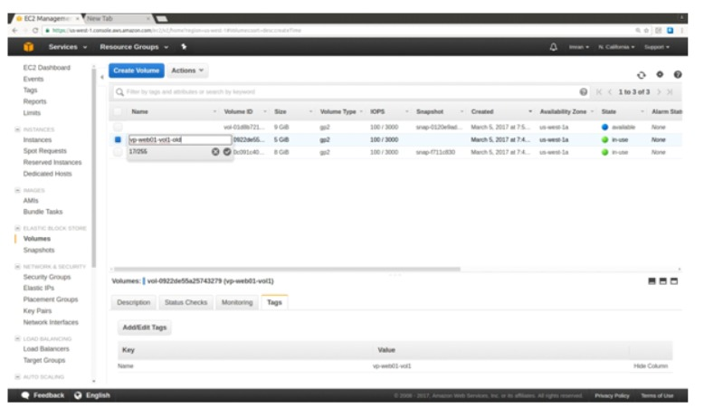

+ Une fois le volume créé, il est disponible pour l'utilisation.
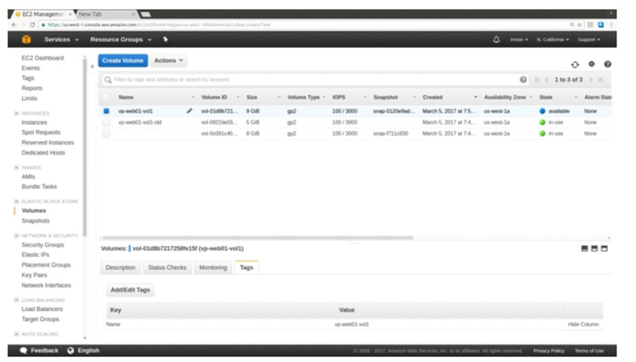

#### Démonter et détacher l'ancien volume

+ Pour démonter et détacher l'ancien volume de l'instance, vérifiez d'abord les points de montage dans la partition créée, puis démontez le répertoire monté comme indiqué ci-dessous :
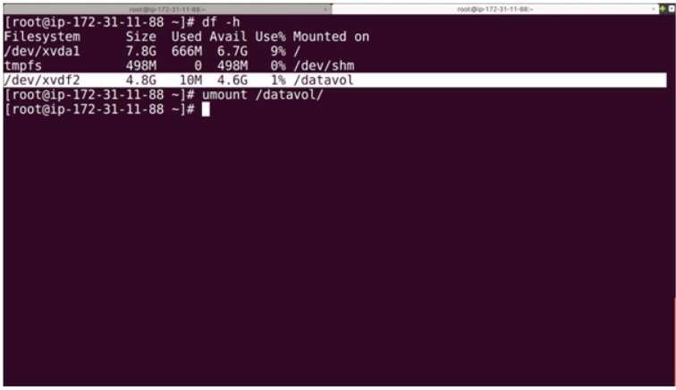

+ Une fois le démontage terminé, détachez l'ancien volume de l'instance. Sélectionnez le volume à détacher, cliquez sur actions et sélectionnez détacher le volume comme indiqué ci-dessous :
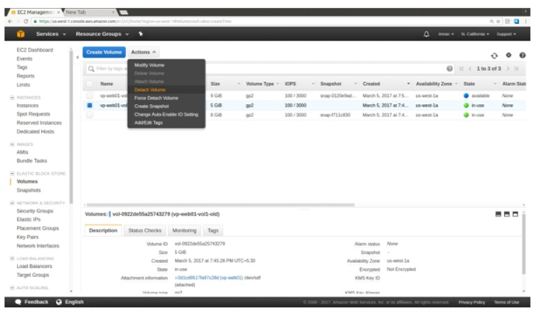

#### Attachez et montez un nouveau volume

+ Enfin, attachez le nouveau volume à l'instance en sélectionnant le nouveau volume, cliquez sur `Actions` et sélectionnez `Attacher le volume`.
+ Nous obtiendrons la boîte de dialogue contextuelle `Attach Volume` comme indiqué ci-dessous : Fournissez la partition de périphérique d'`ID` d'instance : 

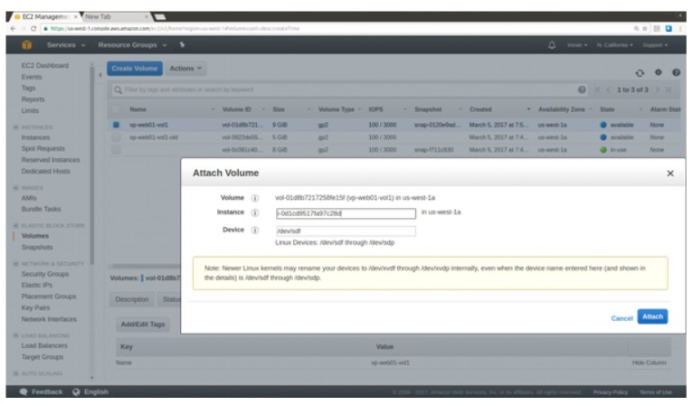

+ Après avoir attaché le montage du volume, à l'instance comme nous l'avons fait auparavant.

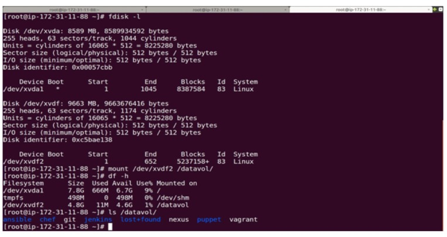


+ Dans la capture d'écran ci-dessus, nous pouvons voir que les données sont restaurées. 
+ Mais la taille du point de montage est toujours d'environ `5 Go`, même si nous avons modifié la taille du `volume EBS à 9Go`.
+ En effet, le reste du volume n'est toujours pas redimensionné et nous devons le redimensionner.


#### Redimensionner le volume augmenté

+ Nous avons déjà montré le nouveau volume mais pour le redimensionner, nous devons le démontrer, supprimer la partition, le recréer avec une nouvelle taille, le redimensionner et le monter.
+ Suivez les mêmes étapes pour démonter, supprimer et créer une nouvelle partition comme indiqué ci-dessous :
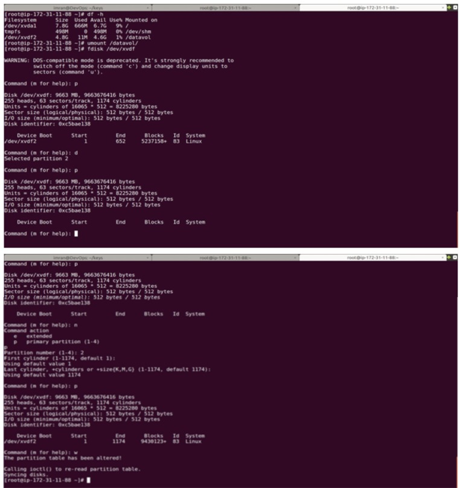

#### Redimensionner le volume 

+ Afin de redimensionner le volume, nous devons exécuter la commande `#resize2fs/dev/xvdf2` (Si nous exécutons cette commande, cela donne une erreur pour exécuter une autre commande car le nouveau volume est supérieur à l'ancien volume).
+ Suivez les étapes indiquées dans la capture d'écran ci-dessus pour redimensionner le volume.

+ **Remarque :** Si le nouveau volume a également la même taille que l'ancien volume, il n'est pas nécessaire de le redimensionner, il suffit de monter après l'avoir attaché à l'instance.
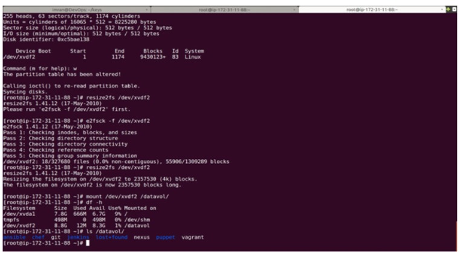

+ Désormais, la taille du volume est augmentée et les données sont également restaurées.


## VPC AWS

+ `Le cloud privé virtuel (VPC)` est un réseau virtuel dédié à votre compte `AWS`.
+ Il est logiquement isolé des autres réseaux virtuels du cloud `AWS`.
+ Vous pouvez lancer vos ressources `AWS`, telles que les instances `AMAZON EC2`, dans votre `VPC`.
+ Vous pouvez configurer votre `VPC`, vous pouvez sélectionner sa plage d'adresse `IP`, créer des sous-réseaux et configurer des tables de routages, des passerelles réseau et des paramètres de sécurité.

<br/>

+ `Le sous-réseau` est une plage d'adresses `IP` dans votre `VPC`.
+ Vous pouvez lancer des ressources `AWS` dans un sous-réseau que vous sélectionnez.
+ Utilisez un sous-réseau public pour les ressources qui doivent être connectés à Internet et un sous-réseau privé pour les ressources qui ne seront pas connectées à Internet.

<br/>

+ `Sous-réseau public :`un sous-réseau public achemine `0.0.0.0.0/0` via une passerelle Internet (igw).
+ Les instances d'un sous-réseau public nécessitent des adresses IP publiques pour communiquer avec Internet.

<br/>

+ `Une passerelle Internet` est un composant `VPC` à l'échelle horizontale, redondant et hautement disponible qui permet la communication entre les instances de votre `VPC et Internet`.
+ Il n'impose donc aucun risque de disponibilité ni contraire de bande passante sur votre trafic réseau.
+ Une passerelle Internet a deux objectifs : fournir une cible dans vos tables de routage `VPC` pour le trafic routable sur `Internet` et effectuer d'adresses réseau `(NAT)` pour les instances auxquelles des adresses `IPV4` publiques ont été attribuées.
+ Une passerelle Internet prend en charge le trafic `IPV4` et `IPV6`.

<br/>

+ Une table de routage contient un ensemble de règles, appelées `routes`, utilisées pour déterminer vers où le trafic réseau est dirigé.

<br/>

+ Chaque sous-réseau de votre `VPC` doit être associé à une table de routage; la table de contrôle de routage du sous-réseau.
+ Un `sosu-réseau` ne peut être associé qu'à une seule table de routage à la fois, mais vous pouvez associer plusieurs sous-réseaux à la même table de routage.


#### Création d'un VPC

+ Accédez au tableau de bord `VPC` à partir du tableau de bord principal d'`AWS`, comme indiqué ci-dessous, et cliquez sur `Démarrer l'assistant VPC`.

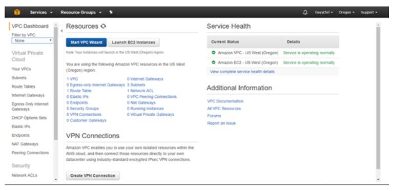

+ Vous accédérez à une page de configuration `VPC`, sélectionnez `VPC`avec un seul sous-réseau public et cliquez sur `Sélectionner`.

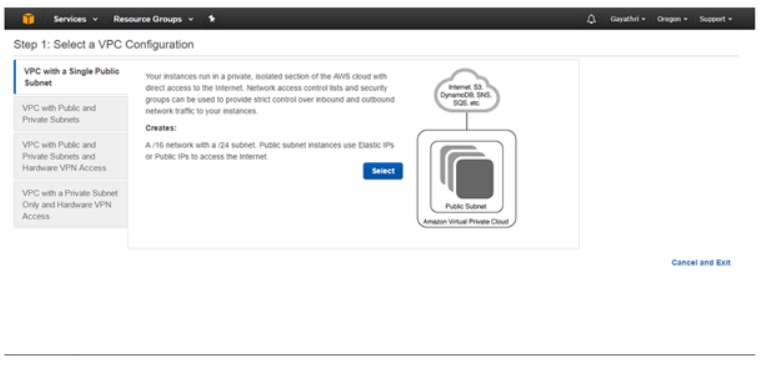

+ Spécifiez la page de blocs `CIDR IPV4` pour le sous-réseau, fournissez un nom pour le `vpc` et cliquez sur `créer un vpc`.

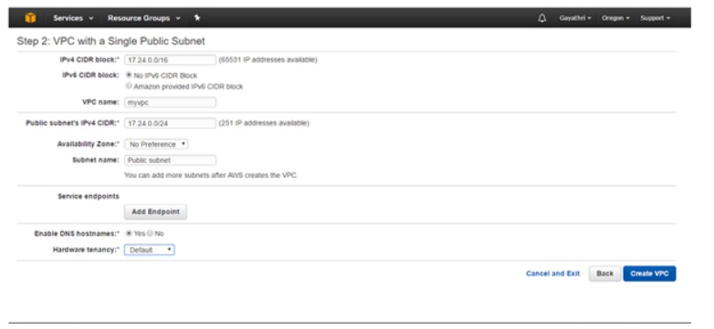

+ Votre `VPC` est créé avec succès et est disponible pour l'attacher aux instances.

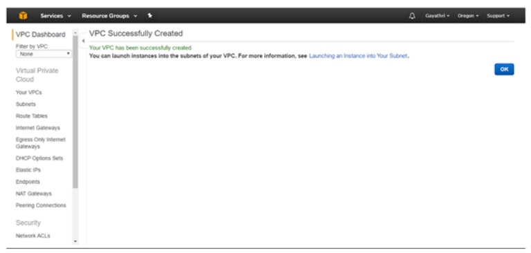

+ Il faut quelques minutes pour atteindre l'état disponible. Une fois disponible, sélectionnez le `vpc` et cliquez sur les actions pour l'attacher à l'instance.

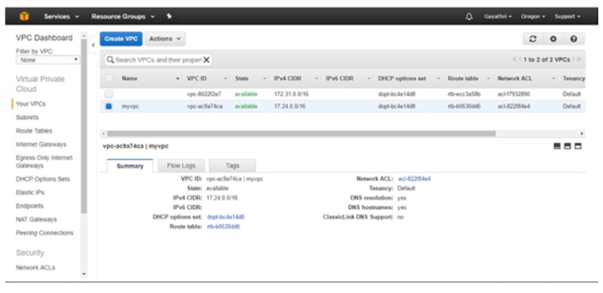

+ Dans l'onglet résumé de `vpc`, vous pouvez voir les détails complets de `vpc`.


## Création d'un VPC hautement disponible

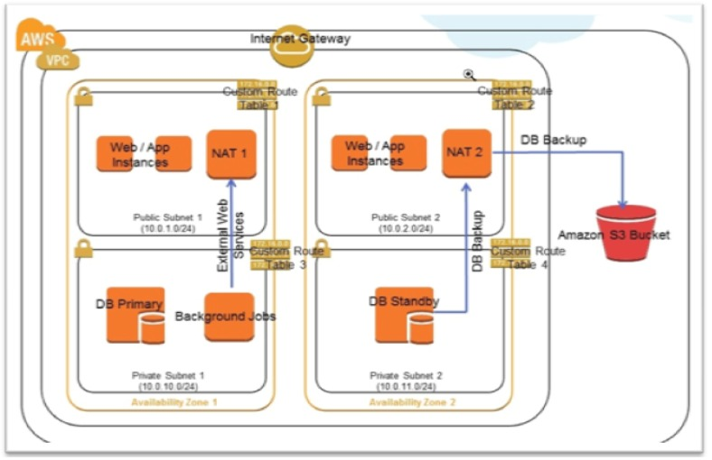

+ Un `VPC hautement disponible` s'étend sur plusieurs zones.
+ Même si une zone tombe en panne, nos services répartis sur l'autre zone continueront à désservir le trafic des utilisateurs.
+ Si vous voyez le diagramme ci-dessus, nous avons des services `Web`, base de données et backend dans deux zones.
+ Lors de la création de l'instance `EC2`, nous pouvons maintenant décider quel sous-réseau créer notre instance.
+ Ainsi, par exemple, nous créerons `Web01` dans un sous-réseau (situé dans la zone 1a) et `Web02` (situé dans la zone 1b) dans un autre sous-réseau.
+ Ainsi, si la `zone 1a` tombe en panne, nous avons toujours `Web02` qui déssert le trafic utilisateur de la `zone 1b`. 
+ Nous allons créer un `VPC HA` manuellement et non avec l'assistant.
+ Création d'un `VPC` : accédez au `VPC` à partir du tableau de bord principal d'`AWS`.

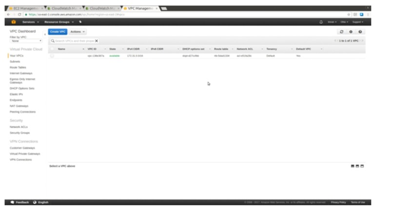

+ Cliquez sur vos `VPC` sur le côté gauche du volet de navigation et cliquez sur `Créer un VPC`.
+ Créez le bloc `CIDR/16` et la plage `IP privée` de votre choix, comme indiqué ci-dessous.

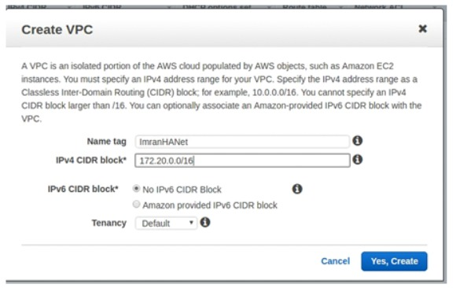

+ Accédez à `Sous-réseaux` et cliquez sur `Créer` des sous-réseaux.
+ Créer le premier sous-réseau public de la même plage `VPC` avec le bloc `CIDR/24`.
+ Sélectionnez la zone de disponibilité comme `us-east-2a`.

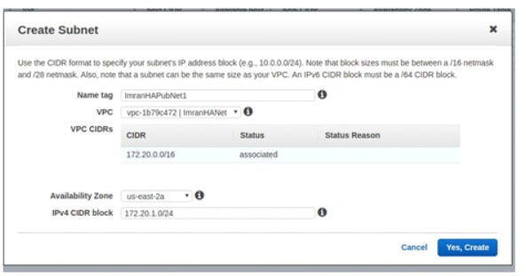

+ Créer un deuxième sous-réseau public à partir de la même plage `VPC` avec le bloc `CIDR/24`.
+ Sélectionnez la zone de disponibilité comme `us-east-2b`.

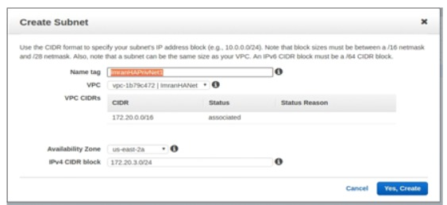

+ Créer un deuxième sous-réseau privé à partir de la même plage `VPC` avec le bloc `CIDR/24`.
+ Sélectionnez la zone de disponibilité comme `us-east-2b`.

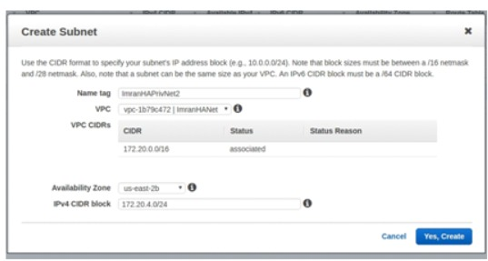

+ Vérifiez tous vos paramètres de sous-réseau.

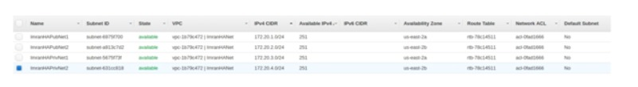

+ Accédez à `Internet Gateway` pour créer une passerelle Internet et mapper au sous-réseau public.


+ Fournissez le nom de la passerelle Internet. Cliquez sur `Créer`.

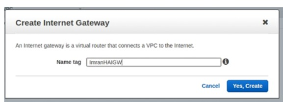

+ Attachez `IGW` à votre `VPC` : sélectionnez la passerelle Internet que vous avez créée, choisissez le `VPC`à attachez et cliquez sur `Attacher au VPC`.

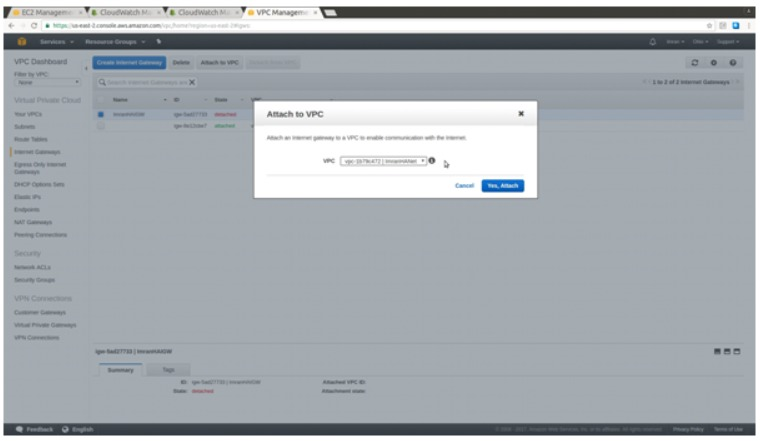

+ Créer une passerelle `NAT` à mapper à vos sous-réseaux privés.
+ Vous avez également besoin d'une adresse `IP Elastic (EIP)` à attribuer à votre passerelle `NAT`.
+ Accédez au volet de navigation de la passerelle `NAT` et cliquez sur créer une passerelle `NAT`.

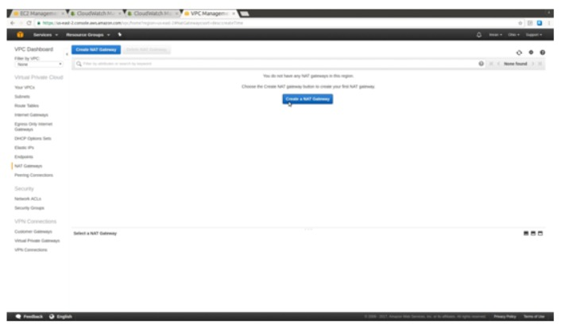

+ Sélectionnez l'un des sous-réseaux `PUBLIC` que nous avons crées précédemment, créez un nouvel `EIP` et attribuez-le à la passerelle.

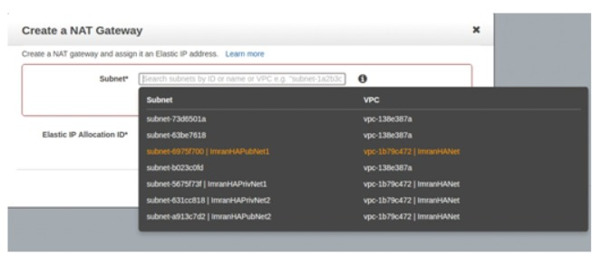

+ Une fois terminé, cliquez sur créer une passerelle `NAT`.

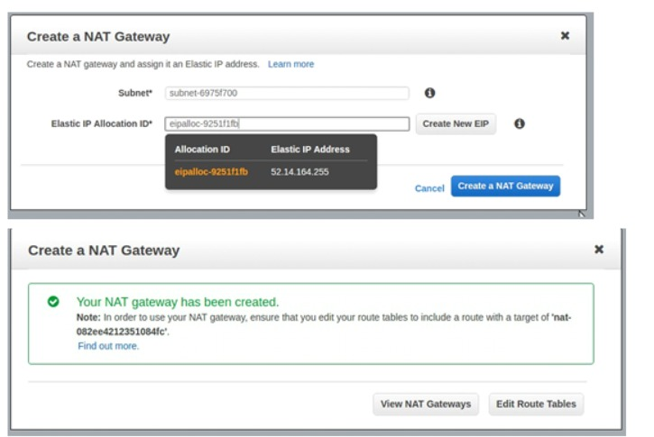

+ La passerelle `NAT` est crée avec succès comme indiqué ci-dessous.

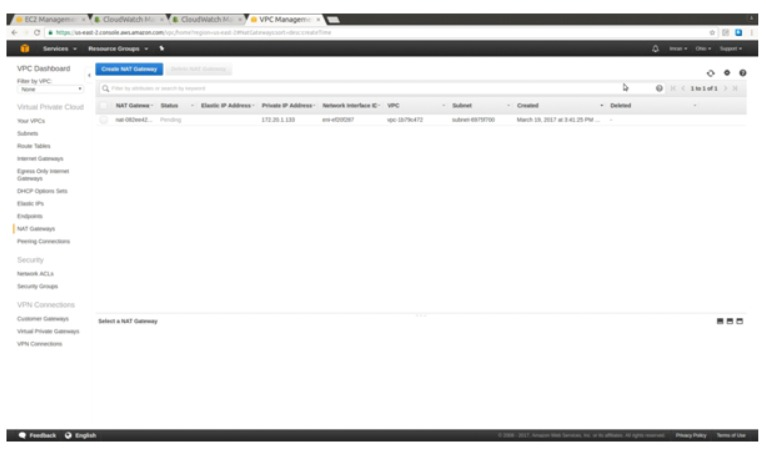

+ Accédez à `Table de routage` pour créer des tables de routages pour les sous-réseaux.


+ Cliquez sur créer une table de routage et donnez un nom, cliquez sur créer.
+ Nous avons besoin de deux tables de routage, une pour le sous-réseau public et une pour le sous-réseau privé.

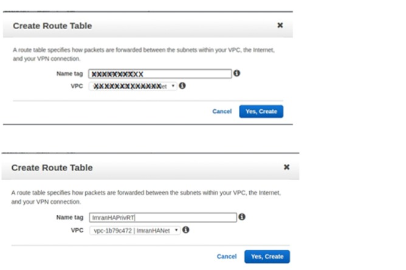

+ Appuyez une règle de table de routage sur `HAPubRT` pour acheminer vers `IGW` que nous avons créé et enregistré.

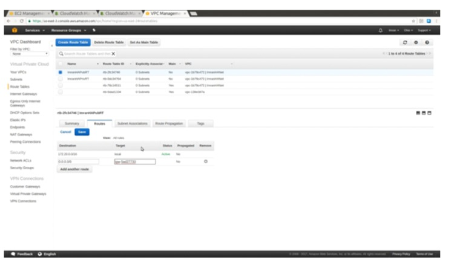

+ Associez `HAPubRT` aux sous-réseaux public et enregistrez.

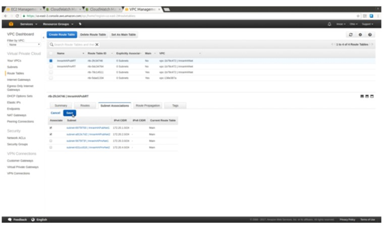

+ Ajoutez une règle de table de routage sur `HAPrivRT` pour acheminer vers `NAT GW` et enregistrer.

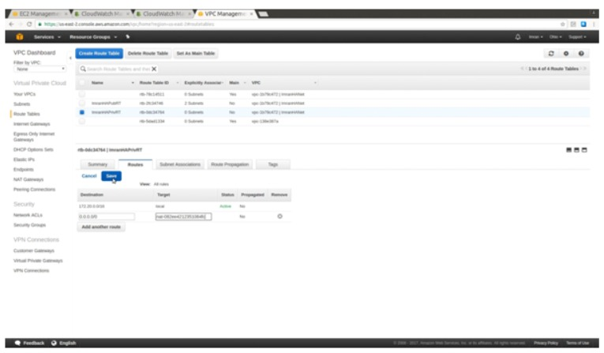

+ Associez `HAPrivRT` aux sous-réseaux privés et enregistrez

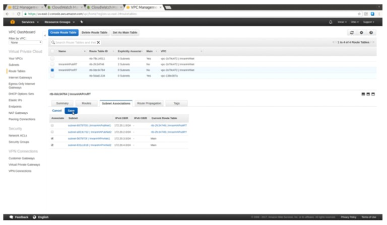

+ Accédez à vos sous-réseaux et vérifiez chaque sous-réseau.

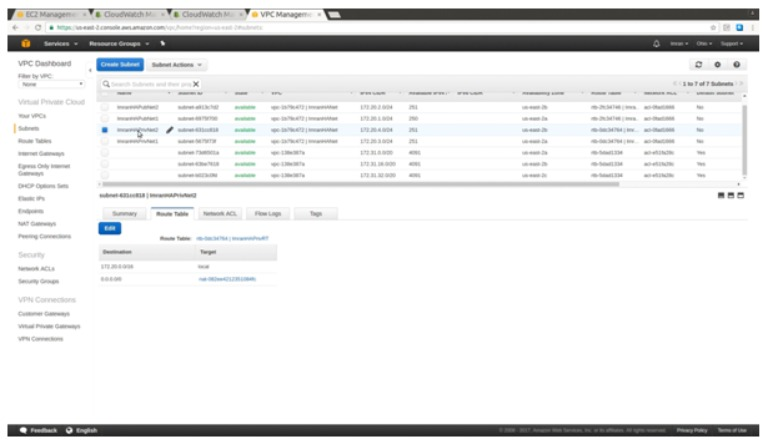

+ Vous pouvez attacher ce `VPC` ayx instances `EC2` avec un sous-réseau public et un sous-réseau privé.
+ Si vous souhaitez vous connecter à l'instance de sous-réseau privé, vous devez d'abord vous connecter à l'instance de sous-réseau public.


## Equilibreur de charge élastique

+ `Elastic Load Balancing` distribue le trafic applicatif entrant sur plusieurs `instances EC2`, dans plusieurs zones de disponibilité.
+ Cela augmente la tolérance aux pannes de vos applications. Un équilibreur de charge accepte le trafic entrant des clients et achemine les demandes vers ses `instances EC2` enregistrées dans une ou plusieurs zones de disponibilité.
+ L'équilibreur de charge surveille également l'état de santé de ses instances enregistrées et garantit qu'il achemine le trafic uniquement vers des instances saines.
+ Lorsque l'équilibreur de charge détecte une instance défectueuse, il arrête le routage du trafic vers cette instance, puis reprend le routage du trafic vers cette instance lorsqu'il détecte que l'instance est à nouveau saine.
+ `Elastic Load Balancing` prend en charge deux types de charge : `les équilbreurs de charges d'application et les équilibreurs de charge classiques`.
+ Il existe une différence essentielle entre la façon dont vous configurez ces équilibreurs de charge. Avec une application `Load Balancer`, vous enregistrez les instances en tant que cibles dans un groupe cible et acheminez le trafic vers un groupe cible.
+ Lorsque vous créez un équilibreur de charge, vous devez choisir d'en faire un équilibreur de charge interne ou un équilibreur de charge accessible sur Internet.
+ Notez que lorsque vous créez un équilibreur de charge classique dans `EC2-Classic`, il doit s'agir d'un équilibreur de charge accessible sur Internet. 
+ Le nom `DNS` d'un équilibreur de charge Internet peut être résolu publiquement en adresses `IP` publiques des noeuds. Par conséquent, les équilibreurs de charge connectés à `Internet` peuvent acheminer les requêtes des clients via Internet.

<br/>

+ Les noeuds d'un équilibreur de charge interne n'ont que des adresses `IP Privées`. Le nom `DNS` d'un équilibreur de charge interne peut être résolu publiquement en adresses `IP` privées des noeuds.
+ Par conséquent, les équilibreurs de charge internes peuvent uniquement acheminer les requêtes des clients ayant accès au `VPC` pour l'équilibreur de charge.
+ **`Remarque :`** Les équilibreurs de charge internet et internes acheminent les requêtes vers nos instances à l'aide d'adresses `IP` privées. Par conséquent, vos instances n'ont pas besoin d'adresses `IP` publiques pour recevoir les demandes d'un équilibreur de charge interne ou accessible sur Internet.

<br/>

+ Si votre application comporte plusieurs niveaux, par exemple des serveurs Web qui doivent être connectés à Internet et des serveurs de base de données qui sont uniquement connectés aux serveurs Web, vous pouvez concevoir une architecture qui utilise à la fois des équilibreurs de charge internes et accessibles sur Internet.
+ Créez un équilibreur de charge accessible sur Internet et enregistrez les serveurs Web avec celui-ci.
+ Créez un équilibreur de charge interne et enregistrez les serveurs de base de données avec celui-ci.
+ Les serveurs Web reçoivent les requêtes de l'équilibreur de charge accessible sur Internet et envoient les requêtes des serveurs de base de données à l'équilibreur de charge interne.
+ Les serveurs de base de données reçoivent les requêtes de l'équilibreur de charge interne.


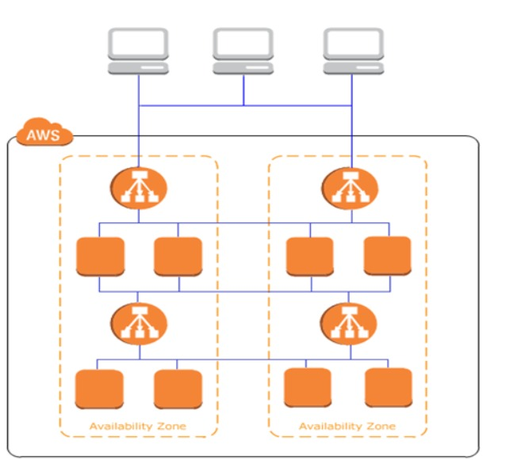


#### Création d'un équilibreur de charge élastique : 

**Conditions Préalables :**

1. Choissez deux zones de dsiponiblité que vous utiliserez pour vos instances `EC2`. Vérifiez que votre cloud privé ``

