# **Systèmes de Contrôle de Versions (VCS)**

## **Introduction au VCS**

+ Quel que soit le modèle suivi par les développeurs pour créer des logiciels, les développeurs écriront ou intégreront de nombreux codes dans leurs logiciels.
+ Tout ce code provenant des différents développeurs de l'équipe doit être fusionné dans un endroit centralisé, qui peut grader une trace de toutes les versions de leur code, maintenir le code et même revenir en arrière en cas de problème.
+ Le **système de contrôle de version (ou contrôle de révision ou contrôle de source)** consiste à gérer plusieurs versions de documents, programmes, sites web, etc.
+ Un **système de contrôle de version(VCS)** vous permet de suivre l'historique d'une collection de fichiers.


+ Les systèmes de contrôle de version sont une catégorie d'outils logiciels qui aident une équipe à gérer les modifications apportées au code source au fil du temps.
+ Le logiciel de contrôle de version garde une trace de chaque modification du code dans un type spécial de base de données.
+ Si une erreur est commise, les développeurs peuvent en arrière et comparer les versions antérieures du code pour aider à corriger l'erreur tout en minimisant les perturbations pour tous les membres de l'équipe.
+ Le contrôle de version protège le code source à la fois des catastrophes et de la dégradation fortuite due aux erreurs humaines et aux conséquences involontaires.


+ Les développeurs de logiciels travaillant en équipe écrivent du code continuellement du nouveau code source et modifient le code source existant.
+ Le code d'un projet, d'une application ou d'un composant logiciel est généralement organisé dans une structure organisée dans une structure de dossiers ou une  `arborescence de fichiers`.
+ Un développeur de l'équipe peut travailler sur une nouvelle fonctionnalité tandis qu'un autre développeur corrige un bogue sans rapport en modifinat le code, chaque developpeur peut apporter ses modifications dans plusieurs parties de l'arborescence des fichiers. 


#### **Quand Utiliser VCS**

+ Avez-vous déjà:

    <ol>
        <li>Apporté une modification au code, réalisé que c'était une erreur et souhaité revenir en arrière ?</li>
        <li>Vous avez perdu du code ou vous avez eu une sauvegarde trop ancienne ?</li>
        <li>Vous avez dû gérer plusieurs versions d'un produit</li>
        <li> Vous vouliez voir la différence entre deux (ou plusieurs) versions de votre code</li>
        <li>Vous vouliez prouver qu'une modification particulière a cassé ou corrigé un morceau de code</li>
        <li>Vous vouliez revoir l'historique d'un code</li>
        <li>Vous souhaitez soumettre une modification au code de quelqu'un d'un autre ?</li>
        <li>Vous vouliez partager votre code ou laisser d'autres personnes travailler sur votre code</li>
        <li>Vous vouliez savoir quelle quantité de travail est effectué, et où, quand et par qui ?</li>
        <li>Vous vouliez expérimenter une nouvelle fonctionnalité sans interférer avec le code fonctionnel</li>
    </ol>
  
+ Dans ces cas, et sans doute dans d'autres, un système de contrôle de version devrait vous faciliter la vie.


## **Terminologies VCS**

#### **Configuration De Base**

<ol>
    <li><b>Dépôt (repo)</b> : La base de données des fichiers</li>
    <li><b>Serveur</b> : l'ordinateur</li>
    <li><b>Client</b> : l'ordinateur qui se connecte au dépôt</li>
    <li><b>Ensemble de travail/Copie de travail</b> : votre répertoire local de fichiers, dans lequel vous apportez des modifications</li>
    <li><b>Trunk/Main</b> : emplacement principal du code dans le dépôt. Considérez le code comme un arbre généalogique : le tronc est la ligne principale</li>
</ol>

#### **Actions Basiques**

<ol>
    <li><b>Add/Push</b> : placez un fichier dans le dépôt pour la première fois, c'est-à-dire commencez à le suivre avec le contrôle de version</li>
    <li><b>Revision</b> : sur quelle version se trouve un fichier(v1, v2, v3)</li>
    <li><b>Head</b>La dernière révision du dépôt</li>
    <li><b>Check out/Pull/Fetch(Extraire/Extraire/Récupérer)</b> : Téléchargez un fichier à partir du dépôt</li>
    <li><b>Check in/Push(Archiver/Push)</b>Téléchargez un fichier dans le référentiel(s'il a changé).Le fichier reçoit un nouveau numéro de version </li>
    <li><b>Check In Message(Message d'enregistrement)</b>: un court message décrivant ce qui a été modifié</li>
    <li><b>Changelog/History</b> Une liste des modifications apportées à un fichier depuis sa création</li>
    <li><b>Update/Sync</b>: synchronisez vos fichiers avec les dernières versions du référentiel. Cela vous permet de récupérer les dernières versions de tous les fichiers.</li>
    <li><b>Revert</b>: supprimez vos modifications locales et rechargez la dernière à partir du référentiel.</li>
</ol>

#### **Actions avancées**

<ol>
    <li><b>Branch</b>: créez une copie séparée d'un fichier/dossier pour un usage privé(correction de bogues, tests, etc). <b>Branch</b> est à la fois un verbe (branchez le code) et un nom (dans quelle branche se trouve t-il ?) </li>
    <li><b>Diff/Change/Delta</b> : Trouver les différentes entre deux fichiers. </li>
    <li><b>Merge(or patch)</b>: Appliquez les modifications d'un fichier à un autre, pour le mettre jour. Par exemple, vous pouvez fusionner des fonctionnalités d'une branche dans une autre. (Chez microsoft, cela s'appelait Reverse integrate et forward Integrate)</li>
    <li><b>Conflict</b>: lorsque des modifications en attente dans un fichier se contredisent (les deux modifications ne peuvent pes être appliquées)</li>
    <li><b>Resolve</b>: corriger les modifications qui se contredisent et archiver la version correcte</li>
    <li><b>Locking</b>: prendre le contrôle d'un fichier afin que personne d'autre ne puisse le modifier jusqu'à ce que vous le déverrouillez. Certains systèmes de contrôle de version l'utilisent pour éviter les conflits. </li>
</ol>

## **Types de contrôle de version**

#### **Systèmes de contrôle de version localisés**

+ Un `système de contrôle de version localisé` conserve des copies locales des fichiers. Cette approche peut être aussi simple que de créer une copie manuelle des fichiers pertinents.

#### **Systèmes de contrôle de version centralisés**
+ Un système de contrôle de version centralisé fournit un composant logiciel serveur qui stocke et gère les différentes versions des fichiers.
+ Un développeur peut copier (extraire) une certaine version du serveur central sur son ordinateur individuel. Par exemple: `CVS, SVN`, etc.


+ Dans `Subversion, CVS, Perforce, etc`. Un référentiel de serveur central (repo) contient la `copie officielle` du code.
    + Le serveur conserve le seul historique des versions du dépôt.
+ Vous en faites des `extractions` sur votre copie locale.
    + Vous apportez des modifications locales
    + vos modifications ne sont pas versionnés
+ Lorsque vous avez terminé, vous vous enregistrez sur le serveur.
  + votre enregistrement incrémente la version du dépôt.

#### **Systèmes de Contrôle de version distribués**
+ Dans un système de contrôle de version distribué, chaque utilisateur dispose d'une copie complète d'un réfréentile sur son ordinateur individuel.
+ Les deux approches présentent l'inconvénient d'avoir un seul point de défaillance.
+ Dans un système de contrôle de version localisé, il s'agit de l'ordinateur et dans un système de contrôle de version centralisé, il s'agit de la machine serveur.
+ Les deux systèmes rendent également plus difficile le travail en parallèle sur différents fonctionnalités.
+ Par exemple: `Git, Mercurial, etc`.

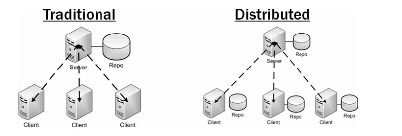


## **Systèmes de contrôle de version célèbres**

#### **CVS**
+ `CVS` pourrait très bien être le point de départ des systèmes de contrôle de version.
+ `CVS` est fondamentalement la norme ici et est utilisé à peu près partout - cependant la base des codes n'est pas aussi riche en fonctionnalités que d'autres solutions telles que`SVN`.
+ L'un des avantages de `CVS` est qu'il n'est pas trop difficile à apprendre.
+ Il est livré avec un système simple qui garantit que les revisions et les fichiers sont tenus à jour.
+ Compte tenu des autres options, `CVS` peut considérer comme une forme de technologie plus ancienne, car il existe depuis un certain temps et reste incroyablement utile pour les administrateurs systèmes qui souhaitent sauvegarder et partager des fichiers.

#### **SVN ou Subversion**
+ `SVN`, ou `Subversion` comme on l'appelle parfois, est généralement le système de contrôle de version le plus largement adopté.
+ La plupart des formes de projets open source utiliseront `Subversion` car de nombreux autres grands produits tels que `Ruby, Python, Apache` et bien d'autres l'utilisent également. 
+ `Google Code` utilise même `SVN` comme moyen de distribuer exclusivement du code.
+ En raison de sa popularité, de nombreux clients différents pour `Subversion` sont disponibles.
+ Si vous utilisez `Windows`, `Tortoisevn` peut être un excellent navigateur pour éviter, visualiser et modifier les bases de code `Subversion`.
+ Toutefois, si vous utilisez un `MAC`, `Versions` pourrait être votre client idéal.


#### **Git**

+ `Git` est considéré comme une étoile émergente plus récente et plus rapide en matière de systèmes de contrôle de version.
+ Developpé pour la première fois par le créateur du noyau `Linux`, `Linux Torvalds`, `Git` a commencé à prendre d'assaut la communauté du développement `Web` et de l'administration système, offrant une forme de contrôle très différente.
+ Ici, il n'existe pas de base de code centralisée unique à partir de laquelle le code peut être extrait, différentes branches sont chargées d'héberger différentes zones du code.
+ D'autres systèmes de contrôle de version, tels que `CVS` et `SVN` utilisent un contrôle centralisé, de sorte qu'une seule copie principale du logiciel soit utilisée.
+ En tant que système rapide et efficace, de nombreux administrateurs système et projets open source utilisent `Git` pour alimenter leurs référentiels.
+ Cependant, il convient de noter que `Git` n'est aps aussi facile à apprendre que `SVN` ou `CVS`, ce qui signifie que les débutants devront peut-être rester à l'écart s'ils ne sont pas prêt à investir du temps pour apprendre l'outil.

#### **Mercuriel**
+ Il s'agit encore d'une autre forme de système de contrôle de version, similaire à `Git`.
+ Il a été conçu initialement comme une source pour des programmes de développement plus importants, souvent en dehors de la portée de la plupart des administrateurs système, des développeurs `Web` indépendants et des concepteurs.
+ Cependant, cela ne signifie pas que les petites équipes et les individus ne peuvent pas l'utiliser.
+ `Mercurial` est une application très rapide et efficace.
+ Les créateurs ont conçu le logiciel avec la performance comme fonctionnalité principale.
+ En plus d'être très évolutif et incroyablement rapide, `Mercurial` est système beaucoup plus simple à utiliser que des éléments `Git`, ce qui est l'une des raisons pour lesquelles certains administrateurs système et développeurs l'utilisent.
+ Il n'y a pas beaucoup de choses à apprendre et les fonctions sont moins compliqués et plus comparables à celles des autres systèmes `CVS`.
+ `Mercurial` est également accompagné d'une interface Web et de diverses documentations complètes qui peuvent vous aider à mieux le comprendre.

#### **Bazar**

+ Semblable à `Git` et `Mercurial`, `Bazar` est un système de contrôle de version distribué, qui offre également une expérience utilisateur exceptionnelle et conviviale.
+ `Bazar` est unique car il peut être déployé soit avec une base de code centrale, soit en tant que base de code distribuée.
+ Il s'agit du système de contrôle de version le plus polyvalent qui prend en charge différentes formes de flux de travail, du centralisé au décentralisé, et avec un certain nombre de variantes différentes reconnues partout.
+ L'une des plus grandes fonctionnalités de `Bazar` est que vous pouvez accéder à un niveau de contrôle très détaillé dans sa configuration.
+ `Bazar` peut être utilisé pour s'adapter à presque tous les scénarios, ce qui est incroyablement utile pour la plupart des projets et des administrateurs car il est si facile à adapter et à gérer.
+ Il peut être également être facilement intégré à projets déjà existants.
+ Dans le même temps, `Bazar` dispose d'une vaste communauté qui aide à la maintenance d'outils et de plugins tiers.


## **Qu'est-ce que Git**
+ Le système de contrôle de version moderne le plus utilisé dans le monde aujourd'hui est de loin `Git`.
+ `Git` est un projet open source mature et activement maintenu, initialement dévéloppé en 2005 par `Linus Torvalds`, le célèbre créateur du noyau d'exploitation `Linux`.
+ Un nombre impressionnant de projets s'appuient sur `Git` pour le contrôle de version, y compris des projets commerciaux ainsi qu'open source.
+ Les développeurs qui ont travaillé avec `Git` sont bien représentés dans le vivier de talents en développement de logiciels disponibles et il fonctionne bien sur un large éventail de systèmes d'exploitation et d'IDE(environnements de développement intégrés).
+ Ayant une architecture distribuée, `Git` est un exemple de `DVCS` (donc Distributed Version Control System).
+ Plutôt que de n'avoir qu'un seul emplacement pour l'historique complet des versions du logiciel, comme cela est courant dans les systèmes de contrôle de version autrefois populaires comme `CVS ou Subversion`(également connu sous le nom de `SVN`) dans `Git`, la copie de travail du code de chaque développeur est également un référentiel, qui peut contenir l'historique complet de toutes les modifications.
+ En plus d'être distribué, `Git` a été conçu dans un souci de performances, de sécurité et de flexibilité.


#### **Pourquoi Utiliser Git ?**
+ *C'est rapide*
+ *Vous n'avez pas besoin d'accéder à un serveur*
+ *Etonnamment bon pour fusionner les modifications simultanées.*
+ *Tout le monde l'utilise* 

### **Installez l'outil git sur votre système**

+ Site Web : 
    + https://git-scm.com/

**Les fenêtres**

+ Installez le logiciel `git`
    + https://git-scm.com/download/win
+ Accédez à la page de téléchargement de `git scm`, sélectionnez `Windows`.
+ Ouvrez `git` installable et suivez l'assistant d'installation, prenez tous les paramètres par défaut dans l'assistant.


+ **Linux**

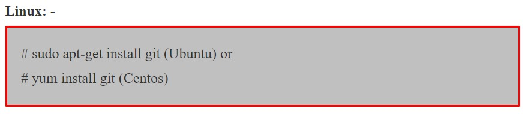

### **Zones Git Locales et Workflow Git de base**

**Zones Git Locales**

+ Dans votre copie locale sur `git`, les fichiers peuvent être:
  
  + Dans votre dépôt local `(validés)`
  + Extrait et modifiés, mais pas encore validés `(copie de travail)`
  + Ou, entre les deux, dans une zone de **préparation**
  + Organisés les fichiers sont prêts à être validés
  + Une validation enregistre un instantané de l'état de toutes les étapes.

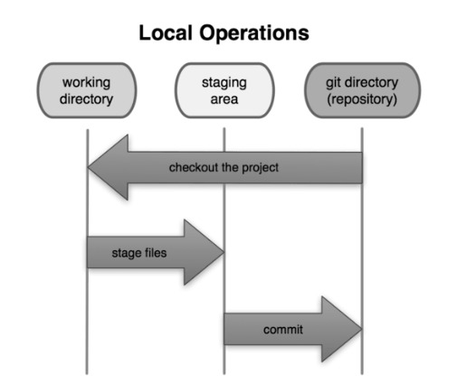

#### **Flux de Travail Git De Base**

+ Modifiez les fichiers dans votre repertoire de travail.
+ Mettez en scène les fichiers, en ajoutant des instantanés de ceux-ci à votre zone de préparation.
+ `commit`, qui prend les fichiers dans la zone de transit et stocke cet instantané de manière permanente dans votre repertoire `Git`.


### **Configuration initiale de Git**

+ Comme vous l'avez lu brièvement dans `Mise en route`, vous pouvez spécifier les paramètres de configuration de `Git` avec la commande `git config`.
+ L'une des premières choses que vous avez faites a été de configurer votre nom et votre adresse e-mail:

<ol>
    <li>Configuration au niveau du système</li>
    <li>Configuration globale/utilisateur</li>
    <li>Configuration au niveau du référentiel/local</li>
</ol>

#### **Configuration au Niveau du Système**

+ La configuration au niveau du système est disponible pour l'ensemble du système.
+ Le premier endroit où `git` recherche ces valeurs se trouve dans le fichier `/etc/gitconfig` à l'échelle du système, qui contient les paramètres appliqués à chaque utilisateur du système et à tous ses référentiels.
+ Si vous transmettez l'option `--system` à `git config`, il lit et écrit spécifiquement à partir de ce fichier.
+ **Remarque :** Généralement cette configuration n'est pas recommandée. Il est toujours préférable d'opter pour deux autres configurations globales et au niveau du référentiel.


#### **Configuration Globale/Utilisateur**

+ La configuration `globale/utilisateur` est disponible pour l'utilisateur actuellement connecté.
+ Si vous transmettez l'option `--global` à `git config`, il lit et écrit spécifiquement ç partir du fichier `~/.gitconfig`.
+ **Remarque :** Il est préférable d'opter pour deux autres configurations globales lorsque vous souhaitez configurer une configuration pour un utilisateur.

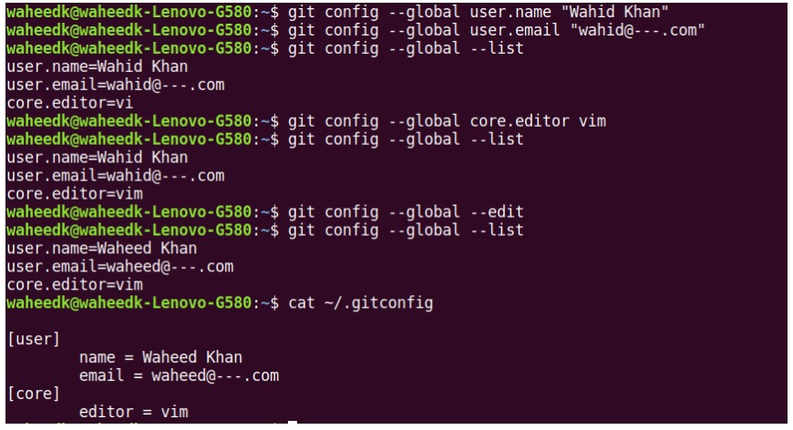


#### **Core.Editor**

+ Par défaut, `Git` utilise tout ce que vous avez défini comme `éditeur de texte` par défaut via l'une des variables d'environnement `shell VISUAL ou EDITOR`, ou bien revient à l'éditeur `vim` pour créer et modifier vos messages de validation et de balise.
+ Pour remplacer cette valeur par défaut par autre chose, vous pouvez utiliser le paramètre `core.editor` : 


+ Désormais, peu importe ce qui est défini comme éditeur shell, `Git` lancera `vim` pour éditer les messages.


#### Configuration du référentiel/au niveau local

+ La commande `git config` vous permet de configurer votre installation `Git (ou un référentiel individuel)` à partir de la ligne de commande.
+ Cette commande peut tout définir, des informations utilisateur aux préférences en passant par le comportement d'un référentiel.
+ Plusieurs options de configuration courantes sont répertoriées ci-dessous.
+ Définissez le nom de l'auteur à utiliser pour tous les `commits` dans le référentiel actuel.

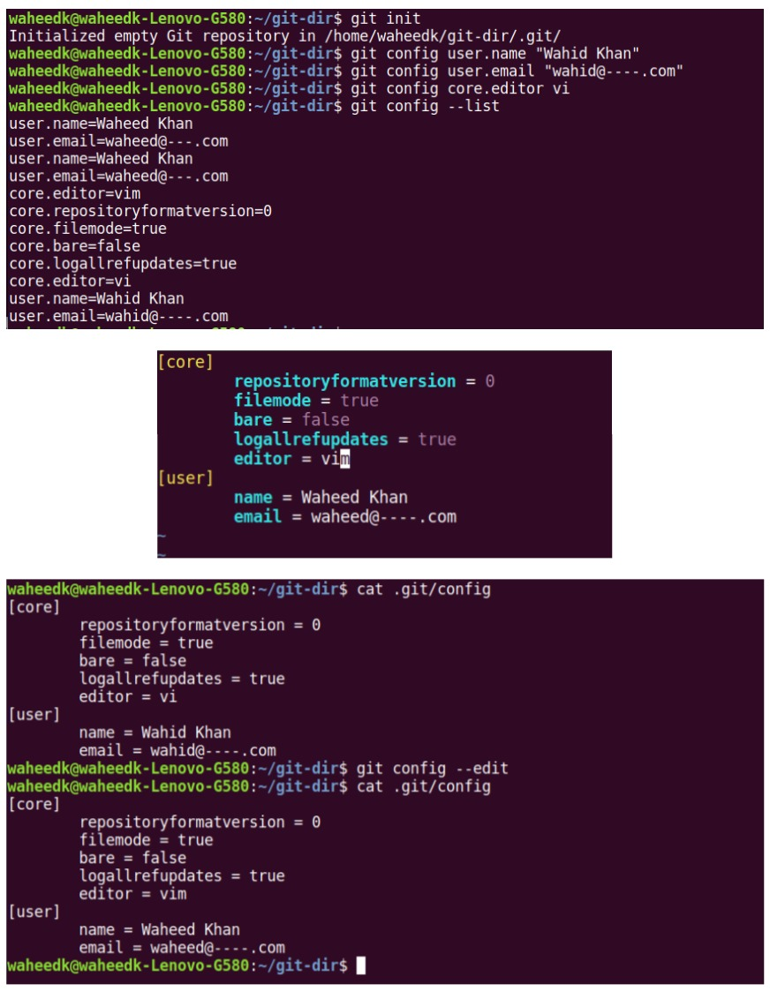


# Opérations Git

### 1) Mise en place d'un référentiel

+ Ce didacticiel fournit un aperçu succinct des commandes `Git` les plus importants.
+ Tout d'abord, la section Configuration d'un référentiel explique tous les outils dont vous avez besoin pour démarrer un nouveau projet contrôlé en version.
+ Ensuite, les sections restantes présentent vos commandes `Git` quotidiennes.
+ A la fin de ce module, vous devriez être en mesure de créer un référentiel `Git`, d'enregistrer des instantanés de votre projet pour conserver et d'afficher l'historique de votre projet.

#### Git Init

+ La commande `git init` crée un nouveau référentiel `Git`.
+ Il peut être utilisé convertir un projet existant non versionné en un référentiel `Git` ou initialiser un nouveau référentiel vide.
+ La plupart des autres commandes `Git` ne sont pas disponibles en dehors d'un référentiel initialisé.
+ Il s'agit donc généralement de la première commande que vous exécuterez dans un nouveau projet.
+ L'exécution de `git init` crée un sous-repertoire `.git` à la racine du projet, qui contient toutes les métadonnées nécessaires au dépôt.
+ Mis à part le repertoire `.git`, un projet existant inchangé (contrairement à `SVN, Git` ne nécessite pas le dossier `.git` dans chaque sous-repertoire). Usage 


+ Transformez le repertoire actuel en référentiel `Git`.
+ Cela ajoute un dossier `.git` au repertoire actuel et permet de commencer à enregistrer les révisions du projet.


<br/>

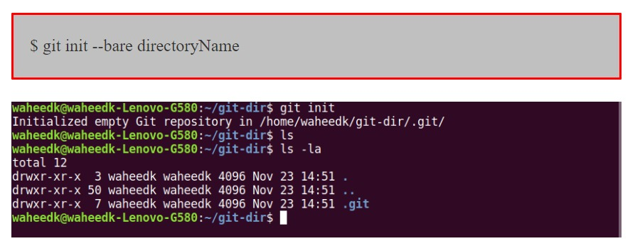

### 2) Status Git

+ `git status` - Affiche l'état de l'arborescence de travail.
+ Utilisez la commande `git status` pour vérifier l'état actuel du référentiel.

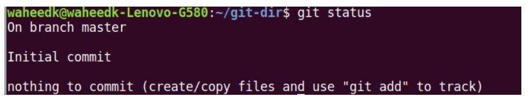

+ La commande vérifie l'état et signale qu'il n'y a rien à valider, ce qui signifie que le référentiel stocke l'état actuel du repertoire de travail et qu'il n'y a aucune modification à enregistrer.
+ Nous utiliserons le `git status` pour continuer à surveiller les états du repertoire de travail et du référentiel.


#### Enregistrer les modifications

### 3) Git add

+ La commande `git add` ajoute une modification dans le répertoire de travail à la zone de transit.
+ Cependant, `git add` n'affecte pas vraiment le référentiel de manière significative : les modifications ne sont réellement enregistrées que lorsque vous exécutez `git commit`.
+ En conjonction avec ces commandes, vous aurez également besoin de `git status` pour afficher l'état du repertoire de travail et la zone de transit. Usage : 

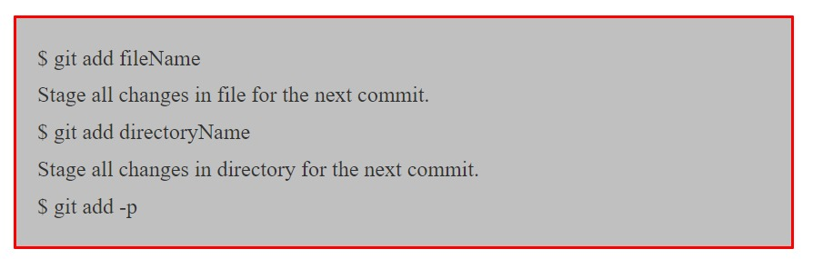

+ Lorsque vous démarrez un nouveau projet `git add` remplit la même fonction que `svn import`.
+ Pour créer un `commit` initial du repertoire actuel, utilisez ce qui suit :

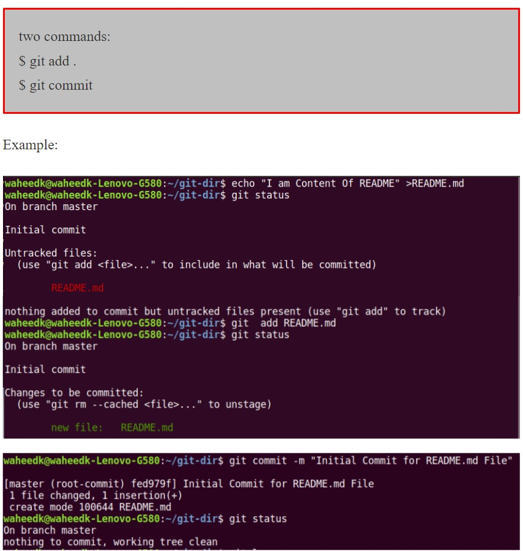


#### 4. Git Commit

+ La commande `git commit` valide l'instantané intermédiaire dans l'historique du projet.
+ Les instantanés validés peuvent être considérés comme des versions `sûres` d'un projet : `Git` ne les modifiera jamais à moins que vous le lui demandiez explicitement. Avec `git add`, c'est l'une des commandes `Git` les plus importantes.
+ Bien qu'elles partagent le même nom, cette commande n'a rien à voir avec `svn commit`.
+ Les instantanés sont enregistrés dans le référentiel local, ce qui ne nécessite absolument aucune interaction avec d'autres référentiels `Git`. Usage : 

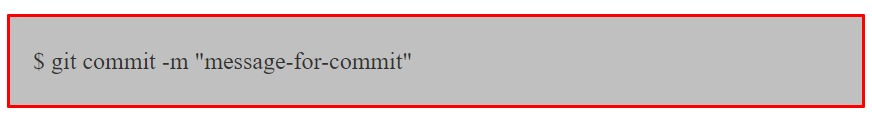

+ Validez l'instantané intermédiaire. Cela lancera un éditeur texte vous invitant à saisir un message de validation.
+ Après avoir saisi un message, enregistrez le fichier et fermer l'éditeur pour créer le `commit` réel : `git commit -m "message-for-commit"`.
+ Validez l'instantané intermédiaire, mais au lieu de lancer un éditeur de texte, utilisez `message-for-commit` comme message de validation.


#### 5. Git Add & Commit Autres Options :

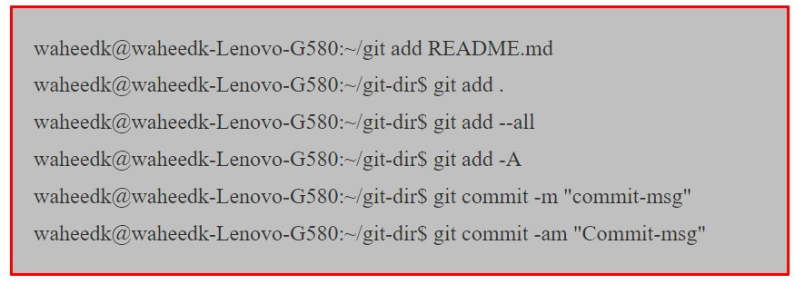

+ Démarrez une session de préparation interactive qui vous permet de choisir des parties d'un fichier à ajouter à la prochaine validation.
+ Cela vous présentera un certain nombre de modifications et vous demandera une commande. 
+ Utilisez y pour mettre en scène le morceau, `n` pour ignorer le morceau, `s` pour diviser en morceaux plus petits, `e` pour modifier manuellement le morceau et `q` pour quitter.


#### Discussion

+ Les commandes `git add et git commit` composent le `workflow Git` fondamental.
+ Ce sont les deux commandes que tout utilisateur de `Git` doit comprendre, quel que soit le modèle de collaboration de son équipe.
+ Ils permettent d'enregistrer les versions d'un projet dans l'historique du référentiel.
+ Le développement d'un projet s'articule autour du modèle `édition/étape/commit`.
+ Tout d'abord, vous modifiez vos fichiers dans le repertoire de travail.
+ Lorsque vous êtes prêt à enregistrer une copie de l'état actuel du projet, vous effectuez les modifications avec `git add`.
+ Une fois que vous êtes satisfait de l'instantané intermédiaire, vous le validez dans l'historique du projet avec `git commit`.
+ La commande `git add` ne doit pas être confondue avec `svn add`, qui ajoute un fichier au référentiel.
+ Au lieu de cela, `git add` fonctionne au niveau plus abstrait des modifications. Cela signifie que `git add` doit être appelé à chaque fois que vous modifiez un fichier, alors que `svn add` ne doit être appelé qu'une seule fois pour chaque fichier.
+ Cela peut sembler redondant, mais ce flux de travail facilite grandement l'organisation d'un projet.


#### La zone de transit

+ La zone de préparation est l'une des fonctionnalités les plus uniques de `Git`, et cela peut prendre un certain temps pour comprendre si vous venez d'un environnement `SVN` (ou même `Mercurial`).
+ Il est utile de le considérer comme un tampon entre le repertoire de travail et l'historique du projet.
+ Au lieu de valider toutes les modifications que vous avez apportées depuis la dernière validation, l'étape vous permet de regrouper les modifications associées dans les instantanés très ciblés avant de les valider dans l'historique du projet.
+ Cela signifie que vous pouvez toutes sortes de modifications à des fichiers non liés, puis revenir en arrière et les diviser en validations logiques en ajoutant des modifications associées à la scène et en les validant pièce par pièce.
+ Comme dans tout système le contrôle de révision, il est important de créer des validations atomiques afin de faciliter la détection des bogues et l'annulation des modifications avec un impact minimal sur le reste du projet.


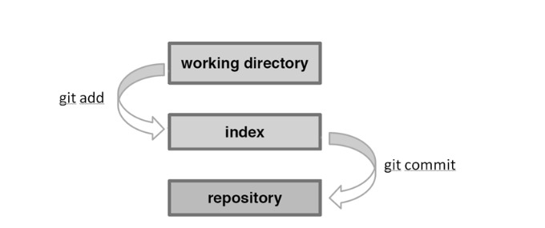


# Historique de Validation

+ Après avoir créé plusieurs validations, ou si vous avez cloné un référentiel avec un historique de validation existant, vous souhaiterez probablement revenir en arrière pour voir ce qui s'est passé.
+ L'outil le plus basique et le plus puissant pour ce faire est la commande `git log`.

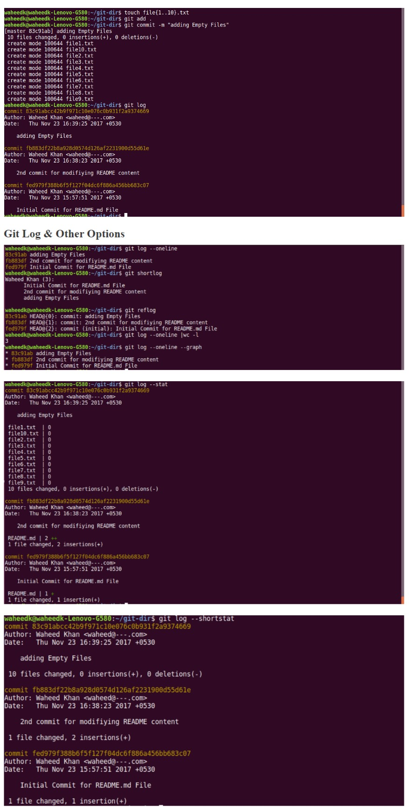

+ `--stat` -> Afficher les statistiques des fichiers modifiés à chaque validation.
+ `--shortstat` -> Afficher uniquement la ligne modifiée/insertions/suppressions de la commande `--stat`.


#### Git Diff

+ `git diff` - Afficher les modifications entre les `commits, les commits et l'arbre de travail, etc`.
+ L'objectif principal du contrôle de version est de vous permettre de travailler avec différentes versions de fichiers.
+ `Git` fournit une commande `diff` pour vous permettre de comparer différentes versions de vos fichiers.
+ Le scénario le plus courant pour utiliser `diff` est de voir les modifications que vous avez apportées après votre dernière validation. Voyons comment procéder.

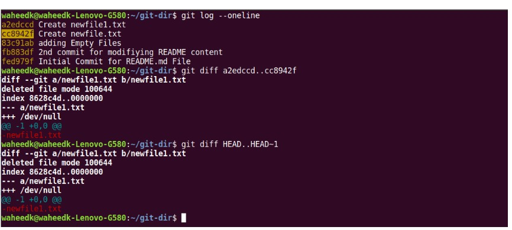

+ `Remarque` : Ici, dans `git diff`, vous pouvez utiliser `commitId ou HEAD`.
  + `HEAD` fait référence à deux choses dans `git` :
    + 1) Validation de niveau supérieur/récent.
    + 2) Branche de travail actuelle
    
# Configuration rapide de Github


# Cloner Git

#### 1) Cloner le référentiel Github vide :

+ La commande `git clone` copie un référentiel `Git` existant.
+ C'est un peu comme `svn checkout`, sauf que la `copie de travail` est un dépôt `Git` à part entière : elle a son propre historique, gère ses propres fichiers et constitue un environnement complètement isolé du dépôt d'origine.
+ Pour plus de commodité, le clonage créé automatiquement une connexion distante appelée  `origin` pointant vers le référentiel d'origine. Cela rend très facile l'interaction avec un référentiel central.

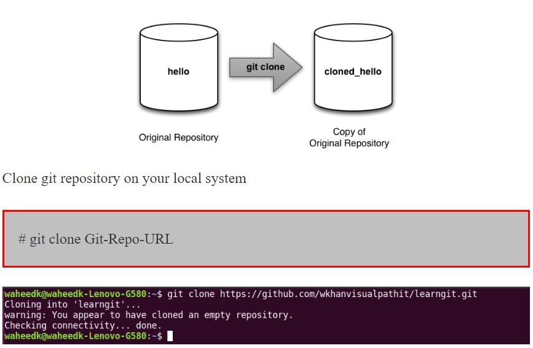

+ **Remarque :** Maintenant, nous venons de cloner un référentiel vide, nous pouvons ajouter le contenu et le transférer vers un référentiel distant. Exemple :

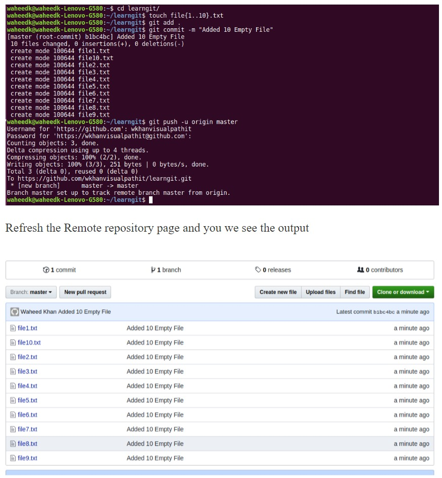

#### Transférer le référentiel local existant vers le référentiel distant

+ Dans le guide de démarrage rapide de `Git`, nous avons vu créer un référentiel `git` sur `github`, puis `cloner/extraire` ce dépôt sur un ordinateur local avec la commande `git clone`.
+ Nous verrons comment maintenant comment créer un dépôt localement puis plus tard comment le pousser vers `github`.
+ Créez un référentiel public et récupérez `l'URL` distante, ajoutez-la à votre dépôt local comme ci-dessous :

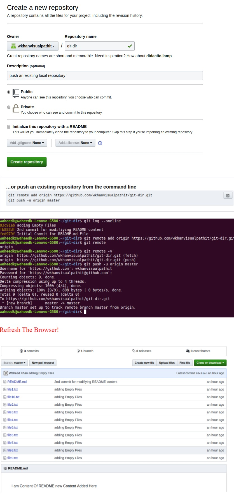


#### Synchronisation

+ `SVN` utilise un référentiel central unique pour servir de centre de communication pour les développeurs et la collaboration s'effectue en transmettant des ensembles de modifications entre les copies de travail des développeurs et le référentiel central.
+ Ceci est différent du modèle de collaboration de `Git`, qui donne à chaque développeur sa propre copie du référentiel, avec son propre historique local et sa propre structure de branches.
+ Les utilisateurs doivent généralement partager une série de `commits` plutôt qu'un seul ensemble de modifications.
+ Au lieu de valider un ensemble de modifications d'une copie de travail vers le référentiel central, `Git` vous permet de partager des branches entières entre les référentiels.
+ Les commandes présentées ci-dessous vous permettent de gérer les connexions avec d'autres référentiels, de publier l'historique local `en poussant` des branches vers d'autres référentiels et de voir ce que d'autres ont contribué `en extrayant` des branches dans votre référentiel local.


#### Git à distance

+ La commande `git remote` vous permet de créer, afficher et supprimer des connexions à d'autres référentiels.
+ Les connexions à distance ressemblent davantage à des signets qu'à des liens directs vers d'autres référentiels.
+ Au lieu de fournir un accès en temps réel à un autre référentiel, ils servent de noms pratiques pouvant être utilisés pour référencer une `URL` pas is pratique. Utilisation :

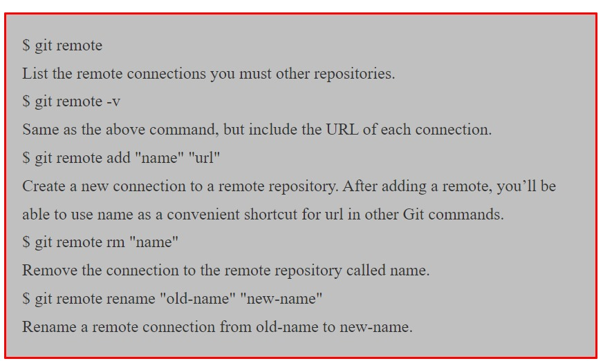


# URL du référentiel

+ `Git` prend en charge de nombreuses façons de référencer distant.
+ Deux des moyens les plus simples d'accéder à un dépôt distant via des protocoles `HTTP et SSH`.
+ `HTTP` est un moyen simple d'autoriser un accès anonyme en lecture seule à un référentiel. Par exemple: `http://hist/path/to/repo.git`.
+ Mais, il n'est généralement pas possible de transmettre des `commits` vers une adresse `HTTP` (vous ne voudriez de toute façon pas autoriser les plus anonymes).
+ Pour un accès en lecture-écriture, vous devez plutôt utiliser `SSH` : 

```
ssh://user@host/path/to/repo.git
```

+ Vous aurez besoin d'un compte `SSH` valide sur la machine hôte, mais à part cela, `Git` prend en charge l'accès authentifié via `SSH` prêt à l'emploi.
+ Exemples : 

  + En plus de l'origine, il est souvent pratique d'avoir une connexion aux référentiels de vos coéquipiers.
  + Par exemple, si votre collègue John gère un référentiel accessible au public sur `dev.example.com/john.git`, vous pouvez ajouter une connexion comme suit :
  
```
$ git remote add john http://dev.example.com/john.git
```

+ Avoir ce type d'accès aux référentiels de développeurs individuels permet de collaborer en dehors du référentiel central.
+ Cela peut être très utile pour les petites équipes travaillant sur un grand projet.


#### Git Fetch

+ La commande `git fetch` importe les `commits` d'un référentiel distant dans votre dépôt local.
+ Les `commits` résultants sont stockés sous forme de branches distantes au lieu des branches locales normales avec lesquelles nous avons travaillé.
+ Cela vous donne la possibilité d'examiner les modifications avant de les intégrer dans votre copie du projet. Usage :


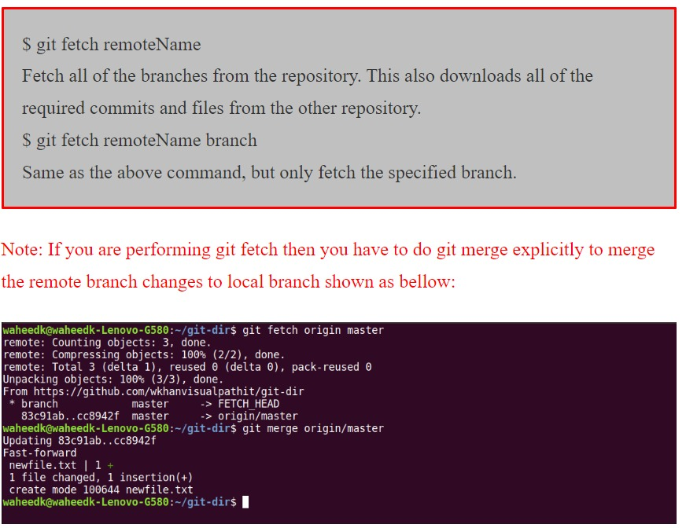

#### Git Pull

+ La fusion des modifications en amont dans votre référentiel local est une tâche courante dans les `workflows` de collaboration basés sur `Git`.
+ Nous savons déjà comment faire cela avec `git fetch` suivi de `git merge`, mais `git pull` regroupe cela en une seule commande. Usage :


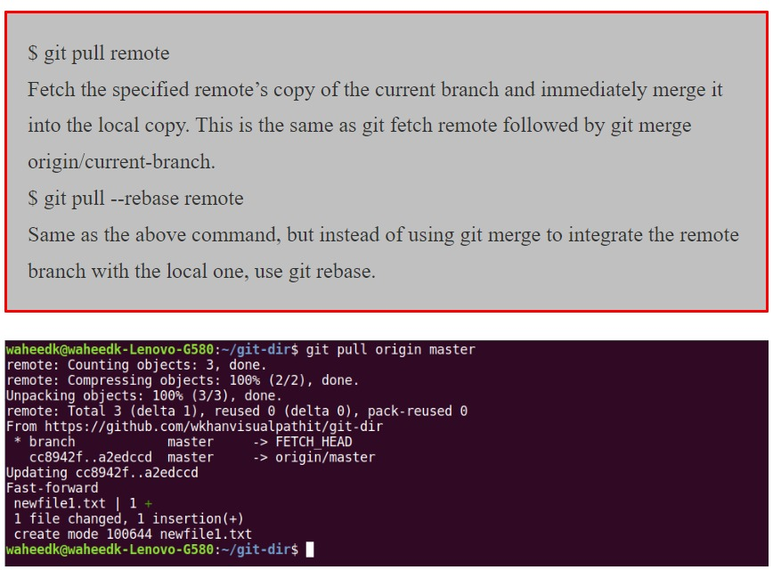


#### Git Push

+ Le `push` est la façon dont vous transférez les `commits` de votre référentiel local vers un dépôt distant.
+ C'est l'équivalent de `git fetch`, mais alors que la récupération des importations s'engage dans les branches locales, les exportations s'engagent vers des branches distantes.
+ Cela peut automatiquement écraser les modifications, vous devez donc faire attention à la façon dont vous l'utilisez. Ces questions sont abordées ci-dessous. Usage : 

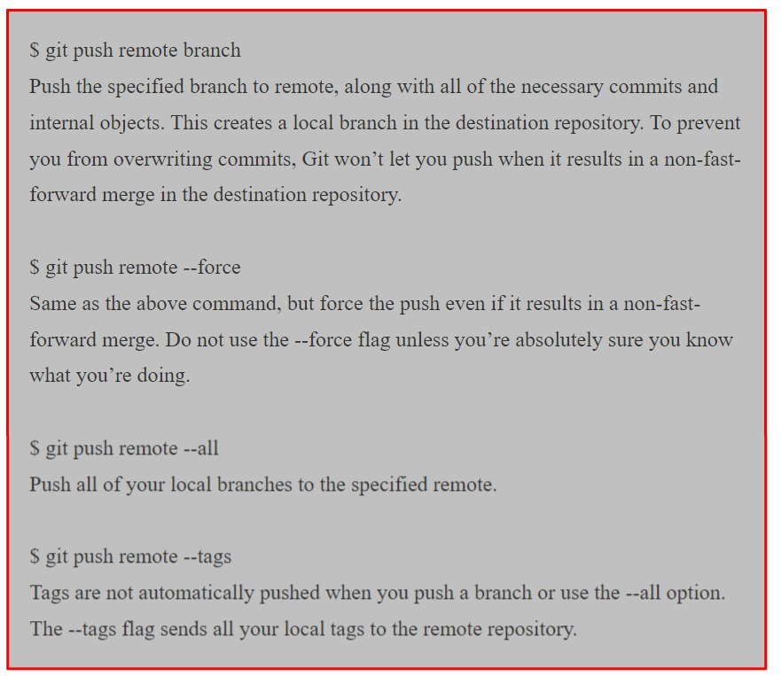

# Branchement et fusion Git

+ Une branche, à la base, est une série unique de modifications de code avec un nom unique. 
+ Chaque référentiel peut avoir une ou plusieurs branches. Par défaut, la première branche est appelée `master`

#### Affichage des succursales

+ Avant de créer de nouvelles branches, nous voulons voir toutes les branches existantes. 
+ Nous pouvons afficher toutes les branches existantes en tapant ce qui suit :

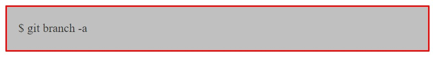


+ L'ajout du `-a` à la fin de notre commande `Git` que nous voulons voir toutes les branches qui existent, y compris celles que nous n'avons pas dans notre espace de travail local.

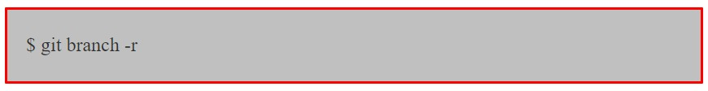

+ L'ajout du `r` à la fin de notre commande indique à `Git` que nous voulons voir toutes les branches distantes qui existent

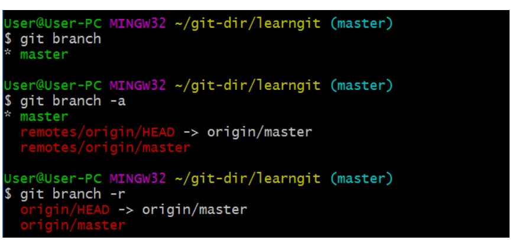

+ L'astérique à côté de `master` dans la première ligne du résultat indique que nous sommes actuellement sur cette branche.
+ La deuxième ligne indique simplement que sur notre route distant, nommé `orign`, il y a une seule branche, aussi appelée `master`.
+ Maintenant que nous savons comment afficher les branches, il temps de créer notre première


#### Créer des succursales
+ Nous allons traiter la branche `maître` par défaut comme notre production et devons donc créer une branche unique pour le développement ou la pré-production.
+ Pour créer une nouvelle branche, nommée development, tapez ce qui suit :


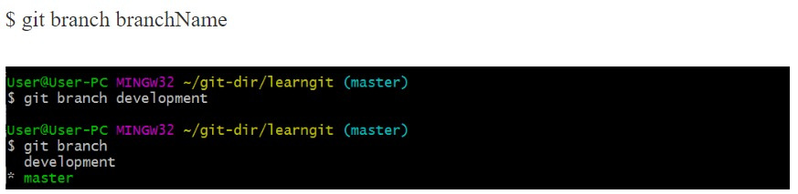

#### PPasser à une succursale

+ Pssé à une nouvelle branche `development`

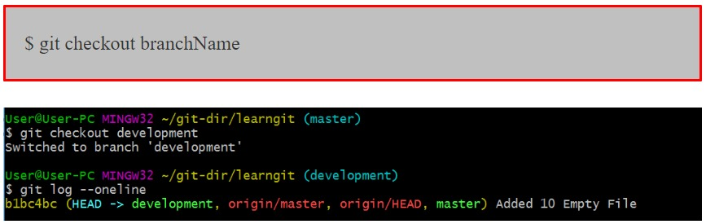

#### Créer une branche et passer à cette branche en même temps

+ En supposant que nous n'ayons pas encore de branche nommée `pre-prod`, le résultat serait le suivant : Basculé vers une nouvelle branche `pre-prod`.


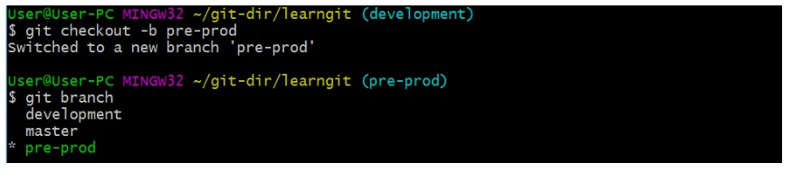

+ Maintenant que nous avons plusieurs succursales, nous devons les utiliser en bon escient.
+ Dans notre scénario, nous allons utiliser notre branche `development` pour tester nos modifications et la branche master pour les rendre publiques.

<br/>

+ Pour illustrer ce processus, nous devons revenir à notre branche de developpement : 

```
$ git checkout develop
```

+ Apporter des modifications à notre branche de développement.
+ Sur cette branche, nous allons modifier un nouveau fichier vierge, nommé `file1.txt`.
+ Jusqu'à ce que nous le fusionnions avec la branche master(à l'étape suivante), il n'y existera pas.


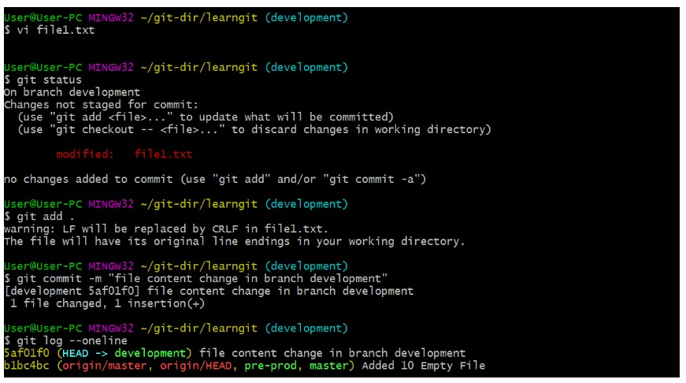

+ Ce fichier est désormais modifié sur la branche `develop`, comme nous sommes sur le point de le découvrir, il n'existe pas sur la branche master.
+ Tout d'abord, nous allons confirmer que nous sommes actuellement sur la branche `develop`.
+ Nous pouvons le faire en tapant ce qui suit :

```
$ git branch
```


#### Fusion de code entre branches

+ Supposons que vous ayez décidé que le travail est terminé dans la branche `development` et prêt à être fusionné dans votre branche principale.
+ Pour ce faire, vous fusionnerez le code de votre branche `development` dans master et tous les journaux et données seront indexés dans `master`.
+ Tout ce que vous avez à faire est de vérifier la branche dans laquelle vous souhaitez fusionner, puis d'exécuter la commande `git merge`.

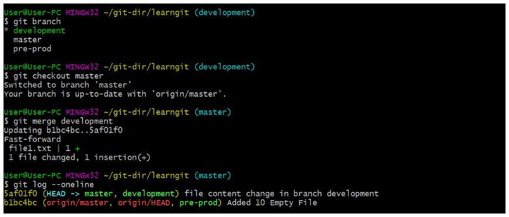


#### Type de fusion

+ Une fois que vous avez fini de développer une fonctionnalité dans une branche isolé, il est important de pouvoir la réintégrer dans la base de code principale.
+ Selon la structure de votre référentiel, `Git` dispose de plusieurs algorithmes distincts pour y parvenir.

  + Une fusion rapide ou une" fusion à trois voies.
  
#### Fusion Rapide
+ Une `fusion rapide` peut se produire lorsqu'il existe un chemin linéaire entre l'extrêmité de la branche actuelle et la branche cible.
+ Au lieu de réellement fusionner les branches, tout ce que `Git` a à faire pour intégrer les historiques est de déplacer (c'est-à dire `avancer rapidement`) la pointe de la branche actuelle jusqu'à la pointe de la branche cible.
+ Cela combine efficacement les historiques, puisque tous les `commits` accessibles depuis la branche cible sont désormais disponibles via la branche actuelle.
+ Par exemple, une `fusion rapide` d'une fonctionnalité dans `master` ressemblerait à ceci:

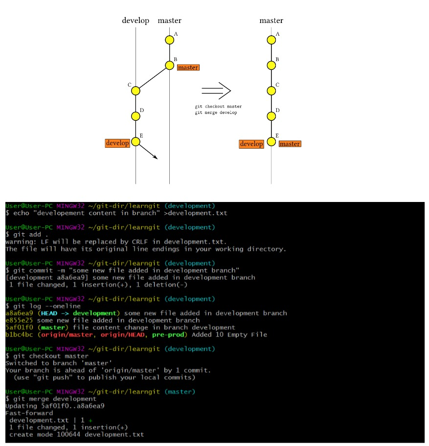

+ Cependant, une fusion rapide n'est pas possible si les branches ont divergé.
+ Lorsqu'il n'existe pas de chemin linéaire vers la branche cible, `Git` n'a d'autre choix que de les combiner via une fusion à 3 voies.


#### Fusion à 3 voies

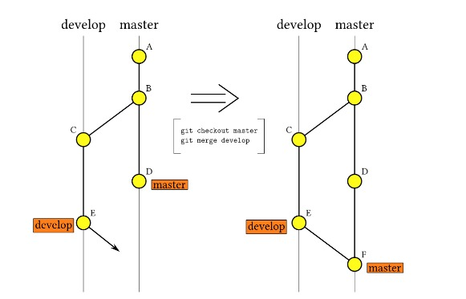

+ Les `fusions à 3 voies` utilisent un commit dédié pour relier les deux historiques.
+ La nomenclature vient du fait que `Git` utilise trois commits pour générer le commit de fusion : les deux pointes de la branches et leur ancêtre commun.
+ Contenu dans la branche de `development`.

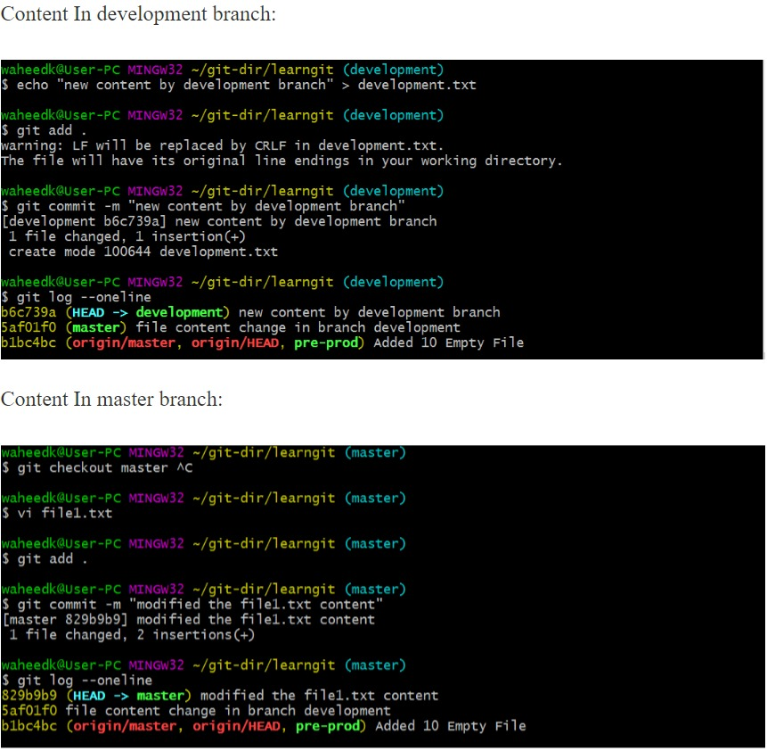


+ Remarque: si les deux branches ont leurs propres modifications à ce moment-là, elles suivent une négociation à trois et génèrent une validation de fusion comme ci-dessous.

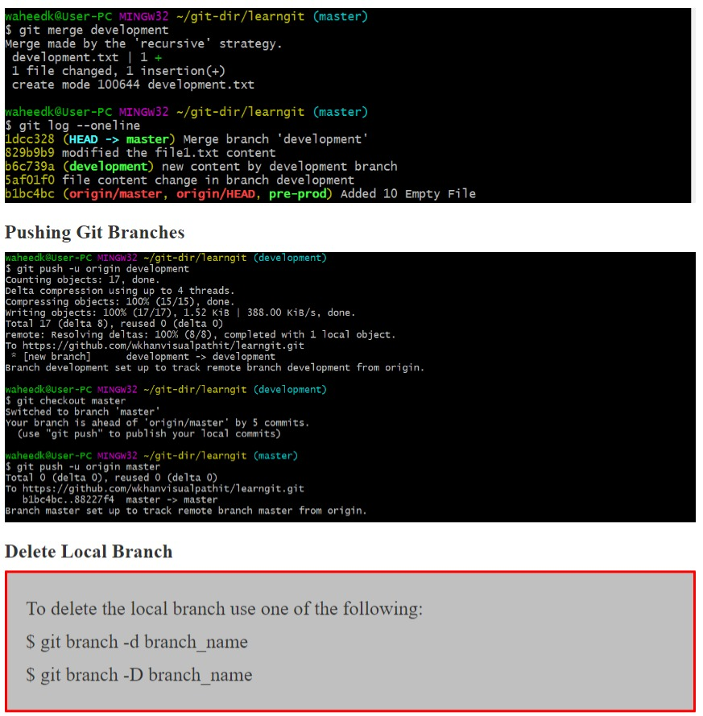


+ Remarque : l'option `-d` est un alias pour `--delete`, qui supprime la branche uniquement si elle a déjà été entièrement fusionnée dans sa branche amont.
+ Vous pouvez également utiliser `-D`, qui est un alias pour `--delete --force`, qui supprime la branche `quel que soit son statut fusionné`.


#### Suprimer une branche distante

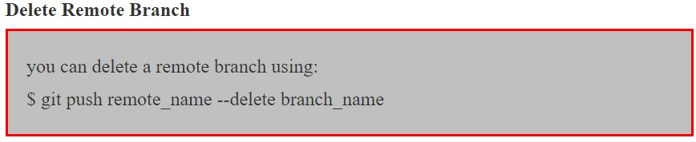


#### Qu'est ce que le rebase git ?

+ Dans `Git`, il existe deux manières principales d'intégrer les modifications d'une branche à une autre : `la fusion et le rebase`.
+ Dans cette section, vous apprendrez ce qu'est le `rebasage`, comment le faire, pourquoi c'est un outil assez étonnant et dans quels cas vous ne voudrez pas l'utiliser.
+ Le `rebasage` est le processus de déplacement ou de combinaison d'une séquence de validations vers une nouvelle validation de base.
+ Le `rebasage` est le plus utile et plus facilement visuablisable dans le contexte d'un flux de travail de branchement de fonctionnalités.
+ Le processus général peut être visualisé comme suit : 

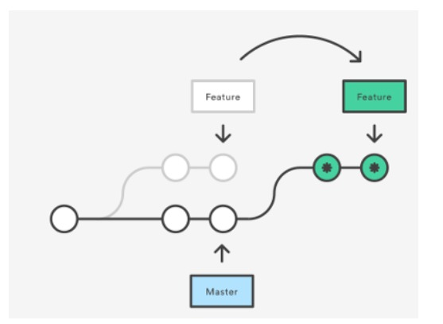

+ Du point de vue du contenu, le `rebasage` consiste à modifier la base de votre branche d'un commit à un autre, ce qui donne l'impression que vous aviez créé votre branche à partir d'un commit différent.
+ En interne, `Git` y parvient en créant de nouveaux `commits` et en les appliquant à la base spécifiée.
+ Il est très important de comprendre que même si la branche se ressemble, elle est composée de commits entièrement nouveaux.

+ Si vous revenez à un exemple précédent de `Basic Merging`,vous pouvez voir que vous avez divergé votre travail et effectué des validations sur les deux branches différentes.
+ Le moyen le plus simple d'intégrer les branches, comme nous l'avons déjà évoqué, est la commande de fusion.
+ Il effectue une `fusion à trois voies` à trois voies entre les deux dernièrs instantanés de branche.
+ Là, pendant la fusion, un nouveau `commit` supplémentaire est généré, ce qui ne nous donne pas la linéarité de l'historique de validation, mais dans le `rebase`, nous aurons la linéarité de l'historique de validation.

<br/>

**Remarque : Git Rebase est utilisé pour la linéarité de l'historique des commits gits**

<br/>

+ Contenu dans la branche master :


#### Trier via rebase

+ L'option `--rebase` peut être utilisé pour garantir un historique linéaire en empêchant les validations de fusions inutiles.
+ De nombreux développeurs préfèrent `rebaser` que fusionner, car cela revient à dire `Je veux mettre mes modifications au-dessus de ce que tout le monde à fait`.
+ En ce sens, utiliser `git pull` avec l'indicateur `--rebase` ressemble encore plus à `svn update` qu'à un simple `git pull`.
+ En fait, extraire avec `--rebase` est un `workflow` si courant qu'il existe une option de configuration dédiée.

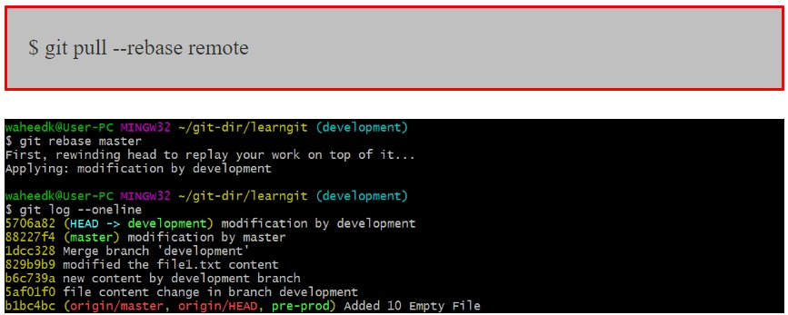


# Connexion SSH à Github

+ Générer des clés `SSH` pour `github`.

  + Ouvrez le terminal
  + Collez la commande ci-dessous en la remplaçant par votre adresse e-mail `Github`.
    + `# ssh-keygen -t rsa -b 4096 -C "votre_email@example.com"`
  + Lorsque vous êtes invité à "Entrer fichier dans lequel enregistrer la clé", indiquez le chemin mentionné ci-dessous : `/home/username/.ssh/id_rsa_github`

<br/>

**Remarque : `username` dans le chemin ci-dessous correspond à l'utilisateur du système Linux avec lequel vous vous êtes connecté`**

<br/>


+ Génération d'une paire de clés `rsa publique/privée`.
+ Entrez un fichier dans lequel enregistrer la clé `(/home/USERNAME/.ssh/id_rsa)` : `/home/USERNAME/.ssh/id_rsa_DO_github`

  + Appuyez sur entrée lorsqu'il vous demande de saisir la phrase secrète.
  
    + Entrez la phrase secrète (vide s'il n'y a pas de phrase secrète) : [tapez une phrase secrète]
    + Saisissez à nouveau la même phrase secrète : [Tapez à nouveau la phrase secrète]

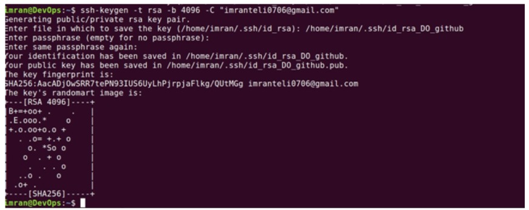

#### Définir la clé privée ssh pour la connexion à github.com

+ Accédez au repertoire ssh des utilisateurs

  + `# cd ~/.ssh`
  + `ls`

+ Ouvrez ou créez le fichier de configuration et mettez-le à jour avec le contenu mentionné ci-dessous.

  + `# vi config`
    + `Host github.com`
    + `HostName github.com`
    + `IdentifyFile ~/.ssh/id_rsa_DO_github`
    + `User git`
    + `IdentitiesOnly yes`

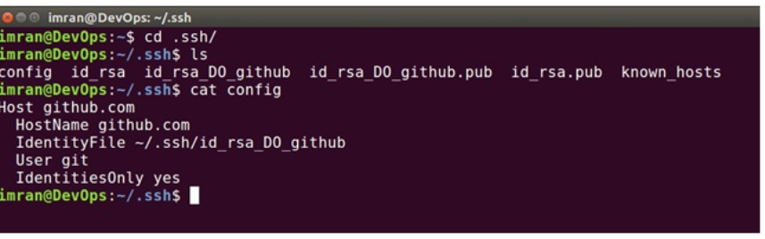
  
#### Ajouter la clé publique SSH dans le compte Github

+ Copiez la clé publique : `# cat ~/.ssh/id_rsa_DO_github.pub`

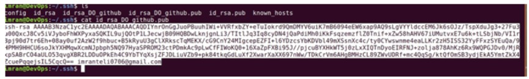

+ Connectez-vous à github avec le même identifiant de messagerie que vous avez fourni lors de la création des clés `ssh`.

  + Cliquez sur paramètres => Clés SSH et GPG => Nouvelle clé SSH => Donnez un nom => Collez le contenu de la clé publique => Ajoutez des clés SSH.


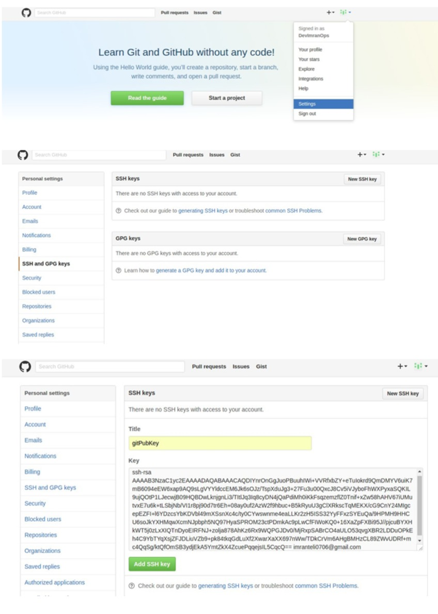

+ Testez la connexion

  + `# ssh -T git@github.com`

+ Vous devriez obtenir une réponse comme ci-dessous
+ `Salut nom d'utilisateur! Vous êtes authentifié avec succès, mais GitHub ne fournit pas d'accès au shell`.

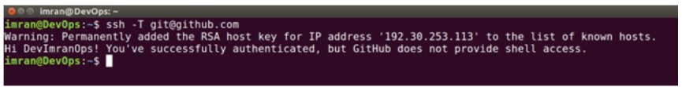


#### Resumé

+ Les systèmes de contrôle de versions sont une catégorie d'outils logiciels qui aident une équipe logicielle à gérer les modifications apportées au code source au fil du temps.
+ Logiciel de contrôle de version garde une trace de chaque modification du code dans un type spécial de base de données.
+ `Git` est un `VCS` distribué, une catégorie connu sous le nom `DVCS`, nous y reviendrons plus tard. Comme la plupart des systèmes `VCS` les plus populaires disponibles aujourd'hui, `Git` est gratuit et open source.
+ `Git` conserve l'historique des modifications à long terme de chaque fichier. `Traçabilité`, étant capable de retracer chaque modification apportée au logiciel et de la connecter à un logiciel de gestion de projet et de suivi des bogues tel que `JIRA`.
+ Branchement et fusion. Faire travailler les membres d'une équipe simutalnément est une évidence, mais même les individus travaillant seuls peuvent bénéficier de la capacité de travailler sur des flux de changements indépendants.


  

    