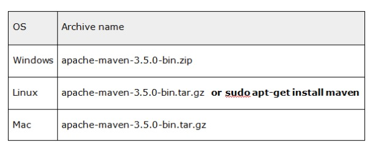
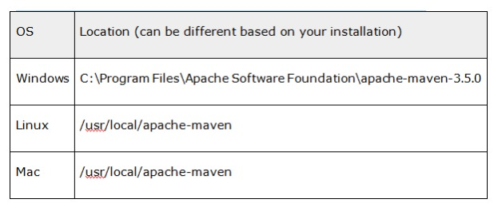
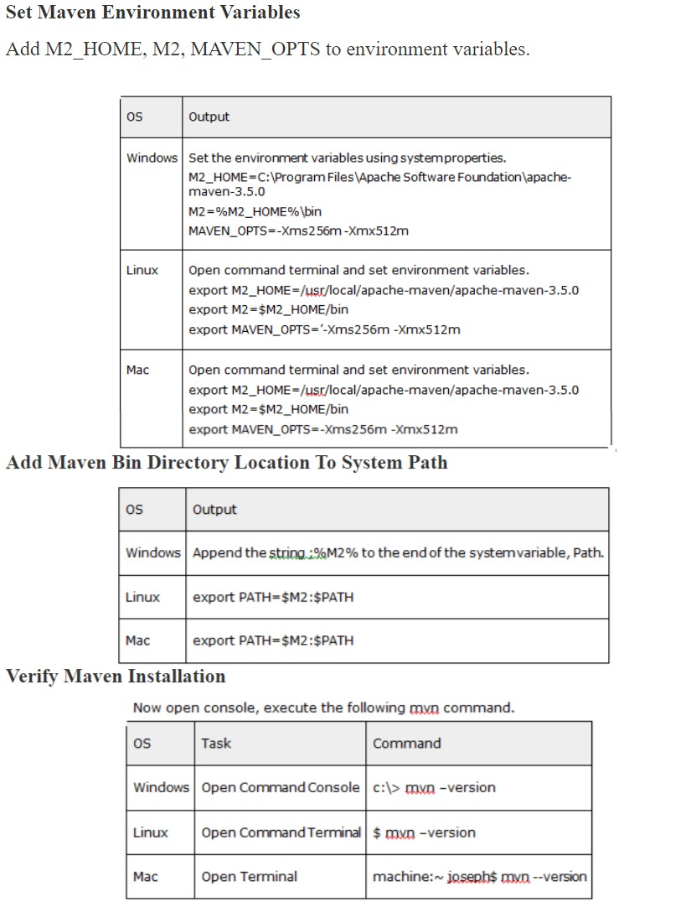
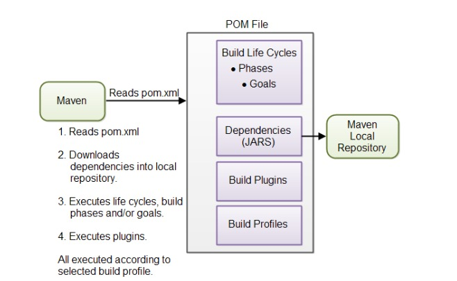
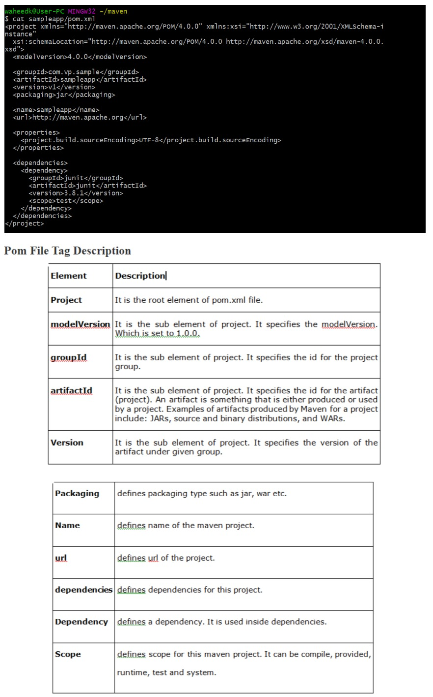
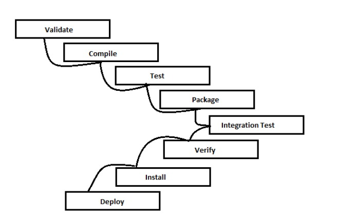
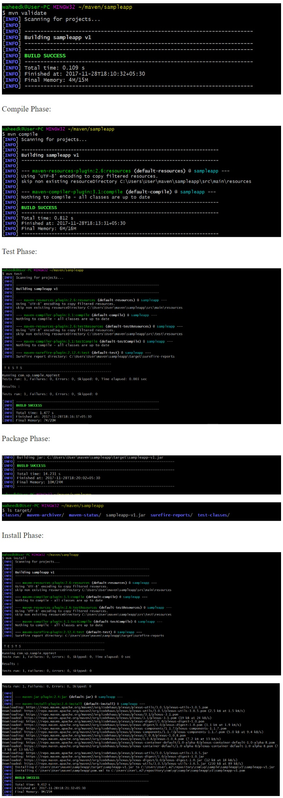

# Maven

 

## Qu'est-ce que Maven ?

+ `Apache Maven` est un outil de gestion et de comprehension de projets logiciels basés sur `Java`.
+ Basé sur le modèle Objet de projet(`POM`). 
+ `Maven` peut gérer la construction, le reporting et la documentation d'un projet à partir d'une information centrale.
+ `Maven` fournit un cadre complet de cycle de vie de build pour la gestion de projet.
+ L'équipe de développement peut automatiser l'infrastructure de build pour un projet en un rien de temps, car `Maven` utilise une disposition de repertoire standard et un cycle de vie de build par défaut.
+ En résumé, `Maven` simplifie et standardise le processus de construction de projet.
+ Il gère de manière transparente la compilation, la distribution, la collaboration en équipe et d'autres tâches.
+ `Maven` augmente la réutilisation et prend en charge la plupart des tâches liées à la construction.

### 1) Processus de Construction

+ Le `Build`est processus qui couvre toutes les étapes nécessaires pour céer un produit livrable de votre logiciel en préproduction et en production. Dans le monde Java, cela inclut généralement :

    + 1) La génération de la source
    + 2) Compilation des sources
    + 3) Exécuter des tests (tests unitaires, tests d'intégration,etc).
    + 4) Emaballage (en pot, war, ejb-jar, ear).
    + 5) Exécution de contrôle de santé (analyseurs statiques comme `Checkstyle`, `Findbugs`, `PMD`, couverture de test, etc).
    + 6) Générer des rapports
  
+ Un `processus de build` défini une partie essentielle de tout cycle de développement car il permet de combler l'écart entre les environnements de développement, d'intégration, de test de production.
+ Un `processus de build` à lui seul accélérera la migration des logiciels d'un environnement à un autre.
+ Il supprime également de nombreux problèmes liés à la compilation, au chemin de classe ou aux propriétés qui côutent du temps et de l'argent à de nombreux projets.

### 2) Qu'est-ce qu'un outil de Construction ?

+ Un `outil de build` est outil qui automatise tout ce qui concerne la construction du projet logiciel.
+ La construction du projet logiciel comprend généralement une ou plusieurs de ces activités :

    + Générer du code source (si du code généré automatiquement est utilisé dans le projet).
    + Générer de la documentation du code source.
    + Compilation du code source.
    + Conditionnement du code compilé dans les fichiers `JAR ou ZIP`.
    + Installation du code packagé sur un serveur, dans un référentiel ou ailleurs.
  
+ Tout projet logiciel donné peut comporter plus d'activités que celles nécessaires à la création du logiciel fini.
+ De telles activités peuvent normalement être connectées à un outil de construction, de sorte que ces activités peuvent également être automatisés.

 

+ L'avantage de l'automatisation de du processus de création est que vous `minimisez le rique que des humains commettent des erreurs lors de la création du logiciel`.
+ De plus un outil de création automatisé est généralement plus rapide qu'un humain effectuant les mêmes étapes manuellement.

#### 3) Comprendre le problème Courant Sans Maven

+ Nous sommes confrontés à de nombreux problèmes lors du développement du projet. Ils sont discutés ci-dessous :

    + Ajout d'un ensemble de fichiers `JAR` et de dépendances dans chaque projet : Dans le cas des frameworks `Struts, Spring, Hibernate`, nous devons ajouter un ensemble de fichiers `JAR` dans chaque projet. Il doit également être dans toutes les dépendances des `jar`.
    + Créer et maintenir la bonne structure de projet. Nous devons créer la bonne structure de projet dans le `servlets, struts, etc`, sinon elle ne sera pas exécutée.
    + Construire et déployer le projet : Nous devons construire le projet pour qu'il puisse fonctionner.

#### Compilation Et Exécution
  
+ `La compilation et l'éxécution d'un programme Java` se déroulent en deux étapes.
+ Pendant la phase de compilation `Java` compile le code source et génère du `bytecode`.
+ Ce `bytecode` intermédiaire est enregistré sous la forme d'un fichier `.class`.
+ Dans la deuxième phase, la `machine virtuelle Java (JVM)`, également appelée `interpréteur Java`, prend le `.class` et génère une sortie en exécutant le `bytecode`.

## Divers Outils de Construction Disponibles :

+ Pour `Java` :
    + `Ant`
    + `Maven`
    + `Gradle`
  
+ Pour le framework `.NET` :
  + `NAnt`

+ Pour `C#` : 
  + `MsBuild`

**Comparaisons Entre Quelques Outils De Construction Basé Sur Java :**

## Ant Contre Maven Conte Gradle

#### Ant :

+ `Apache Ant` est une bibliothèque `Java` et un outil de ligne de commande dont la mission est de piloter les processus décrits dans les fichiers de construction en tant que cibles et points d'extension les uns des autres.
+ La principale utilisation connu d' `Ant` est la création d'applications `Java`.
+ `Ant` fourni un certain nombre de tâches intégrées permettant de compiler, d'assembler, de tester et d'exécuter des applications `Java`.
+ `Ant` peut également être utilisé efficacement pour créer des applications `non Java`, par exemple des applications `C ou C++`.
+ Plus généralement, `Ant` peut être utilisé pour piloter tout type de processus pouvant être décrit en termes de cibles et de tâches.
+ Sa courbe d'apprentissage est très faible, permettant ainsi à quiconque de commencer à l'utiliser sans aucune préparation particulière.
+ Il est basé sur l'idée de programmation procédurale. Après sa version initiale, il a été amélioré avec la possibilité d'accepter des `plug-ins`.
+ L'inconvénient majeur était `XML` comme format pour écrire des scripts de construction `XML`, étant de nature hiérarchique, n'est pas adapté à l'approche de programmation procédurale utilisé par `Ant`.
+ Un autre problème avec `Ant` est que son `XML` a tendance à devenir ingérable lorsqu'il est utilisé avec tous les projets, sauf de très petite taille.

#### Maven

+ `Apache Maven` est un outil de gestion et de compréhension de projets logiciels.
+ Basé sur le concept de modèle objet de projet `(POM)`, `Maven` peut gérer la construction, le reporting et la documentation d'un projet à partir d'une information centrale.
+ Son objectif était d'améliorer certains des problèmes rencontrés par les développeurs lors de l'utilisation d'`Ant`.
+ `Maven` continue d'utiliser `XML` comme format pour écrire les spécifications de construction. Mais la structure est diamétralement différente.
+ Alors qu'`Ant` exige que le programmeur écrive toutes les commandes qui conduisent à l'exécution réussie d'une tâche.
+ `Maven` s'appuie sur des conventions et fournit les cibles (objectifs) disponibles qui peuvent être invoquées.
+ Comme ajout supplémentaire, et probablement le plus important, `Maven` a introduit la possibilité de télécharger des dépendances sur le réseau (plus tard adoptée par `Ant via Ivy`).
+ Alors qu'`Ant` exige que le programmeur écrive toutes les commandes qui conduisent à l'exécution réussie d'une tâche.
+ `Maven` s'appuie sur des conventions et fournit les cibles `(objectifs)` disponibles qui peuvent être invoquées.
+ `Maven` s'appuie sur des conventions et fournit les cibles `(objectifs)` disponibles qui peuvent être invoquées.
+ Comme ajout supplémentaire, et probablement le plus important, `Maven` a introduit la possibilité de télécharger des dépendances sur le réseau (plus tard adopté par `Ant via Ivy`).
+ Le principal avantage de `Maven` est son cycle de vie. Tant que le projet est basé sur certaines normes, avec `Maven`, on peut parcourir tout le cycle de vie avec une vie relative facilité. 
+ Cela a un coût en termes de flexibilité. 
+ Aujourd'hui, l'intérêt pour les `DSL (Domain Specific Languages)` ne cesse de croître. L'idée est de disposer de langages conçus pour résoudre des problèmes appartenant à un domaine spécifique.
+ Dans le cas des `builds`, l'un des résultats de l'application de `DSL` est `Gradle` et, par exemple, `gradle` est utilisé dans `Android` pour la construction et l'empaquetage.

#### Gradle

+ `Gradle` vise à aider les organisations à fournir de meilleurs logiciels, plus rapidement. Des constructions plus rapides sont l'un des moyens les plus directs d'y parvenir; `Gradle` combine de bonnes parties des deux outils et s'appuie sur eux avec le `DSL` et d'autres améliorations.
+ Il possède la puissance et la flexibilité d'`Ant` avec le cycle de vie et la facilité d'utilisation de `Maven`. 
+ Par exemple, `Google` a adopté `Gradle` comme outil de création par défaut pour le système d'exploitation d'Android.
+ `Gradle` n'utilise pas `XML`. Au lieu de cela, il disposait de son propre `DSL` basé sur `Groovy (l'un des langages JVM)`.
+ En conséquence, les scripts de `build Gradle` ont tendance à être beaucoup plus courts et plus clairs que ceux écrits pour `Ant` ou `Maven`.
+ La quantité de code passe-partout est beaucoup plus petite avec `Gradle` puisque son `DSL` est conçu pour résoudre un problème spécifique :

  + déplacer le logiciel tout au long de son cycle de vie, de la compilation à l'analyse statique et aux tests jusqu'à l'empaquetage et au déploiement.
  
+ `Maven` simplifie et apporte une solution aux problèmes mentionnés ci-dessus. Il effectue principalement les tâches suivantes : 

  + Il facilite la construction d'un projet.
  + Il fournit un processus de construction uniforme (le projet maven peut être partagé par tous les projets maven)
  + Il fournit des informations sur le projet (document de journal, sources de références croisés, liste de diffision, liste de dépendances, test unitaire rapports, etc.)
  + Il est facile de migrer pour les nouvelles fonctionnalités de `Maven`.

#### Utilisation d'Apache Maven

+ 1) Utilisation comme outil de construction.
+ 2) Utiliser comme pour gérer la structure du projet 
+ 3) Construction, publication et déploiement
+ 4) Documentation
+ 5) Rapports
+ 6) Versions
+ 7) Distributions

## Configuration et installation pour Maven

#### Site Web Maven : 

+ Le site `Maven` se trouve ici : 
  + http://maven.apache.org
  
+ Depuis ce site, vous pouvez télécharger la dernière version `Maven` et suivre le projet en général.
+ Vous pouvez télécharger et installer `maven` sur les plateformes `Windows, Linux et MAC OS`.
+ **Remarque :** `Maven` est un outil basé sur `Java`, la toute première condition est donc d'avoir installé `JDK` sur votre machine.

#### Téléchargez les archives Maven

+ [Maven archives](https://maven.apache.org/download.cgi)

#### Extrayez l'archive Maven

+ Extrayez l'archive dans le repertoire dans lequel vous souhaitez installer `Maven 3.5.0`.
+ Le sous-répertoire `apache-maven-3.5.0` sera créé à partir de l'archive.

#### Définir les variables d'environnement Maven

+ Ajoutez `M2_HOME, MAVEN_OPTS` aux variables d'environnements.

+ `Maven` aide à la structure du projet, à la gestion des dépendances, la raison en est que les référentiels `Maven`, `Maven` communiquent avec les référentiels et forment la structure du projet.

 

**Remarque : `Maven` tire toutes ses connaissances des référentiels `Maven`, ce qui siginifie quelle sera la structure du projet, quel est le type de projet, et.c**

 

# Comment fonctionne Maven ?& Concepts de base

+ `Maven` est centré autour du concept de fichiers `POM (Project Object Model)`.
+ Un fichier `POM` est une représentation `XML` des ressources du projet comme `le code source, le code test, les dépendances (JAR externes utiisés), etc`.
+ Le `POM` contient des références à toutes ces ressources.
+ Le fichier `POM` doit se trouver dans le repertoire racine du projet auquel il appartient.
+ Voici un diagramme illustrant comment `Maven` utilise le fichier `POM` et ce que contient principalement le fichier `POM`.

+ Ces concepts sont expliqués brièvement ci-dessous pour vous donner un aperçu, puis plus en détail dans leurs propres sections plus loin dans ce didacticiel.

#### Fichiers POM

+ Lorsque vous exécutez une commande `Maven`, vous donnez à `Maven` un fichier `POM` sur lequel les commandes.
+ `Maven` en exécutera ensuite la commande sur les ressources décrites dans le `POM`.

#### Construire des cycles de vie, des phases et des objectifs

+ Le processus de construction dans `Maven` est divisé en cycles de vie, et objectifs de construction.
+ Un cycle de vie de `build` se compose d'une séquence de phase de `build`, et chaque phase de `build` en une séquence d'objectifs.
+ Lorsque vous exécutez `Maven`, vous transmettez une commande à `Maven`.
+ Cette commande est le nom d'un cycle de vie, d'une phase ou d'un objectif de `build`.
+ Si l'exécution d'un cycle de vie est demandée, toutes les phases de construction de ce cycle de vie sont exécutées.
+ Si une phase de construction doit être exécutée, toutes les phases de construction qui la précèdent dans la séquence prédéfinie de phrases de construction sont également exécutées.

#### Dépendances et référentiels

+ L'un des premiers objectifs exécutés par `Maven` est de vérifier les dépendances à votre projet.
+ Les dépendances sont des fichiers `JAR externes (bibliothèques Java)` que votre projet utilise.
+ Si les dépendances ne sont pas trouvées dans le référentiel `Maven` local, `Maven` les télécharge depuis un référentiel `Maven central` et les place dans votre référentiel local.
+ Le référentiel local n'est qu'un répertoire sur le disque dur de votre ordinateur. 
+ Vous pouvez spécifier où le référentiel local doit être situé si vous le souhaitez (je le fais).
+ Vous pouvez également spécifier le référentiel distant à utiliser pour télécharger les dépendances.
+ Tout cela sera expliqué plus en détail plus loin dans ce tutoriel.

#### Créer des plugins

+ Les `plugins de construction` sont utilisés pour insérer des objectifs supplémentaires dans une phase de construction.
+ Si vous devez effectuer un ensemble d'actions pour votre projet qui ne sont pas ouvertes par les phases et les objectifs de construction `Maven standard`, vous pouvez ajouter un `plugin` au fichier `POM`.
+ `Maven` propose des `plugins standards` que vous pouvez utiliser, et vous pouvez également implémenter les vôtres en `Java` si vous en avez besoin.

#### Créer des profils

+ Les `profils de construction` sont utilisés si vous devez créer votre projet de différentes manières.
+ Par exemple, vous devez peut-être créer votre projet pour votre ordinateur local, à des fins de développement et de test.
+ Et vous devrez peut-être le créer pour le déployer sur votre environnement de production.
+ Ces deux versions peuvent être différentes. 
+ Pour activer différentes `builds`, vous pouvez ajouter différents profils de `build` à vos fichiers `POM`.
+ Lors de l'exécution de `Maven`, vous pouvez indiquer quel profil de `build` utiliser.
+ `Maven` utilise le concept de référentiel pour contenir les fichiers `jar`. Il existe deux types de référentiel, à savoir le référentiel local et le référentiel distant.
+ Chaque projet `maven` possède un fichier `pom.xml`. Si vous exécutez votre application avec `maven`, il vérifie maintenant vitre référentiel distant et télécharge le `jar`.
+ Après avoir téléchargé les pots, il exécutéra le cycle de vie, créera des phases et/ou des objectifs.

# Premier exemple d'application

+ Ouvrez l'invite de commande `[Ctrl + Alt + T]`

#### Choisissez un numéro (quel est le numéro de sélection) ?

+ Il existe certain `nombre archétype`, le `nombre` spécifique d'un `archétype` qui peut être utilisé.
+ Ensuite, la structure du projet se formera en conséquence.

#### Fichier pom.xml maven

+ `POM` est un acronyme pour `Project Object Model`.
+ Le fichier `pom.xml` contient des informations sur le projet et des informations de configuration permettant au `maven` de construire le projet, telles que :

  + les dépendances
  + le répertoire de construction
  + le répertoire source
  + le repertoire source de test
  + le plugin
  + les objectifs, etc.

+ `Maven` lit le fichier `pom.xml` puis exécute l'objectif.
+ Dans notre cas, le projet génère ce fichier `pom.xml`.

# MAVEN - Construire le cycle de vie

+ Un `cycle de vie de build` est une conséquence bien définie de phases qui définissent l'ordre dans lequel les objectifs doivent être exécutés. Ici, la phase représente une étape du cycle de vie.
+ A titre d'exemple, un `cycle de vie de build maven` typique consiste en la séquence de phase suivante.

#### Un cycle de vie de build est composé de phases :

+ Chacun de ces cycles de vie de `build` est défini par une liste différente de phases de `build`, où une `phase de build` représente une étape du cycle de vie.

+ Par exemple, le cycle de vie par défaut comprend les phases suivantes : 

  + **Validate**
    + valider que le projet est correct et que toutes les informations nécessaires sont disponibles.
  + **Compile**
    + compiler le code source du projet.
  + **Test**
    + tester le code source compilé à l'aide d'un cadre de tests unitaires approprié. Ces tests ne doivent pas nécessiter que le code soit empaqueté ou déployé.
  + **Package**
    + prenez le code compilé et emballez-le dans son format distribuable, tel qu'un **JAR**.
  + **Verify**
    + effectuer des contrôles sur les résultats des tests d'intégration pour garantir que les critères de qualité sont respectés.
  + **Install**
    + installer le package dans le référentiel, pour l'utiliser comme dépendance dans d'autres projets localement.
  + **Deploy**
    + effectué dans l'environnement de construction, copie le package final dans le référentiel distant pour e partager avec d'autres développeurs et projets. Deux phases non par défaut :
      + **Clean**
      + **Site**

#### Exécution de la phase maven

+ **Phase de validation :**
  + Si nous exécutons une phase dans maven, dans la phase précédente est automatiquement lancée.

#### Résumé : 

+ `Maven` est un outil de gestion et de compréhension des `builds logiciels`.
+ `Maven` est basé sur le concept de modèle objet de projet. `Maven` aide à la création de code, à la gestion des dépendances, à la création de documentation à la publication de sites et à la publication de distribution, tous contrôlés à partir du fichier déclaratif.
+ `Maven` peut être étendu par des `plugins` pour utiliser un certain nombre d'autres outils de développement reporting ou le processus de construction.
+ `Maven archetype` est un ensemble d'outils permettant de gérer les `archétypes`, c'est-à-dire une representation abstraite d'un type de projet qui peut être instancié en un projet `Maven` personnalisé concret. Un `archétype` sait quels fichiers feront partie du projet instnacié et quelles propriétés remplir pour personnaliser correctement le projet.

