# Docker

## L'ère des applications

+ Dans le monde d'aujourd'hui, nous sommes tous entouré d'applications et de sites Web.
+ Nous utilisons nos smartphones et nos ordinateurs pour naviguer sur `Internet` et utiliser tous les `services Web` via nos applications mobiles ou nos navigateurs.
+ Tous ces millions ded données basées sur le `Web` proviennent de lieux éloignés de certains ordinateurs situés dans un centre de données.
+ Nous les appelons généralement des serveurs; ces serveurs pourraient être ces machines physiques que nous voyons accumulées dans un centre de données avec toutes ces lumières et câbles clignotants.
+ Si nous prenons quelques exemples comme `Amazon, Google et Netflix, Goibibo etc`, toutes ces entreprises fonctionnent sur des applications ou on peut dire que leurs applications sont leur affaire.
+ Cela souligne un point très important:nous ne pouvons pas séparer leur activité de leur application.

 

+ L'application a besoin de ressources de calcul pour s'exécuter sur lequel elle a hébergé son application.
+ Autrefois, lorsque nous n'avions `ni virtualisation ni cloud computing`, nous les utilisons pour les exécuter directement sur un serveur physique.
+ Ainsi, si je souhaite héberger une application sur 10 serveurs Web, j'ai besoin de 10 serveurs physiques sous équilibreur de charge servant le trafic Web.

+ Ces serveurs sont très chers et nous devons effectuer beaucoup de maintenance pour eux.

    + Nous devons nous procurer un serveur. Un processus par lequel nous passons une commande pour l'achat.
    + Des dépenses en capital ou `CapEx` sont requises.
    + Il existe des dépenses opérationnelles `(OpeEx)`, comme le refroidissement, l'alimentation, les administrateurs pour maintenir cette batterie de serveurs.
    + Donc, si je souhaite augmenter la capacité et ajouter plus de serveurs, je dois consacrer du temps et de l'argent au processus mentionné ci-dessus.
    + Ceci est très courant car l'entreprise démarre à partir d'une très petite base d'utilisateurs, uis le trafic des utilisateurs/consommateurs augmente si l'entreprise se porte bien.
    + Nous déployons une application par serveur car nous souhaitons que nos applications soient isolées.
    + Par exemple, si nous avons besoin d'une application Web, d'une application de base de données et quelques applications backend.
    + Nous pourrions finir par avoir plusieurs systèmes exécutant chacun une seule instance de cette application.

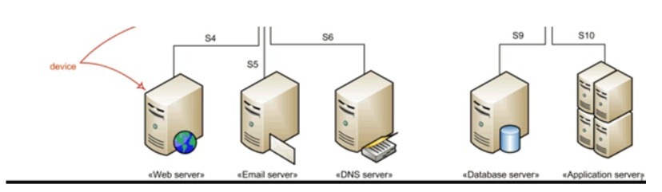

 

+ Ainsi, chaque fois que nous avons besoin d'exécuter une nouvelle application, nous achetons des serveurs, installons le système d'exploitation et configurons sur celui-ci.
+ Et la plupart du temps, personne ne connaissait les exigences de performances de la nouvelle application ! Cela signifiait que le service informatique devait faire des suppositions lors du choix du modèle et de la taille des serveurs à acheter.
+ En conséquence, le service informatique a fait la seule chose raisonnable : il a acheté de gros serveurs rapides et très résilients.
+ Après tout, la dernière chose que quiconque souhaitait - y compris l'entreprise - était des serveurs sous-alimentés.
+ La plupart du temps, les ressources de calcul de ces serveurs physiques seront sous-alimentés.
+ La plupart du temps, les ressources de calcul de ces serveurs physiques seront utilisées, à la hauteur de 5 à 10% de leur capacité potentielle. Un gaspillage du capital et des ressources de l'entreprise.

# Révolution de la Virtualisation

+ `VMware` a donné au monde de la `machine virtuelle` et tout a changé après cela.
+ Nous pourrions désormais isolées dans des systèmes d'exploitation distincts mais sur le même serveur physique.
+ **Dans le chapitre sur la Virtualisation. Nous avons discuté des avantages et des fonctionnalités de la virtualisation, l'architecture de l'hyperviseur.**

# Problèmes avec l'architecture de l'hyperviseur.

+ Nous savons désormais que chaque `VM` possède son propre `systèmes d'exploitation`, ce qui pose problème.
+ Le système d'exploitation a besoin d'une bonne quantité de ressources telles que le `processeur, la mémoire, le stockage, etc`.
+ Nous maintenons également les licences du système d'exploitation et les soignons régulièrement, comme les correctifs, les mises à niveau et les modifications de configuration.
+ Nous voulions héberger une application mais avons collecté une bonne quantité de graisse sur notre infra, nous gaspillons ici `des OpEx et des CapEx`.
+ Pensez à expédier une machine virtuelle d'un endroit à un autre endroit, cela semble une excellente idée.
+ Si nous pouvons tout regrouper dans une image virtuelle et l'expédier afin que l'autre personne n'ait pas besoin de configurer la machine virtuelle à partir de zéro, elle puisse directement exécuter la machine virtuelle à partir de l'image.
+ Nous l'avons fait dans le chapitre `Vagrant` où nous téléchargeons la machine virtuelle préinstallée et venons de l'exécuter.

 

+ Mais ces images sont lourdes et volumineuses car elles contiennent le système d'exploitation avec l'application.
+ Les démarrer est un processus lent. Donc, étant portable, il n'est pas pratique d'expédier la machine virtuelle à chaque fois.
+ Livraison d'une application bundle avec toutes les dépendances/bibliothèques dans une image sans `OS`.
+ Hmm, on dirait que nous avons résolu un gros là-bas. C'est ce que sont les conteneurs.
+ Pensez à configurer une application dans une `VM ou une machine physique`.
+ Nous avons besoin de la configuration du `système d'exploitation, des dépendances, de l'application déployée` et de quelques modifications de configuration dans `le système d'exploitation, des dépendances, de l'application déployée et de quelques modifications de configuration dans le système d'exploitation`.
+ Nous suivons une serie d'étapes pour configurer tout cela, comme la configuration d'une `pile LAMP`.
+ Si nous pouvions regrouper tous ces étapes dans un seul conteneur et l'expédier, les administrateurs n'auraient alors pas besoin d'effectuer de configuration sur la cible, tout ce que nous avons à faire est d'extraire `une image de conteneur` et de l'exécuter.

# Conteneurs

+ Si les `machines virtuelles` sont une `virtualisation matériele`, alors les `conteneurs` sont une `virtualisation du système d'exploitation`.7
+ Nous n'avons pas besoin d'un véritable système d'exploitation dans le conteneur pour installer notre application.
+ Les applications à l'intérieur des conteneurs dépendent du `noyau du système d'exploitation hôte` sur lequel elles sont exécutées. 
+ Ainsi, si j'ai hébergé une application `Java` comme à l'intérieur du conteneur, elle utilisera toutes les bibliothèques `Java` et les `fichiers de configuration des données du conteneur`, mais pour les ressources de calcul, elle s'appuie sur le `noyau du système d'explotation hôte`.
+ Les conteneurs sont comme les autres processus qui s'exécutent dans un système d'exploitation, mais ils sont isolés, leurs processus, fichiers, bibliothèques et configurations qui s'exécutent dans les limites du conteneur.
+ Les conteneurs ont également leur propre `arborescence de processus` et leur `propre réseau`.
+ Chaque `conteneur` aura une `adresse IP et un port` sur lesquels l'application à l'intérieur du conteneur est exécutée.
+ Cela peut ressembler à une machine virtuelle, mais ce n'est pas le cas, rappelez-vous que la `VM` a son propre `système d'exploitation` et que les `conteneurs n'en ont pas`.

+ Les `conteneurs` sont très `légers` car ils ne contiennent que `les bibliothèques et les applications`. 
+ Cela signifie donc que moins de ressources de calcul sont utilisées et cela signifie plus d'espace libre pour exécuter les conteneurs.
+ Ainsi, en termes de ressources, nous économisons également `CapEx et OpEx`.
+ Les `conteneurs` ne sont pas une technologie moderne, ils existaient autour de nous sous différentes formes et technologies.
+ Mais `Docker` l'amené à un tout autre niveau en matière de `construction, d'expédition et de gestion de conteneurs`.

# Docker

+ `Docker, Inc.` a commencé sa vie en tant que fournisseur de plateforme `service(PaaS)` appelé `dotCloud`.
+ En coulisses, la plateforme `dotCloud` exploitait les `conteneurs Linux`.
+ Pour les aider à créer et à gérer ces conteneurs, ils ont construit un outil interne qu'ils ont surnommé `Docker`. Et c'est ainsi qu'est né `Docker`.
+ En 2013, l'activité `dotCloud Paas` étant en difficulté et l'entreprise avait besoin d'un nouveau souffle.
+ Pour y parvenir, ils ont embauché `Ben Golub` en tant que nouveau `PDG`, ont rebaptisé l'entreprise `Docker, Inc.`, se sont débarrassés de la plateforme `dotCloud PaaS` et ont commencé un nouveau voyage avec pour mission d'apporter `Docker et les conteneurs` au monde.
+ `Docker` s'appuie sur les fonctionnalités du `noyau Linux`, telles que `les espaces de noms et les groupes de contrôle`, pour garantir l'isolation des ressources et pour empaqueter une application avec ses dépendances.
+ Ce regroupement des dépendances permet à une application de s'exécuter comme prévu sur différents `systèmes d'exploitation Linux`.
+ C'est cette portabilité qui a suscité l'intérêt des développeurs et des administrateurs système.

 

+ Mais quand quelqu'un dit `Docker`, il peut faire référence à au moins trois choses :

  + `Docker, Inc.` la société
  + `Docker` la technologie d'exécution et d'orchestration du conteneur
  + `Docker` le projet open source

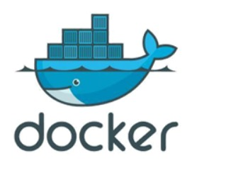

+ Lorsque la plupart des gens parlent de `Docker`, ils font généralement référence au `Docker Engine`.
+ Le `moteur Docker` s'exécute et orchestre les `conteneurs`.
+ A partir de maintenant, nous pouvons penser le `moteur Docker` comme un `hyperviseur`.
+ De la même manière que la technologie d'hyperviseur qui exécute les machines virtuelles, `le moteur Docker` est le moteur d'exécution principal des `contenrus` qui exécute les conteneurs.

+ Il existe de nombreuses technologies Docker qui sont intégrés au `moteur Docker` pour automatiser, orchestrer ou gérer les `conteneurs Docker`.

# Installation De Docker

+ Docker peut être installé sur les systèmes d'exploitation `Windows, Mac et Linux`.
+ Nous allons installer `Docker` sur le serveur `Ubuntu 16.04` dans cette partie. `Docker` peut être installé directement à partir des référentiels `Ubuntu`, mais il se peut qu'il ne s'agisse de la dernière version du `moteur Docker`.
+ Pour installer la dernière et la meilleure version, nous l'installerons à partir du référentiel officiel Docker.

 

**Désinstaller les anciennes versions**

+ Les anciennes versions de `Docker` étaient appelées `docker ou docker-engine`. Si ceux-ci sont installés, désinstallez-les :

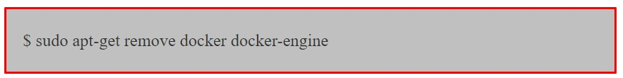

+ Ce n'est pas grave si `apt-get` signale qu'aucun de ces packages n'est installé. Ajoutez la clé `GPG` pour le référentiel `Docker`.

+ Ajouter le référentiel `Docker`

+ Mettre à jour le package

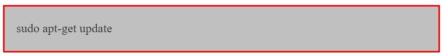

+ Installer `Docker`

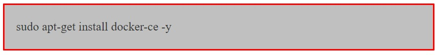

+ `Docker` doit maintenant être installé, le `daemon` et le processus activé pour démarrer au démarrage.
+ Vérifiez qu'il fonctionne :

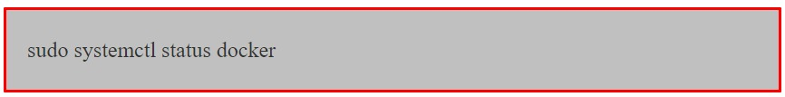

+ Les commandes `Docker` peuvent être exécutées par l'utilisateur `root` ou en fournissant `sudo`.
+ Nous pouvons également exécuter les commandes `docker` avec un utilisateur normal, pour ce faire, nous devons ajouter l'utilisateur dans le `groupe Docker`.

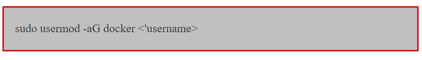

+ Vous devez vous déconnecter et vous connecter pour refléter les modifications. Exécutez la commande `Docker` pour vérifier si elle fonctionne.

+ Lorsque vous installez le `moteur Docker`, vous obtenez deux composants :

  + Client Docker
  + Moteur Docker
  
# Vue d'ensemble de Docker Engine
+ Ressentons et goûtons rapidement le `moteur Docker` avant de nous y plonger en profondeur.
+ De manière générale, nous opérons dans deux domaines dans le domaine des moteurs de docker.

  + `Images Docker`
  + `Conteneurs Docker`

### Images

+ Désormais, vous pouvez penser les `images` comme des `boîtes vagrand`.
+ C'est très différent des `images vm` mais cela semblera pareil au départ.
+ Les `boîtes vagrant` sont l'état arrêté d'une `VM et des images`  et l'état arrêté des `conteneurs`.
+ Exécutez la commande `Docker Images`.

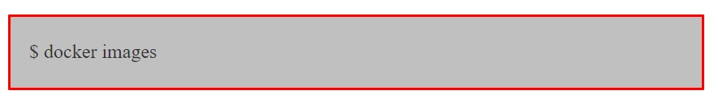

+ Cette commande répertoriera les images téléchargées sur votre ordinateur, vous ne verrez donc rien dans la sortie.
+ Nous devons télécharger quelques images, dans le monde `Docker`, nous l'appelons `image Pullingan`.
+ Alors, doù tire-t-il l'image. Encore une fois, même analogie avec les `boîtes vagrant`. Nous téléchargeons les `boîtes vagrant` depuis le `cloud vagrant`, les `images Docker` sont téléchargées depuis les `registres Docker`, le `registre Docker` le plus célèbre est `DockerHub`.
+ Il existe également depuis d'autres registres de Google, Redhat, etc.

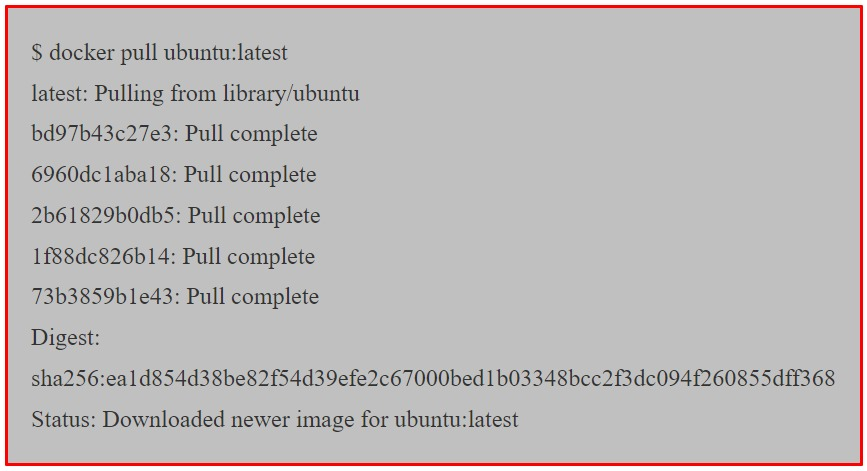

+ Exécutez à nouveau la commande `docker images` pour voir l'`ubuntu:latest image` que vous venez d'extraire.

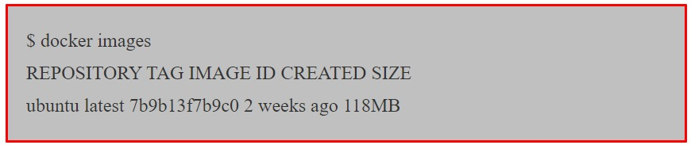

+ Nous entrerons dans les détails de l'endroit où l'image est stockée et de ce qu'elle contient dans le chapitre suivant.
+ Pour l'instant, il suffit de comprendre qu'il contient suffisamment de système d'exploitation (OS), ainsi que tout le code pour exécuter n'importe quelle application pour laquelle il est conçu.
+ `L'image Ubuntu` que nous avons extraite contient une version allégée du système d'exploitation `Ubuntu Linux`, comprenant quelques-uns des utilitaires `Ubuntu` courants.

### Conteneurs

+ Maintenant que nous avons une image extraite localement sur notre `hôte Docker` nous pouvons utiliser la commande `docker run` pour lancer un conteneur à partir de celle-ci.

+ Regardez attentivement le résultat de la commande ci-dessus. Vous devriez remarque que l'invite de votre shell a changé.
+ En effet, votre shell est maintenant attaché à celui du nouveau conteneur - vous êtes littéralement à l'intérieur du nouveau conteneur ! Examinons cette commande `docker run`.
  + `docker run` indique au `Docker daemon` de démarrer un nouveau conteneur.
  + Les options `-it` indiquent au `daemon` de rendre le conteneur interactif et d'attacher notre shell actuel au shell conteneur.
  + Ensuite, la commande indique à `Docker` que nous voulons que le conteneur soit basé sur l'image `ubuntu:latest`.
  + Nous lui disons d'exécuter le processus `/bin/bash` à l'intérieur du conteneur.
  
+ Exécutez la commande `ps` suivante depuis l'intérieur du conteneur pour répertorier du conteneur pour répertorier tous les processus en cours.

+ Comme vous pouvez le voir sur le résultat de la commande `ps` seuls deux processus s'exécutent à l'intérieur du conteneur :

  + `PID 1`: Il s'agit du processus `/bin/bash` que nous avons demandé au conteneur d'exécuter avec la commande `docker run`.
  + `PID 10`: Il s'agit du processus `ps -elf` que nous avons exécuté pour répertorier les processus en cours d'exécution.
  
+ La présence du processus `ps -elf` dans la sortie ci-dessus pourrait être un peu trompeuse car il s'agit d'un processus de courte durée qui meurt dès que la commande `ps` se termine.
+ Cela signifie que le seul processus de longue durée à l'intérieur du conteneur est le processus `/bin/bash`.
+ Appuyez `Ctrl+PQ`pour quitter le conteneur. Cela vous ramènera dans le shell de votre `hôte Docker`.
+ Vous pouvez le vérifier en consultant l'invite de votre `shell`. Lors d'une étape précédente, vous avez appuyé sur `Ctrl+PQ` pour quitter votre shell du conteneur.
+ En faisant cela depuis l'intérieur d'un conteneur, vous sortirez du conteneur sans le tuer.
+ Vous pouvez voir tous les conteneurs en cours d'exécution d'exécution sur votre système à l'aide de la commande `docker ps`.

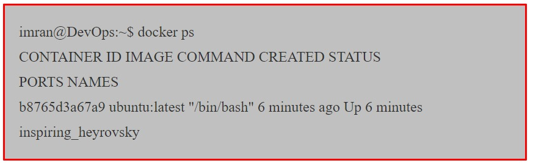

+ La sortie ci-dessus montre un seul conteneur en cours d'exécution. Il s'agit du conteneur que vous avez crée précédemment.
+ La présence de votre conteneur dans cette sortie prouve qu'il est toujours en cours d'exécution. 
+ Vous pouvez également voir qu'il a été créé il y a 6 minutes et qu'il fonctionne depuis 6 minutes.

### Attachement aux conteneurs en cours d'exécution

+ Vous pouvez attacher votre shell aux conteneurs en cours d'exécution.
+ Il s'agit du conteneur que vous avez créé précédemment. La présence de votre conteneur dans cette sortie prouve qu'il est toujours, reconnectons-nous-y.
+ **Remarque :** L'exemple ci-dessus fait reférence à un conteneur appelé `inspiring_heyrovsky`. 
+ Le nom de votre conteneur sera différent, alors n'oubliez pas de remplacer `inspiring_heyrovsky` par le nom ou l'ID du conteneur exécuté sur votre `hôte Docker`.

+ Notez que l'invite de votre shell a de nouveau changé. Vous êtes de retour à l'intérieur du conteneur. Le format de la commande de `docker exec` est:
  + `docker exec -options <'container-name or container-id><'command>`
+ Dans notre exemple, nous avons utilisé les options `-it` pour attacher notre shell du conteneur.
+ Nous avons référencé le conteneur par son nom et lui avons demandé d'exécuter le `shell bash`.
+ Quittez à nouveau en appuyant sur `Ctrl+PQ`.
+ Votre invite shell devrait être renvoyée à votre `hôte Docker`.
+ Exécutez à nouveau la commande `docker ps` pour vérifier que votre conteneur est toujours en cours d'exécution.

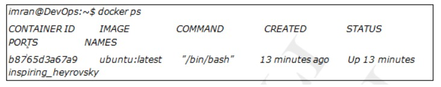

+ Arrêtez le conteneur et tuez-le à l'aide des commandes `docker stop` et `docker rm`.

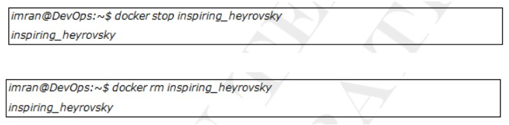

+ Vérifiez que le conteneur a été supprimé avec succès en exécutant une autre commande `docker ps`.

+ Vous auriez maintenant le goût des images et des conteneurs `Docker`. Nous avons extrait une image, exécuté un conteneur, l'avons arrêté et supprimé.
+ Dans la section suivante, nous approfondirons plus en détail les images puis les conteneurs.

# Images

+ Nous avons vu des éléments très basiques sur les images Docker, nous allons maintenant approfondir les `images Docker.
+ Les images sont construites et distribuées comme des logiciels. 
+ Comme nous l'avons vu dans le chapitre sur `l'intégration continue`, il devrait y avoir un `processus de création et de publication`, nous devons faire de même si nous publions des images.
+ Nous avons mentionné précédemment que les images sont à l'état arrêté du conteneur afin que vous puissiez arrêter un conteneur et créer une nouvelle image à partir de celui-ci.

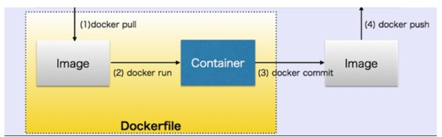

+ Nous voyons sur la figure ci-dessus que nous extrayons une image, exécutons un conteneur, le personnalisons selon nos besoins, validons le conteneur dans une image, puis l'expédions.
+ Cependant, une fois que vous avez démarré un conteneur à partir d'une image, les deux constructions deviennent dépendantes l'une de l'autre et vous ne pouvez pas supprimer l'image tant que le dernier conteneur qui l'utilise n'a pas été détruit.
+ Tenter de supprimer une image sans arrêter et détruire tous les conteneurs qui l'utilisent entraînera des erreurs.
+ Les images que nous expédions doivent être légères et ne doivent contenir que les fichiers et les bibliothèques nécessaires à l'exécution de l'application qu'elles contiennent..
+ Par exemple, si nous expédions une application `Java`, un serveur d'application comme `Tomcat` et des fichiers pour exécuter sur notre application et rien d'extra.

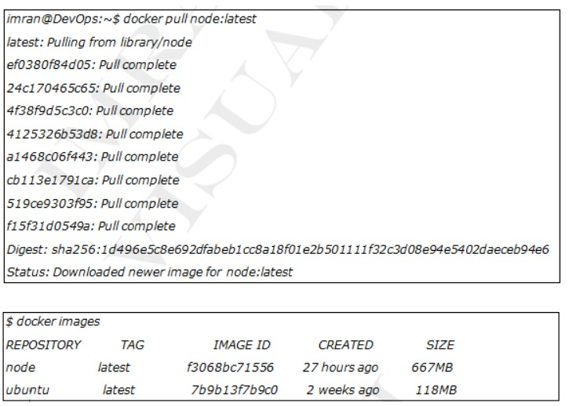

+ Comme vous pouvez le voir maintenant, nous avons deux images téléchargées sur notre moteur `Docker`.

### Registres D'images

+ Les `images Docker` sont stockées dans les `registres d'images`.
+ Les `registres d'images` le plus courant est [Docker Hub](https://hub.docker.com/).
+ D'autres registres existent, notamment des registres tiers et des registres sécurisés sur site, mais `Docker Hub` est la valeur par défaut et c'est celui que nous utiliserons dans cette partie.

+ Les `registres d'images` contiennent plusieurs référentiels d'images.
+ Les `référentiels d'images` contiennent des `imaes`.
+ Cela peut être déroutant, c'est pourquoi la figure ci-dessous montre une image d'une registre d'images contenant 3 référentiels, et chaque référentiel contient quelques images.

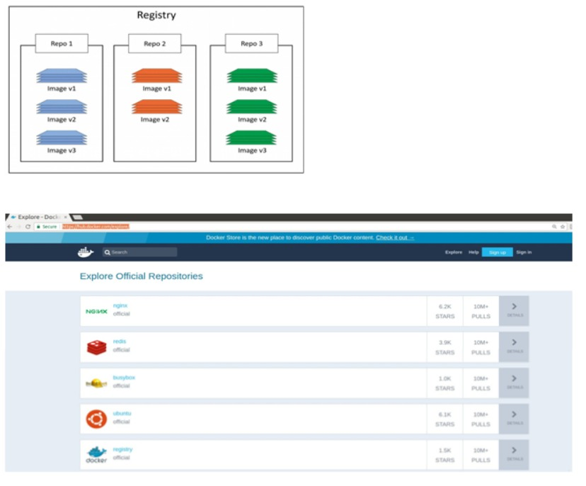

+ `Docker Hub` contient des `référentiels officiels et non officiels`.
+ Les référentiels officiels proviennent de `Docker, Inc.`
+ Ce sont des images sûres et sécurisées avec le dernier logiciel à jour.
+ Les `reférentiels non officiels` sont téléchargés par n'importe qui et ne sont pas vérifiés par `Docker, Inc.`.
+ La liste ci-dessous contient quelques-uns des référentiels et montre leurs `URL` qui existent au niveau supérieur de l'espace de noms `Docker Hub`:

  + **nginx - https://hub.docker.com/_/nginx/**
  + **busybox - https://hub.docker.com/_/busybox/**
  + **redis - https://hub.docker.com/_/redis/**
  + **mongo - https://hub.docker.com/_/mongo/**
  
+ Nos images personnelles vivent dans des `référentiels non officiels`. 

### Balises D'images

+ Lors de l'extraction d'une image, nous donnons le nom de l'image: `TAG` et `Docker` atteindra par défaut le registre `DockerHub` et trouvera l'image avec le `TAG` que nous avons spécifié.

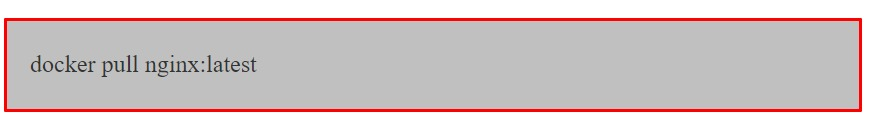

+ La **balise** fait généralement référence à la version de l'image du référentiel.
+ Si nous recherchons une autre version comme la `1.12.0`, nous pouvons utiliser la commande ci-dessous.

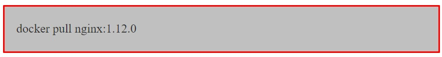

+ Si nous ne spécifions aucune balise, la balise par défaut est la plus récente.
+ La dernière balise ne signifie pas que les images sont la dernière version, c'est juste le nom de la balise et c'est tout.

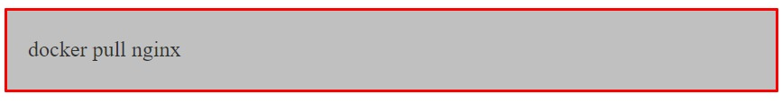

+ La commande ci-dessus téléchargera l'`image nginx` avec la dernière balise.

### Images Et Calques

+ Toutes les `images Docker` sont construites d'un ou plusieurs calques en lecture seule, comme indiqué ci-dessous.

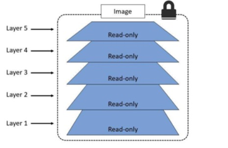

+ Il existe plusieurs façons de voir et d'inspecter les calques qui composent une image, et nous en avons déjà vue une.
+ Jetons un deuxième coup d'oeil au résultat de la commande `docker pull node:latest` de plus tôt.

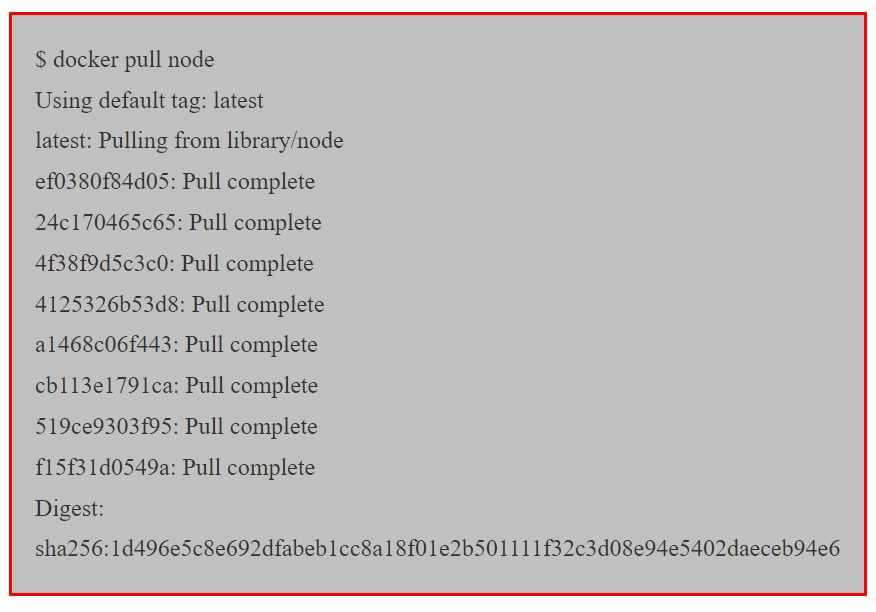

+ Chaque ligne de la sortie ci-dessous qui se termine par `Pull Complete` représente un calque de l'image qui a été extrait.
+ Comme nous pouvons le voir, cette image comporte 5 calques.

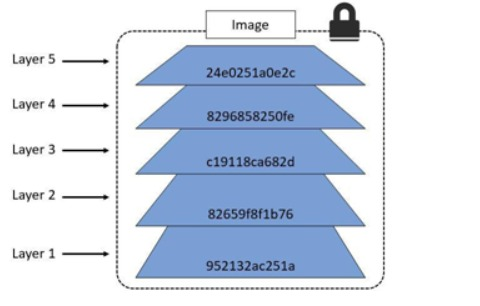

+ Chaque calque n'est qu'un ensemble de différences par rapport au calque qui le précède.
+ Lorsque vous créez un nouveau `conteneur`, vous ajoutez un nouveau calque inscriptible au-dessus des calques sous-jacents.
+ Cette couche est souvent appelée `couche conteneur`. 
+ Toutes les modifications apportées au conteneur en cours d'exécution, telles que l'écriture de nouveaux fichiers, la modification de fichiers existants et la suppression de fichiers, sont écrites sur cette fine couche de conteneur inscriptible.
+ Le diagramme ci-dessous montre un conteneur basé sur l'image `Ubuntu 15.04`.

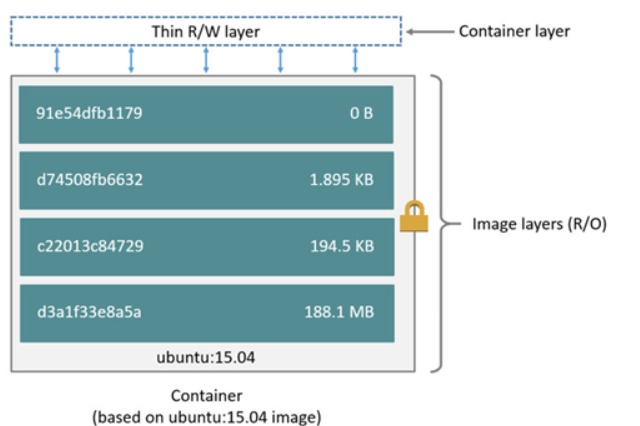

### Conteneur Et Couches

+ La principale différence entre `un conteneur et une image` réside dans la couche supérieure inscriptible.
+ Toutes les écritures dans le conteneur qui ajoute de nouvelles données ou modifient des données existantes sont stockées dans cette couche inscriptible.
+ Lorsque le conteneur est supprimé, la couche inscriptible est également supprimée.
+ L'image sous-jacente reste inchangé tout en ayant leur propre état de données.
+ Le diagramme ci-dessus montre plusieurs conteneurs partageant la même image `Ubuntu 15.04`.

+ Docker utilise des pilotes pour gérer le contenu des couches d'images et de la couche conteneur inscriptible.
+ Chaque pilote de stockage gère la mise en œuvre différemment, mais tous les pilotes utilisent des couches d'images empilables et la stratégie de copie sur écriture `(CoW)`.
+ Une autre façon de voir les calques qui composent une image consiste à inspecter l'image avec la commande `docker inspect`.
+ L'exemple ci-dessous inspecte la même image `ubuntu:latest`.

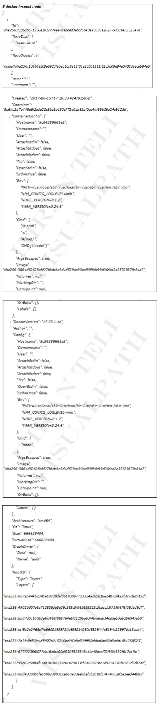

### Supression d'images

+ Lorsque vous n'avez plus besoin d'une image, vous pouvez la supprimer de vôtre hôte `Docker` avec la commande `docker rmi`.
+ `rmi` est l'abbreviation de supprimer l'image.
+ Supprimez l'image du noeud extraite à l'étape précédente avec la commande `docker rmi`.
+ L'exemple ci-dessous adresse l'image par son `ID`.

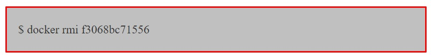

# Conteneurs

+ Le `conteneur` est l'instance d'exécution d'une image comme si nous démarrions une machine virtuelle à partir d'une `boîte vargrant`.
+ Nous pouvons démarrer plusieurs conteneurs à partir d'une seule image.
+ Nous créeons un conteneur à partir d'une image en donnant la commande `ducker run`.
+ Les conteneurs s'exécutent jusqu'à ce que les processus qui s'y exécutent existent.
+ Il doit y  avoir au moins un processus en cours d'exécution à l'intérieur du conteneur avec le `PID 1`.
+ Si ce processus meurt, les conteneurs meurent également.

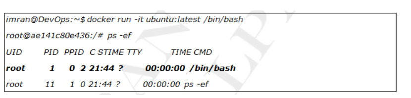

+ Dans le conteneur ci-dessus `/bin/bash` a le `PID 1`, ce processus sera tué si nous appuyons sur la commande `exit`.

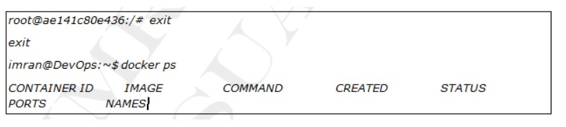

+ Comme la sortie se déconnectera et tuera le `shell` actuel et c'est notre `PID 1`, notre conteneur a également été tué avec lui.
+ `docker ps -a` affichera les conteneurs en cours d'exécution ou sortis.

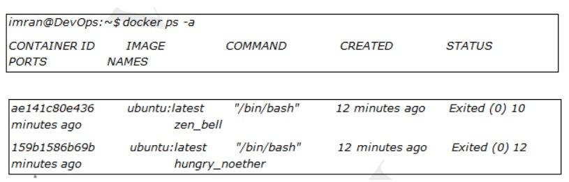

+ Nous pouvons démarrer un conteneur quitté en donnant `<docker start containerid>`.

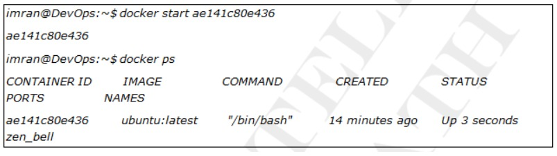

+ `docker stop` arrêtera un conteneur en cours d'exécution.

+ `docker rm` supprimera le conteneur avec ses données.

+ Exécuter un `webservice` dans un conteneur.

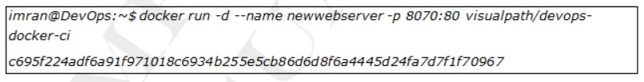

+ Nous avons démarré le conteneur ci-dessus en arrière-plan par l'option `-d`.
+ Nous avons également donné le nom à nôtre conteneur par l'option `--name`.
+ L'image ci-dessus est `service Web Apache` qui s'exécute sur le port `80` des conteneurs.
+ Le port hôte `8070` est mappé au port `80` des conteneurs.
+ Cela signifie que si nous accédons à l'`IP` des machines hôtes sur le port `8070`, nous obtiendrons un service exécuté sur le port `80` à partir des conteneurs.
+ Les conteneurs ne sont pas directement accessibles par leurs addresses `IP` car les adresses `IP` des conteneurs ne sont pas permanentes.
+ Nous en discuterons en détail dans la section réseau.
+ Nous accédons au service exécuté dans le conteneur à partir du port hôte qui est redirigé vers le port du conteneur, c'est ce qu'on appelle une `redirection de port`.

+ `-p 8070:80` signifie que le port hôte `8070` est mappé au port `80` du conteneur. Vérifiez le service Web du conteneur en y accédant à partir du navigateur sur `http://hostip:8070`.

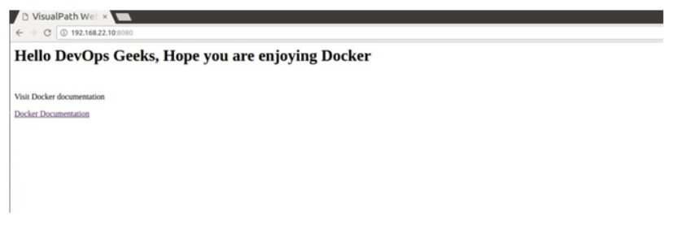

+ Vérifie les registres `nginx, apache et jenkins` depuis `dockerhub` et exécutez-les pour en savoir plus.

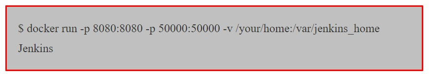

+ Ici, nous mappons deux ports `8080 et 5000`, les ports hôtes et conteneur sont identiques, ce qui est correct si vos ports hôte ne sont pas occupés.
+ Les données des conteneurs ne sont pas persistantes, ce qui signifie que si nous supprimons le conteneur, ses données sont également perdus, ce qui est évident.
+ Mais si nous voulons garder ces données en sécurité sur la machine hôte, nous pouvons utiliser l'indicateur `-v` qui concerne les volumes.
+ Le côté gauche est le chemin du repertoire de la machine hôte et le côté droit est le chemin du repertoire des conteneurs que vous souhaitez enregistrer sur la machine hôte.
+ C'est similaire à nos répertoires de `synchronisation vagrant`.
+ Désormais, même si nous supprimons le conteneur, ses données dans `/var/jenkins_home` seront en sécurité sur la machine hôte dans le repertoire `/your/home`.

### Inspection Des Conteneurs

+ Dans l'exemple précédent, vous avez peut-être remarqué que nous n'avions pas spécifié de commande pour le conteneur lorsque nous avons exécuté l'exécution du `docker`.
+ Pourtant, le conteneur exécutait un simple service Web. Comment est-ce arrivé ? Lors de la création d'une `image Docker`, il est possible d'intégrer une commande ou un processus par défaut que vous souhaitez que les conteneurs utilisant l'image exécutent.
+ Si nous exécutons une commande `docker inspect` sur l'image que nous avons utilisée pour notre conteneur, nous pourrons voir la commande/le processus que le conteneur exécutera au démarrage.

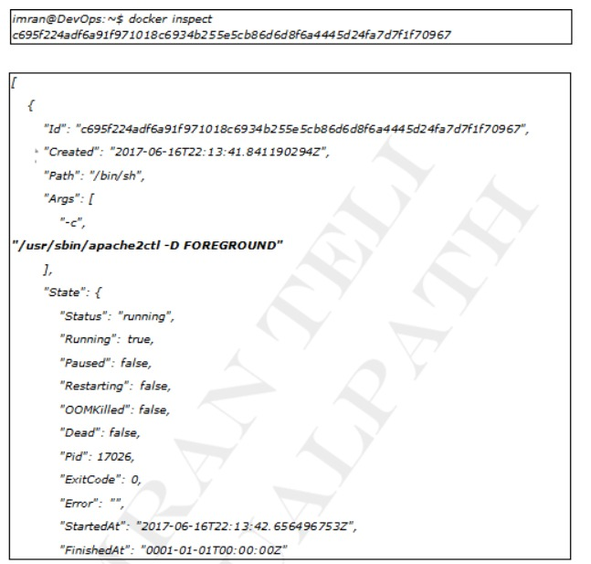

# Images de construction et d'expédition

+ `Docker` peut créer des images automatiquement en lisant les instructions d'un `Dockerfile`, un fichier texte qui contient toutes les commandes, dans l'ordre, nécessaires pour créer une image donnée.
+ Les `Dockerfiles` adhèrent à un format spécifique et utilisent un ensemble d'instructions spécifique.
+ `Dockerfile` définira ce qui se passe dans l'environnement à l'intérieur de votre conteneur.
+ L'accès aux ressources telles que les interfaces réseau et les lecteurs de disque est virtualisé à l'intérieur de cet environnement, qui est isolé du reste de votre système.
+ Vous devez donc mapper les ports vers le monde extérieur et être précis sur les fichiers que vous souhaitez `copier` vers cet environnement.
+ Cependant, après cela, vous pouvez vous attendre à ce que la version de votre application définie dans ce fichier `Docker` se comporte exactement de la même manière partout où elle s'exécute.

### Fichier Docker

+ Créez un répertoire vide et placez-y ce fichier, avec le nom `Dockerfile`.
+ Prenez note des commentaires qui expliquent chaque affirmation.

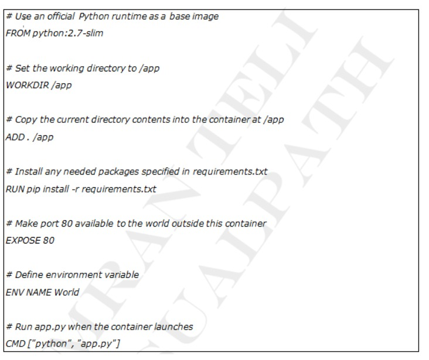

+ Ce `Dockerfile` fait référence à quelques éléments que nous n'avons pas encore créés, à savoir `app.py et requirements.txt`. Mettons-les en place ensuite.
+ L'application elle-même récupère ces deux fichiers et placez-les dans le même dossier que `Dockerfile`.
+ Ceci complète notre application qui, comme vous pouvez le voir, est assez simple.
+ Lorsque le `dockerfile` ci-dessus est intégré dans une image, `app.py et requirements.txt` seront présents en raison de la commande `ADD` de ce `dockerfile`, et la sortie de `app.py` sera accessible via `HTTP` grâce à la commande `EXPOSE`.

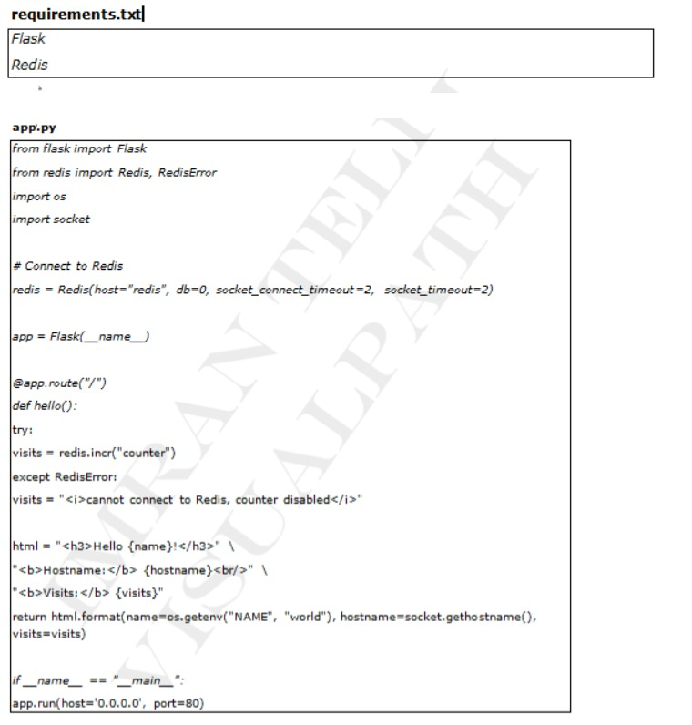

+ Nous voyons maintenant que `pip install -r requirements.txt` installe les bibliothèques `flask et redis` pour `Python` et que l'application imprime la variable d'environnement `NAME` ainsi que la sortie d'un appel à `socket.gethostname()`.
+ Enfin comme `Redis` n'est pas en cours d'exécution (car nous avons uniquement installé la bibliothèque `Python`, et non `Redis` lui-même), nous devons nous attendre à ce que la tentative de l'utiliser ici échoue et produise le message d'erreur.

**Remarque :** L'accès au nom de l'hôte à l'intérieur d'un conteneur récupère `l'ID` du conteneur, qui est comme `l'ID` de processus pour un exécutable en cours d'exécution.

### **Créer L'application**

+ C'est ça! Vous n'avez pas besoin de `Python` ou de quoi que ce que ce soit dans le fichier `requirements.txt` sur votre système, et la création ou l'exécution de cette image ne les installera pas non plus sur votre système.
+ Il ne semble pas que vous ayez vraiment configuré un environnement avec `Python et Flask`, mais c'est le cas.

+ Voici ce que cela devrait montrer

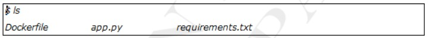

+ Exécutez maintenant la commande `build`. Cela crée une `image docker` que nous allons baliser en utilisant `-t` pour qu'elle ait un nom convivial.

+ Où est votre image construite ? Ilse trouve dans le registre d'images docker local de votre machine:

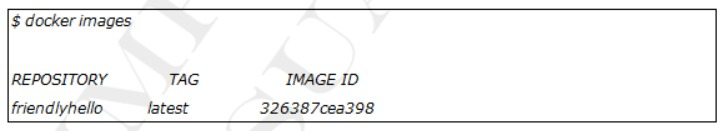

### Exécutez l'application

+ Exécutez l'application en mappant le `port 4000` de votre machine sur le port `EXPOSE 80` du conteneur à l'aide de `-p`.

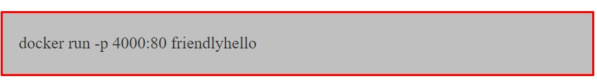

+ Vous devriez voir un avis indiquant que `Python` diffuse votre application à l'adresse `http://0.0.0.0:80`.
+ Mais ce message vient de l'intérieur du conteneur, qui ne sait pas que vous avez mappé le `port 80` de ce conteneur sur `4000`, créant ainsi `l'URL` correcte `http://localhost:4000`.
+ Accédez dans un navigateur Web pour voir le contenu affiché sur une page Web, y compris le texte `Hello World`, `l'ID` du conteneur et le message d'erreur `Redis`.

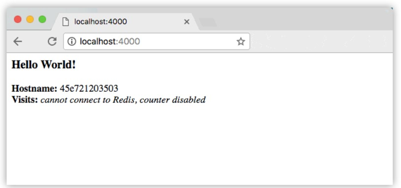

+ Vous pouvez également utiliser la commande `curl` dans un `shell` pour afficher le même contenu.

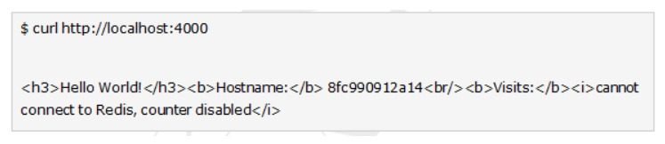

**Remarque :**

+ Ce remappage de port de `4000:80` vise à démontrer la différence entre ce que vous exposez dans le fichier docker et ce que vous publiez à l'aide de `docker run -p`.
+ Dans les étapes ultérieures, nous mapperons simplement le `port 80` de l'hôte au `port 80` du conteneur et utiliserons `http://localhost`.
+ Appuyez sur `CTRL+C` dans votre terminal pour quitter. Exécutons maintenant l'application en arrière-plan, en mode détaché :

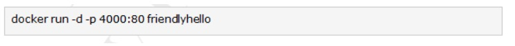

+ Vous obtenez le long `ID` de conteneur pour votre application, puis êtes renvoyé vers votre terminal.
+ Votre conteneur s'exécute en arrière-plan. Vous pouvez également voir `l'ID` abrégé du conteneur avec `docker ps` (et les deux fonctionnent de manière interchangeable lors de l'exécution de commandes):

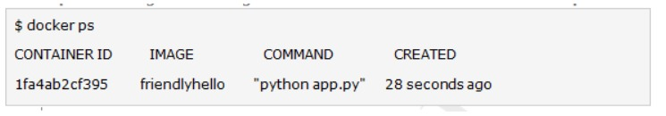

+ Vous verrez que `CONTAINER ID` correspond à ce qui se trouve sur `http://localhost:4000`.
+ Utilisez maintenant `docker stop` pour terminer le processus, en utilisant `l'ID du CONTAINER`, comme ceci :

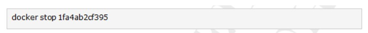

### Partagez votre image

+ Pour démontrer la portabilité de ce que nous venons de créer, téléchargeons notre image construite et exécutons-la ailleurs.
+ Après tout, vous devrez apprendre à pousser vers les registres, lorsque vous souhaiterez déployer des conteneurs en production
+ `Un registre` est une collection de référentiels, et un `référentiel` est une collection d'images, un peu comme un référentiel `Github`, sauf que le code est déjà construit.
+ Un compte sur un registre peut démontrer de nombreux référentiels.
+ Le `dockerCLI` utilise le registre public de `Docker` par défaut.

 

+ **Remarque :** Nous utiliserons le registre public de `Docker` simplement parce qu'il est gratuit et préconfiguré, mais il existe de nombreux registres publics parmi lesquels choisir, et vous pouvez même configurer votre propre registre privé à l'aide de `Docker Trusted Registry`.

### Connectez-vous avec votre identifiant Docker

+ Si vous n'avez pas de compte `Docker`, créez-en un sur un `cloud.docker.com`.
+ Notez votre nom d'utilisateur. Connectez-vous au registre public `Docker` sur votre ordinateur local.

### Marquer l'image

+ La notation pour associer une image locale à un référentiel sur un référentiel est `username/repository.tag`.
+ La balise est facultative, mais recommandée, car c'est le mécanisme que les registres utilisent pour donner une version aux images `Docker`.
+ Donnez au référentiel et à la balise des noms significatifs pour le contexte, tels que `get-started-part1`.
+ Cela placera à l'image dans le référentiel de démarrage et la marquera comme part1.
+ Maintenant, rassemblez le tout pour marquer l'image.
+ Exécutez l'image de balise `docker` avec votre nom d'utilisateur, votre référentiel et les noms de balises afin que l'image soit téléchargé vers la destination souhaitée.
+ La syntaxe de la commande est :

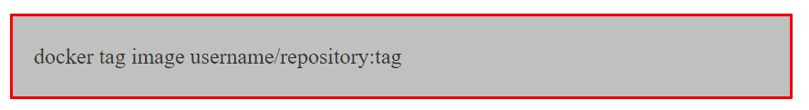

+ Par exemple :

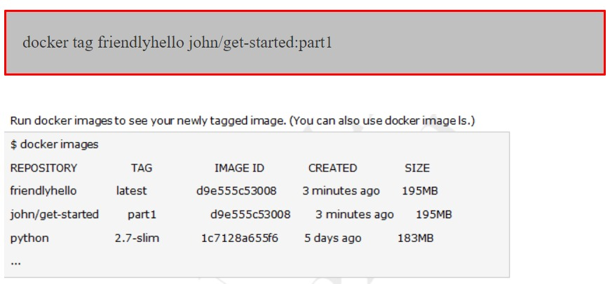

### Publier l'image

+ Téléchargez votre image taguée dans le référentiel :

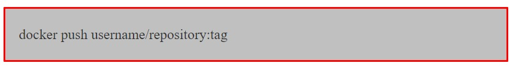

+ Une fois terminé, les résultats de ce téléchargement sont accessibles au public.
+ Si vous vous connectez à `Docker Hub`, vous y verrez la nouvelle image, avec sa commande `pull`.

### Extrayez et exécutez l'image à partir du référentiel distant

+ Désormais, vous pouvez utiliser `docker run` et exécuter votre application sur n'importe quelle machine avec cette commande : 

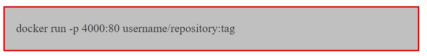

+ Si l'image n'est pas disponible localement sur la machine, `Docker` pourrait l'extraire du référentiel.

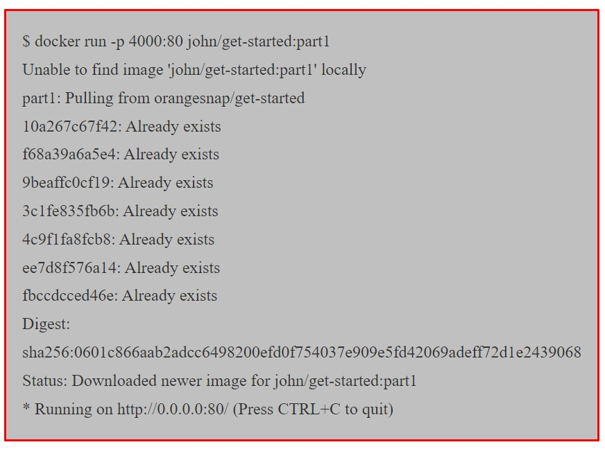

+ **Remarque :** 
  + si vous ne spécifiez pas la partie : `tag` de ces commandes, la balise `:latest` sera prise en compte, à la fois lorsque vous créez et lorsque vous exécutez des images.
  + `Docker` utilisera la dernière version de l'image exécutée sans balise spécifiée (pas nécessairement l'image la plus récente).
  + Quelque soit l'endroit où `docker run` s'exécute, il extrait votre image, ainsi que `python` et toutes les dépendances du fichier `requirements.txt`, et exécute votre code.
  + Tout est transporté ensemble dans un petit paquet soigné, et la machine hôte n'a pas besoin d'installer autre chose que `docker` pour l'exécuter.
  + `Instructions Dockerfile` : Nous avons vu dans la section précédente que `Dockerfile` est utilisé pour créer des images `Docker`.
  + Il contient la liste des instructions lues par `Docker` pour configurer une image.
  + Il existe une douzaine d'instructions que nous pouvons utiliser dans notre `Dockerfile`.

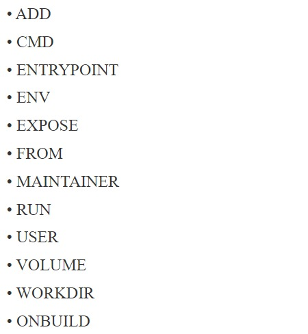

### FROM

+ Cette instruction est utilisé pour définir l'image de base pour les instructions ultérieures.
+ Il est obligatoire de définir ceci dans la première ligne d'un `Dockerfile`.
+ Vous pouvez cependant l'utiliser plusieurs fois. Exemple :

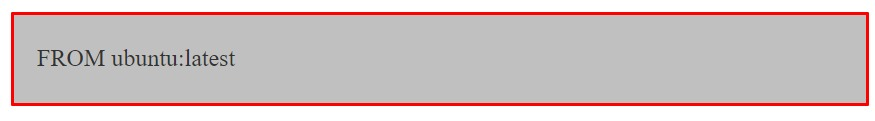

### MAINTAINER

+ Il s'agit d'une instruction non exécutable utilisée pour indiquer l'auteur du `Dockerfile`. Exemple :

### RUN

+ Cette instruction vous permet d'exécuter une commande au-dessus d'un calque existant et de créer un nouveau calque avec les résultats de l'exécution de la commande.
+ Par exemple, s'il existe une condition préalable pour installer `PHP` avant d'exécuter une application, vous pouvez exécuter les commandes appropriées pour installer `PHP` au-dessus de l'image de base (par exemple `Ubuntu`), comme ceci :

### CMD

+ La principale différence entre `CMD et RUN`, est que `CMD` n'exécute rien pendant la construction.
+ Il spécifie simplement la commande prévue pour l'image. Alors que `RUN` exécute la commande pendant le temps de construction.
+ **Remarque :** il ne peut y avoir qu'une seule instruction `CMD` dans un `Dockerfile`, si vous en ajoutez d'autres, seule la dernière prend effet. Exemple :

### EXPOSE

+ Lors de l'exécution de votre service dans le conteneur, vous souhaiterez peut-être que votre conteneur écoute sur les ports spécifiés.
+ L'instruction `EXPOSE` vous aide à le faire. Exemple :

### ENV

+ Cette instruction peut-être utilisée pour définir les variables d'environnement dans le conteneur. Exemple :

### COPY

+ Cette instruction permet de copier des fichiers et répertoires d'une source spécifiée vers une destination (dans le système de fichiers du conteneur). Exemple :

### ADD

+ Cette instruction est similaire à l'instruction `COPY` avec quelques fonctionnalités supplémentaires telles que la prise en charge des `URL` distantes dans le champ source et l'extraction `tar` en local uniquement.
+ Mais si vous n'avez pas besoin d'une fonctionnalité, il est suggéré d'utiliser `COPY` car il est plus lisible. Par exemple :

### ENTRYPOINT

+ Vous pouvez utiliser cette instruction pour définir la commande principale de l'image.
+ Par exemple, si vous n'avez installé qu'une seule application dans votre image et vous souhaitez qu'elle s'exécute à chaque instruction de l'image, `ENTRYPOINT` est l'instruction qu'il vous faut.
+ **Remarque :** les arguments sont facultatifs et vous pouvez le transmettre pendant l'exécution avec quelque chose comme `docker run<'image-name>`.
+ De plus, tous les éléments spécifiés à l'aide de `CMD` seront remplacés, à l'exception des arguments. 
+ Ils seront transmises à la commande spécifiées dans `ENTRYPOINT`. Exemple : 

### VOLUME

+ Vous pouvez utiliser l'instruction `VOLUME` pour activer l'accès à un emplacement sur le système hôte à partir d'un conteneur.
+ Passez simplement le chemin de l'emplacement auquel vous souhaiterez accéder. Exemple :

### USER

+ Ceci est utilisé pour définir `l'UID(ou le nom de l'utilisateur)` à utiliser lors de l'exécution de l'image. Exemple : 

### WORKDIR

+ Ceci est utilisé pour définir le répertoire actuellement actif pour d'autres instructions telles que `RUN, CMD, ENTRYPOINT, COPY et ADD`.
+ Notez que si un chemin relatif est fourni, la prochaine instruction `WORKDIR` le prendra comme relatif au chemin de l'instruction `WORKDIR` précédente. Exemple :

### BUILD

+ Cette instruction ajoute une instruction de déclenchement à exécuter lorsque l'image comme base pour une autre image.
+ Il se comporte comme si une instruction `RUN` était insérée immédiatement après l'instruction `FROM` du `Dockerfile` en aval.
+ Ceci est généralement utile dans les cas où vous avez besoin d'une image statique avec une valeur de configuration dynamique qui change chaque fois qu'une nouvelle image doit être crée (au-dessus de l'image de base). Exemple :

+ La capture d'écran ci-dessus provient du référentiel officiel `nginx` de `Dockerfile`.
+ Si vous voyez, il existe das liens vers `Dockerfile` pour chaque version de l'image. Les liens pointent vers `Dockerfile` hébergé dans `github`.

+ Ces `Dockerfiles` sont le meilleur endroit pour apprendre le `Dockerfile` tel qu'il a été vérifié auprès de `Dockerfile`.
+ L'une des meilleures pratiques est de combiner plusieurs commandes dans l'instruction `RUN` en utilisant `&&` chaque instruction `RUN` crée une couche sur les images, donc si vous avez dix instructions `RUN` cela crée dix calques supplémentaires dans votre image.
+ Pour éviter cela, nous pouvons corriger toutes les commandes dans une seule instruction `RUN` en combinant toutes les commandes avec `&&` comme indiqué dans la capture d'écran ci-dessus :

# Bases du réseau de conteneurs

### Un Serveur Web Simple Et Statique

+ Exécutez l'image `Docker Hub nginx`, qui contient un serveur `Web base`:

+ `Docker` téléchargera l'image depuis le `Docker Hub`.

  + `-d` : indique à `Docker` d'exécuter en arrière-plan.
  + `-P` : indique à `Docker` de rendre ce service accessible depuis d'autres ordinateurs. (`-P` est la version courte de `--publish-all`).

+ Mais comment pouvons-nous nous connecter à notre serveur Web maintenant ?

### Trouver Le port de notre serveur Web

+ Nous utiliserons `docker ps` : 

+ Le serveur `Web` s'exécute sur les ports `80` et `443` à l'intérieur du conteneur.
+ Ces ports sont mappés aux ports `32769` et `32768` sur notre hôte `Docker`.
+ Nous expliquerons le pourquoi et le comment de ce mappage de ports. Mais d'abord, assurons-nous que tout fonctionne correctement.

### Connexion à notre serveur Web (GUI)

+ Pointez votre navigateur vers l'adresse `IP` de votre hôte `Docker`, sur le port indiqué par `docker ps` pour le port de connecter `80`.

### Connexion à notre serveur Web (CLI)

+ Vous pouvez également utiliser `curl` directement depuis l'hôte `Docker`.
+ Assurez-vous d'utiliser le bon numéro de port s'il est différent de l'exemple ci-dessous :

### Pourquoi Cartographions-nous les Ports ?

+ Nous n'avions plus d'adresses `IPv4`. Les conteneurs ne peuvent pas avoir d'adresses `IPv4` physiques.
+ Ils ont des adresses privées. Les services doivent être exposés port par port. Les ports doivent être mappés pour éviter les conflits.

  + Trouver le port serveur `Web` dans un script.
  + Analyser la sortie de `docker ps` serait pénible. Il existe une commande pour nous aider.
  
    + `$ docker port <containersID>`
    + `8032 769` Allocation manuelle des numéros de port.

+ Nous utilisons deux serveurs `Web NGINX`. Le premier est exposé sur le port `80`.
+ Le deuxième est exposé sur le port `8000`. Le troisième sur les ports `8000` et `8888`.
+ **Remarque :** la convention est `port-on-host : port-on-container`.

### Plomberie dans votre infrastructure

+ Il existe de nombreuses façons d'intégrer des conteneurs dans votre réseau.
+ Démarrez le conteneur en laissant `Docker` lui allouer un port public.
+ Récupérez ensuite ce numéro de port intégrez-le à votre configuration.
+ Choisissez un numéro de port fixe à l'avance, lorsque vous générez votre configuration.
+ Démarrez ensuite votre conteneur en définissant les numéros de port manuellement.
+ Utilisez un plugin réseau, en connectant vos conteneurs avec par exemple des `VLAN`, des tunnels...
+ Activez le mode `Swarm` pour le déploiement sur un cluster. Le conteneur sera alors accessible via n'importe via n'importe quel noeud du cluster.

### Trouvez l'adresse IP Du Conteneur

+ `docker inspect` est une commande avancée, qui peut récupérer une tonne d'informations sur nos conteneurs.
+ Ici, nous lui fournissons une chaîne de format pour extraire exactement l'adresse `IP` privée du conteneur.

### Epingler notre Conteneur

+ Nous pouvons tester la connectivité au conteneur en utilisant l'adresse `IP` que nous venons découvrir.
+ Voyons cela maintenant en utilisant l'outil `ping`.

### Les différents pilotes réseau

+ Un conteneur peut utiliser l'un des pilotes suivants :

  + bridge (par défaut)
  + aucun
  + hôte
  + conteneur
  + Le pilote est sélectionné avec `docker run --net ...`

### Le pont par défaut

+ Par défaut, le conteneur obtient une interface virtuelle `eth0`. (En plus de sa propre interface de bouclage lo privée). 
+ Cette interface est fournie par une `vethpai`. Il est connecté au pont `Docker`. (Nommé `docker0` par défaut; configurable avec `--bridge`).
+ Les adresses sont allouées sur un sous-réseau interne privé. (`Docker` utilise `127.17.0.0/16` par défaut; configurable avec `-bip`).
+ Le trafic sortant passe par une règle iptables `MASQUERADE`. Le trafic entrant passe par une règle iptables `DNAT`. Le conteneur peut avoir ses propres routes, règles iptables, etc.

# Le modèle de réseau de conteneurs

### Le modèle de réseau de conteneurs

+ Le `CNM` a été introduit dans `Engine 1.9.0 (novembre 2015)`.
+ Le `CNM` ajoute la notion de réseau, et une nouvelle commande de niveau supérieur pour manipuler et voir ces réseaux : `dicker network`.
+ Qu'y a-t-il dans un réseau ?

  + Conceptuellement, `un réseau` est un commutateur virtuel.
  + Il peut être **local** (sur un seul moteur) ou **global** (sur plusieurs hôtes).
  + Un réseau est associé à un sous-réseau `IP`.
  + Un réseau est géré par un pilote.
  + Un réseau peut avoir un `IPAM` (allocateur `IP`) personnalisé.
  + Les conteneurs avec des noms explicites sont détectables via `DNS`.
  + Tous les pilotes que nous avons vus auparavant sont disponibles.
  + Un nouveau pilote multi-hôtes, `overlay`, est disponible immédiatement.
  + Plus de pilotes peuvent être fournis par des plugins `(OVS, VLAN ..)`.

### Créer un réseau

+ Gérons un réseau appelé `dev`.

+ Le réseau est désormais visible avec la commande `network ls` :

### Placer des conteneurs sur un réseau

+ Nous allons créer un conteneur nommé sur ce réseau. Il sera accessible avec son nom, recherchez.

### Communication entre les conteneurs

+ Maintenant, créez un autre conteneur sur ce réseau.

+ A partir de ce nouveau conteneur, nous pouvons résoudre et pinger l'autre, en utilisant le nom qui lui est attribué.

### Résolution des adresses de conteneurs

+ Dans `Docker Engine 1.9`, la résolution de noms est implémentée avec `/etc/hosts` et mise  àjour à chaque fois que des conteneurs sont ajoutés/supprimés.

+ Dans `Docker Engine 1.10`, cela a été remplacé par un résolveur dynamique. (Cela évite les conditions de concurrence lors de la mise à jour de `/etc/hosts`.)

### Connecter plusieurs conteneurs ensemble

+ Essayons d'exécuter une application qui nécessite deux conteneurs.
+ Le premier conteneur est un serveur Web.
+ L'autre est un magasin de données `Redis`.
+ Nous les placerons tous les deux sur le réseau de développement créé précédemment.

### Exécution du serveur Web
+ L'application est fournie par l'image conteneur `jpetazzo/trainingwheels`.
+ Nous n'en savons pas grand-chose, nous allons donc essayer de l'exécuter et voir ce qui se passe.

### Testez le serveur Web

+ Si nous nous connectons à l'application maintenant, nous verrons une page d'erreur :

+ C'est parce que le service `Redis` n'est pas en cours d'exécution.
+ Ce conteneur tente de résoudre le nom `redis`.

+ Remarque : nous n'utiliserons pas ici de nom de domaine complet ou d'adresse `IP`, juste `redis`.

### Démarrer le magasin de données

+ Nous devons démarrer un conteneur `redis`.
+ Ce conteneur doit être sur le même réseau que le serveur Web.
+ Il doit avoir le bon nom (redis) pour que l'application puisse le trouver. Démarrez le conteneur :

### Testez à nouveau le serveur web

+ Si nous nous connectons à l'application maintenant, nous devrions voir que l'application fonctionne correctement :

+ Lorsque l'application tente de résoudre `Redis`, au lieu d'obtenir une erreur `DNS`,elle contient l'adresse `IP` de notre conteneur `Redis`.

### Quelques mots sur la portée

+ Que faire si nous voulons exécuter plusieurs copies de notre application.
+ Puisque les noms sont uniques, il ne peut y avoir qu'un seul conteneur nommé `redis` à la fois.
+ Nous pouvons spécifier `--net-alias` pour définir des alias à l'échelle du réseau, indépendamment du nom du conteneur.

+ Supprimons le conteneur `Redis` :
+ Et créez-en un qui ne bloque pas le nom `redis` : 

+ Vérifiez que l'application fonctionne toujours (mais le compteur est revenu à 1, puisque nous avons effacé l'ancien conteneur `Redis`).

### Les noms sont locaux à chaque réseau

+ Essayons d'envoyer une requête `ping` à notre conteneur de recherche à partir d'un autre conteneur, lorsque cet autre conteneur n'est pas sur le réseau de développement.

+ Les noms peuvent être résolus uniquement lorsque les conteneurs se trouvent sur le même réseau.
+ Les conteneurs ne peuvent se contacter que lorsqu'ils sont sur le même réseau (vous pouvez essayer d'effectuer un ping en utilisant l'adresse `ÌP` pour vérifier).

### Alias de réseau
+ Nous aimerions avoir un autre réseau, prod, avec son propre conteneur de recherche.
+ Mais ile ne peut y avoir qu'un seul conteneur nommé `search` ! Nous utiliserons des alias de réseau.
+ Un conteneur peut avoir plusieurs alias réseau. Les alias de réseau sont locaux à un réseau donné (n'existent que dans ce réseau).
+ Plusieurs conteneurs peuvent avoir le même alias réseau (même sur le même réseau).
+ Dans `Docker Engine 1.11`, la résolution d'un alias réseau génère les adresses `IP` de tous les conteneurs contenant cet alias.

### Créer des conteneurs sur un autre réseau

+ Crée le réseau de production

+ Nous pouvons désormais créer plusieurs conteneurs avec l'alias de recherche sur le nouveau réseau de production.

### Résolution des alias de réseau

+ Essayons d'abord la résolution `DNS`, en utilisant l'outil `nslookup` fourni avec l'image `alpine`.

+ `Adresse 1:172.23.0.3 prod-es-2.prod Adresse 2 : 172.23.0.2 prod-es-1.prod` (Vous pouvez ignorer les erreurs `null` impossible à résoudre).

### Connexion à des conteneurs avec alias

+ Chaque instance `ElasticSearch` a un nom (généré lors de son démarrage).
+ Ce nom peut-être vu lorsque nous émettons une simple requête `HTTP` sur le point de terminaison de l' `API ElasticSearch`.
+ Essayez la commande suivante plusieurs fois : 

+ Essayez ensuite plusieurs fois en remplaçant, `--net dev` par `--net prod` : 

### Bon à savoir ...

+ Docker ne créera pas de noms de réseau ni d'alias sur le réseau de pont par défaut.
+ Par conséquent, si vous souhaitez utiliser ces fonctionnalités, vous devez d'abord créer un réseau personnalisé.
+ Les alias réseau ne sont pas uniques : vous pouvez attribuer le même alias à plusieurs conteneurs sur le même réseau.
+ Dans `Engine 1.10` : un conteneur sera sélectionné et seule son adresse `IP` sera renvoyée lors de la résolution de l'alias réseau.
+ Dans `Engine 1.11`: lors de la résolution de l'alias réseau, la réponse `DNS` inclut les adresses `IP` de tous les conteneurs avec ect alias réseau. Cela permet un équilibrage de charge brut sur plusieurs conteneurs (mais ne remplace pas un véritable équilibreur de charge).
+ Dans `Engine 1.12` : l'activation du mode `Swarm` donne accès aux fonctionnalités de clustering, notamment un équilibreur de charge avancé utilisant `Linux IPVS`.
+ La création de réseaux et d'alias de réseau est généralement automatisé avec des outils comme `Compose`.

# Workflow de développement local avec Docker

### Utiliser un conteneur Docker pour le développement local

+ Plus jamais : 

  + Fonctionne sur ma machine
  + Pas la même version
  + Dépendance manquante

+ En utilisant des conteneurs `Docker`, nous obtiendrons un environnement de développement cohérent.

### Notre application "Namer"

+ Le code est disponible sur : https://github.com/jpetazo/namer. L'image `jpetazzo/namer` est automatiquement construite par le `Docker Hub`.

### Regardons le code

+ Téléchargeons le code source de notre application.

### Où est mon code ?

+ D'après le `Dockerfile`, le code est copié dans `/src` : 

+ Nous souhaitons supporter des modifications à l'intérieur du conteneur sans le reconstruire à chaque fois. Pour cela, nous utiliserons un volume.

### Notre premier tome
+ Nous dirons à `Docker` de mapper le repertoire actuel sur `/src` dans le conteneur.

+ L'indicateur `-d` indique que le conteneur doit s'exécuter en mode détaché (en arrière-plan).
+ L'indicateur `-v` permet le montage de volumes à l'intérieur de conteneurs.
+ L'indicateur `-p` mappage le port `9292` à l'intérieur du conteneur au port `80` sur l'hôte.
+ Nous n'avons pas besoin de donner une commande à exécuter car le `Dockerfile` spécifie déjà `rackup`.

### Montage de volumes à l'intérieur de conteneurs

+ L'indicateur `-v` monte un repertoire de votre hôte dans votre conteneur `Docker`.
+ La structure du drapeau est la suivante : `[host-path]:[container-path]:[rw|ro]`

  + Si `[host-path] ou [container-path]` n'existe pas, il est créé.
  + Vous pouvez contrôler l'état d'écriture du volume avec les options `ro` et `rw`.
  + Si vous ne spécifiez `rw` ou `ro`, ce sera `rw` par défaut.
  + Si vous ne spécifiez `rw` ou `ro`, ce sera `rw` par défaut.

+ Il y aura un chapitre complet sur les volumes.
+ 

### Tester le conteneur de développement

+ Voyons maintenant si notre nouveau conteneur est en cours d'exécution.

+ Notre client n'aime vraiment pas la couleur de notre texte. Changeons-le

### Améliorer le flux de travail avec Compose

+ Vous pouvez également démarrer le conteneur avec la commande suivante :
  + `$docker-compose up -d`

+ Cela fonctionne grâce au fichier `Compose`, `docker-compose.yml`:

+ Pourquoi composer ?

  + Spécifier tous ces paramètres `docker run` est fastidieux.
  + Et sujet aux erreurs.
  + Nous pouvons `encoder` ces paramètres dans un `fichier Compose`
  + Lorsque vous voyez fichier `docker-compose.yml`, vous savez que vous pouvez utiliser `docker-compose up`.
  + `Compose` peut également gérer des applications complexes et multi-conteneurs. (Nous en reparlerons plus tard)

# Flux de travail expliqué

+ Nous pouvons voir un workflow simple :

  + Construire une image contenant notre environnement de développement (Rails, Django ...)
  + Démarrez un conteneur à partir de cette image. Utilisez l'option `-v` pour montrer le code source à l'intérieur du conteneur.
  + Modifiez le code source en dehors des conteneurs, en utilisant les outils habituels (vim, emacs, textmate ...)
  + Testez l'application (Certains frameworks récupèrent automatiquement les modifications. D'autres nécessitent que vous fassiez `CTRL + C` redémarrer après chaque modification)
  + Répétez deux dernières étapes jusqu'à ce que vous soyez satisfait.
  + Une fois terminé, `commit+push` les modifications du code source. (Vous utilisez le contrôle de version,n'est-ce pas ?)

### Débogage à l'intérieur du conteneur 

+ `Docker` a introduit une fonctionnalité appelée `docker-exec`.
+ Il permet aux utilisateurs d'exécuter un nouveau processus dans un conteneur déjà en cours d'exécution.
+ Si parfois vous souhaitez pouvoir vous connecter pouvoir vous connecter en `SSH` dans un conteneur : vous pouvez utiliser `docker exec` à la place.
+ Vous pouvez obtenir une invite shell dans un conteneur existant de cette façon, ou exécuter un processus arbitraire pour l'automatisation. Exemple de `docker exec`.

  + `$ #` Vous Vous pouvez exécuter des commandes `Ruby` dans la zone où l'application est en cours d'exécution et plus encore!

# Utilisation de Docker Compose pour les piles de développement

+ Les `Dockerfiles` sont parfaits pour créer un seul conteneur.
+ Mais lorsque vous souhaitez démarrer une pile complexe composée de plusieurs conteneurs, vous avez besoin d'un outil différent.
+ Cet outil est `Docker Compose`. Dans cette leçon, vous utiliserez `Compose` pour amorcer un environnement de développement.

## Composer pour les piles de développement

### Qu'est-ce que Docker Compose

+ `Docker Compose` (anciennement connu sous le nom de fig) est un outil externe.
+ C'est facultatif (vous n'avez pas besoin de `Compose` pour exécuter `Docker` et les conteneurs) mais le recommandons vivement!
+ L'idée générale de `Compose` est de permettre un `worflow` d'intégration très simple et puissant :

  + Clonez votre code
  + Exécutez `docker compose-up`.
  + Votre application est opérationnelle !

### Présentation de la rédaction

+ Voici comment travailler avec `Compose` :

  + Vous décrivez un ensemble (ou une pile) de conteneurs dans un fichier `YAML` appelé `docker-compose.yml`
  + Vous exécutez `docker-compose up`
  + `Compose` extrait automatiquement les images, crée des conteneurs et les démarre.
  + `Compose` peut configurer des liens, des volumes et d'autres options `Docker` pour vous.
  + `Compose` peut exécuter les conteneurs en arrière-plan ou  au premier plan.
  + Lorsque les conteneurs s'exécutent au premier plan, leur sortie agrégée est affichée.

### Vérifiez si compose est installé

+ Si vous installez les machines virtuelles de formation officielles, `Compose` a été préinstallé.
+ Vous pouvez toujours vérifier qu'il est installé en exécutant :

### Installation de Composer

+ Si vous installez `Compose` sur votre machine, il existe (au moins) deux méthodes.
+ `Compose` est écrit en `Python`. Si vous avez `pip` et que vous l'utilisez pour gérer d'autres packages `Python`, vous pouvez installer `compose` avec :

+ (Remarque : si vous êtes familier avec `virtualenv`, vous pouvez également installer `Compose`.)

+ Si vous n'avez pas `pip`, ou ne souhaitez pas l'utiliser pour installer `Compose`, vous pouvez également récupérer un fichier binaire tout-en-un.

### Lancement de notre première pile avec Compose

+ Première étape : démarrez votre application

+ Deuxième étape : démarrez votre application

+ Regardez `Compose` créer et exécuter votre application avec les paramètres corrects, notamment en reliant les conteneurs pertinents entre eux.

### Lancement de notre première pile avec Compose

+ Vérifiez que l'application s'exécute sur `http:/<youHostIP>:8000`.

### Arrétez l'application

+ Lorsque vous appuyez sur `^C`, `Compose` essaie de terminer correctement tous les conteneurs.
+ Après dix secondes (ou si vous appuyez à nouveau sur `^C`), cela les tuera de force.

### Le fichier docker-compose.yml

+ Voici le fichier utilisé dans la démo :

### Composer des versions de fichiers

+ La version 1 dispose directement conteneurs (www, redis ...) au niveau supérieur du fichier. La version 2 comporte plusieurs sections :
  + La version est obligatoire et doit être `2`.
  + Les `services` sont obligatoires et correspondent au contenu du format `version 1`.
  + Les `réseaux` sont facultatifs et peuvent définir plusieurs réseaux sur lesquels les conteneurs peuvent être placés.
  + Les `volumes` sont facultatifs et peuvent définir des `volumes` à utiliser (et potentiellement partagés) par les conteneurs.

### Conteneurs dans Docker-Compose.yml

+ Chaque service du fichier `yaml` doit contenir soit une `build`, soit une `image`.

  + `build` indique un chemin contenant un `Dockerfile`.
  + `image` indique un nom d'image (locale ou sur un registre).

+ Les autres paramètres sont facultatifs.
+ Ils codent les paramètres que vous ajoutez généralement à l'exécution de `Docker`.
+ Parfois, ils présentent plusieurs améliorations mineurs.

### Paramètres du conteneur

+ La commande indique quoi exécuter (comme `CMD` dans un `Dockerfile`).
+ Les ports se traduisent en une (ou plusieurs) options `-p` pour mapper les ports. Vous pouvez spécifier des ports locaux (c'est-à-dire x, y pour exposer le port public x)
+ `volumes` se traduit par une (ou plusieurs) option `-v`. Vous pouvez utiliser des chemins relatifs ici.
+ Pour la liste complète, consultez : http://docs.docker.com/compose/yml/.

### Composer des commandes

+ Nous avons déjà vu `docker-compose up`, mais un autre est `docker-compose build`.
+ Il exécutera `docker build` pour tous les conteneurs mentionnant de construction.
+ Il est courant d'exécuter les étapes de construction et d'exécution dans l'ordre.

+ Une autre option courante consiste à démarrer les conteneurs en arrière-plan : 

### Vérifier l'état du conteneur

+ Il peut être fastidieux de vérifier l'état de vos conteneurs avec `docker -ps`, surtout lorsque vous exécutez plusieurs applications en même temps.
+ `Composer` facilite les choses, avec `docker-compose ps` vous ne verrez que l'état des conteneurs de la pile actuelle :

### Nettoyer

+ Si vous avez démarré votre application en arrière-plan avec `Compose` et que vous souhaitez l'arrêter facilement, vous pouvez utiliser la commande `kill` :

+ Alternativement, `docker-compose down` arrêtera et supprimera les conteneurs.

### Traitement particulier des volumes

+ `Composer` est intelligent. Si votre conteneur utilise des volumes, lorsque vous redémarrez votre application.
+ `Compose` créera un nouveau conteneur, mais réutilisera les `volumes` qu'il utilisait précédemment.
+ Cela facilite la mise à niveau d'un service ace état,en extrayant sa nouvelle image et en redémarrant simplement votre pile avec `Compose`.