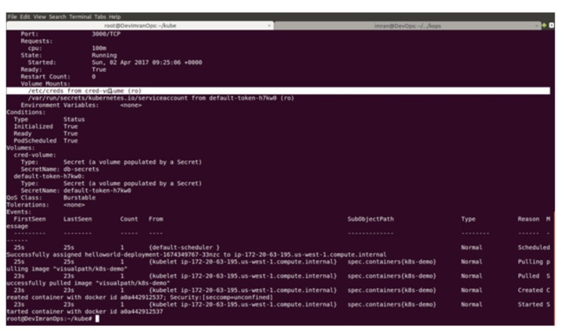

# Presentation De Kubernetes

+ Nous avons vu jusqu'à présent dans le chapitre `Docker` que nous pouvons créer et exécuter des conteneurs sur l'hôte `Docker`.
+ C'est tellement cool, c'est léger, rapide et livrable, mais qu'en est-il de la production.
+ Pouvons-nous exécuter nos applications sur ces conteneurs légers ou, plus spécifiquement, vous demander d'exécuter tous ces conteneurs sur un seul hôte ?
+ La réponse est qu'il n'est pas prudent de mettre tous ses œufs dans le même panier.
+ Nous avons donc besoin d'un `cluster d'hôtes Docker`, qui peut être géré par une application externe.
+ Quelque chose qui puisse planifier des `conteneurs` pour nous sur l'hôte le mieux approprié du `cluster`.
+ Il devrait également détecter un `conteneur` défaillant et résoudre le problème pour nous.
+ Nous recherchons donc un `outil d'orchestration Docker`.


+ Nous disposons de peu `d'outils d'orchestration Docker et de services cloud` sur le marché, comme indiqué ci-dessous.

    + `Amazon ECS` : `Amazon EC2 Container Service (ECS)` prend en charge les `conteneurs Docker` et vous permet d'exécuter des applications sur un `cluster` géré d'instances `Amazon EC2`.
    + `Azure Container Service (ACS)` : `ACS` vous permet de créer un `cluster de machine virtuelles` qui agissent en tant qu'hôtes de conteneurs ainsi que de `machines maîtres` utilisées pour gérer vos `conteneurs` d'applications.
    + `Cloud Foundry's Diego` : `Diego` est un système de gestion de conteneurs qui combine un planificateur, un exécuteur et un gestionnaire de santé. Il s'agit d'une réécriture `Cloud Foundry`.
    + `CoreOS Fleet` - `Fleet` est un outil de gestion de conteneurs qui vous permet de déployer des conteneurs `Docker` sur des hôtes d'un cluster ainsi que de distribuer sur un cluster
    + `Docker Swarm` : `Docker Swarm` fournit unr fonctionnalité de `clustering` native pour les `conteneurs Docker`, qui vous permet de transformer un groupe de moteurs `Docker` en un seul moteur `Docker virtuel`.
    + `Google Container Engine` - `Google Container Engine`, basé sur `Kubernetes`, vous permet d'exécuter des `conteneurs Docker` sur la plate-forme `Google Cloud`. Il planifie les conteneurs dans le `cluster` et les gère en fonction des exigences définies par l'utilisateur.
    + `Kubernetes` - `Kubernetes` est un système d'orchestration pour les conteneurs `Docker` Il gère la planification et gère les charges de travail en fonction de paramètres définis par l'utilisateur.
    + `Mesosphère Marathon` - `Marathon` est un `framework d'orchestration de conteneurs pour Apache Mesos` conçu pour lancer des applications de longue durée. Il offre des fonctionnalités clés pour exécuter dans un environnement en cluster.

# Pourquoi Kubernetes ?

+ Parmi eux, nous nous sur `Kubernetes` dans ce didacticiel pour les raisons mentionnées ci-dessous.
  + `Kubernetes` est le propre projet de `Google` qu'ils ont utilisé pour gérer les `conteneurs` des 10 dernières années. Ainsi, une vaste expérience en matière d'applications et un modèle mature sont des élements que nous recherchons pour les productions.
  + `Kubernetes` est classé parmi les `meilleurs outils d'orchestration de conteneurs` du marché selon une enquête.
  + Il prend en charge d'autre plate-formes de `conteneurs` en dehors de `Docker` comme `RKT`.
  + `Kubernetes` est un projet `open source`, distinct des autres projets **pilotés par les fournisseurs** comme `Swarm, Msos, CloudFoundry`. `Docker swarm` est également open source mais il est étroitement intégré à d'autres outils `Docker`.
  + Il peut prendre en charge un grand nombre d'applications. C'est un sujet de discussion au sein de la communauté `Kubernetes` depuis le printemps, lorsqu'elle a annoncé que l'outil pouvait exécuter plus de `1000 noeuds`.
  + Cela ne veut pas dire que les autres outils d'orchestration ne sont pas que `kubernetes`, mais nous voulions simplement essayer d'abord les meilleurs d'entre eux, puis nous pourrons en essayer d'autres d'il y a des lacunes avec `Kubernetes`.
  
# Qu'est-ce que Kubernetes ?

+ `Ansible` peut contrôler un grand nombre de serveurs et facilite les tâches d'administrations et d'exploration.
+ `Ansible` peut effectuer une gestion de configuration simple et une orchestration complexe, il possède toutes les fonctionnalités des outils de configuration et il est très facile à apprendre et à mettre en oeuvre.
+ Il communique via les `canaux SSH` normaux afin de récupérer des informations sur des machines distantes, d'émettre des commandes et de copier des fichiers. Pour les noeud `Windows`, il utilise `winrm`.


### **Selon La documentation Kubernetes**

+ `Kubernetes` est une `plate-forme open source` permettant `d'automatiser ,la mise en échelle et les opérations de conteneurs d'applications sur des clusters d'hôtes`, fournissant une infrastructure centrée sur les conteneurs.

+ Avec `Kubernetes`, vous pouvez répondre rapidement et efficacement à la demande des clients:

  + `Déployez` vos applications de manière rapide et prévisible.
  + Faites évoluer vos applications à la volée.
  + Déployez de nouvelles fonctionnalités en toute transparence.
  + Limitez l'utilisation du matériel aux ressources requises uniquement.
  
+ L'objectif de `Kubernetes` est de favoriser un écosystème de composants et d'outils qui allègent le fardeau d'applications dans les `cloud publics et privés`.

+ Kubernetes est:

  + `Portable` : public, privé, hybride, multi-cloud.
  + `Extensible` : modulaire, enfichable, hookable, composable.
  + `Auto-réparation` : placement automatique, redémarrage automatique, replication automatique, mise à l'échelle automatique.
  + `Google` a lancé le projet `Kubernetes` en 2014. `Kubernetes` s'appuie sur une décennie et demie d'expérience de `Google` dans l'exécution de charges de travail de production à grande échelle, combiné aux meilleures idées et pratiques de la communauté.
  
# Que peut faire Kubernetes ?
+ Au minimum, `Kubernetes` peut planifier et exécuter des conteneurs d'applications sur des `clusters de machines physiques ou virtuelles`.
+ `Kubernetes` fournit l'infrastructure nécessaire pour créer un environnement de développement véritablement centré sur les conteneurs.
+ `Kubernetes` répond à un certain nombre de besoins courants des applications exécutées en production, telles que : 
  + `Colocalisation des processus d'assistance`, facilitant les applications composites et préservant le modèle d'une application par conteneur.
  + Montage de systèmes de stockage.
  + Distribution de secrets.
  + Vérification de l'état des applications
  + Replication instances d'application
  + Utilisation de la mise à l'échelle automatique des pods horizontaux.
  + Dénomination et découverte 
  + Equilibrage des charges
  + Mise à jour progressive.
  + Surveillance des ressources
  + Accès et ingestion de journaux
  + Débogage d'applications
  + Fournir une authentification et une autorisation
  
# Architecture Kubernetes

+ `Kubernetes` est une pile de services qui fonctionnent ensemble pour gérer tous les hôtes, le cluster `Kubernetes` est ainsi que nous appelons ensemble `AKA K8`.
+ Tous ces services ou composants sont présentés ci-dessous.

  + `POD` : un `pod` est un groupe d'un ou plusieurs conteneurs (tels que des conteneurs `Docker`), le stockage partagé pour ces conteneurs et des options sur la façon d'exécuter les conteneurs. Les `pods` sont toujours colocalisés et co-programmés, et exécutés dans un contexte partagé. Un `pod` modélise un `hôte logique` spécifique à une application. Il contient un ou plusieurs conteneurs d'applications relativement étroitement couplés - dans un monde pré-conteneur, lis se seraient exécutés sur la même machine physique ou virtuelle.
  + `SERVICE` : Les pods `kuberenetes` sont mortels. Il naissent et lorsqu'ils meurent, ils ne ressuscitent pas. Les `ReplicationControllers` en particulier créent et détruisent de manière dynamique (par exemple lors d'une mise à l'échelle vers le haut ou vers le bas ou lors de mises à jour progressive). Bien que chaque `pods` ait sa propre `addresse IP`, même ces addresses IP ne peuvent pas être fiables pour être stables dans le temps. Cela conduit à un problème. Le `service` sera au-dessus du `POD` et aura une adresse IP stable, c'est comme un `équilibreur de charge` donc peu importe les `noeuds` que vous avez sous l'équilibreur de charge et quelle est leur adresse IP, l'équilibreur de charge pourra y accéder. C'est similaire pour le `service` dans `Kubernetes`.


  
# Architecture du Noeud Maître
+ `etcd` : Il s'agit d'un magasin clé-valeur open source developpé par `CoreOS`. `Kubernetes` utilise `etcd` pour stocker les données de configuration accessibles par tous les noeuds (sbires et maître) du cluster. Des exemples de données stockées par `Kubernetes` dans `etcd` sont les tâches planifiées, es détails et l'état du `pod/service` crées et déployés, les espaces de noms et les informations de réplication etc.
+ `KubeApiServer` : Le serveur `API Kubernetes` valide également généralement le magasin de données de configuration dans `etcd` et les détails du conteneur déployé qui sont en accord. Il fournit également une interface `RESTFUL` pour faciliter la communication.
+ `Serveur Kube-Schedule` : le déploiement ` des pods et des services` configurés sur les noeuds est effectués par le composant planificateur. Il est responsable de l'attribution des tâches aux niveaux du cluster. Le planificateur dispose également des informations concernant les ressources sur les membres du cluster. Comme ceux requis pour l'exécution du service configuré et est donc en mesure de décider où déployer un service spécifique.
+ `Kube-Controller-Manager` : Il est généralement responsable de la gestion des fonctions au niveau du `cluster` telles que le `contrôleur de réplication`. Chaque fois que l'état souhaité du cluster change, il est écrit dans `etcd` puis le gestionnaire de contrôleur tente de faire apparaître le `cluster` dans l'état souhaité. Un contrôleur utilise `apiserver` pour surveiller l'état partagé du cluster et apporte des modifications correctives à l'état actuel pour qu'il corresponde à celui souhaité. Un exemple est `Replication Controller` qui prend en charge les `PODS` dans le système, si un `POD` échoue, il le remplace par un nouveau `POD`.


# Architectures des Noeuds de serviteurs.
+ `Docker` : L'une des exigences de base des neouds est `Docker`.`Docker` est responsable de l'extraction et de l'exécution du conteneur à partir des images `Docker`.
+ `Kube-proxy` : chaque noeud du cluster exécute un simple proxy réseau. L'utilisation d'un noeud proxy dans le cluster achemine la requête vers le conteneur approprié dans le noeud.
+ `kubelet` : Il s'agit d'un processus agent qui s'exécute suer chaque noeud. Il est responsable de la gestion `des pods et leurs conteneurs`. Il traite les spécifications des pods qui snt définies au format `YAML ou JSON`. `Kubelet` prend les spécifications des pods et vérifie si les pods fonctionnent correctement ou non.
+ `Flannel` : Il s'agit d'un réseau superposé qui fonctionne sur l'attribution d'une plage d'adresses de sous-réseau. Il est utilisé pour attribuer des `adresses IP` à chaque `pod` exécuté et pour établir les communications de pod à pod et de pod à services.


# Configuration de Kubernetes

+ Kubernetes peut être configuré sur une seule machine `Linux` ou nous pouvons avoir `le maître et les noeuds` sur une machine séparée.
+ Comme vous l'auriez deviné, un cluster à noeud unique est idéal pour l'apprentissage et les tests, mais un cluster `Kubernetes` de qualité de production est nécessaire pour gérer des applications et des conteneurs à grande échelle. Nous verrons les deux manières de mettre en place un `cluster Kubernetes`. La configuration manuelle de tous les composants `Kubernetes` est une tâche très fastidieuse, mais il existe peu d'outils sur le marché capable d'automatiser le déploiement du cluster `Kubernetes` pour nous.
  + `Minikube` : `Minikube` configure un cluster à noeud unique sur une machine virtuelle exécuté sur `viurtualbox`. Nous pouvons créer et également géré le cluster `Kubernetes avec minikube`.
  + `Kops` : `Kops` met en place un cluster kubernetes multi-neuds de qualité de production sur le cloud `AWS`, actuellement il ne prend en charge que le fournisseur `AWS`.

# Configuration du Minikube Localement

### Qu'est-ce qu'un Minikube ?

+ `Minikube` exécute un cluster `kubernetes` à noeud unique dans une `VM` sur votre ordinateur portable.
+ C'est pour apprendre à tester `Kubernetes`, il ne doit pes être utilisé en production.

### Configurez Minikube

+ `Minikube` peut être télécharger depuis son dépôt github : https://github.com/kubernetes/releases.
+ Nous allons configurer `minikube` sur une machine `Linux`, alors vérifiez `l'URL` de la dernière version et téléchargez le package.
+ `L'URL` mentionnée dans la capture d'écran était la plus récente au moment de la préparation du document `Virtualbox` en est la dépendance, car par défaut, il créera une machine virtuelle sur `virtualbox` et y configurera un `minikube`.


### Kubectl

+ `kubectl` est une interface de ligne de commande permettant d'exécuter des commandes sur des clusters `Kubernetes`.

### Installation et configuration de Kubectl

+ Consultez la page de téléchargement pour connaitre l'URL de la dernière version : https://kubernetes.io/docs/tasks/kubectl/install/


+ `Kubectl` lira la configuration à partir de `~/.kube/config` et connaîtra `l'IP`, le port, l'authentification et d'autres détails pour se connecter au cluster `Kubernetes`.


+ Exécutez la commande `kubectl` pour vérifier si elle fonctionne.


+ Essayez les commandes dans la capture d'écran ci-dessous pour tester si le cluster fonctionne.


+ Cela montre que notre cluster `Kubernetes` fonctionne, nous sommes capables d'extraire des images, d'exécuter un conteneur et également d'accéder à son service.
+ Si vous souhaitez arrêter votre cluster, vous pouvez exécuter `Minikube stop` et cela fera tomber le cluster `minikube`.

# KOPS
## Cluster Kubernetes Sur Le Cloud AWS

### Qu'est-ce que le Kops ?

+ `Kops` vous permet de déployer des clusters `Kubernetes` de qualité production et hautement disponibles à partir de la ligne de commande
+ Le déploiement est actuellement pris en charge sur `Amazon Web Services (AWS)`, et d'autres plates-formes sont prévues.

  + Installation, mises à niveau et gestion des opérations `Kubernetes (kops)` de niveau production `K8`.
  + Le moyen le plus simple de mettre en place et de faire fonctionner un cluster `Kubernetes` de niveau production.
  + Fonctionne sur `Mac OS/Linux`

+ Nous allons configurer une machine virtuelle `Linux` avec `vagrant+virtualbox` et configurer `Kops` dans la machine virtuelle.

### Kops sur la VM

+ Configurer `vagrant` et `virtualbox`
+ Créez un repertoire `Kops` et affichez `xenia64 vm`.
+ Affichez la machine virtuelle.


+ Copiez le lien de la dernière version `Linux-amd64` de `Kops` depuis `github`.


+ Connectez-vous à la machine virtuelle et télécharger `Kops`.


+ `make` est exécutable et déplacé vers `/usr/local/bin`.


+ Installer l'interface `CLI AWS`.


### Configuration AWS Pour Kops

+ Créez un compartiment `S3` dans la région que vous utiliserez pour stocker l'état de `KOPS`.


### Configuration Du Nom De Domaine

+ Nous avons besoin du nom de domaine et de quelques sous-domaines, nous pouvons configurer les deux avec `AWS route53`.
+ Vous pouvez utiliser `route53` pour le nom de domaine et le sous-domaine si vous le souhaitez.
+ Enregistrez un domaine auprès de n'importe quel fournisseur de nom de domaine `GoDaddy ou Namecheap ou Route53`.


### Configuration du sous-domaine avec `AWS Route53`

+ Accédez au tableau de bord `AWS route53` => `Gestion DNS` => Créer une zone hébergée.
+ Nom de domaine => `kubernetes .<Votre nom de domaine>`.
+ Notez les quatre valeurs `ns` que vous voyez après la création du sous-domaine.

### Configuration de `NS Record` avec le fournisseur de domaine

+ Accéder au site de fournisseur de domaine.
+ Ajoutez un enregistrement `NS` puis le sous-domaine `Kubernetes`.

<br/>

+ Pour `namecheap` suivez la procédure mentionnée ci-dessous.
+ `Manage` => `Advanced DNS` => `Add new record`.
+ Vous devez ajouter les quatre valeurs d'enregistrement `ns` car nous avions quatre noms de serveur `ns` dans `Route53`.


+ N'utilisez pas le nom du serveur `NS` mentionné dans la capture d'écran, utilisez celui que vous avez créé avec `Route53`.

### Configuration d'AWS CLI

+ Créez un utilisateur `IAM` avec un accès complet et téléchargez son fichier d'informations d'identification.
+ Exécutez la commande `AWS` configure notre `VM` et saisissez la clé d'accès `AWS` et la clé secrète du fichier `credentials.csv`.


### Configurez Kubectl

+ Installation et configuration de `kubectl`.
+ Vérifiez la page de téléchargement pour connaître `l'URL` de la dernière version : https://kubernetes.io/docs/tasks/kubectl/install/


+ Configurer les clés `SSH` pour la connexion au cluster


+ Renommer le binaire `kops` et le tester


+ Configurez le serveur de noms `Google DNS (8.8.8.8, 8.8.8.4` dans notre `VM` puisse résoudre `Kubernetes.<Votre nom de domaine>`.


+ `Kubernetes.<Votre nom de domaine>` doit être résolu en une valeur d'enregistrement `ns` après cela.
+ Comme indiqué dans la capture d'écran ci-dessous, cela résout pour moi.


### Configurer le Cluster Kubernetes

+ C'est maintenant l'heure du spectacle, nous allons créer un cluster `Kubernetes` sur `AWS` avec la commande `Kops`.
+ A partir de maintenant, nous devrions avoir la configuration mentionnée ci-dessous prête à partir d'`AWS`.

  + `Bucket S3`, mon nom de compartiment est `kops-state-86`.
  + Nom de domaine complet pour notre cluster, le mien est `kubenetes.devimranops.club`.
  + Configuration de l'`AWS CLI` avec un utilisateur administrateur `IAM`.
  + Région `AWS`, j'utilise `us-west-1`
  + Zone `AWS`, j'utilise `us-west-1a` 

+ Nous devons fournir toutes les valeurs à la commande `kops` comme indiqué ci-dessous. 


+ Vous devriez obtenir le résultat ci-dessous, qui montre que la configuration du cluster est crée par `kops`.
+ Le cluster n'a pas encore été créé, suivez la commande suivante pour la créer.


+ `Kops` met à jour le cluster pour créer le cluster.


+ La configuration du cluster aurait été lancée, vérifiez-la via `AWS`.


+ Vérifier les sous-domaine `Route53`


+ Validez le cluster avec la commande `kops`


+ `Kops` crée le fichier `~/.kube/config` dans lequel il écrit tous les détails de configuration pour `Kubectl`.


+ Nous pouvons maintenant commencer à utiliser la commande `kubectl` pour interagir avec notre cluster `kubernetes`.
+ Vérifiez tous les noeuds du cluster.


+ Exécutons un conteneur sur ce cluster


+ Déploiement et service créés, le service est exposé sur le port `31496` dans le groupe de sécurité du noeud maître à accéder à ce service.
+ Accédez à `AWS EC2` => Sélectionnez le nœud maître => Groupe de sécurité => `masters.kubernetes.Inbound` => Edit.
+ Ajoutez le numéro de port et la source depuis n'importe où/MyIP.


+ Obtenez l'adresse `IP publique` du noeud maître et accédez-y à partir du navigateur sur le port exposé.


+ Au lieu de l'adresse `IP` publique du noeud maître, nous pouvons également utiliser les noms attribués par `Route53`.


+ Si vous n'utilisez pas le cluster, vous le supprimer.


# Conteneurs et images

+ Dans cet exercice, nous allons créer une `image Docker` pour l'application `nodejs` qui utilisera `dockerhub` comme registre et exécutera cette image sur notre cluster `Kubernetes`.
+ Vérifie le repertoire `docker-demo`. Vérifiez les trois fichiers ci-dessous ``

```
Dockerfile
=========

# cat Dockerfile
FROM node:4.6
WORKDIR /app
ADD ./app
RUN npm install
EXPOSE 3000
CMD npm start

Index.JS
===========

# cat index.js

var express = require('express')
var app = express();
app.get('/', function(req, res) {
  res.send('Hello World!);
}

var server = app.listen(3000, function () {
  var host = server.address().address;
  var port = server.address().port;
  console.log('Example app listening at http://%:%s', host, port);
})


Package.Json
============

# cat package.json
{
  "name" : "myapp",
  "version" : "0.0.1",
  "private": true,
  "scripts": {
    "start": "node index.js"
  };
  
  "engines" : {
    "node" : "^4.6.1"
  };
  
  "dependencies" : {
      "express": "^4.14.0",
      "mysql" : "^2.10.2"
  }
} 
```

+ Installez Docker.


+ Créer une image

  + Le nom des images doit correspondre à votre compte/nom de dépôt `Dockerhub`.
  + Par exemple, mon nom de compte dans `dockerhub est <<visualpath>>`, donc le nom de mon image est `visualpath/k8s-demo`.
    


+ Exécutez l'image localement et testez-la


+ Testez-le depuis le navigateur 
  + Entrez l'adresse `IP` de votre machine virtuelle `(kops vm)` sur laquelle votre conteneur est exécuté et le numéro de port.


+ Transférez l'image vers `DockerHub`


# Première application sur Kubernetes

+ Exécutons notre nouvelle application sur le cluster `Kubernetes`
+ Avant de pouvoir lancer un conteneur, nous devons créer une définition `POD`.
+ Un `POD` décrit une application exécutée sur `Kubernetes`
+ Un peut contenir un ou plusieurs conteneurs étroitement couplés qui constituent l'application.

  + Ces applications peuvent facilement communiquer entre elles en utilisant leurs numéros de port locaux.
  + Notre application n'a qu'un seul conteneur.
  + Lire la définition du `pod`.


+ Utiliser `kubectl` pour créer un `pod` sur le cluster.


+ Commandes `kubectl` utiles


+ Exécuter des commandes sur le conteneur


# Presentation de Service

+ Création de service pour notre application.


+ Accès au service du monde extérieur.
+ Ouvrez le groupe `MasterNode Security` depuis `AWS`.
+ Autorisez le port `31001` depuis `MyIP/Anywhere`. Le port peut être différent,veuillez vérifier votre port de sevice (`kubectl get service`).
+ Ouvrez le navigateur, entrez l'adresse `IP publique` de votre noeud maître et le port `31001`.


+ Suppression d'un service


+ Création d' `AWS ELB` en tant que service pour notre `pod`.


+ Vérifiez `ELB` depuis `AWS`


+ Attribuez un nom `DNS` à notre `ELB` à partir de `Route53`.
+ Accédez au tableau de bord `AWS Route53` => `Zone hébergée` => Créer un jeu d'enregistrements => Nom: helloworld => Alias : Oui => Equilibreur de charge `ELB Classic`.
+ Sélectionnez votre `ELB` et utilisez `helloworld.kubernetes.devimranops.club`(domaine différent dans votre cas).


# Mise à l'échelle des pods

### Mise à l'échelle

+ Si votre application est sans état, vous pouvez la mettre à l'échelle horizontalement.
+ Sans état signifie que votre application ne stocke pas de fichiers/données sur le système de fichiers local.
+ Toutes les bases de donnés sont avec état. Ils stockent les fichiers de base de données localement.
+ La plupart des applications `Web` peuvent être rendues sans état.
+ La gestion des sessions doît être effectuée en dehors du conteneur.
+ Tout fichier qui doit être enregistré ne peut pas être enregistré localement sur l'ordinateur.
+ La mise à l'échelle dans `Kubernetes` peut être effectuée à l'aide du `TReplication Controller`.
+ Le contrôleur de réplication garantira qu'un nombre spécifié de répliques de `pods` s'exécuteront à tout moment.
+ Un `pod` créé avec le contrôleur de réplication sera automatiquement remplacé s'il est rempli, supprimé ou terminé.
+ L'utilisation du contrôleur de replication est également recommandée si vous souhaitez simplement vous assurer qu'un `pod` est toujours en cours d'exécution, même après les redémarrages.
+ Répliquer notre `pod` deux fois.


+ Vérifiez `pod & rc` (contrôler de réplication) avec la commande `kubectl get & kubectlscribe`.


+ Supprimez un `pod` pour voir la même à l'échelle.


+ Augenter/réduire le contrôleur de réplication.


+ Augmenter/Réduire avec le fichier de définition du contrôleur de réplication.


# Déploiements

### Ensemble de réplication

+ Le jeu de réplicas est le `Replication Controller` de nouvelle génération.
+ Il prend en charge un nouveau sélecteur capable d'effectuer une sélection basée sur un filtrage selon un ensemble de valeurs.
+ Par exemple `environnement` soit `dev` ou `qa` non seulement basé sur l'égalité comme le `Replication Controller` -> par exemple `<<environnement>> == <<dev>>`.
+ Cet ensemble de réplicas, plutôt que le `Replication Controller`, est utilisé par l'objet de déploiement.


### Déploiements

+ Une déclaration de déploiement dans `Kubernetes` vous permet d'effectuer des déploiements et des mises à jour d'applications.
+ Lorsque vous utilisez l'objet de déploiement, vous définissez l'état de votre application.
+ `Kubernetes` fera alors en sorte que les objets que les clusters correspondent à l'état souhaité. 
+ La simple utilisation du contrôleur de réplication ou du jeu de réplication peut s'avérer fastidieuse pour déployer des applications.
+ L'objet de déploiement est plus facile à utiliser et vous offre plus de possibilités.
+ Avec un objet de déploiement, vous pouvez : 

  + Créer un déploiement (par exemple, déployer une application).
  + Mettre à jour un déploiement (par exemple, déployer une dernière version)
  + Effectuer des mises à jour progressives (déploiements sans temps d'arrêt)
  + Revenir à une version précédente.
  + Pause/Reprendre (par exemple pour un déploiement jusqu'à un certain pourcentage seulement).

+ Exemple de définition de déploiement 


+ Commandes utiles


+ Déploiement : 
  + Créer un déploiement
  + Obtenir des informations sur le déploiement, le jeu de réplication (rs), le pod, l'état du déploiement.


+ Créez l'image de démonstration `k8s` avec la prochaine version `V2`.
+ Copiez le contenu du répertoire `docker-demo` dans un autre repertoire.
+ Modifiez le fichier `index.js`, mettre à jour la chaîne dans `res.send` vers quelque chose comme `V2`.
+ Construisez l'image avec la balise `V2`.
+ Envoyez la dernière image vers le registre `DockerHub`.
+ Vérifiez depuis `DockerHub`.


+ Exposez le déploiement existant avec `NodePort`.


+ `NodePort` est `32400` selon la sortie ci-dessus.
+ Autorisez ce port dans le groupe de sécurité du noeud maître afin que nous puissions nous connecter à ce service.


+ Vérifiez l'adresse `IP` du noeud maître est le port exposé.


+ Mettez à niveau la version de l'image vers `V2` à partir du déploiement.


+ Vérifiez depuis dans le navigateur et curl.


+ Historique du déploiement.


+ Restaurer la version précédente.


+ Augmentation de la limite d'historique de déploiement de deux à plusieurs.


+ Déploiement avec un numéro de version


# En savoir plus sur les services

+ Les `pods` sont très dynamiques, ils vont et viennent sur le `cluster Kubernetes`.
+ Lors de l'utilisation d'un `Replication Controller`, les `pods` sont terminés et créés lors des opérations de mise à l'échelle.
+ Lors de l'utilisation de déploiements, lors de la mise à jour de la version de l'image, les pods sont terminés et les nouveaux pods remplacent les anciens pods.
+ C'est pourquoi les `Pods` ne doivent être jamais être accessibles directement, mais toujours via un service.
+ Un `service` est le pont logique entre les pods `mortels` et d'autres services oiu utilisateurs finaux.
+ Lors de l'utilisation précédente de la commande `kubectl expose`, vous avez créé un nouveau service pour votre `pod`, afin qu'il soit accessible en externe.
+ La création d'un service créera un point de terminaison pour vos pods.
+ Un `ClusterIP` : une adresse `IP` virtuelle accessible uniquement depuis l'intérieur du cluster.
+ Un `NodePort`: un port identique sur chaque noeud et également accessible en externe.
+ Un `LoadBalancer` : un `LoadBalancer` créé par le fournisseur de cloud qui acheminera le trafic externe vers chaque noeud du `NodePort`.

+ Créez un module `helloworld`.


+ Créez un service pour le `pod` ci-dessus, la valeur du sélecteur est le nom du `pod` tel qu'il est mis en évidence.


+ `NodePort` est explicitement défini dans la définition du service, observez la capture d'écran ci-dessus.


+ Nous pouvons utiliser `svc` comme forme abrégée pour service.


+ Supprimer et recréer le service modifiera l'adresse `IP/IP` virtuelle du cluster interne.


### Etiquettes
+ Les étiquettes sont des paires clé/valeur qui peuvent être attachées aux objets.
+ Les étiquettes sont comme les balises dans `AWS`.
+ Vous pouvez étiqueter vos objets, par exemple votre pod, en suivant une structure organisationnelle.
+ Clé : environnement _ Valeur : `dev/staging/qa/prod`
+ Clé : département - Valeur : `ingénierie/finance/marketing`


+ Les étiquettes ne sont pas uniques et plusieurs peuvent être ajoutées à un seul objet.
+ Une fois les étiquettes attachées à un objet, vous pouvez utiliser des filtres pour affiner les résultats. C'est ce qu'on appelle des `sélecteurs d'étiquttes`.
+ A l'aide des `sélecteurs d'étiquettes`, vous pouvez utiliser matching expression pour faire correspondre les étiquettes.
+ Par exemple, un `pod` particulier ne peut s'exécuter que sur un noeud étiqueté avec `<<environnement>> == <<développement>>`.
+ Vous pouvez utiliser des étiquettes pour baliser les noeuds. 
+ Une fois les noeuds balisés, vous pouvez utiliser des sélecteurs d'étiquettes pour permettre aux pods de s'exécuter uniquement sur des noeuds spécifiques.
+ Sélection d'un noeud spécifique à partir de la définition dedéploiement.


+ `Tag Hardware` : la haute spécification n'est présente sur aucun noeud de notre cluster.


+ Créez notre déploiement qui a la balise `nodeSelector` recherchant du matériel: balise `high-spec`.


+ Observez que l'état de création du pod est en attente.
+ Le déploiement recherche un noeud avec une balise `high-spec`, qui n'est pas trouvé.
+ Si nous n'avons pas une telle balise, la création du `pod` sera en attente.


+ Marquons un noeud avec du matériel : haute spécification.
+ Le pod sera automatiquement programmé une fois que l'étiquette est disponible. 


# Secrets

+ `Secrets` fournit un moyen dans `Kubernetes` de distribuer des informations d'identification, des clés et des mots de passe aux `pods`.
+ `Kubernetes` lui-même utilise ce mécanisme de secrets pour fournir les informations d'identification permettant d'accéder à `L'API interne`.
+ Les secrets peuvent être utilisés des manières suivantes.

  + Utilisez des secrets comme variables d'environnement.
  + Utilisez les secrets sous forme de fichier dans un `pod`.
  + Cette configuration utilise des volumes à monter dans un conteneur.
  + Dans les `volumes`, vous avez des fichiers.
  + Encodage `Base 64`, encode du nom d'utilisateur et du mot de passe.


+ Création de secrets


+ Création d'un déploiement qui montre notre secret (db-secrets) en tant que volume.
+ `describe` montre les volumes montés, notre `db-secret` mis en surbrillance est monté en tant que volume.



+ Connectez-vous à l'un des pods et vérifiez le point de montage `/etc/creds` pour vérifier nos secrets de base de données.


# Déploiement WordPress

+ Création de secrets pour le déploiement de `WordPress`


+ Création du déploiement de `WordPress`


+ Création d'un service pour `WordPress`


+ Accéder à votre déploiement `WordPress` depuis le monde extérieur.
+ Accédez à l'adresse `IP pUblique` de votre noeud maître sur le port `31001` comme indiqué ci-dessus dans le port de service.
+ Le groupe de sécurité du noeud maître doit autoriser l'accès au port `31001` depuis `MyIP/Anywhere`.


+ Les `pods` ou `conteneurs` sont apatrides, ils ne sauvegardent pas de données s'ils sont tués ou morts.
+ Nous supprimerons notre `pod WordPress` en tant que démo pour montrer ce comportement.


+ Le `pod` est recréé par l'ensemble de `réplication de déploiement` si nous le supprimons manuellement.
+ Toutes les données du `pod` précédent sont supprimées au fur et à mesure que nous supprimons le `pod`.
+ Vérifiez l'application `WordPress` depuis le navigateur, nous aurons perdu l'installation précédente.


