# Qu'est-ce que SSL

## Introduction

- `SSL (Secure Sockets Layer)` est la technologie de sécurité standard permettant d'établir une connexion cryptée entre un serveur web et un navigateur.
- Cette connexion garantit que toutes les données transmises restent privées et intègres.
- SSL est une norme de l'industrie utilisée par des millions de sites web pour protéger leurs transactions en ligne avec leurs clients.

## Certificats SSL

- En général, un certificat SSL contient votre nom de domaine, les détails de votre entreprise, la date d'expiration et les informations sur l'autorité de certification.
- Il inclut également la date d'expiration du certificat et les coordonnées de l'autorité de certification responsable de la délivrance du certificat.

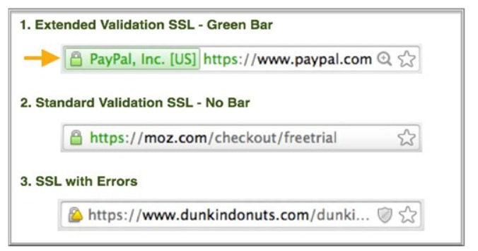

# Types de certificats SSL

### SSL de validation standard

- **Coût** : Généralement entre 0 $ et 100 $.
- **Niveau de validation** : Validation standard.
- **Temps de délivrance** : Délivrance plus rapide.
- Certifie qu'il s'agit d'un certificat valide émis par une autorité de certification de confiance, mais sans validation étendue du propriétaire du domaine/site.

### SSL à validation étendue

- **Coût** : Généralement entre 100 $ et 500 $.
- **Niveau de validation** : Plus haut niveau de validation.
- **Temps de délivrance** : Prend 5 à 10 jours.
- La validation étendue inclut une vérification physique de l'adresse par l'autorité de certification SSL, offrant une assurance accrue à l'utilisateur final.

# Liste des autorités de certification SSL (CA) populaires

- [Comodo](https://www.comodo.com/)
- [Symantec](https://www.symantec.com/)
- [GoDaddy](https://www.godaddy.com/)
- [GlobalSign](https://www.globalsign.com/)
- [Digicert](https://www.digicert.com/)

# Certificats auto-signés

- En cryptographie, un certificat auto-signé est signé par la même entité qu'il certifie.
- Il n'est pas lié à l'identité de la personne ou de l'organisation effectuant réellement la procédure de signature.
- Techniquement, un certificat auto-signé est signé avec sa propre clé privée.

# Comment ça marche

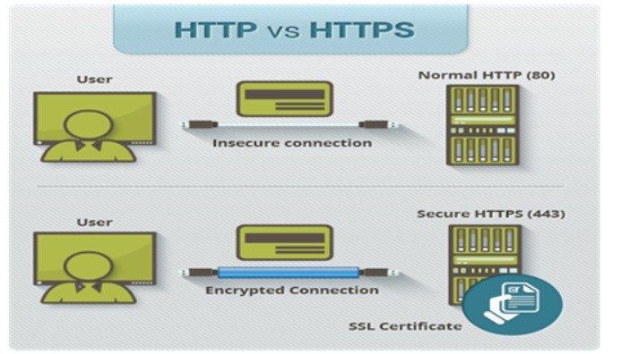

# Qu'est-ce que HTTPS ?

- Lorsque vous demandez une connexion HTTPS à une page web, le site web enverra initialement son certificat SSL à votre navigateur.
- Le certificat SSL contient la clé publique nécessaire pour démarrer la session sécurisée.
- Sur la base de cet échange initial, votre navigateur et le site web lancent ensuite la prise de contact SSL.
- Le Handshake SSL implique la génération de secrets partagés pour établir une connexion sécurisée unique entre vous et le site web.
- Lorsqu'un certificat SSL numérique de confiance est utilisé lors d'une connexion HTTPS, les utilisateurs verront une icône de cadenas dans la barre d'adresse du navigateur.
- Lorsqu'un certificat de validation étendue est installé sur un site web, la barre d'adresse devient verte.

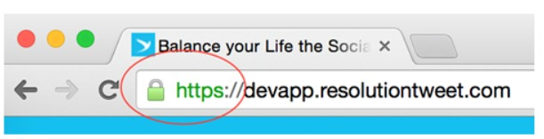

# Configuration AWS

## Instance EC2

- Installez un serveur web (par exemple, Apache ou Internet Information Service (IIS)) sur chaque instance EC2.
- Entrez l'adresse IP de l'instance dans un navigateur web connecté pour vérifier la page par défaut du serveur.

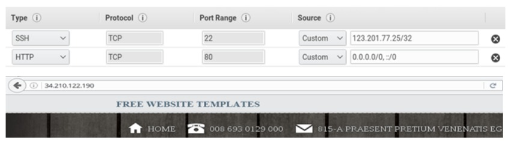

## Équilibreur de charge élastique (Classic Load Balancer)

- Attachez le serveur web de l'instance EC2 à l'ELB.
- Testez votre équilibreur de charge en copiant le nom DNS et en le collant dans le champ d'adresse d'un navigateur web connecté à Internet.

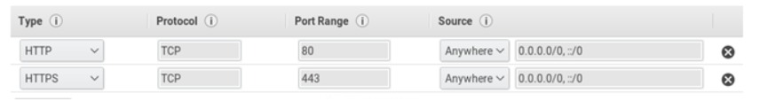

## Serveur web

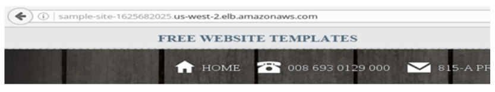

## Enregistrez un domaine et configurez l'enregistrement DNS pour ELB

- Utilisez un service d'enregistrement de domaine comme `freename.com` pour enregistrer le domaine.

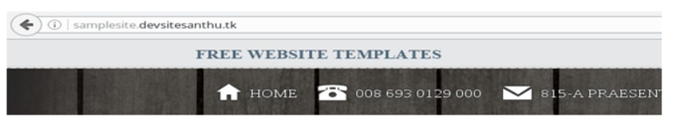

# Génération d'un certificat auto-signé avec OpenSSL (CentOS)

**Remarque :**
- Les clés doivent être au format PEM car AWS comprend les clés PEM (Privacy Enhanced Mail).

## Qu'est-ce qu'OpenSSL ?

- OpenSSL est un logiciel open source implémentant les protocoles SSL et TLS pour effectuer des communications sécurisées sur les réseaux informatiques.

### Étape 1 : Installer mod_ssl


+ **sudo -i**
+ **yum install mod_ssl**


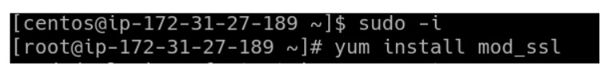

<br/>

+ `Etape 2` : générer une clé privée `RSA` de 2048 bits.

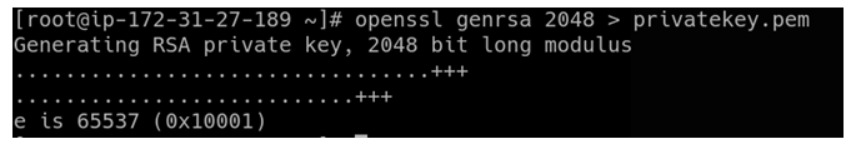

<br/>

+ `genrsa` : Vous pouvez générer une paire de clé publique-privée avec le `genrsa 2048`: longueur de clés en bits.

<br/>

+ `Etape 3` : générer un certificat `auto-signé` à l'aide de la commande `req flag`:

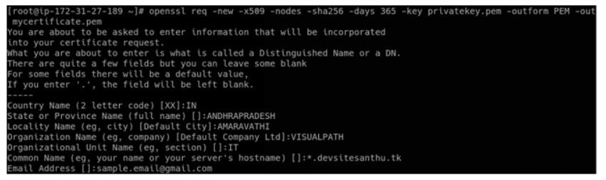

<br/>

+ `req` : demande le certificat et utilitaire de certificat.
+ `new` : nouvelle demande.
+ `x509` : Cette option génère un certificat `auto-signé` au lieu d'une demande de certificat. Ceci est généralement utilisé pour générer `un certificat de test` ou `une autorité de de certification racine auto-signée`.
+ `nodes` : si cette option est spécifiée, si une clé privée est créée, elle ne sera pas chiffré.
+ `sha256` : L'algorithme de hachage `SHA256` n'intervient pas dans le processus de chiffrement /authentification, mais les outils (navigateurs, clients de messagerie, serveurs ...) doivent être capables de lire/déchiffrer ce genre de hachage lors du processus de connexion/authentification mais les outils (navigateurs, clients de messagerie, serveurs...) doivent être capables de lire/déchiffrer ce genre de hachage lors du processus de connexion/authentification.
+ `days`: lorsque l'option `-x509` est utilisé, elle spécifie le nombre de jours pour lesquels certifier le certificat. La valeur par défaut est de 30 jours.
+ `key` : format de clé privée.
+ `outform` : format de sortie (`DER` ou `PEM`).
+ `out` : ceci spécifie le nom du fichier de sortie dans lequel écrire ou la sortie standard par défaut.

+ Ces `clés de génération` sont enregistrées dans le repertoire de travail actuel :

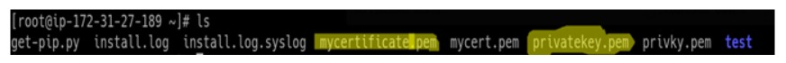

# Télécharger des clés dans AWS

+ Ouvrez la console `Amazon EC2` à l'adresse `https://console.aws.amzon.com/ec2/`
    + Dans le volet de navigation, sous `LOAD BALANCING`, choisissez `Load Balancers`.
    + Sélectionnez votre équilibreur de charge.
    + Aller à Actions `=>` Cliquez sur `Edit listeners`

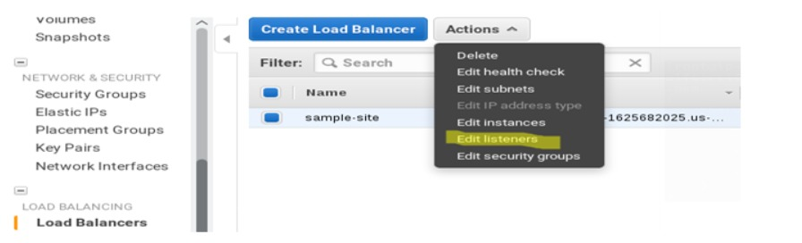 

+ Ajoutez le protocole `HTTPS` pour l'instant. Nous pouvons voir le certificat `SSL`, choisissez `Modifier`.

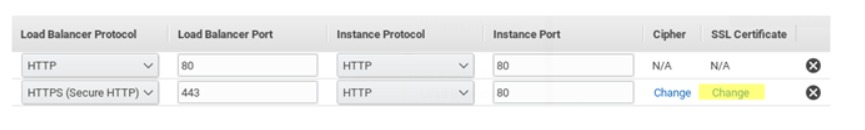
<br/>

+ Sur la page sélectionner un `certificat`, effectuez l'une des opérations suivantes :
+ Si vous disposez d'un `certificat d'AWS (Certificate Manager)`, sélectionnez choisir existants d'`AWS` (Certificate Manager(ACM)), sélectionnez le certificat dans `Certificat`, puis choisissez Enregistrer.
  + **Remarque : Cette option est disponible uniquement dans les régions qui prennent en charge `AWS Certificate Manager`**
+ Si vous avez déjà téléchargé un certificat d' `IAM`, sélectionnez Choisir un Certificat existant depuis `AWS Identify and Access Management (IAM)`, sélectionnez le certificat depuis `Certificat`, puis choisissez `Enregistrer`.
+ Si vous avez un `Certificat SSL` à télécharger, sélectionnez `Télécharez un nouveau certificat SSL vers AWS Identity and Access Management (IAM)`. Entrez un nom pour le certificat, copiez les informations requises dans le formulaire, puis choisissez `Enregistrer`. Notez que la chaîne de certificats n'est pas requise si le certificat est un certificat auto-signé.

+ **Méthode 1 :** à l'aide du téléchargement `awscli (AWS Command Line Interface)` vers la commande `IAM` : 

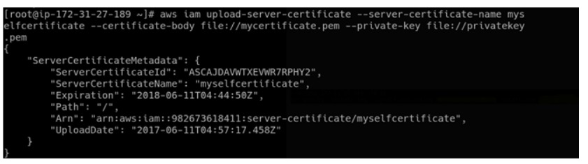

```
aws iam upload-server-certificate --server-certificate-name yourselfcertificate --certificate-body file://mycertificate.pem --private-key file://privatekey.pem
```


+ **Remarque :** dans ce certificat, stocké sous l'option de certificat existant `IAM`.

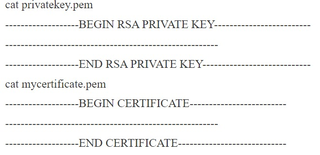


+ Cliquez sur `ENREGISTREZ` -> on peut voir comme ceci.
+ Entrez le nom du certificat.
+ Copiez le fichier `privatekey.pem` et collez-le dans la zone de clé privé.
+ Copiez le fichier `mycertificate.pem` et collez-le dans la zone de certificat de clé publique.

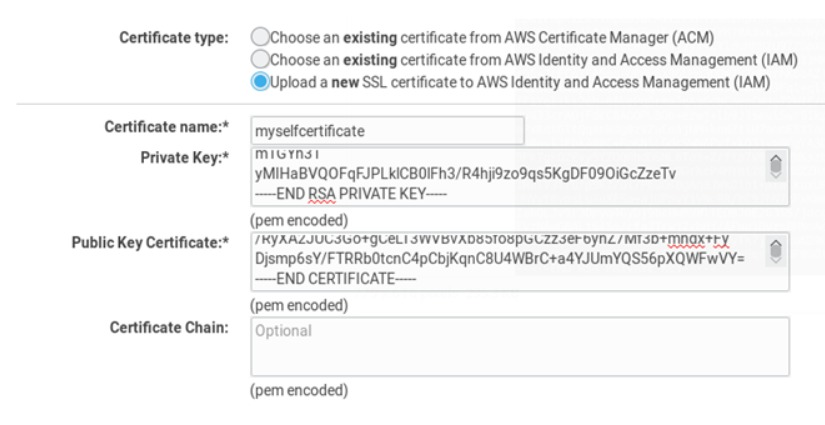

+ Cliquez sur Enregistrer 

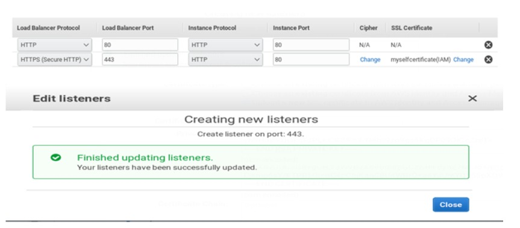

# Vérification

+ Etape 5 : Essayez maintenant d'ouvrir le site Web avec le protocole https

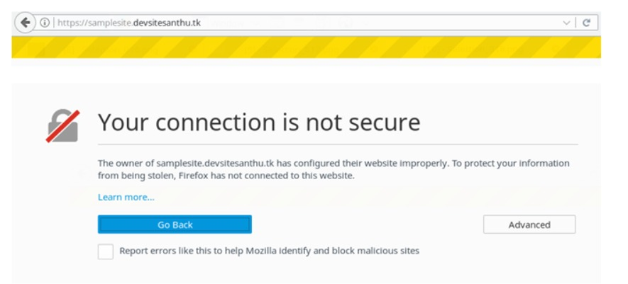

+ Le navigateur connaît le site `Web` sous auto-signé ou émis par `CA`.
+ Cliquez ensuite sur `Option avancée` -> cliquez sur `AddException`.

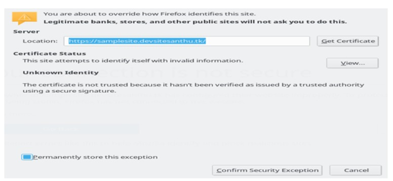

+ Si nous voulons voir les détails de l'autorité de certification émise.
+ Cliquez sur `Afficher` => Cliquez sur `Fermer` => `ConfirmSecurityException` => Votre site Web est maintenant ouvert sous https.

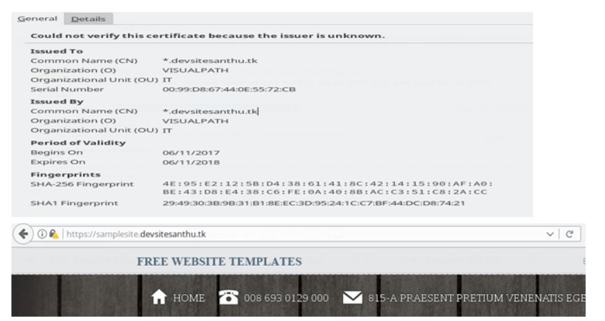

+ Maintenant, tout est fait, le site fonctionne également sous protocole `HTTPS`.

# Diagramme d'algorithme : 

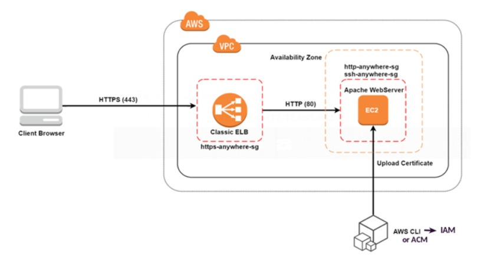