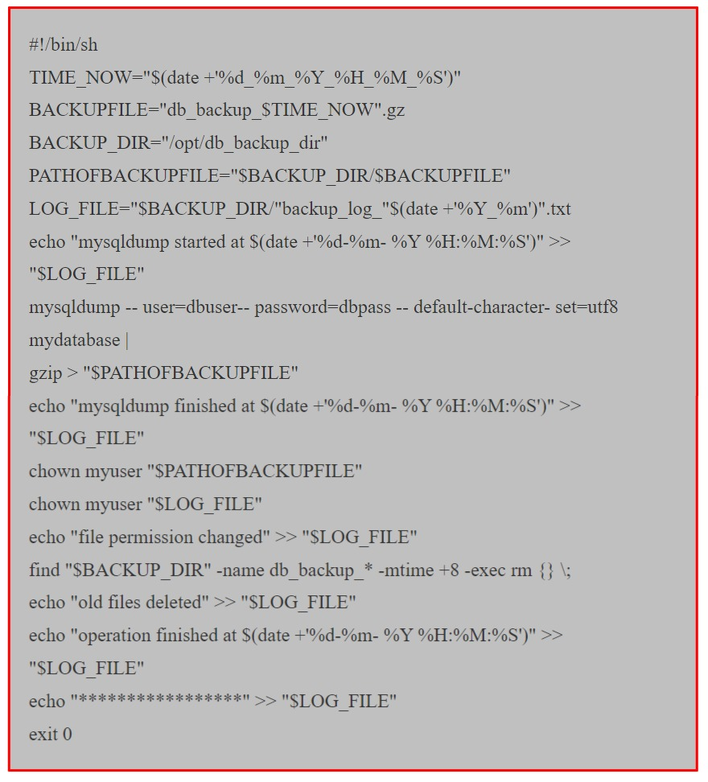

# **Script Bash**

## **1. Introduction**

+ Ce didacticiel vous donnera une plate-forme solide sur la façon de créer des `scripts bash et d'automatiser les tâches d'administration systèmes quotidiennes`.
+ Certes, tout ne peut être abordé dans ce chapitre, mais vous serez équipés d'une bonne quantité de connaissances pour créer vos propres scripts et y exceller si vous faites vos projets efforts.
+ Les `Scripts Bash` sont utilisés par de nombreux `administrateurs systèmes et geeks DevOps` pour faire avancer les choses rapidement et efficacement.
+ Il existe de nombreux outils d'automatisations sur le marché comme `Ansible, Puppet, Chef, etc`.
+ Qui sont beaucoup plus sophistiqués mais parfois pour faire avancer les choses rapidement sous `Linux Systèmes`, nous utilisons des `scripts Bash`.
+ De plus,les `scripts` vous feront comprendre ce qu'est l'`automatisation` et vous pourrez alors comprendre rapidement les fonctionnalités utilisés dans la gestion de la configuration des outils comme `Ansible ou Puppet`.

### **a) Que Sont les Scripts**

+ Un `Script Bash` est un fichier brut contenant une série de commandes.
+ Ces commandes sont un mélange de commandes que nous tapierons normalement nous-mêmes sur la ligne de commandes( telles que `ls` ou `cp` par exemple) et des commandes que nous pourrions taper sur la ligne de commande mais que nous ne ferions généralement pas(vous découvrirez au fil des prochaines pages).
+ Un point crucial à retenir cependant est:

  + `Tout ce que vous pouvez exécuter normalement sur la ligne de commande peut être mis dans un script et fera exactement la même chose. De même tout ce que vous pouvez insérer dans un script peut également être exécuté normalement sur la ligne de commande et il fera exactement la même chose`.
  

### **b) Premier Scénario**

+ Comme nous l'avons mentionné précédemment, ce script est un fichier texte normal contenant les commandes.
+ Nous allons ouvrir un éditeur de fichier `vi` et y ajouter quelques commandes.
+ Il est conventionnel de donner aux fichiers qui sont des `scripts Bash` une extension `.sh`(`print.sh` par exemple).

        $ vi print.sh
        1. #!/bin/bash
        2. # Asample Bash script
        3. echo Hello World!

+ Explication:
    + **Ligne 1 :**
        + `#!` est appelé `SHEBANG`,il indique au script d'interpréter le reste des lignes avec un interprète `/bin/bash`.
        + Donc, si nous changeons cela en `/usr/bin/python` alors cela indique au script pour utiliser l'interpréteur `python`.
    + **Ligne 2 :**
        + Cela est un `Un commentaire`. Tout ce qui suit `#` n'est pas executé. C'est pour notre référence seulement. Les commentaires permettent à toutes personnes lisant ce script d'avoir une référence.
    + **Ligne 3 :**
        + `echo` est la commande qui imprimera le message à l'écran. Vous pouvez vous-même taper la ligne de commande et il se comportera exactement de la même manière.

### **Exécuter ou Exécuter un Script ?**

+ Exécuter un `Script Bash` est assez simple. Parfois, vous entendrez les gens dire d'exécuter le script, les deux signifient la même chose, les deux signifient la même chose.
+ Avant de pouvoir exécuter un script, il doit avoir l'autorisation d'exécution d'ensemble.
+ Si vous oubliez d'abord cette autorisation avant d'exécuter le script, vous obtiendrez simplement une erreur message `<<Autorisation refusée>>`.
+ Chaque fois que vous créez un fichier dans le Système Linux par défaut, il n'aura pas une `autorisation d'éxécution`, c'est pour des raisons de sécurité.
+ Vous rendrez votre script exécutable et alors vous pouvez l'exécuter.

+ Sans donner l'autorisation d'execution, nous pouvons également exécuter le script, mais nous forunissosn ensuite un shell et lui demandons d'exécuter toutes les commandes du script sur ce shell.

### **Variables**

+ Stockage temporaire d'informations en mémoire.

**Comment travaillent-ils ?**
+ Une `variable` est un stockage pour une information.
+ Nous pourrions effectuer deux actions pour les variables :
    + Définir une valeur pour une variable.
    + Lire ou utiliser la valeur d'une variable.

+ Pour attribuer une variable, nous utilisons `= signe`, `VariableName=Value`
+ Pour lire/accéder à la valeur de la variable, nous utilisons : `$VariableName`.

**Arguments de ligne de Commande**
+ Lorsque nous exécutons un programme sur la ligne de commande, vous êtes habitué à fournir des arguments après celui-ci pour contrôler son comportement.
+ Par exemple, nous pourrions exécuter la commande `ls -l/tmp`.
+ `-l` et `/tmp` sont tous deux arguments de ligne de commande pour la commande `ls`.
+ Nous pouvons faire la même chose avec nos scripts bash. 
+ Pour ce faire, utilisons les variables `$1` pour représenter le premier argument de ligne de commande, `$2` pour représenter le deuxième argument de ligne de commande et ainsi de suite.
+ Ceux-ci sont automatiquement définis par le système lorsque nous executons notre script, il nous suffit donc de nous y référer.
+ Regardons un exemple.

**Explication**

+ `Ligne 3` - exécutez `cp` avec le premier argument de ligne de commande comme source et le deuxième argument de ligne de commande comme destination.
+ `Ligne 5` - exécutez la commande `echo` pour imprimer un message.
+ `Ligne 6` - Une fois la copie terminée, exécutez la commande `ls` pour la destination juste pour vérifier qu'elle a fonctionné. Nous avons inclus les options `l` pour nous montrer des informations supplémentaires et `h` pour rendre la taille lisible par l'homme afin que nous puissions vérifier qu'elle a été copiée correctement.

**Certaines Variables Systèmes**

+ Le système définit également quelques autres variables que vous pouvez utiliser.

    + `$0` - Le nom du script Bash.
    + `$1 - $9` - Les 9 premiers arguments du script Bash(Comme mentionné ci-dessus).
    + `$#` - Combien d'arguments ont été transmis au script Bash.
    + `$@` - Tous les arguments fournis au script Bash.
    + `$?` - L'état de sortie du processus executé le plus récemment.
    + `$$` - L'ID de processus du script actuel.
    + `$USER` - Le nom de l'utilisateur qui exécute le script.
    + `$HOSTNAME` - Le nom de l'hôte de la machine sur laquelle le script est executé.
    + `$SECONDS` - le nombre de secondes depuis le démarrage du script.
    + `$RANDOM` - Renvoie un nombre aléatoire différent à chaque fois qu'il est mentionné.
    + `$LINENO` - Renvoie le numéro de ligne actuel dans le script Bash.

**Définir Vos Propres Variables**

**Citations**

+ Stocker un seul mot dans une variable fonctionne bien sans guillemets, mais si nous voulons stocker une phrase et également stocker des caractères spéciaux comme `$, %, @ etc`, notre affectation normale de variable ne fonctionnera pas.
  

+ Cependant, lorsque nous voulons que les variables stockent des valeurs plus complexes, nous devons utiliser des guillemets.
+ En effet, dans les circonstances normales, `Bash` utilise un espace pour déterminer les éléments distincts.
+ Lorsque nous mettons notre contenu entre guillemets, nous indiquons à `Bash` que le contenu doit être considéré comme un seul élément.
+ Vous pouvez utiliser des guillemets simples `(')` ou des guillemets doubles `(")`.
+ Les guillemets simples traiteront chaque caractère littéralement.
+ Les guillemets doubles, vous permettront d'effectuer une substitution(c'est-à-dire d'inclure des variables dans le réglage de la valeur).

**Remplacement De Commande**
+ La variable définie dans le script part avec elle et meurt à la fin du script.
+ Si nous voulons accessible à tous les scripts de votre shell actuel, nous devons l'exporter.

**Exportation de Variables**

+ Nous expliquons comment stocker une chaîne/un texte dans une variable, mais vous souhaitez parfois stocker la sortie d'une commande dans une variable.
+ Comment vous devrez peut-être stocker la sortie de la commande `ls` dans une variable. 
+ Pour cela, nous utilisons la substitution de commandes. Il existe deux syntaxes pour ce faire.

+ Exportez une variable depuis le `shell bash` comme mentionné ci-dessous.
  

+ Ce script qui imprime les variables exportés et locales
  

+ Exécutez le script pour voir les résultats
  

**Variables d'environnement ou exportation permanente de variables**

+ Pour exporter des variables de manière permanente, vous pouvez ajouter la commande `export` dans l'un des fichiers de démarrage suivants : 

  + `~/.profil`
  + `~/.bashrc`
  + `/etc/profil`

+ `.profile` et `.bashrc` se trouvent dans le repertoire personnel de l'utilisateur, ils ne donc accessibles que pour cet utilisateur `etc/profile` est destiné à un accès global à toutes les variables.
+ **Par exemple**
  

**Resumé**

+ `$1, $2, ...`
  + Le premier, deuxième, etc, arguments de ligne de commande du script.
+ `Quotes "`
  + Double effectuera une substitution de variables, seul ne le fera pas
+ `variable = value`
  + Pour définir une valeur pour une variable. N'oubliez pas qu'il n'ya pas d'espace de chaque côté de `=`
+ `variable = ${command}`
  + Enregistrer la sortie d'une commande dans une variable
+ `export var 1`
  + Rendre la variable `var1` disponible aux processus enfants.

#### **Entrée de l'utilisateur**
+ Scripts interactifs.

**Demander l'avis de l'utilisateur**

+ Prendre les entrées de l'utilisateur lors de l'execution du script, les stocker dans une variable, puis utiliser cette variable dans notre script.
+ Nous prendrons les entrées de l'utilisateur telles que les `adresses IP, les noms d'utilisateur, les mots de passe ou la confirmation O/N`.
+ Pour ce faire, nous utilisons la l'entrée et la sauvegardera dans une variable.

+ `read var1`
+ **Reagrdons un exemple simple :**
+ **input.sh**

**Explication**

+ `Ligne 3` - Imprimera un message demandant une saisie à l'utilisateur.
+ `Ligne 4` - Exécutez la commande `read` et enregistrez la réponse de l'utilisateur dans la variable `varname`.
+ `Ligne 5` - renvoie un autre message juste pour vérifier que la commande de lecture a fonctionné. Remarque j'ai dû mettre une barre oblique inverse `(\)` devant pour qu'il soit échappé.

+ Vous pouvez modifier le comportement de lecture avec diverses options de ligne de commande.
+ Deux options couramment utilisés sont cependant `-p` qui vous permet de spécifier une invite et `-s` qui rend l'entrée silencieuse.
+ Cela peu faciliter la demande d'une combinaison de nom d'utilisateur et mot de passe, comme dans l'exemple ci-dessus.
  

+ Jusqu'à présent, nous avons examiné un seul mot en entrée. Nous pouvons cependant faire plus que cela.
  

### **Les déclarations If**
+ Les scripts prennent des décisions.

**Déclarations If de base**
+ Si vous utilisez `bash` pour les `scripts`, vous devrez sans aucun doute beaucoup utiliser de conditions.
+ En fonction d'une condition, vous décidez ou non exécuter certaines commandes sur le système.
+ Une instruction `if` de base dit effectivement que si un test particulier est vrai, alors effectuez un ensemble d'actions donné.
+ Si ce n'est pas vrai, n'effectuez pas ces actions. Si suit le format ci-dessous:
  

+ Tout ce qui se trouve entre `then` et `fi` (si à l'envers) ne sera executé que si le test (entre crochets) est vrai.
  

+ Regardons un exemple simple:
  

**Explication**

+ `Ligne 3` - Voyons si le premier argument de la ligne de commande est supérieur à 100.
+ `Ligne 5 et 6` - Ne seront exécutés que si le test de la ligne 4 renvoie vrai. Vous pouvez avoir ici autant de commandes que vous le souhaitez.
+ `Ligne 7` - `fi` signale la fin de l'execution `if`. Toutes les commandes suivantes seront exécutés normalement.
+ `Ligne 8` - Parce que cette commande est en dehors de l'instruction `if`, elle sera exécutée quel que soit le résultat quel que soit le résultat de l'instruction `if`.
  

**Exemple de Script de condition If/Else**
+ Si la condition est vraie, nous exécutons un bloc de code, mais si elle est fause, nous pouvons exécuter un autre bloc de code en utilisant la commande `else`.
   
  

**Test**
+ Les crochets `([])` dans l'instruction `if` ci-dessous sont en fait une référence à la commande test.
+ Cela signifie que les opérateurs par test peuvent également être utilisés ici.
+ Recherchez la page de manuel de test pour voir tous les opérateurs possibles(il y en a plusieurs), mais certains des plus courants sont repertoriés ci-dessous.
  

**Quelquespoints à noter :**
+ `=` est légèrement différent de `-eq`. `[001=1]` renverra `false` comme `=` effectuera une comparaison de chaîne (c'est-à-dire caractère pour caractère indentique) tandis que `-eq` effectuera une comparaison numérique, ce qui signifie que `[001 -eq 1]` retorunera vrai.
+ Lorsque nous faisons une référence à `FILE` ci-dessus, nous entendons en fait un chemin. N'oubliez pas qu'un chemin peut être `absolu ou relatif` et peut faire référence à un fichier ou à un repertoire.

**Boucles!**
+ Exécutez-le encore et encore ...
+ Les `boucles` nous permettent de prendre une série de commandes et de les réexécuter jusqu'à ce qu'une situation particulière soit atteinte. Ils ont utiles pour automatiser les tâches répétitives.

**Pour la Boucle**
+ Une `boucle for` est une instruction du langage de programmation `bash` qui permet d'exécuter du code à plusieurs reprises.
+ Une `boucle for` est classée comme une instruction d'itération, c'est-à-dire qu'il s'agit de la répétition d'un processus dans un `script bash`.
+ Par exempple, vous pouvez exécuter une commande ou une tâche `Linux` 5 fois ou lire et traiter une liste de fichiers à l'aide d'une `boucle for`.
+ Une `boucle for` peut être utilisée à une invite shell ou dans un `script shell` lui-même.
  

+ La `boucle for` prendra chaque élément de la liste (dans l'ordre, l'un après à l'autre), attribuera cet élément comme valeur de la variable `var`, exécutera les commandes entre `do et done` puis retrounera en haut, récupérera l'élément suivant dans la liste et répétez.
+ La liste est définie comme une série de chaînes séparées par des espaces.
+ Les `boucle For` itèrent pour autant d'arguments donnés. Exemple : Le contenu de `$Variable` est imprimé 3 fois.
  

+ Ou écrivez-le de la manière `boucle for traditionelle`
  

+ Ils peuvent également être utilisés pour agir sur des fichiers. Cela exécutera la commande `cat` sur `file1 et file2`.
  

+ Ou la sortie d'une commande.
  

#### **Boucle While**
+ La boucle `bash while` est une instruction de flux de contrôle qui permet d'exécuter du code ou des commandes à plusieurs reprises en fonction d'une condition donnée.
+ Par exemple, exécutez la commande `echo` 5 fois ou lisez le fichier texte ligne par ligne ou évaluez les otpions transmises sur la ligne de commande pour un script.

**Syntaxe :**
+ La syntaxe est la suivante:
  

+ `command1 à command3` sera exécuté à plusieurs reprises jusqu'à ce que la condition soit vraie.
+ L'argument d'une boucle `while` peut être n'importe quelle expression booléenne.
+ Par exemple, suivre la boucle `while` affichera la bienvenue 5 fois à l'écran:
  

**Impression de la liste des adresses IP des hôtes à partir du fichier Hosts.**
+ Créez un fichier nommé `hosts`

      $ vi hosts
      192.168.1.10
      192.168.1.11
      192.168.1.12
      192.168.1.13

      #!/bin/bash

      1. for in `cat hosts`; do
      2. echi "Printing list of hosts."
      3. echo $i
      4. done

**Explication**
+ **Ligne 1.** Pour la substitution de commandes, nous utilisons **des backticks``**. 
+ C'est différent des guillemets simples "" `cat hosts` renverra le contenu du fichier hosts ligne par ligne, qui sera stocké dans la variable `i`.

#### **Cas d'utilisation en temps réel**

+ `Script Bash` pour installer `Apache, MYSQL et PHP pour Ubuntu OS`.

**Consultez votre Script**

+ Consultez le lien mentionné ci-dessous pour plus d'information sur la coloration de votre sortie d'echo: http://misc.flogisoft.com/bash/tip_colors_and_formatting.
+ Les terminaux `ANSI/VT100` et les émulateurs de terminaux ne sont pas seulement capables d'afficher du texte en noir et blanc; ils peuvent afficher des couleurs et des textes formatés grâce à des séquences d'échappement.
+ Ces séquences du caractère `Escape`(souvent représenté par `"^[" ou "<Esc>"`) suivi de quelques autres caractères: `"<Esc>[FormatCodem"`.
+ En bash, le caractère `<Esc>` peut être obtenu avec les syntaxes suivantes : 
  + `\e`
  + `\033`
  + `\x1B`
  

**Scripts de Sauvegarde**
+ Lorsque vous travaillez avec des systèmes, vous devez peut-être effectuer une sauvegarde de fichiers, de repertoires, de fichiers journaux, etc.
+ Le scénario mentionné ci-dessous vous montre comment automatiser les procédures de sauvegarde.
+ Dans cet exemple, nous allons créer un fichier et mentionner le nom des fichiers journaux qui doivent être suavegardés avec la commande `tar`.
+ Avant d'effectuer une sauvegarde si le fichier n'existe pas.
+ Après tout, il ne sert à rien d'exécuter la commande de sauvegarde si le fichier journal n'existe pas.
+ Créer un repertoire pour stocker les fichiers journaux.
  

+ Mettez quelques fichiers dans le repertoire des journaux.
  

+ Vous pouvez choisir de mettre du contenu dna sles fichiers journaux, toucher créera simplement des fihciers vides.
  

+ Créer un fichier dans lequel vous placez lenom des fichiers que vous souhaitez sauvegarder.
  

+ Il existe un nom de fichier supplémentaire `chef.log` qui n'est pas présent dans notre répertoire de journaux `/tmp/scripts/log`.
+ Nous verrons comment nous allons le gérer dans notre script.
  

**Script de suavegarde de base de données MySQL**

+ La commande `mysqldump` est utilisé pour effectuer le dump de base de données pour `MySQL`.
+ Dans le script, nous prenons le `dbdump` et l'envoyons vers un repertoire cible dans un format `zippé`.
+ Nous supprimons également le fichier `bdbackup` vieux de 8 jours à l'aide de la commande `find`.
+ Ce processus est appelé purge ou purge des anciens fichiers de sauvegarde/journaux.
  

**Execution de la commande sur des serverus/noeuds distants**
+ Parfois, nous devons exécuter une commande ou un ensemble de commandes sur plusieurs neouds/serverus.
+ Nous utilisons `ssh` pour connecter à ces noeuds/serveurs.
+ Mais c'est un travail très long et vanal si vous devez le faire plusieurs fois.
+ Nous allons écrire un `script bash` pour ce faire.
+ Pour cet exercice, nous choisirons d'exécuter `yum install http` sur trois noeuds. Hypothèses :

  + Trois machines virtuelles `Centos`
  + Les machines virtuelles disposent d'une connexion Internet pour télécharger et installer des logiciels.
  + Toutes les machines virtuelles ont le même nom d'utilisateur pour se connecter.
  
+ Nous allons créer un fichier nommé `hosts-dev` et y ajouter l'adresse `IP` des trois noeuds.
  

+ Nous allons écrire un script qui lira l'adresse `IP` du fichier `hosts-dev`, effectuera `ssh` sur chacun d'eux un par un et exécutera la commande `yum install httpd sur ssh`.
  

**Décomposons-le**

+ `Ligne 2` : la boucle `for` parcourra un par un le contenu du fichier `hosts-dev`, qui sont les addresses `IP` des machines virtuelles. Notez que nous avons utilisé des guillemets `` pour lire le fichier `hosts-deb`('cat hosts-dev').
+ `Ligne 4` : nous exécutons la commande `sudo yum isntall httpd -y sur ssh`. La variable `$hosts` contiendra l'adresse `IP` établira une connexion `SSH` avec l'utilisateur vargrant `(ssh vagrant@hosts)`. Cette boucle s'exécutera jusqu'à ce que nous ayons épuisé toutes les entrées du fichier `hosts-dev`. Si vous avez, disons, 50 noeuds, vous pouvez ajouter l'adresse `IP` des 50 noeuds de ce fichier. Chaque fois qu'il se connecte aux machines virtuelles/au serveur/noeuds, il vous demandera un mot de passe, ce sera pénible si vous ave beaucoup de serveurs sur lesquels vous parvenez à saisir le mot de passe manuellement. Dans la section suivante, nous traiterons de ce problème en effecutant un échange de clés `ssh`.

**Le script ci-dessus installera le package `httpd` sur les trois noeuds mais vous demandera également un mot de passe à chaque fois qu'il effectuera une connexion `ssh`. Pour éviter cela, nous pouvons effectuer une connexion par clé qui est abordée dnas le chapitre suivant**.

#### **Comment configurer des clés SSH**
**A propos des clés SSH**

+ Les`clés SSH` offrent un moyen plus sécurisé de se connecter à un serveur privé virtuel avec `SSH` que d'utiliser un seul mot de passe.
+ Même si un mot de passe peut éventuellemnt être déchiffré par une attaque par force brute, les clés `SSH` sont presque impossible à déchiffrer par laseule force force brute.
+ La génération d'une paire de clés vous fournit deux longues chaînes de cractères: **une clé publqiue et privée**.
+ Vous pouvez placer la `clé publique` sur n'importe quel serveur, puis la déverrouiller en vous y connectant avec un client disposant déjà de la **clé privée**.
+ Lorsque les deux correspondent, le système se deverrouille sans avoir besoin de mot de passe.
+ Vous pouvez augmenter encore plus la sécurité en proyégenat la clé privé avec une phrase secrète.

**Première étape: Créer la paire de clés RSA**

+ La première étape consiste à créer la paire de clés sur la machine client(il ya de fortes chances qu'il s'agisse uniquement de votre ordinateur): `$ ssh-keygen -t rsa`.

**Deuxième étape: Stockez les clés et la phrase secrète**

+ Une fois que vous avez entré la commande `keygen`, vous recevrez quelques questions supplementaires:

  + Entrez le fichier dans lequel enregistrer la clé `(/home/demo/.ssh:id_rsa)`.
  + Vous pouvez appuyer sur `Entrée` ici, enregistrant le fichier dans l'accueil de utilisateur (dans ce cas, mon example d'utilisateur demo).
  + Saisissez la phrase secrète (vide s'il n'ya pas de phrase secrète): c'est à vous de décider si vous souhaitez utiliser une phrase secrète.

+ La saisie d'une phrase secrète présente des avantages:
  + La sécurité d'une clé, quel que soit le degré de cryptage, dépend toujours du fait quelle n'est visible par personne d'autre.

+ Si une clé privée protégée par une phrase secrète tombe en possession d'un utilisateur non autorisé
+ Le seul inconvénient, bien sûr, d'avoir une phrase secrète est de devoir la saisir à chaque fois que vous utilisez la paire de clés.
+ L'ensemble du processus de génration de clé ressemble à ceci:
  

+ La clé publique se trouve désormais dans `/home/deom/.ssh/id_rsa.pub`.
+ La clé privé(identification) se trouve désormais dans `/home/demo/.ssh/id_rsa`.

**Troisième étape: Copiez la clé publique**

+ Le processus ci-dessus est également appelé `pipeline de livraison de code`.
+ Une fois la paire de clés gnénérée, il  est temps de placer la clé publique sur le sevreur virtuel que l'on souaite utiliser.
+ Vous pouvez copier la clé publique dans le fichier des clés autorisés de la nouvelle machine avec la commande `ssh-copy-id`.
+ Assurez-vous de remplacer l'exemple de nom d'utilisateur et l'adresse `IP` ci-dessous.
  

**Exercice :**
+ Créer 4 machines virtuells `centos`. L'une de ces quater machines virtuelles sera la boîte d'automatisation à partir de laquelle nous exécuterons nos scripts.
+ Effectuer l'échange de clés `SSH` de la boîte d'automatisation vers le reste des trois machines virtuelles.
+ Ecrivez un scripàt qui installera `Apache et MySQL`, démarrera et activera les deux services et vérifiera l'état `d'Apache, MySQL`.
+ Exécutez ce script depuis la boîte d'automatisation sur les trois VM et validez.

### **Quelques exemples de scripts**

+ Un script pour automatiser la tâche mentionnée ci-dessous sur `Centos`.

  + Inatllez l'outil de recherche mlocate, mettez à jour la base de données mlocate.
  + Installez, démarrez et activez le sevrice `httpd`.
  + Recherchez les fichier avec l'autorisation `0777` et supprimez-les.
  + Vérifier l'espace libre sur le disque dur et alertez s'il manque d'espace disque.
    
  
**Script de maintenance automatique pour le service Nginx**
+ Cescript démarre le service `nginx` s'il est mort.
+ Placez-le ous `conjob` et planifiez son exécution toutes les 2 minutes, ce qui agit comme un script de surveillance de maintenance.
+ Hypothèses: `Nginx` est déjà installé sur le système.

**Outil d'intégration continue**
+ `cat nginstart.sh`
  

**Exemple de script pour automatiser la configuration de Jenkins**

+ Par exemple:
  + `AWS`
  + `Azur`
  + `Google Cloud`
  + `Rackspace`

**Outils de Surveillance**
+ Est utilisé pour surveiller la snaté de notre infrastructure et de nos applications.
+ Il nous envoie des notifications et des rapports par courrier électronique ou par d'autres moyens.
+ **Resumé :**
  + Les `scripts` sont nécessiares pour effctuer automatiquement les tâches du systèmes sans intervention manuelle.
  + Les `Scripts Bash` sont utilisés par l'administrateur système `Linux` depuis des lustres pour automatiser les tâches `Linux`.
  + `Les variables, les conditions, les boucles, etc.`sont des aspects importants du langages de script qui nous aident à automatiser des tâches complexes.
  + Essayez tous les exemples de scripts de cas d'utilisation en temps réel pour mettre la main sur l'automatisation du système.
  

**Conclusion**

+ Il existe de nombreuses options avancées dans les scripts `Bash`, telles que des fonctions, des constructions de listes, des expressions régi=ulières, etc., qui pouyrraient vous intéresser et être tentées de les utiliser. Vous pouvez consulter le guide [Advanced Bash Scripting](http://tldp.org/LDP/abs/html/) pour des informations avancées.

**Choix**
+ Apprendre toutes ces otpions avancées est formdibale et fait de vous un guru du script s'il est pratiqué. Il y a aussi beaucoup de limitations au `script bash`, comme s'il est uniquement destiné aux systèmes `Linux` et qu'il contient tellement de syntaxe.

+ `Python` devrait être prochain choix de langage de script, plus facile à ire et à écrire et également polyvalent, il peut également être utilisé pour automatiser des tâches sur la plate-forme `Windows et les services cloud`.
+ `Python` a beaucoup moins de syntaxe, par exemple vérifiez ci-dessous `condition if` de `bash vs python`.
  