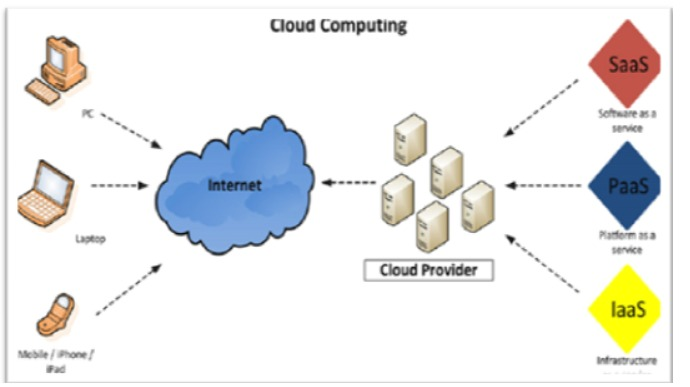
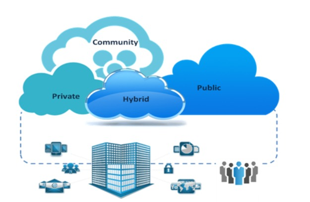

# Services Web Amazon

## Qu'est-ce que le cloud computing ?

+ Le `cloud computing` est la fourniture à la demande de puissance de calcul, de stockage de base de données, d'applications et d'autres ressources informatiques via une plate-forme de `services cloud` via `Internet` avec une `tarification`.

### Quels sont les différents types de clouds ?

+ Nous avons trois types `d'infrastructure cloud`

    + **Cloud Privé**
  
        + `L'infrastructure cloud` est prévue pour un usage exclusif par une seule organisation comprenant plusieurs consommateurs (par exemple, des unités commerciales).
        + Il peut être détenu, géré et exploité par l'organisation, un tiers ou une combinaison de ceux-ci, et il peut exister sur site ou hors site.
    
    + **Cloud Public**
  
        + `L'infrastructure cloud` est prévue pour une utilisation ouverte par le grand public.
        + Il peut être détenu, géré et exploité par une entreprise, une université ou un organisme gouvernemental, ou une combinaison de ceux-ci.
        + Il existe chez le fournisseur cloud.

    + **Cloud Hybride**
  
        + `L'infrastructure cloud` est une composition de deux ou plusieurs infrastructures cloud distinctes (privées, communautaires ou publiques) qui restent des entités uniques, mais sont liées entre elles par une technologie standardisée ou propriétaire qui permet la portabilité des données et des applications(par exemple, cloud bursting pour l'équilibrage de charge entre des clouds).

# Modèles de services cloud :

### Logiciel En Tant Que Service (SaaS) :

+ Le `Logiciel En tant Que Service` vous fournit un produit complet qui est exécuté et géré par le fournisseur de services.
+ Dans la plupart des cas, les personnes faisant référence à `Software as a service` font reférence aux applications des utilisations finaux.
+ Avec une offre `SaaS`, vous n'avez pas à penser à la manière dont le service est maintenu ou à la manière dont l'infrastructure sous-jacente est gérée, il vous suffit de penser à la façon dont vous utiliserez ce logiciel en particulier.
+ Un exemple de courant d'application `SaaS` est la messagerie Web où vos pouvez envoyer et recevoir des e-mails sans avoir gérer les ajouts de fonctionnalités au produit de messagerie ou à gérer les serveurs et les systèmes d'exploitation sur lesquels le programme de messagerie s'exécute.
+ Exemple : `Google Apps, Salesforce, Workday, Concur, Citrix, Cisco WebEx`.

### Plateforme En Tant Que Service

+ Les `Plateformes En Tant Que Service` éliminent le besoin pour les organisations de gérer l'infrastructure sous-jacente (généralement le matériel et les systèmes d'exploitation) et vous permettent de vous concentrer sur le déploiement et la gestion  
