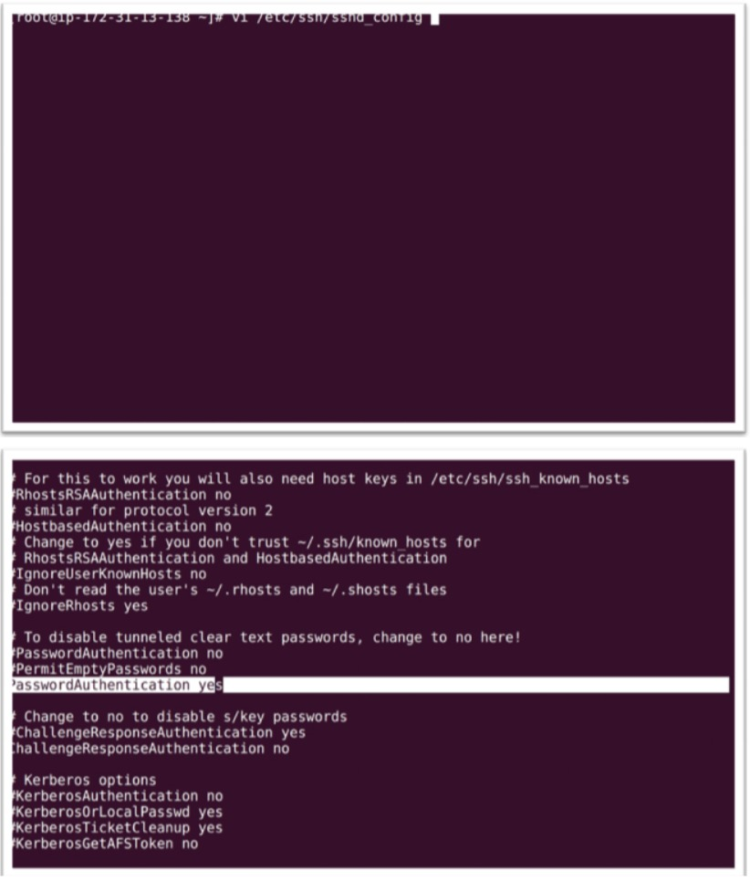

# Services Web Amazon

## Qu'est-ce que le cloud computing ?

+ Le `cloud computing` est la fourniture à la demande de puissance de calcul, de stockage de base de données, d'applications et d'autres ressources informatiques via une plate-forme de `services cloud` via `Internet` avec une `tarification`.

### Quels sont les différents types de clouds ?

+ Nous avons trois types `d'infrastructure cloud`

    + **Cloud Privé**
  
        + `L'infrastructure cloud` est prévue pour un usage exclusif par une seule organisation comprenant plusieurs consommateurs (par exemple, des unités commerciales).
        + Il peut être détenu, géré et exploité par l'organisation, un tiers ou une combinaison de ceux-ci, et il peut exister sur site ou hors site.
    
    + **Cloud Public**
  
        + `L'infrastructure cloud` est prévue pour une utilisation ouverte par le grand public.
        + Il peut être détenu, géré et exploité par une entreprise, une université ou un organisme gouvernemental, ou une combinaison de ceux-ci.
        + Il existe chez le fournisseur cloud.

    + **Cloud Hybride**
  
        + `L'infrastructure cloud` est une composition de deux ou plusieurs infrastructures cloud distinctes (privées, communautaires ou publiques) qui restent des entités uniques, mais sont liées entre elles par une technologie standardisée ou propriétaire qui permet la portabilité des données et des applications(par exemple, cloud bursting pour l'équilibrage de charge entre des clouds).

# Modèles de services cloud :

### Logiciel En Tant Que Service (SaaS) :

+ Le `Logiciel En tant Que Service` vous fournit un produit complet qui est exécuté et géré par le fournisseur de services.
+ Dans la plupart des cas, les personnes faisant référence à `Software as a service` font reférence aux applications des utilisations finaux.
+ Avec une offre `SaaS`, vous n'avez pas à penser à la manière dont le service est maintenu ou à la manière dont l'infrastructure sous-jacente est gérée, il vous suffit de penser à la façon dont vous utiliserez ce logiciel en particulier.
+ Un exemple de courant d'application `SaaS` est la messagerie Web où vos pouvez envoyer et recevoir des e-mails sans avoir gérer les ajouts de fonctionnalités au produit de messagerie ou à gérer les serveurs et les systèmes d'exploitation sur lesquels le programme de messagerie s'exécute.
+ Exemple : `Google Apps, Salesforce, Workday, Concur, Citrix, Cisco WebEx`.

### Plateforme En Tant Que Service (Paas)

+ Les `Plateformes En Tant Que Service` éliminent le besoin pour les organisations de gérer l'infrastructure sous-jacente (généralement le matériel et les systèmes d'exploitation) et vous permettent de vous concentrer sur le déploiement et la gestion de vos applications.
+ Cela vous aide à être plus efficace car vous n'avez pas à vous soucier de l'approvisionnement en ressources, de la planification des capacités, de la maintenance des logiciels, des correctifs ou de toute autre tâche lourde et indifférente impliqué dans l'exécution de votre application.
+ Example : `Beanstalk`

### Infrastructure En Tant Que Service (IaaS)

+ L' `Infrastructure En Tant Que Service`, parfois abrégé en `IaaS`, contient les éléments de base de l'informatique dans le `cloud` et donne généralement accès aux fonctionnalités réseau, aux ordinateurs (virtuels ou sur matériel dédié) et l'espace de stockage de données. 
+ L' `Infrastructure En Tant Que Service` vous offre le plus haut niveau de flexibilité et de contrôle de gestion sur vos ressources informatiques et est très similaire aux ressources informatiques et développeurs connaissent aujourd'hui.
+ Exemple : `AWS EC2, Microsoft Azure, Google Compute Engine, Joyent`.

# Avantages et inconvénients du cloud computing

+ Comme indiqué précédemment, `vagrant` est outil de ligne de commande et l'invite de commande `Windows` est tout simplement lente à exécuter des commandes `vagrant`.
+ Nous aurons donc besoin d'un meilleur utilitaire de ligne de commande, l'un d'eux est `Git Bash`.

+ **Avantages :**

    + `Mise en oeuvre facile :` l'hébergement `cloud` permet aux entreprises de conserver les mêmes applications et processus métier sana avoir à gérer les aspects techniques du `backend`. Facilement gérable via internet, une infrastructure `cloud` est accessible facilement et rapidement aux entreprises.
    + `Accessibilité :` accédez à vos données n'importe où et à tout moment. Une `infrastructure cloud Internet` maximise la productivité et l'efficacité de l'entreprise en garantissant que votre application est toujours accessible. Cela permet une collaboration et un partage faciles entre les utilisateurs situés à plusieurs endroits.
    + `Aucun matériel requis :` puisque tout sera hébergé dans le `cloud`, un centre de stockage physique nécessaire. Cependant, une sauvegarde pourrait être utile en cas de sinistre qui pourrait stagner la productivité de votre entreprise.
    + `Coût par personne :` les frais généraux technologiques sont réduits au minimum grâce aux services d'hébergement `cloud`, permettant aux entreprises d'utiliser le temps et les ressources supplémentaires pour améliorer l'infrastructure de l'entreprise.

+ **Désavantage :**

    + `Vous n'avez plus le contrôle :` lorsque vous déplacez des services vers le cloud, vous transmettez vos données et informations. Les entreprises qui disposent d'un personnel informatique interne ne seront pas en mesure de gérer elles-mêmes les problèmes. Cependant, `Stratosphère Networks` dispose d'un service d'assistance en direct 24h/24 et 7j/7 qui peut résoudre immédiatement tout problème.
    + `Il se peut que vous ne disposiez pas de toutes les fonctionnalités` : tous les services `cloud` ne sont pas identiques. Certains fournisseurs de cloud ont tendance à proposer des versions limitées et à activer uniquement les fonctionnalités les plus populaires, de sorte que vous ne recevrez peut-être pas toutes les fonctionnalités ou personnalisations souhaitées. Avant de vous inscrire, assurez-vous de savoir ce que propose votre fournisseur de services cloud.
    + `Cela ne signifie pas que vous devez supprimer les serveurs :` vous avez peut-être moins de serveurs à gérer, ce qui signifie moins de tâches à gérer pour votre personnel. Même s'il peut sembler coûteux de disposer de centres de données et d'une infrastructure `cloud`, la redondance est essentielle pour la sauvegarde et la restauration.
    + `Pas de redondance :` un serveur `cloud` n'est ni redondant ni sauvegardé. Comme la technologie peut échouer ici et là, évitez de vous brûler en souscrivant à un plan de redondance. Même s'il s'agit d'un coût supplémentaire, dans la plupart des cas, cela en vaudra la peine.
    + `Problèmes de bande passante :` pour des performances idéales, les clients doivent planifier en conséquence et en pas regrouper de grandes quantités de serveurs et de périphériques de stockage dans un petit ensemble de centres de données.

## Qu'est-ce qu'AWS ?

+ `Amazon Web Services (AWS)` est une plate-forme de services cloud sécurisée offrant une puissance de calcul, un stockage de base de données, une diffusion de contenu et d'autres fonctionnalités pour aider les entreprises à évoluer et à se développer.
+ Découvrez comment des millions de clients exploitent actuellement les produits et solutions `Cloud AWS` pour créer des applications sophistiquées offrant une flexibilité, une évolutivité et une fiabilité accrues.

## Régions et zones de disponibilité

+ Les `ressources de cloud computing d'Amazon` sont hébergées dans plusieurs emplacements dans le monde.
+ Ces emplacements sont composés de régions et zones de disponibilité.
+ Chaque région est une zone géographique distincte. Chaque région possède plusieurs emplacements isolés appelés `zones de disponibilité`.
+ Pour la plupart des `services AWS` que vous utilisez, vous serez invité à sélectionner une région dans laquelle vous souhaitez déployer le service.
+ Chaque région est complètement isolée des autres et fonctionne également de manière indépendante.
+ Une liste des régions et des zones de disponibilité et donnée ci-dessous à titre de référence :

+ Chaque région est divisée en une ou plusieurs `zones de disponibilité (AZ)` et prononcée comme `AZees`.
+ Une `AZ` est un emplacement isolé à l'intérieur d'une région. 
+ Les `AZ` sont constitués d'un ou plusieurs centres de données physiques qui hébergent les services `AWS`.
+ Tout comme pour les régions, même les `AZ` ont des codes correspondants pour les identifier. Il s'agit généralement de noms de régionaux suivis d'une valeur numérique.
+ Par exemple, si vous sélectionnez et utilisez `us-east-1`, qui est la région de Virginie du Nord, les `AZ` seront repertoriés comme `us-esat-1b, us-east-1c, us-east-1d, etc`.
+ Les `AZ` sont très importants du point de vue de la conception et du déploiement. En tant que centres de données, ils sont plus que capables de pannes et de temps d'arrêt.
+ Il est donc toujours recommandé de répartir vos ressources sur plusieurs zones de disponibilité et de concevoir vos applications de manière à ce qu'elles puissent rester disponibles même si une zone de disponibilité est complètement hors ligne.
+ Un point important à noter ici est qu'`AWS` vous fournira toujours les services et produits en tant que client; cependant, il est de votre devoir de concevoir et de distribuer vos applications de manière à ce qu'elles ne subissent aucune panne ou panne potentielle.
+ La structure ci-dessous représente les `régions` et leurs `zones de disponibilité`.

+ `AMAZON RDS` vous offre la possibilité de placer des ressources, telles que des instances et des données, à plusieurs emplacements.

+ **Note :**

    + `AWS` ne réplique pas automatiquement les ressources entre les régions. C'est à l'utilisateur final de mettre en place le `processus de réplication`.

# Services AWS

+ `AWS` nous fournit de nombreux services que nous pouvons utiliser pour construire notre infrastructure sur le `Cloud AWS`.
+ Notre objectif en matière de `DevOps` sera d'exploiter les services `SysOps` fournis par `AWS`.
+ Il existe de nombreux autres services consommés directement par les développeurs et ce n'est pas l'objectif de ce livre.
+ `AWS` propose également certains services liés au `DevOps`, tels que `codecommit, codedeploy, cloudformation, etc ..`, qui seraient hors de portée de ce livre.
+ Dans ce chapitre, nous examinerons les services `AWS` mentionnés ci-dessous.

  + `IAM`
  + `EC2`
  + `VPC`
  + `S3`
  + `RDS`
  + `Beanstalk`
  + `Cloudwatch`
  + `Route53`

# IAM

#### A) Sécurité, identité et conformité :

+ `AWS Identity and Access Management (IAM)` est un service `Web` qui permet aux clients `Amazon Web Services (AWS)` de gérer les utilisateurs et les autorisations des utilisateurs dans `AWS`.
+ Le service est destiné aux organisations comptant plusieurs ou systèmes dans le `Cloud` qui utilisent des produits `AWS` tels qu'`Amazon EC2, Amazon SimpleDB et AWS Management Console`.
+ Avec `IAM`, vous pouvez gérer de manière centralisée les utilisateurs, les informations d'identification de sécurité telles les `clés d'accès et les autorisations` qui contrôlent les ressources `AWS` auxquelles les utilisateurs peuvent accéder.

#### B) Création d'un utilisateur IAM :

+ Connectez-vous au compte `AWS => Services => IAM`

+ Sélectionner `users => Add user => username`

+ Sélectionnez l'une des options `Accès` par programmation (accès basé sur une clé `AWS-CLI`) ou `AWS Managment Console access`.

+ Si vous sélectionnez l'accès à `AWS Management Console`, vous devez sélectionner un mot de passe généré automatiquement ou un mot de passe personnalisé.
+ Cliquer sur `Next Permissions` 

#### 1. Joindre la politique à l'utilisateur

+ Par défaut, les utilisateurs `IAM` ne sont pas autorisés à créer ou à modifier des ressources `Amazon EC2`, ni à effectuer des tâches à l'aide de l'`API Amazon EC2`. (Cela signifie qu'ils ne peuvent pas non plus le faire à l'aide d' `Amazon EC2 console ou CLI`).
+ Lorsque vous attachez une stratégie à un utilisateur ou à un groupe d'utilisateurs, elle autorise ou refuse aux utilisateurs l'autorisation d'effectuer les tâches spécifiées sur les ressources spécifiés.
+ Ainsi, lors de la création d'un utilisateur, nous devons attribuer les stratégies qui doivent être exécutées par un utilisateur particulier.
+ Il existe des stratégies prédéfinies dans `IAM`, nous pouvons attacher les stratégies existantes ou créer une nouvelle stratégie.
+ Ici, dans cet exemple, nous attachons un accès administrateur dans lequel l'utilisateur obtient toutes les autorisations d'administrateur.

+ Après avoir créé l'utilisateur, nous obtenons un fichier `download.csv`, qui contient les informations d'identification de l'utilisateur et l'`URL` pour se connecter à la console `AWS`.

#### Configuration de MFA

+ `AWS Multi-factor Authentification (MFA)` est une bonne pratique simple qui ajoute une couche de protection supplémentaire en plus de votre nom d'utilisateur et de votre mot de passe.
+ Avec `MFA` activé, lorsqu'un utilisateur se connecte à un site `Web AWS`, il lui sera demandé de saisir son nom d'utilisateur et son mot de passe (le premier facteur : ce qu'il connaît), ainsi qu'un code d'identification de son appareil `AWS MFA` (le deuxième facteur) - ce qu'ils ont).
+ Pris ensemble, ces multiples facteurs offrent une sécurité accrue pour les paramètres et les ressources de votre compte `AWS`.
+ Vous pouvez activer `MFA` pour votre compte `AWS` et pour les utilisateurs `IAM` individuels que vous avez crées sous votre compte.
+ `MFA` peut également être utilisé pour contrôler l'accès aux `API` du service `AWS`.

+ Cliquez sur `username`
+ Cliquez sur `Assigned MFA Service`

+ Téléchargez `Google Authenticator` sur votre smartphone.
+ Ouvrez `Google Authentificator`
+ Cliquez sur le symbole plus
+ Scannez le code-barres
+ Entrez le code d'authentification1
+ Entrez le deuxième code d'authentification

+ Utilisez `l'URL` en surbrillance pour que votre utilisateur se connecte au compte `AWS` avec l'utilisateur `IAM`.

# AMAZON EC2

+ `Amazon Elastic Compute Cloud (Amazon EC2)` est un `service Web` qui fournit une capacité de calcul sécurisée et redimensionnable dans le cloud.
+ Il est conçu pour faciliter le `cloud computing` à l'échelle du `Web` pour les développeurs.
+ L'interface de service Web simple d'`Amazon EC2` vous permet d'obtenir et de configurer de la capacité avec un minimum de frictions.
+ Il vous offre un contrôle total sur vos ressources informatiques et vous permet de fonctionner sur l'environnement informatique éprouvé `Amazon`.
+ `Amazon EC2` réduit le temps requis pour obtenir et démarrer de nouvelles instances de serveur à quelques minutes, ce qui vous permet d'adapter rapidement la capacité, la hausse comme à la baisse, à mesure que vos besoins informatiques évoluent.
+ `Amazon EC2` fournit aux développeurs les outils nécessaires pour créer des applications résilientes aux pannes et les isoler des scénarios de panne courants.

#### Avantages d'EC2

+ Informatique élastique à l'échelle du Web.
+ Entièrement isolé
+ Services d'hébergement cloud flexibles
+ Intégré
+ Fiable
+ Sécurisé
+ Peu coûteux
+ Facile à démarrer

#### Types d'instances Amazon EC2

+ `Amazon EC2` propose une large sélection de types d'instances optimisés pour s'adapter à différents cas d'utilisation.
+ Les types d'instances comprennent différentes combinaisons de capacité de processeur, de mémoire, de stockage et de réseau et vous offrent la flexibilité de choisir la combinaison de ressources appropriée pour vos applications.
+ Chaque type d'instance comprend une ou plusieurs tailles d'instances, vous permettant d'adapter vos ressources aux exigences de votre charge de taravail cible.

#### Différents types d'instances

+ **1. Usage général : t2, m4, m3**

**`T2`**

+ L'instance `T2` reçoit des crédits `CPU` en continu à un taux en fonction de la taille de l'instance.
+ Les instances `T2` accumulent des crédits `CPU` lorsqu'elles sont inactives et utilisent des crédits `CPU` lorsqu'elles sont actives.
+ Les instances `T2` constituent un bon choix pour les charges de travail qui n'utilisent pas la totalité du processeur de manière fréquente ou cohérente, mais ont parfois besoin d'éclater (par exemple, les serveurs Web, les environnements de développement et les bases de données).

**`M4`**

+ Les instances `M4` constituent la dernière génération d'instances à usage général.
+ Cette famille offre un équilibre entre les ressources de calcul, de mémoire et de réseau et constitue un bon choix pour de nombreuses applications.

**`M3`**
+ Cette famille comprend les types d'instances `M3` et fournit un équilibre entre les ressources de calcul, de mémoire et de réseau, et constitue un bon choix pour de nombreuses applications.

+ **2. Calcul optimisé : c4, c3**

**`C4`**

+ Les instances `C4` constituent la dernière génération d'instances optimisés pour le calcule, dotées des processeurs les plus performantes et du rapport `prix/performances` de calcul le plus bas d'`EC2`.

**`C3`**

+ Les instances `C3` vous fourniront les processeurs les plus performants et les performances de `calcul/prix` les plus basses par rapport à toutes autres instances `Amazon EC2`.
+ Les instances `C3` disposent également d'une mise en réseau améliorée et d'un stockage d'instance basé sur `SSD`.

+ **3. Mémoire optimisée : x1, r4, r3**

**`X1`**

+ Les instances `X1` sont optimisées pour les applications en mémoire à grande échelle de classe entreprise et ont le prix par `Gio de RAM` le plus bas parmi les types d'instances `Amazon EC2`.

**`R4`**

+ Les instances `R4` sont optimisées pour les applications gourmandes en mémoire et offrent un meilleur prix par `Gio de RAM que R3`.

**`R3`**

+ Les instances `R3` sont optimisés pour les applications gourmandes en mémoire et offrent un prix inférieur par `Gio de RAM`.

+ **4. Instances de calcul accéléré : p2, g2, f1**

**`G2`**
+ Les instances `G2` sont optimisés pour les applications gourmandes en graphiques.

**`F1`**

+ Les instances `F1` offrent une accélération matérielle personnalisable avec des réseaux prédiffusés programmables sur `site (FPGA)`.

+ **Stockage optimisé : I3, D2**

**`I3`**

+ Instances d'`E/S` élévées. Cette famille comprend les instances de stockages élévées qui fournissent un stockage d'instance soutenu par `SSD Non-Volatile Memory Express (NVMe)` optimisé pour une faible latence, des performances d'`E/S` aléatoires très élévées, un débit de lecture séquentiel élevé et fournissent des données d'`IOPS` élévées faible coût.

**`D2`**

+ Les instances `D2` disposent jusqu'à `48 To` de stockage local sur disque dur, offrent un débit de disque élevé et offrent le prix par débit de disque le plus bas sur `Amazon EC2`.

#### Tarification Amazon EC2

+ L'essai d'`Amazon EC2` est gratuit. Il existe quatre façons de payer pour les instances `Amazon EC2` : à la demande, instances réservées et instances ponctuelles.
+ Vous pouvez également payer pour des hôtes dédiés qui vous fournissent une capacité d'instance `EC2` sur des serveurs physiques dédiés à votre usage.

#### Ala demande : les instances à la demande sont recommandées pour :
+ Utilisateurs qui préfèrent le faible coût et la flexibilité d'`Amazon EC2` sans aucun paiement initial ni engagement à long terme.
+ Applications avec des charges de travail à court terme, pointues ou imprévisibles qui ne peuvent pas être interrompues.
+ Applications développées ou testées sur `Amazon EC2` pour la première fois.

**`Instances Spot` - `Les instances Spot Amazon EC2` vous permettent d'enchérir sur la capacité informatique `Amazon EC2` disponible jusqu'à 90% de réduction sur le prix à la demande.**

 

**Les instances ponctuelles sont recommandées pour :**

+ Applications avec une utilisation en régime permanent.
+ Applications pouvant nécessiter une capacité réservée.
+ Les clients qui peuvent s'engager à utiliser `EC2` sur une durée de `1 ou 3 ans` pour réduire leurs coûts informatiques totaux.

**`Hôtes dédiés` - Un `hôte dédié` est un serveur `EC2` physique dédié à votre usage. Les hôtes dédiés peuvent vous aider à réduire les coûts en vous permettant d'utiliser vos licences logicielles existantes liés au serveur, notamment Windows Server, SQL Server et SUSE Linux Enterprise Server.**

+ Peut être acheté à la demande (toutes les heures)
+ Peut être acheté sous forme de reservation jusqu'à 70% de réduction sur le prix à la demande.

#### Groupes de sécurité :

+ Le `groupe de sécurité` agit comme un `pare-feu` pour les instances `Amazon EC2` associées, contrôlant à la fois le traffic entrant et sortant au niveau de l'instance.
+ Lorsque vous lancez une instance, vous associez un ou plusieurs `groupe de sécurité` à l'instance.
+ Vous ajoutez des `règles` à chaque `groupe de sécurité` qui autorisent le trafic vers ou depuis ses instances associées.
+ Vous pouvez modifier les règles d'un groupe de sécurité à tout moment; les nouvelles règles sont automatiquement appliquées à toutes les instances associées au groupe de sécurité.
+ Lorsque nous décidons d'autoriser automatiquement ou non le traffic à atteindre une instance, nous évaluons toutes les règles de tous les groupes de sécurité associés à l'instance.

#### Paire de Clés

+ `Amazon EC2` utilise la `cryptographie à clé publique` pour chiffrer et déchiffrer les informations de connexion.
+ La `cryptographie à clé publique` utilise une `clé publique` pour chiffrer une donnée, telle qu'un mot de passe, depuis le destinataire utilise une `clé privée`pour déchiffrer les données.
+ Les `clés publiques et privées` sont appelées `paire de clés`.
+ Pour vous connecter à votre instance, vous devez créer une paire de clés, spécifier le nom de la paire de clés lorsque vous lancez l'instance et fournir la clé privée lorsque vous vous connectez via `SSH`.
+ Avec les instances `Windows`, vous utilisez une `paire de clés` pour obtenir le mot de passe administrateur, puis vous connectez à l'aide de `RDP`.

#### Création d'une instance EC2.

+ `AWS Marketplace` contient différents types d'`Amazon Machine Images (AMI)` comme `Centos, Ubuntu, Amazon Linux, Windows, ... etc`.

    + Connectez-vous à `AWS Management Console` et configurez votre compte `root`
    + Lancez une instance `Amazon EC2`
    + Dans le tableau de bord d'`Amazon EC2`, sélectionnez `Lancer l'instance` pour créer et configurer votre machine virtuelle.
    + Configurer l'instance
    + Dans `AWS marketplace`, sélectionnez votre `AMI` requise (Ex : `Centos AMI`)

**Choisissez un type d'instance : dans l'assistant, choisissez un type d'instance, nous recommandons `t2.micro` (éligible au niveau gratuit)**

**Configurez les détails de l'instance avec tous les paramètres par défaut.**

**Groupe de sécurité : Nous devons créer un groupe de sécurité afin de contrôler le trafic vers votre instance.**

**Lancer l'instance : Vérifiez la configuration de votre instance et choisissez `Lancer`**

**Créer une paire de clés : sélectionnez `Créer une nouvelle paire de clés` et attribuer un nom. Le fichier de paire de clés (.pem) sera téléchargé : automatiquement - enregistrez-le dans un endroit sûr car nous utiliserons plus tard ce fichier pour nous connecter à l'instance. Enfin, choisissez `Lancer les instances` pour terminer la configuration.**

**Connectez-vous à l'instance `EC2`, passez à l'utilisateur `root`, créez un utilisateur et ouvrez le fichier `sudoers` comme indiqué ci-dessous :**

**Recherchez l'entrée pour l'utilisateur `root`, en dessous, ajoutez une entrée similaire pour votre utilisateur.**

**Ouvrez le fichier `SSHD_CONFIG` pour activer l'authentification par mot de passe**

**Redémarrez le service `SSHD`. Et maintenant vous pouvez vous connecter à votre utilisateur.**

# AMAZON EBS

+ 