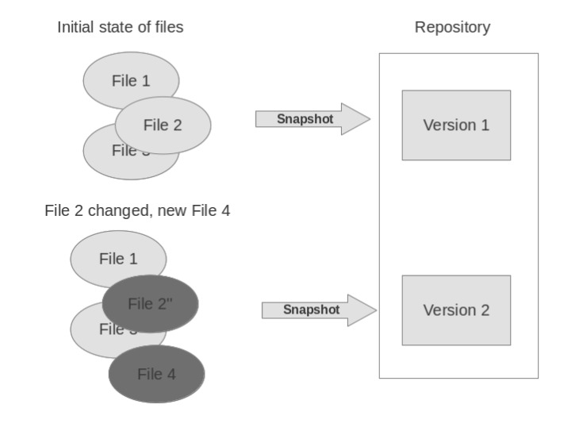
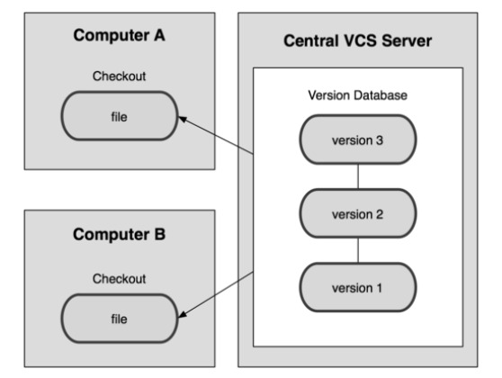
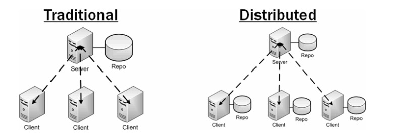
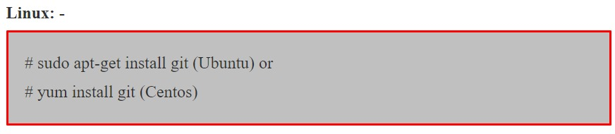
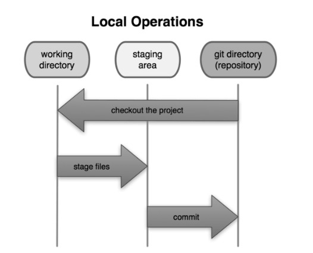
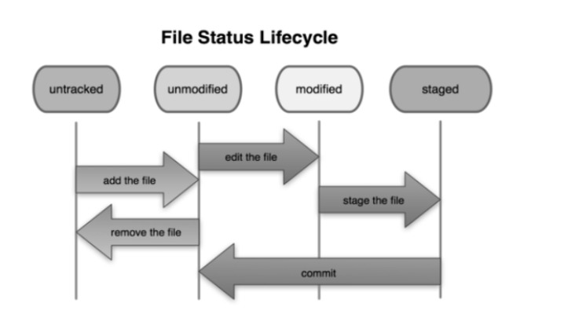

# **Systèmes de Contrôle de Versions (VCS)**

## **Introduction au VCS**

+ Quel que soit le modèle suivi par les développeurs pour créer des logiciels, les développeurs écriront ou intégreront de nombreux codes dans leurs logiciels.
+ Tout ce code provenant des différents développeurs de l'équipe doit être fusionné dans un endroit centralisé, qui peut grader une trace de toutes les versions de leur code, maintenir le code et même revenir en arrière en cas de problème.
+ Le **système de contrôle de version (ou contrôle de révision ou contrôle de source)** consiste à gérer plusieurs versions de documents, programmes, sites web, etc.
+ Un **système de contrôle de version(VCS)** vous permet de suivre l'historique d'une collection de fichiers.

+ Les systèmes de contrôle de version sont une catégorie d'outils logiciels qui aident une équipe à gérer les modifications apportées au code source au fil du temps.
+ Le logiciel de contrôle de version garde une trace de chaque modification du code dans un type spécial de base de données.
+ Si une erreur est commise, les développeurs peuvent en arrière et comparer les versions antérieures du code pour aider à corriger l'erreur tout en minimisant les perturbations pour tous les membres de l'équipe.
+ Le contrôle de version protège le code source à la fois des catastrophes et de la dégradation fortuite due aux erreurs humaines et aux conséquences involontaires.

+ Les développeurs de logiciels travaillant en équipe écrivent du code continuellement du nouveau code source et modifient le code source existant.
+ Le code d'un projet, d'une application ou d'un composant logiciel est généralement organisé dans une structure organisée dans une structure de dossiers ou une  `arborescence de fichiers`.
+ Un développeur de l'équipe peut travailler sur une nouvelle fonctionnalité tandis qu'un autre développeur corrige un bogue sans rapport en modifinat le code, chaque developpeur peut apporter ses modifications dans plusieurs parties de l'arborescence des fichiers. 

#### **Quand Utiliser VCS**

+ Avez-vous déjà:

    <ol>
        <li>Apporté une modification au code, réalisé que c'était une erreur et souhaité revenir en arrière ?</li>
        <li>Vous avez perdu du code ou vous avez eu une sauvegarde trop ancienne ?</li>
        <li>Vous avez dû gérer plusieurs versions d'un produit</li>
        <li> Vous vouliez voir la différence entre deux (ou plusieurs) versions de votre code</li>
        <li>Vous vouliez prouver qu'une modification particulière a cassé ou corrigé un morceau de code</li>
        <li>Vous vouliez revoir l'historique d'un code</li>
        <li>Vous souhaitez soumettre une modification au code de quelqu'un d'un autre ?</li>
        <li>Vous vouliez partager votre code ou laisser d'autres personnes travailler sur votre code</li>
        <li>Vous vouliez savoir quelle quantité de travail est effectué, et où, quand et par qui ?</li>
        <li>Vous vouliez expérimenter une nouvelle fonctionnalité sans interférer avec le code fonctionnel</li>
    </ol>
  
+ Dans ces cas, et sans doute dans d'autres, un système de contrôle de version devrait vous faciliter la vie.

## **Terminologies VCS**

#### **Configuration De Base**

<ol>
    <li><b>Dépôt (repo)</b> : La base de données des fichiers</li>
    <li><b>Serveur</b> : l'ordinateur</li>
    <li><b>Client</b> : l'ordinateur qui se connecte au dépôt</li>
    <li><b>Ensemble de travail/Copie de travail</b> : votre répertoire local de fichiers, dans lequel vous apportez des modifications</li>
    <li><b>Trunk/Main</b> : emplacement principal du code dans le dépôt. Considérez le code comme un arbre généalogique : le tronc est la ligne principale</li>
</ol>

#### **Actions Basiques**

<ol>
    <li><b>Add/Push</b> : placez un fichier dans le dépôt pour la première fois, c'est-à-dire commencez à le suivre avec le contrôle de version</li>
    <li><b>Revision</b> : sur quelle version se trouve un fichier(v1, v2, v3)</li>
    <li><b>Head</b>La dernière révision du dépôt</li>
    <li><b>Check out/Pull/Fetch(Extraire/Extraire/Récupérer)</b> : Téléchargez un fichier à partir du dépôt</li>
    <li><b>Check in/Push(Archiver/Push)</b>Téléchargez un fichier dans le référentiel(s'il a changé).Le fichier reçoit un nouveau numéro de version </li>
    <li><b>Check In Message(Message d'enregistrement)</b>: un court message décrivant ce qui a été modifié</li>
    <li><b>Changelog/History</b> Une liste des modifications apportées à un fichier depuis sa création</li>
    <li><b>Update/Sync</b>: synchronisez vos fichiers avec les dernières versions du référentiel. Cela vous permet de récupérer les dernières versions de tous les fichiers.</li>
    <li><b>Revert</b>: supprimez vos modifications locales et rechargez la dernière à partir du référentiel.</li>
</ol>

#### **Actions avancées**

<ol>
    <li><b>Branch</b>: créez une copie séparée d'un fichier/dossier pour un usage privé(correction de bogues, tests, etc). <b>Branch</b> est à la fois un verbe (branchez le code) et un nom (dans quelle branche se trouve t-il ?) </li>
    <li><b>Diff/Change/Delta</b> : Trouver les différentes entre deux fichiers. </li>
    <li><b>Merge(or patch)</b>: Appliquez les modifications d'un fichier à un autre, pour le mettre jour. Par exemple, vous pouvez fusionner des fonctionnalités d'une branche dans une autre. (Chez microsoft, cela s'appelait Reverse integrate et forward Integrate)</li>
    <li><b>Conflict</b>: lorsque des modifications en attente dans un fichier se contredisent (les deux modifications ne peuvent pes être appliquées)</li>
    <li><b>Resolve</b>: corriger les modifications qui se contredisent et archiver la version correcte</li>
    <li><b>Locking</b>: prendre le contrôle d'un fichier afin que personne d'autre ne puisse le modifier jusqu'à ce que vous le déverrouillez. Certains systèmes de contrôle de version l'utilisent pour éviter les conflits. </li>
</ol>

## **Types de contrôle de version**

#### **Systèmes de contrôle de version localisés**

+ Un `système de contrôle de version localisé` conserve des copies locales des fichiers. Cette approche peut être aussi simple que de créer une copie manuelle des fichiers pertinents.

#### **Systèmes de contrôle de version centralisés**
+ Un système de contrôle de version centralisé fournit un composant logiciel serveur qui stocke et gère les différentes versions des fichiers.
+ Un développeur peut copier (extraire) une certaine version du serveur central sur son ordinateur individuel. Par exemple: `CVS, SVN`, etc.

+ Dans `Subversion, CVS, Perforce, etc`. Un référentiel de serveur central (repo) contient la `copie officielle` du code.
    + Le serveur conserve le seul historique des versions du dépôt.
+ Vous en faites des `extractions` sur votre copie locale.
    + Vous apportez des modifications locales
    + vos modifications ne sont pas versionnés
+ Lorsque vous avez terminé, vous vous enregistrez sur le serveur.
  + votre enregistrement incrémente la version du dépôt.

#### **Systèmes de Contrôle de version distribués**
+ Dans un système de contrôle de version distribué, chaque utilisateur dispose d'une copie complète d'un réfréentile sur son ordinateur individuel.
+ Les deux approches présentent l'inconvénient d'avoir un seul point de défaillance.
+ Dans un système de contrôle de version localisé, il s'agit de l'ordinateur et dans un système de contrôle de version centralisé, il s'agit de la machine serveur.
+ Les deux systèmes rendent également plus difficile le travail en parallèle sur différents fonctionnalités.
+ Par exemple: `Git, Mercurial, etc`.

## **Systèmes de contrôle de version célèbres**

#### **CVS**
+ `CVS` pourrait très bien être le point de départ des systèmes de contrôle de version.
+ `CVS` est fondamentalement la norme ici et est utilisé à peu près partout - cependant la base des codes n'est pas aussi riche en fonctionnalités que d'autres solutions telles que`SVN`.
+ L'un des avantages de `CVS` est qu'il n'est pas trop difficile à apprendre.
+ Il est livré avec un système simple qui garantit que les revisions et les fichiers sont tenus à jour.
+ Compte tenu des autres options, `CVS` peut considérer comme une forme de technologie plus ancienne, car il existe depuis un certain temps et reste incroyablement utile pour les administrateurs systèmes qui souhaitent sauvegarder et partager des fichiers.

#### **SVN ou Subversion**
+ `SVN`, ou `Subversion` comme on l'appelle parfois, est généralement le système de contrôle de version le plus largement adopté.
+ La plupart des formes de projets open source utiliseront `Subversion` car de nombreux autres grands produits tels que `Ruby, Python, Apache` et bien d'autres l'utilisent également. 
+ `Google Code` utilise même `SVN` comme moyen de distribuer exclusivement du code.
+ En raison de sa popularité, de nombreux clients différents pour `Subversion` sont disponibles.
+ Si vous utilisez `Windows`, `Tortoisevn` peut être un excellent navigateur pour éviter, visualiser et modifier les bases de code `Subversion`.
+ Toutefois, si vous utilisez un `MAC`, `Versions` pourrait être votre client idéal.

#### **Git**

+ `Git` est considéré comme une étoile émergente plus récente et plus rapide en matière de systèmes de contrôle de version.
+ Developpé pour la première fois par le créateur du noyau `Linux`, `Linux Torvalds`, `Git` a commencé à prendre d'assaut la communauté du développement `Web` et de l'administration système, offrant une forme de contrôle très différente.
+ Ici, il n'existe pas de base de code centralisée unique à partir de laquelle le code peut être extrait, différentes branches sont chargées d'héberger différentes zones du code.
+ D'autres systèmes de contrôle de version, tels que `CVS` et `SVN` utilisent un contrôle centralisé, de sorte qu'une seule copie principale du logiciel soit utilisée.
+ En tant que système rapide et efficace, de nombreux administrateurs système et projets open source utilisent `Git` pour alimenter leurs référentiels.
+ Cependant, il convient de noter que `Git` n'est aps aussi facile à apprendre que `SVN` ou `CVS`, ce qui signifie que les débutants devront peut-être rester à l'écart s'ils ne sont pas prêt à investir du temps pour apprendre l'outil.

#### **Mercuriel**
+ Il s'agit encore d'une autre forme de système de contrôle de version, similaire à `Git`.
+ Il a été conçu initialement comme une source pour des programmes de développement plus importants, souvent en dehors de la portée de la plupart des administrateurs système, des développeurs `Web` indépendants et des concepteurs.
+ Cependant, cela ne signifie pas que les petites équipes et les individus ne peuvent pas l'utiliser.
+ `Mercurial` est une application très rapide et efficace.
+ Les créateurs ont conçu le logiciel avec la performance comme fonctionnalité principale.
+ En plus d'être très évolutif et incroyablement rapide, `Mercurial` est système beaucoup plus simple à utiliser que des éléments `Git`, ce qui est l'une des raisons pour lesquelles certains administrateurs système et développeurs l'utilisent.
+ Il n'y a pas beaucoup de choses à apprendre et les fonctions sont moins compliqués et plus comparables à celles des autres systèmes `CVS`.
+ `Mercurial` est également accompagné d'une interface Web et de diverses documentations complètes qui peuvent vous aider à mieux le comprendre.

#### **Bazar**

+ Semblable à `Git` et `Mercurial`, `Bazar` est un système de contrôle de version distribué, qui offre également une expérience utilisateur exceptionnelle et conviviale.
+ `Bazar` est unique car il peut être déployé soit avec une base de code centrale, soit en tant que base de code distribuée.
+ Il s'agit du système de contrôle de version le plus polyvalent qui prend en charge différentes formes de flux de travail, du centralisé au décentralisé, et avec un certain nombre de variantes différentes reconnues partout.
+ L'une des plus grandes fonctionnalités de `Bazar` est que vous pouvez accéder à un niveau de contrôle très détaillé dans sa configuration.
+ `Bazar` peut être utilisé pour s'adapter à presque tous les scénarios, ce qui est incroyablement utile pour la plupart des projets et des administrateurs car il est si facile à adapter et à gérer.
+ Il peut être également être facilement intégré à projets déjà existants.
+ Dans le même temps, `Bazar` dispose d'une vaste communauté qui aide à la maintenance d'outils et de plugins tiers.

## **Qu'est-ce que Git**
+ Le système de contrôle de version moderne le plus utilisé dans le monde aujourd'hui est de loin `Git`.
+ `Git` est un projet open source mature et activement maintenu, initialement dévéloppé en 2005 par `Linus Torvalds`, le célèbre créateur du noyau d'exploitation `Linux`.
+ Un nombre impressionnant de projets s'appuient sur `Git` pour le contrôle de version, y compris des projets commerciaux ainsi qu'open source.
+ Les développeurs qui ont travaillé avec `Git` sont bien représentés dans le vivier de talents en développement de logiciels disponibles et il fonctionne bien sur un large éventail de systèmes d'exploitation et d'IDE(environnements de développement intégrés).
+ Ayant une architecture distribuée, `Git` est un exemple de `DVCS` (donc Distributed Version Control System).
+ Plutôt que de n'avoir qu'un seul emplacement pour l'historique complet des versions du logiciel, comme cela est courant dans les systèmes de contrôle de version autrefois populaires comme `CVS ou Subversion`(également connu sous le nom de `SVN`) dans `Git`, la copie de travail du code de chaque développeur est également un référentiel, qui peut contenir l'historique complet de toutes les modifications.
+ En plus d'être distribué, `Git` a été conçu dans un souci de performances, de sécurité et de flexibilité.

#### **Pourquoi Utiliser Git ?**
+ *C'est rapide*
+ *Vous n'avez pas besoin d'accéder à un serveur*
+ *Etonnamment bon pour fusionner les modifications simultanées.*
+ *Tout le monde l'utilise* 

### **Installez l'outil git sur votre système**

+ Site Web : 
    + https://git-scm.com/

**Les fenêtres**

+ Installez le logiciel `git`
    + https://git-scm.com/download/win
+ Accédez à la page de téléchargement de `git scm`, sélectionnez `Windows`.
+ Ouvrez `git` installable et suivez l'assistant d'installation, prenez tous les paramètres par défaut dans l'assistant.

+ **Linux**

### **Zones Git Locales et Workflow Git de base**

**Zones Git Locales**

+ Dans votre copie locale sur `git`, les fichiers peuvent être:
  
  + Dans votre dépôt local `(validés)`
  + Extrait et modifiés, mais pas encore validés `(copie de travail)`
  + Ou, entre les deux, dans une zone de **préparation**
  + Organisés les fichiers sont prêts à être validés
  + Une validation enregistre un instantané de l'état de toutes les étapes.

#### **Flux de Travail Git De Base**

+ Modifiez les fichiers dans votre repertoire de travail.
+ Mettez en scène les fichiers, en ajoutant des instantanés de ceux-ci à votre zone de préparation.
+ `commit`, qui prend les fichiers dans la zone de transit et stocke cet instantané de manière permanente dans votre repertoire `Git`.

### **Configuration initiale de Git**

+ Comme vous l'avez lu brièvement dans `Mise en route`, vous pouvez spécifier les paramètres de configuration de `Git` avec la commande `git config`.
+ L'une des premières choses que vous avez faites a été de configurer votre nom et votre adresse e-mail:

<ol>
    <li>Configuration au niveau du système</li>
    <li>Configuration globale/utilisateur</li>
    <li>Configuration au niveau du référentiel/local</li>
</ol>

#### **Configuration au Niveau du Système**

+ La configuration au niveau du système de 