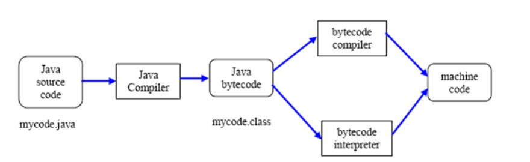

<u><h1>Maven</h1></u>

 

<h2>Qu'est-ce que Maven ?</h2>

+ `Apache Maven` est un outil de gestion et de comprehension de projets logiciels basés sur `Java`.
+ Basé sur le modèle Objet de projet(`POM`). 
+ `Maven` peut gérer la construction, le reporting et la documentation d'un projet à partir d'une information centrale.
+ `Maven` fournit un cadre complet de cycle de vie de build pour la gestion de projet.
+ L'équipe de développement peut automatiser l'infrastructure de build pour un projet en un rien de temps, car `Maven` utilise une disposition de repertoire standard et un cycle de vie de build par défaut.
+ En résumé, `Maven` simplifie et standardise le processus de construction de projet.
+ Il gère de manière transparente la compilation, la distribution, la collaboration en équipe et d'autres tâches.
+ `Maven` augmente la réutilisation et prend en charge la plupart des tâches liées à la construction.

<h3>1) Processus de Construction</h3>

+ Le `Build`est processus qui couvre toutes les étapes nécessaires pour céer un produit livrable de votre logiciel en préproduction et en production. Dans le monde Java, cela inclut généralement :

    + 1. La génération de la source
    + 2. Compilation des sources
    + 3. Exécuter des tests (tests unitaires, tests d'intégration,etc).
    + 4. Emaballage (en pot, war, ejb-jar, ear).
    + 5. Exécution de contrôle de santé (analyseurs statiques comme `Checkstyle`, `Findbugs`, `PMD`, couverture de test, etc).
    + 6. Générer des rapports
  
+ Un `processus de build` défini une partie essentielle de tout cycle de développement car il permet de combler l'écart entre les environnements de développement, d'intégration, de test de production.
+ Un `processus de build` à lui seul accélérera la migration des logiciels d'un environnement à un autre.
+ Il supprime également de nombreux problèmes liés à la compilation, au chemin de classe ou aux propriétés qui côutent du temps et de l'argent à de nombreux projets.

<h3>2) Qu'est-ce qu'un outil de Construction ?</h3>

+ Un `outil de build` est outil qui automatise tout ce qui concerne la construction du projet logiciel.
+ La construction du projet logiciel comprend généralement une ou plusieurs de ces activités :

    + Générer du code source (si du code généré automatiquement est utilisé dans le projet).
    + Générer de la documentation du code source.
    + Compilation du code source.
    + Conditionnement du code compilé dans les fichiers `JAR ou ZIP`.
    + Installation du code packagé sur un serveur, dans un référentiel ou ailleurs.
  
+ Tout projet logiciel donné peut comporter plus d'activités que celles nécessaires à la création du logiciel fini.
+ De telles activités peuvent normalement être connectées à un outil de construction, de sorte que ces activités peuvent également être automatisés.

 

+ L'avantage de l'automatisation de du processus de création est que vous `minimisez le rique que des humains commettent des erreurs lors de la création du logiciel`.
+ De plus un outil de création automatisé est généralement plus rapide qu'un humain effectuant les mêmes étapes manuellement.

<h3>3) Comprendre le problème Courant Sans Maven</h3>

+ Nous sommes confrontés à de nombreux problèmes lors du développement du projet. Ils sont discutés ci-dessous :

    + Ajout d'un ensemble de fichiers `JAR` et de dépendances dans chaque projet : Dans le cas des frameworks `Struts, Spring, Hibernate`, nous devons ajouter un ensemble de fichiers `JAR` dans chaque projet. Il doit également être dans toutes les dépendances des `jar`.
    + Créer et maintenir la bonne structure de projet. Nous devons créer la bonne structure de projet dans le `servlets, struts, etc`, sinon elle ne sera pas exécutée.
    + Construire et déployer le projet : Nous devons construire le projet pour qu'il puisse fonctionner.

<h3>Compilation Et Exécution</h3>
  
+ `La compilation et l'éxécution d'un programme Java` se déroulent en deux étapes.
+ Pendant la phase de compilation `Java` compile le code source et génère du `bytecode`.
+ Ce `bytecode` intermédiaire est enregistré sous la forme d'un fichier `.class`.
+ Dans la deuxième phase, la `machine virtuelle Java (JVM)`, également appelée `interpréteur Java`, prend le `.class` et génère une sortie en exécutant le `bytecode`.

<u><h2>Divers Outils de Construction Disponibles :</h2></u>

+ Pour `Java` :
    + `Ant`
    + `Maven`
    + `Gradle`
  
+ Pour le framework `.NET` :
  + `NAnt`

+ Pour `C#` : 
  + `MsBuild`

**Comparaisons Entre Quelques Outils De Construction Basé Sur Java :**

<u><h2>Ant Contre Maven Conte Gradle</h2></u>

<h3>Ant :</h3>

+ `Apache Ant` est une bibliothèque `Java` et un outil de ligne de commande dont la mission est de piloter les processus décrits dans les fichiers de construction en tant que cibles et points d'extension les uns des autres.
+ 

