<center><h1><u>Intégration Continue Avec Jenkins</u></h1></center>

+ Dans le chapitre précédent, nous avons vu comment le processus de développement est suivi par les développeurs pour créer des logiciels et même maintenir ces logiciels.
+ Ainsi, lorsque les développeurs écrivent du code pour créer des logiciels, ils fusionnent également tout ce code dans un référentiel centralisé ou un système de contrôle de version comme `Github`.
+ Ce code est transféré dans les référentiels plusieurs par jour, et au fil du temps, tout le code est fusionné.
+ Les méthodes traditionnelles de développement de logiciels ne dictent pas la fréquence ou la fréquence à laquelle vous intégrez toutes les sources d'un projet.
+ Les programmeurs peuvent travailler séparément pendant des heures, des jours, voire des semaines sur la même source sans se rendre compte du nombre de conflits (et peut-être de bugs) qu'ils génèrent.


<center><h2><u>L'Intégration est Douloureuse.</u></h2></center>


+ Les équipes agiles produisent du code exploitable et robuste à chaque itération.
+ Tout ce code, s'il est construit et évalué renvoie de nombreux conflits, bugs et erreurs.
+ Les développeurs doivent résoudre ces conflits et problèmes avant de passer à l'itération suivante.
+ Plus les programmeurs partagent du code, plus cela devient problématique.
+ Pour ces raisons les équipes agiles choisissent donc souvent `L'Intégration Continue`.

<center><h2><u>Quelques Terminologies.</u></h2></center>
<br/>

<h3>Code Source</h3>

+ Tout le code que les développeurs écrivent pour créer le logiciel est appelé `Code Source`.

<h3>Le Processus De Construction</h3>

+ Il s'agit d'un processus par lequel le code source est converti en une forme autonome pouvant être exécutée sur un ordinateur.
+ Par exemple, un code source écrit pour développer un logiciel `Windows` une fois construit créera un fichier `.exe ou .msi`.
+ Un autre exemple, si un code `Java` est construit, il peut créer un fichier `.jar, .war, .ear`.
+ Ce logiciel déployable est appelé `Artefact`. 
+ Le code peut être empaqueté et déployé manuellement.
+ Mais il existe des outils de construction qui facilitent la vie des développeurs lorsqu'il s'agit de créer des `artefacts` ou même de les déployer.
+ Ceux-ci sont appelés `Outils d'Automatisation de Construction`.

**Quelques outils de build**

+ `Ant`
+ `Maven`
+ `Gradle`
+ `MsBuild`
+ `Nant`


**Tests Unitaires**

+ `Les tests unitaires` vérifient que chaque unité de code (principalement des fonctions) fonctionne comme prévu.
+ Le développeur, en plus d'écrire du code, écrira les cas de test qui peuvent être exécutés au moment de la construction.
+ Certains cas de tests peuvent être générés automatiquement.
+ L'objectif de tests unitaires est d'isoler une session de code (unité) et de vérifier son exactitude.


<center><h2><u>Qu'est-ce que l'intégration continue</u></h2></center>

+ `L'Intégration Continue (CI)` est le processus d'automatisation de la création et des tests du code chaque fois qu'un membre de l'équipe valide des modifications dans le contrôle de version.
+ `CI` encourage les développeurs à partager leur code et leurs tests unitaires en fusionnant leurs modifications dans un référentiel de version partagé après chaque petite tâche terminée.
+ La validation du code déclenche un système de génération automatisé pour récupérer le dernier code du référentiel partagé et pour créer, tester et valider la branche principale complète (également appelée `tronc ou main`).


<h3>Le Problème</h3>

+ Les développeurs écriront le code et construiront dans un système local.
+ Uen fois que les développeurs ont testé le code et vérifié localement, ils le transfèrent vers un référentiel centralisé comme `github`.
+ De même, tous les développeurs transmettent leur code `VCS` plusieurs par jour.
+ Les développeurs travailleraient dans leurs propres silos ou grottes et continueraient à écrire le code jusqu'à ce qu'ils terminent une tâche particulière ou le projet.
+ Désormais, tout le code que les développeurs ont inséré dans le `VCS`, s'il est construit et testé, renverra de nombreux conflits, erreur à cause de laquelle la construction échouera.

<h3>La Solution</h3>

+ Pour contourner ce problème, chaque fois que le développeur envoie le code au `VCS`, il doit être récupéré, construit et testé par un serveur de `build` en même temps.

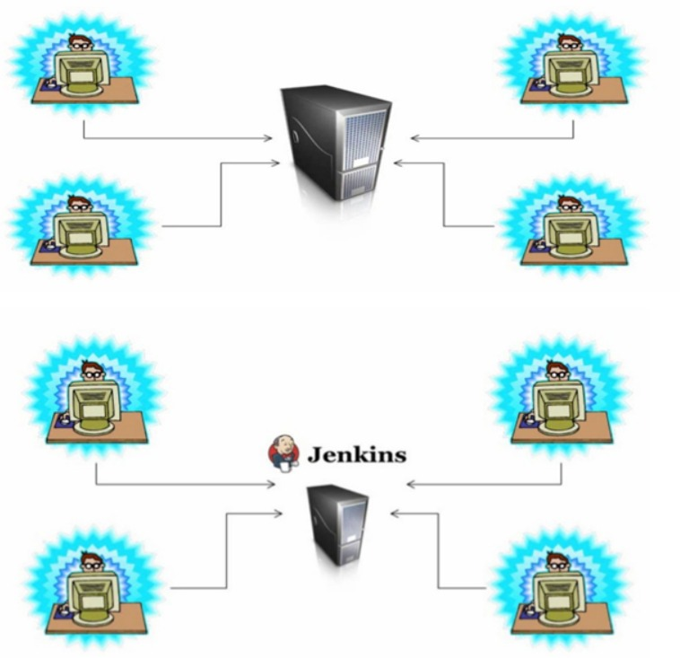

+ Ce processus répété plusieurs fois par semaine ou par jour ou quotidiennement une fois est appelé `Intégration Continue`.
+ Le code des développeurs est continuellement intégré, de sorte qu'à tout moment nous disposons d'un logiciel fonctionnel, s'il y a un problème dans le `processus de construction`, les développeurs seront informés par `e-mail` et résoudront le problème.


<center><h2><u>Qu'est-ce que Jenkins</u></h2></center>

+ `Jenkins` est un `serveur d'intégration continue` qui récupérer le dernier code de `VCS`, le construire, le tester et le notifier aux développeurs.
+ `Jenkins` peut faire bien plus de choses en plus d'être simplement un `serveur CI`.
+ Il s'appelait à l'origine `Hudson`, `Oracle Inc.`possède désormais `Hudson`
+ `Jenkins` est un projet open source écrit par `Koshuke Kawagauchi`.
+ `Jenkins` est un serveur d'applications `Web basé sur Java`.
+ Comme condition préalable, nous devons d'abord configurer `Java` sur des machines pour ex&cuter le serveur `Jenkins`.

<center><h2><u>Caractéristiques de Jenkins</u></h2></center>

<br/>

<h3>Open Source</h3>

+ Comme `Jenkins` est open source, il y a de nombreuses contributions partout dans le monde au logiciel `Jenkins`.
+ Il possède toutes les fonctionnalités les plus récentes et les plus intéressantes que les développeurs y intègrent régulièrement.

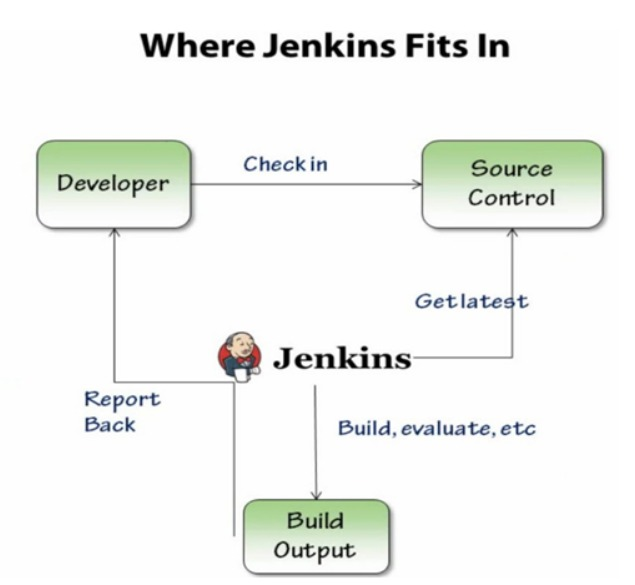


#### Extensible

+ `Jenkins` est livré avec de nombreux avantages, mais ce n'est tout simplement pas limité à cela, la principale puissance de `Jenkins` est son extensibilité qui peut être obtenue en y installant des `plugins`.
+ La communauté open source `Jenkins` a écrit des tonnes de `plugins`, ces `plugins` peuvent effectuer diverses tâches, comme l'intégration avec des outils ou des serveurs externes.

    + `Plugins VCS` - **git, svn, subversion, etc.**
    + `Plugins de construction` - **MAVEN, ANT, Msbuild, etc.**
    + `Plugins de notification` - **E-mail, chat, sms, etc.**
    + `Plugins cloud` - **Créez des instances cloud, déployez du code sur les services cloud, etc.**
    + `Plugins de test` - **Analyse de code, cas de test unitaire, analyse de code statique, etc.**

+ La liste des `plugins` est très longue, chaque fois nous voulons que `Jenkins` effectue certaines tâches, recherchez simplement ce plugin et la plupart du temps, vous trouverez quelque chose.
+ Par exemple, si vous souhaitez que `Jenkins` déploie `l'artefact Java` sur le serveur `Tomcat`, recherchez le plugin nommé `déployer sur un conteneur`.

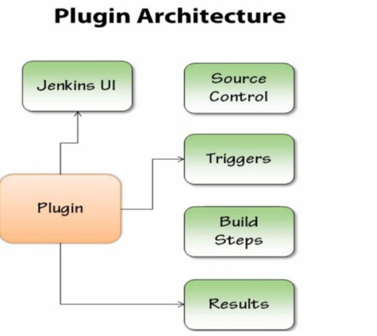


# Configuration Jenkins

+ `Jenkins` peut être installé sur `Windows, Linux ou MacOS`.
+ `Jenkins` a juste besoin d'un logiciel `Java` pour fonctionner.
+ Dans ce tutoriel, nous allons installer `Jenkins` sur un serveur `Ubuntu`.
+ Vous pouvez configurer `une machine virtuelle ou une instance cloud`.


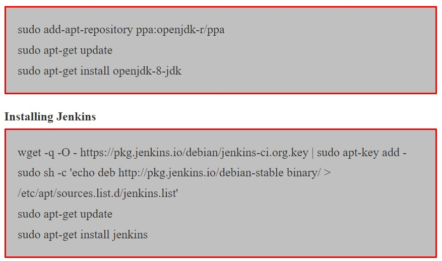


#### Installer le client Git et Maven sur le serveur Jenkins

+ Nous intégrerons `Jenkins` à `github` pour télécharger le code source.
+ Nous testons le code source `Java` qui sera construit par `Maven`, nous devons donc également installer `Maven` sur le serveur `Jenkins`.
+ Ce n'est pas une condition obligatoire pour exécuter `Jenkins` si vous n'utilisez pas `git et maven`.

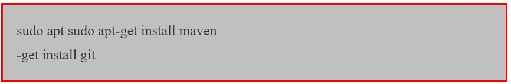


#### Accéder Jenkins

+ `Jenkins` s'exécute sur le port `8080` par défaut.
+ Ouvrez un navigateur et utiliser l'url ci-dessous : http://jenkinsIP:8080
+ `Jenkins` définira un mot de passe aléatoire pour déverrouiller la configuration de `Jenkins`.


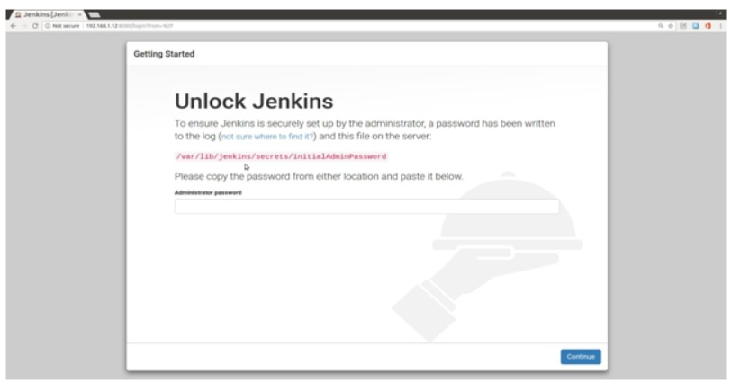

+ Le mot de passe serait stocké dans le fichier `/var/lib/jenkins/secrets/initialAdminPassword`.
+ Lisez ce fichier et obtenez le mot de passe. Utilisez ce mot de passe pour déverrouiller `Jenkins`.

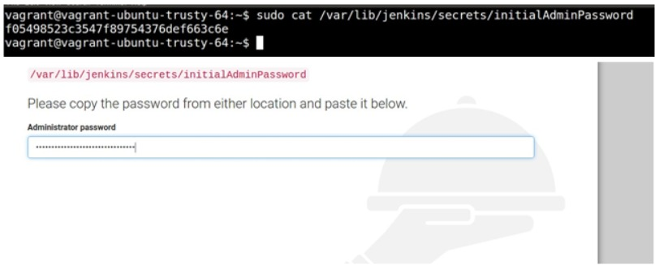

+ `Jenkins` vous offre la possibilité d'installer certains `plugins` suggérés au moment de l'installation.
+ Vous pouvez sélectionner des `plugins` individuels ou installer un groupe de plugins suggéré.
+ Sélectionnez le `plugin` suggéré pour le moment.

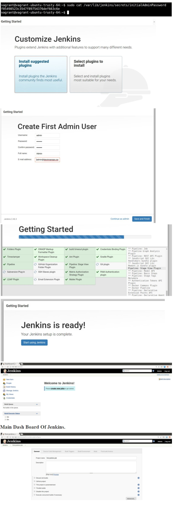


# Création du premier travail Jenkins

+ `Jenkins` gère toutes les tâches dans ce qu'on appelle des `tâches`.
+ Chaque tâche représente un ensemble d'activités telles que `le processus de construction, le déploiement de logiciels ou l'exécution des scripts`.
+ Nous allons créer un exemple de travail pour mieux comprendre.

  + `Click Create new jobs or New Item => Enter name - "first-jenkins-job" => Select Freestyle project => OK`.

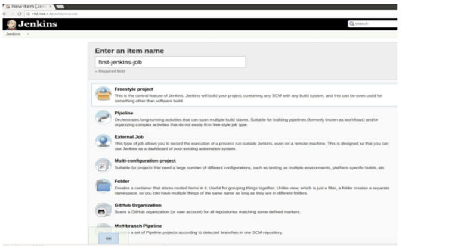


+ Allez dans la section `Build` => Dans la liste déroulante, sélectionnez `shell` => Entrez quelques commandes Linux, `free -m; w` => Enregistrer.

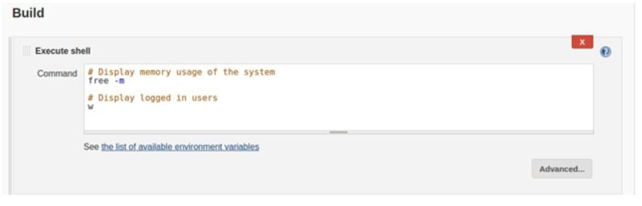

+ Après avoir enregistré le projet, nous atterrissons dans le tableau de bord de travail. 
+ Cliquez sur `Build` maintenant pour exécuter ce projet.

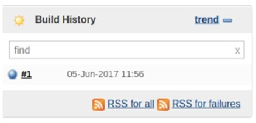

+ Une fois l'exécution terminée, nous pouvons vérifier l'historique des tâches exécutées et en vérifier la sortie.

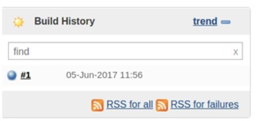

+ Cliquez sur la boule bleue pour voir le résultat du travail.

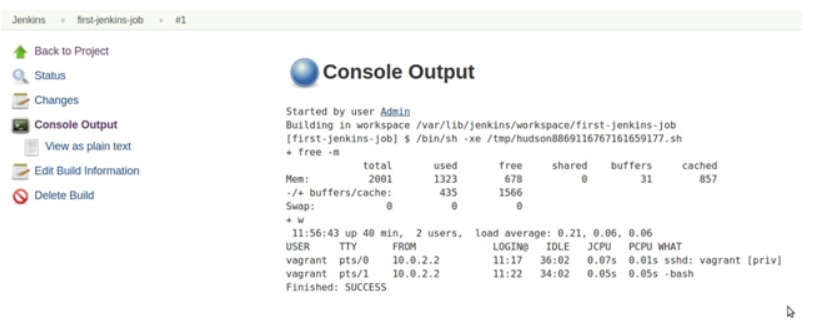


+ Nous avons vu dans l'exemple ci-dessus que la mise en place d'un travail `Jenkins` n'est pas une tâche si difficile.
+ Mais vous devez savoir quelles informations sont collectées dans le cadre du travail de `Jenkins`.
+ Dans la tâche suivante, nous créons une véritable tâche de `build`.

# Configurer une tâche build Java avec Maven

+ Noua allons utiliser un code source Java accessible au public depuis github pour tester le travail de `build` : https://github.com/wakalao/game-of-life.git.
+ Ce code source `Java` peut être construit par `Maven`. Il contient également le fichier `pom.xml` dont `Maven` a besoin pour créer le code.
+ Accéder au tableau de bord principal de `Jenkins` => Cliquez sur Nouvel élément => Donnez un nom à votre travail => Freestyle => OK.

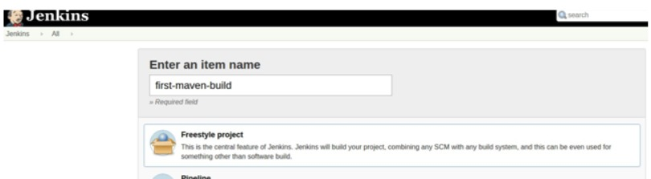


#### Gestion du code source

+ Copiez l'`URL` du code source de gameoflife depuis github.
+ Accédez à la section de gestion du code source dans `Jenkins` et sélectionnez sur `Git`.
+ Entrez l'url github du jeu de la vie.

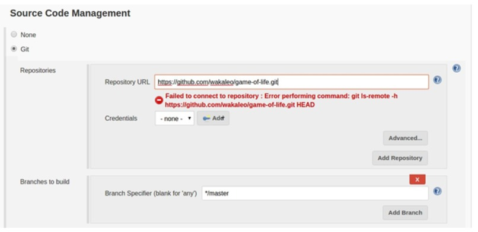


+ Il s'agit d'un référentiel public, donc aucune information d'identification n'est requise et nous sélectionnons la branche principale.


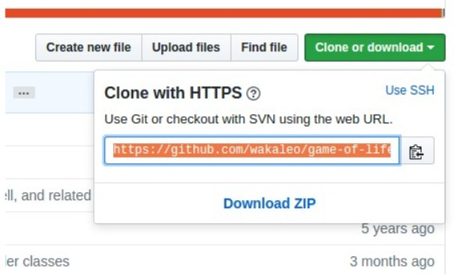

+ Accédez à la section `build` => Dans le menu déroulant, sélectionnez `Invoquer les cibles Maven de premier niveau` => Dans les objectifs, indiquez `installer` => Enregistrer.


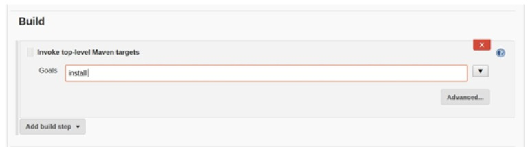


+ Cliquez sur `Build Now` => Dans l'historique de construction, cliquez sur le symbole de chargement ou sur la boule clignotante pour voir la sortie de la console d'exécution.

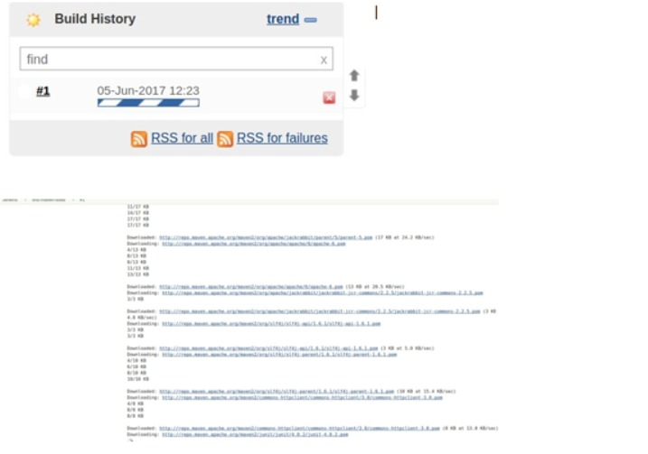

+ Selon le `POM.xml` de ce projet ce travail `maven` particulier effectuera les tâches mentionnées ci-dessous.

    + Téléchargez les dépendances Maven pour créer le travail.
    + Construisez le code source Java.
    + Générez l'artefact
    + Archivez l'artefact
    + Exécutez les cas de tests unitaires dans le code source.

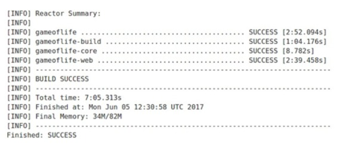

#### Artefact de l'application Web Game Of Life

+ Une fois le processus de construction terminé, vous pouvez trouvez l'artefact de cette tâche dans l'espace de travail de cette tâche.


#### Espace de travail :

+ L'espace de travail est l'endroit où toutes les données du travail sont stockées, par exemple le code source, les artefacts, etc.
+ Chaque travail dans `Jenkins` a son propre espace de travail.

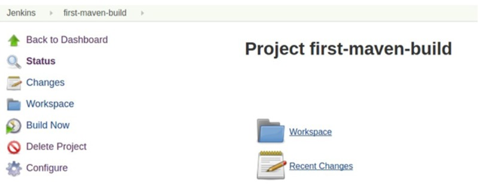

+ Cliquez sur `workspace => gemaoflife-web => target => gameoflife.war`, `gameoflife.war` est l'artefact généré et archivé par le processus de construction de `Maven`.
+ Cette artefact peut être déployé sur le serveur d'applications Web Java comme le serveur `Tomcat ou Jboss`.


# Administration Jenkins

+ Une fois que nous avons eu un petit avant-goût de `Jenkins` et comment exécuter des tâches, nous pouvons comprendre comment administrer `Jenkins`.
+ `Jenkins` offre des fonctionnalités étonnantes et très flexibles, nous pouvons configurer `Jenkins` selon nos besoins.
+ `Jenkins` peut effectuer diverses tâches en plus d'être simplement un serveur `CI`, mais nous devons le configurer selon nos besoins.
+ Dans la section suivante, nous verrons à quel point `Jenkins` est flexible et extensible.
+ Vous pouvez ouvrir les paramètres d'administration de `Jenkins` en cliquant sur `Gérer Jenkins` depuis le tableau de bord principal.

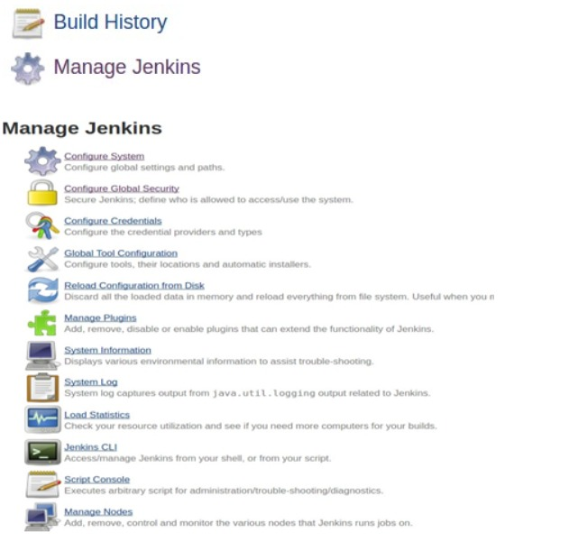

+ Il existe une variété de paramètres avec lesquels vous pouvez bricoler.
+ Nous allons approfondir un par un.
+ **Remarque : Parfois, après avoir apporté une modification à la configuration, vous devez peut-être redémarrer `Jenkins`**.
+ Dans le navigateur, vous pouvez utiliser l'URL ci-dessous pour redémarrer `Jenkins`.


```
http://<JenkinsIP>:8080/restart
```

#### Gérer Les Plugins

+ Les `plugins` sont la fonctionnalité la plus puissante de `Jenkins`.
+ Vous pouvez personnaliser `Jenkins` selon vos besoins en installant et en configurant des `plugins`.
+ Vous pouvez utiliser `Jenkins` pour automatiser presque tout, cela dépend simplement des `plugins` que vous configurez et il existe une grande variété de choix de plugins.
+ Nous avons déjà utilisé certains plugins dans notre travail de construction comme `Git SCM, Invoke top level Maven target etc`.
+ Certains `plugins` sont installés par défaut dans `Jenkins` et vous pouvez ensuite installer n'importe quel plugin selon votre choix et vos besoins.
+ Cliquez sur `Gérer les plugins`.


+ Il y a quatre onglets

+ **1) Mise à Jour**
    + Si un `plugin` est obsolète ou si aucune version de ce plugin n'est disponible, nous pouvons mettre à jour les `plugins` à partir de cet onglet.
    
+ **2) Disponibles**
    + Liste des plugins disponibles à installer. Trouvez votre plugin à partir du filtre, cochez simplement votre plugin préféré et cliquez sur `Installer sans redémarrer`.
    + Si les paramètres ne prennent pas effet, redémarrez le serveur `Jenkins`.
    + Chaque plugin aura une page wiki, cliquez sur le plugin pour lire son wiki.

    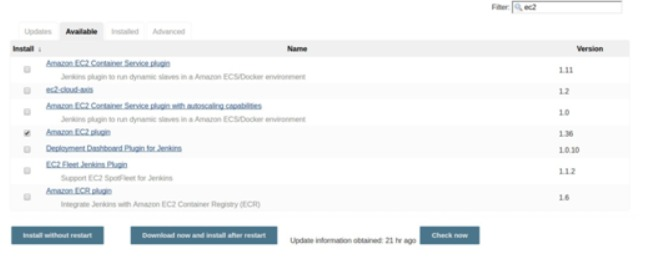

+ **3) Installé**

  + Liste des plugins installés, si vous choisissez de désinstaller un plugin. Mettez une coche et cliquez sur désinstaller.
    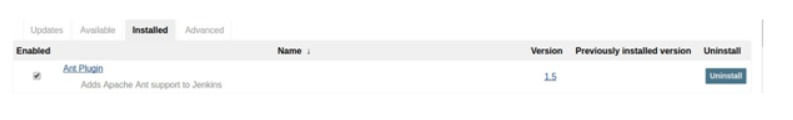
  
+ **4) Avancé**

    + Il arrive parfois que vous soyez assis derrière un serveur proxy et que vous n'ayez pas de connexion Internet directe.
    + Cette fois, vous ne pourrez pas voir la liste des plugins disponibles et vous ne pourrez pas l'installer.
    + 
