# Scripts Python


## Introduction A Python

+ `Python` est un langage de script de haut niveau, `interprété, interactif et orienté objet`.
+ `Python` est conçu pou être hautement lisible.

#### Alors Pourquoi y a t-il un didacticiel dans ce Livre

+ Lorsque nous écrivons un `script bash` pour effectuer `l'automatisation` nous avons lentement augmenté la complexité de notre code.
+ Notre code est devenu de plus en plus complexe. De plus, nous n'avons aucune autre fonctionnalité dans le `script bash` en dehors de la simple automatisation des tâches `Linux`.
+ `Python` est l'un des langages de programmation les plus simples du marché.
+ Etant simple, cela nous offre de nombreuses fonctionnalités et bibliothèques qui étendent la puissance de `Python`.
+ `Pyhon` est très extensible. Nous pouvons utiliser `Python` pour exécuter l'automatisation `Linux`, l'automatisation `Windows`, l'automatisation `Cloud` et plusieurs autres. Il est de nature très polyvalent.


#### Python est Interprété

+ `Python` est traité au moment de l'exécution par l'interpréteur. Vous n'avez pas besoin de compiler votre programme avant de l'exécuter. Ceci est similaire à `PERL et PHP`.


#### Python est Interactif

+ Vous pouvez en fait vous asseoir devant une invite `Python` et interagir avec l'interpréteur directement pour écrire vos programmes.

#### Python est Orienté Objet

+ `Python` prend en charge le style ou la technique de programmation orientée objet qui encapsule le code dans les objets.

#### Python est un Langage Pour les Débutants

+ `Python` est un excellent langage pour les programmeurs débutants et prend en charge le développement d'un large éventail d'applications, du simple traitement de texte aux navigateurs `WWW` en passant par les jeux.


## Installation de Python

#### Installation de Windows

+ Voici les étapes pour installer `Python` sur une machine `Windows`.

    + Ouvre votre navigateur Web et accéder à [python](http://www.python.org/download/).
    + Suivez le lien vers le fichier `python-XYZ.msi` du programme d'installation de `Windows` où `XYZ` est la version que vous devez installer.
    + Pour utiliser ce programme d'installation `python-XYZ.msi`, le système `Windows` doit prendre en charge `Microsoft Installer 2.0`.
    + Enregistrez le fichier d'installation sur votre ordinateur local, puis exécutez-le pour savoir si votre ordinateur prend en charge `MSI`.
    + Exécutez le fichier téléchargez.
    + Cela fait apparaitre l'installation de `Python`, qui est vraiment simple à utiliser.
    + Acceptez simplement les paramètres par défaut, attendez que l'installation soit terminée.
    + Après installation, nous devons configurer `Python` dans le `PATH` dans la variable d'environnement système.

#### Installer Linux

+ Le système `Linux` est livré par défaut avec `Python` installé, il n'est donc pas nécessaire de prendre des mesures pour le système `Linux`.


## Syntaxe de Base

<br/>

#### Programmation Interactive Python

+ Ouvre le `shell Linux` => Tapez `Python` et appuyez sur `Entrée`, cela vous déposera dans le `shell/interpréteur python`.


+ Tapez le texte suivant à l'invite `Python` et appuyez `Entrée`.


<br/>

<h4>Script Python</h4>

+ Créez un fichier nommé `hello.py`, `py` signifie print et est une extension du fichier `python`.
+ Ajoutez le contenu mentionné ci-dessous et enregistrez le fichier.


+ **Ligne 1 :** `#!` est le `charset shebang` comme nous le savons grâce aux `scripts bash`, le chemin de l'interprète est `/usr/bin/python`.
  + Vous pouvez trouver le chemin de l'interpréteur `Python` dans votre système `Linux` en indiquant `quel python`.
  + L'appel de l'interpréteur avec un paramètre de script démarre l'exécution du script et se poursuit jusqu'à ce qu'il soit terminé.
  + Une fois le script terminé, l'interpréteur n'est plus actif.
+ **Ligne 2 :** `print` est la commande `python` qui imprime les messages.


#### Exécution du Script Python

+ Maintenant, essayez d'exécuter ce programme comme suit : 

  + Exécution du script `Python` : 

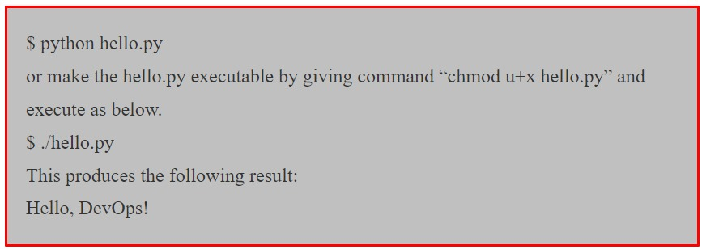

#### Lignes et retrait

+ Les instructions du programme `Python` sont écrites les unes au-dessus des autres, comme le montre l'exemple suivant : 

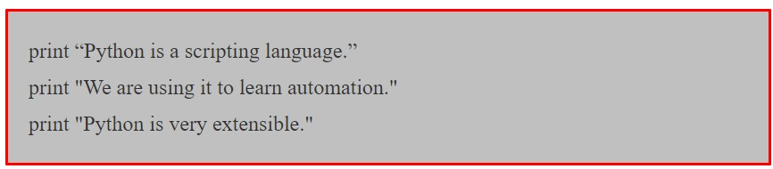

+ Le programme de 3 lignes ci-dessus est correct et s'exécutera pour produire le résultat attendu.
+ Le programme ci-dessous générera une erreur de syntaxe à cause du caractère espace inséré au début de la deuxième ligne.

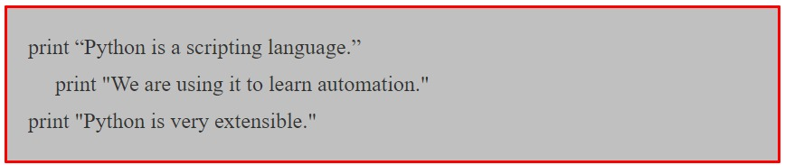

+ `Python` évalue de la deuxième instruction d'impression comme un bloc de code à l'intérieur instruction d'impression.
+ Ainsi, sa deuxième impression de réflexion est sous la première déclaration d'impression, mais c'est une déclaration distincte.
+ `Python` ne fournit aucune accolade pour indiquer des blocs de code pour les définitions de classes et de fonctions ou contrôle de flux.
+ Les blocs de code sont indiqués par une indentation de ligne, qui est strictement appliquée.

#### Citation en python

+ Nous pouvons utiliser des guillemets en `Python` pour entourer `le texte/les chaînes`.
+ Il existe trois types de citations en `python`.

  + **Guillemet simple (')**
    + Tout ce qui se trouve entre guillemets est considéré comme une chaîne littérale et ne sera pas évalué par `python`.
  + **Guillemets doubles ("")**
    + Peuvent être utilisés lorsque vous avez une variable dans la chaîne qui doit être évalué par python en utilisant le formatage de chaîne `(%)`
  +  **Triple(""or"")**
    + Ceci est utilisé pour écrire une chaîne multiligne ou également appelée chaîne de paragraphe.
  + Par exemple :
    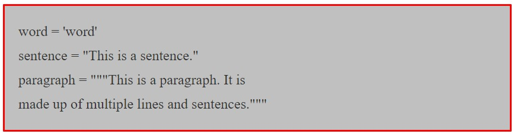

#### Commentaires en Python
+ Un signe `dièse(#)` est un symbole de commentaire en python. `Python` ignore tout le texte après `#` et ne l'évalue pas.
+ Tous les caractères après le `#` et jusqu'à la fin de la ligne physique font partie du commentaire et l'interpréteur `Python` les ignore.

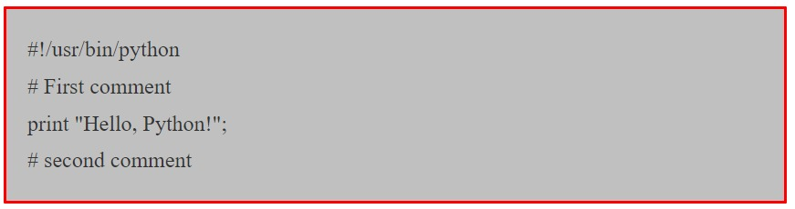

+ Ceci produit le résultat suivant : `Hello, Python!`

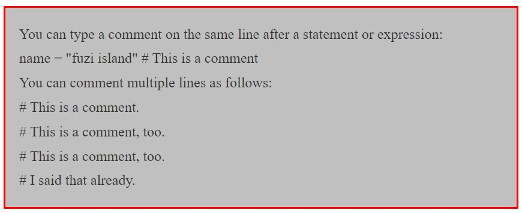


#### Commentaire Multiligne

+ Nous pouvons utiliser une chaîne de paragraphe pour créer un commentaire multiligne. 
+ Tout ce qui se trouve dans la chaîne de paragraphe serait ignoré par `Python`.

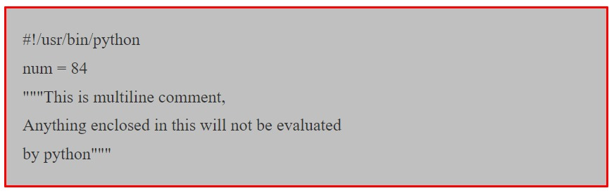

## Types de variables

+ Les `variables` sont un stockage temporaire des données en mémoire. Il existe différents types de données.
+ En attribuant différents types de données aux variables, vous pouvez stocker des entiers, des décimales ou des caractères dans ces variables.

#### Affectation de variables
+ Nous n'avons pas besoin de définir les types de variables en python comme les autres langages de programmation.
+ La déclaration de variable se produit automatiquement lorsque nous attribuons une valeur à une variable.
+ Le signe égal `(=)` est utilisé pout attribuer des valeurs aux variables. L'opérande à gauche de l'opérateur `=` est le nom de la variable et l'opérande à droite de l'opérateur `=` est la valeur stocké dans la variable.
+ Par exemple : 

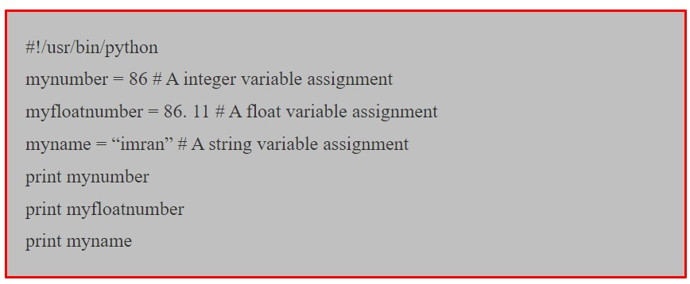

+ Ici, 86, 86.11 et imran sont des valeurs attribuées respectivement aux noms de variables `mynumber, myfloatnumber et myname`.
+ Exécutez le script ci-dessus et vérifiez le résultat.

#### Affectation multiple

+ `Python` vous permet d'attribuer une seule valeur à plusieurs variables simultanément. Par exemple : 

```
              x=y=z=86
```

+ Ici, un objet entier est créé avec la valeur 86 et les trois variables affectées au même emplacement mémoire.
+ Vous pouvez également affecter plusieurs objets à plusieurs variables. Par exemple : 

```
          x,y,z = 86, 11 "imran".
```

+ Ici, les deux objets entiers avec les valeurs 86 et 11 sont affectés respectivement aux variables `x` et `y`, et un objet chaîne avec la valeur `"imran"` est affecté à la variable `z`.


## Types de données Python

+ Les données stockées en mémoire peuvent être de plusieurs types. 
+ Par exemple, l'âge d'une personne est stocké sous forme de valeur numérique et son adresse est stockée sous forme de caractères alphanumériques.
+ `Python` dispose de différents `types de données standards` qui sont utilisés pour définir les opérations possibles sur celles-ci et la méthode de stockage pour chacune d'elles.

#### Python propose 5 types de données standard

+ Numbers
+ String
+ List
+ Tuple
+ Dictionary

+ Si vous utilisez `bash` pour les `scripts`, vous devez sans aucun doute beaucoup utiliser de conditions.
+ En fonction d'une condition, vous décidez si vous devez ou non exécuter certaines commandes sur le système.
+ Une instruction `if` de base dit effectivement que si un test particulier est vrai, alors effectuez un ensemble d'actions donné.
+ Si ce n'est pas vrai, n'effectuez pas ces actions. Si suit le format ci-dessous :

#### Nombre Python

+ Les nombres Python sont de type entier, flottant, long et complexe comme indiqué ci-dessous.

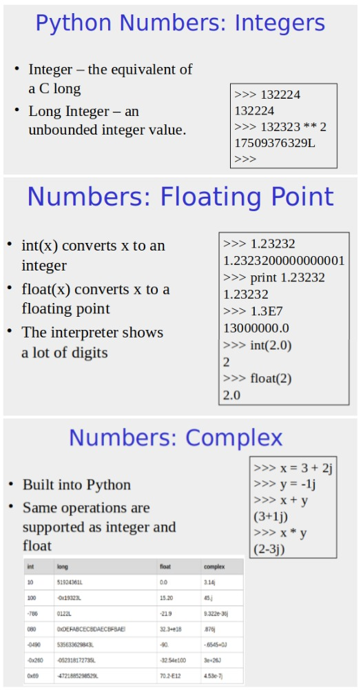

#### Chaînes Python

+ Les chaînes Python sont de simples données texte entourées de guillemets simples ou doubles.

```
          stringvar = 'sample string'
          strvar2 = 'string#2'
```

+ Python autorise des paires de guillemets simples ou doubles.

```
          stringvar = "sample string"
          strval2 = "string#2"
```

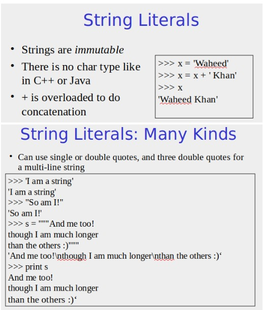

+ Le découpage de chaîne peut également être effectué et stocké dans une variable, `slice` signifie un sous-ensemble ou  une paire de la chaîne.

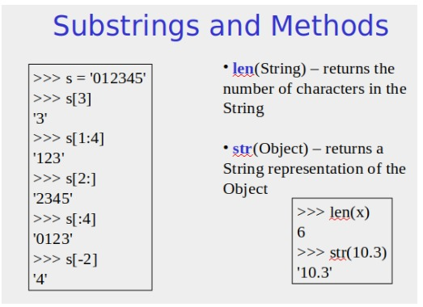


+ Des sous-ensembles de chaînes peuvent être créés par l'opérateur `slice([] et [:])` avec des index commençant à 0 au debut de la chaîne et progressant de `-1` à la fin.
+ Le signe `plus (+)` est l'opérateur de concaténation de chaînes et l'astérisque `(*)` est l'opérateur de répétition. Par exemple :

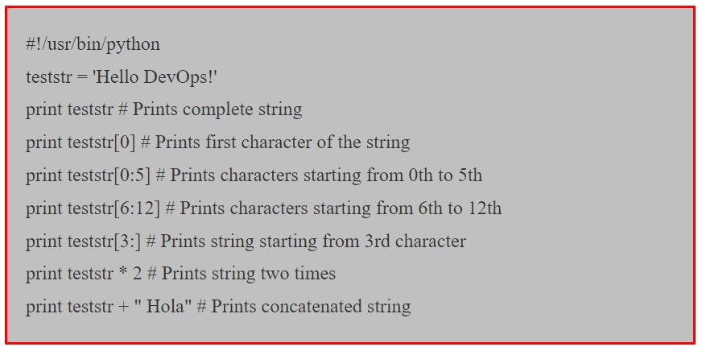

+ Cela produira le résultat suivant :


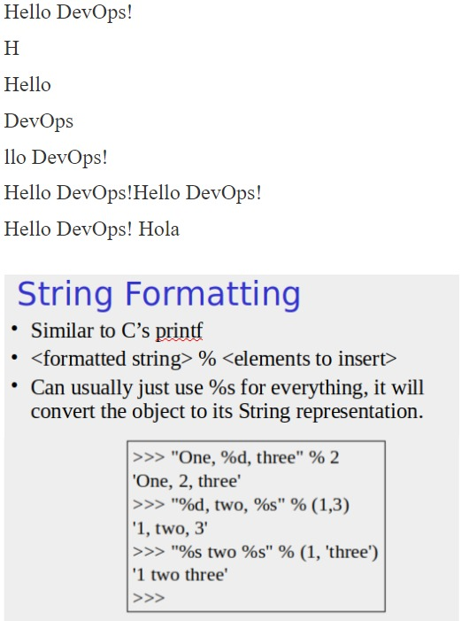

#### Listes Python

+ Les `listes` connaissent également un tableau de Python. Il peut stocker plusieurs valeurs de types de données différents dans une variable.
+ Une liste contient des élements séparés par des virgules et placés entre crochets `([])`.
+ C'est similaire aux tableaux en `C` mais la différence entre eux que tous les éléments appartenant à une liste peuvent être de types de données différents.
+ Les valeurs stockées dans une liste sont accessibles à l'aide de l'opérateur `slice([]) et [:])` avec des index commençant à 0 au début de la liste et allant jusqu'à la fin `-1`.
+ Le signe plus `(+)` est l'opérateur de concaténation de liste et l'astérisque `(*)` est l'opérateur de répétition. Par exemple :

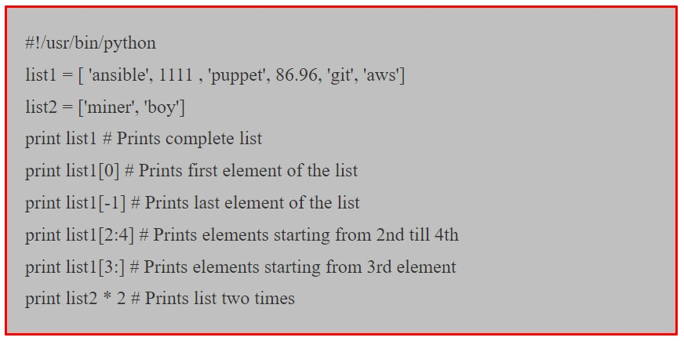

+ Cela produit le résultat suivant :

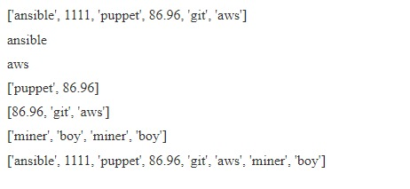

#### Tuples Python

+ Le `tuple` est un autre type de tableau qui ressemble exactement à une liste, mais les `tuples` sont `immuables`, ce qui signifie que vous ne pouvez pas modifier un tuple tout comme vous ne pouvez pas modifier le contenu d'un `cd-rom`.
+ Un `tuple` est constitué d'un certain nombre de valeurs séparées par des virgules. Les tuples sont placés entre parenthèses `()`.
+ Les tuples peuvent être considérés comme des listes en lecture seule. Par exemple :

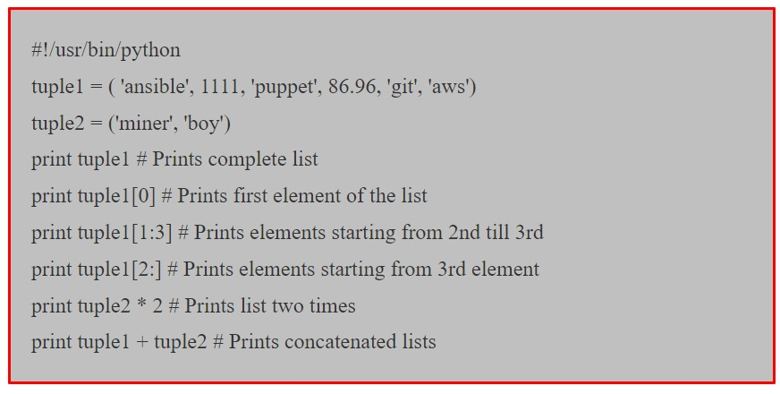

+ Cela produit le résultat suivant : 

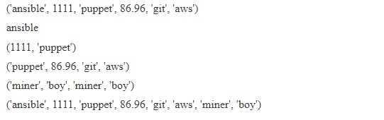

+ Le code suivant n'est pas valide avec le tuple, car nous avons tenté de mettre à jour un tuple, ce qui n'est pas autorisé.
+ Un cas similaire est possible avec les listes : 

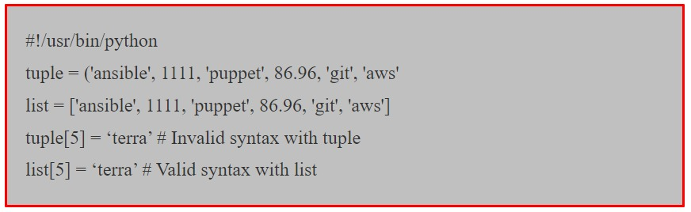

#### Dictionnaire Python

+ Dans les données du dictionnaire, elles sont stockées sous forme de paire de clé-valeur, contrairement à une liste ou à un tuple où nous n'avons que des valeurs.
+ Vous pouvez penser qu'il s'agit d'un dictionnaire anglais normal où le mot dans la clé et sa signification sont sa valeur.
+ Les dictionnaires de Python sont une sorte de type de table de hachage. Une clé de dictionnaire peut être presque n'importe quel type `Python`, mais il s'agit généralement de combres ou de chaînes.
+ Les valeurs en revanche, peuvent être n'importe quel objet `Python` arbitraire. Les dictionnaires sont entourés d'accolades `({})` et les valeurs peuvent être attribuées et accessibles à l'aide d'accolades `([])`. Par exemple : 

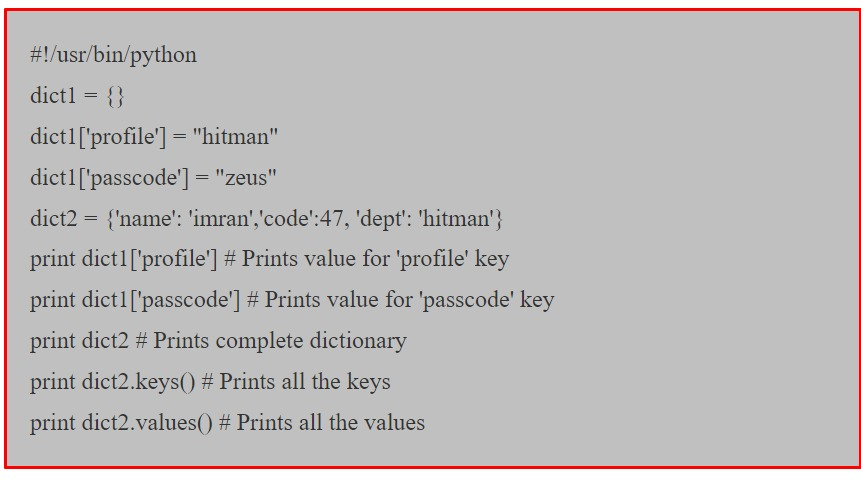

+ Cela produit le résultat suivant : 

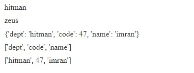

## Opérateurs Python

+ Les opérateurs sont les constructions qui peuvent manipuler la valeur des opérandes.
+ Considérons l'expression `4 + 5 = 9`. Ici, 4 et 5 sont appelés `opérande` et + est appelé `opérateur`.

#### Types d'opérateurs
+ Le langage Python prend en charge les types d'opérateurs suivants.

1. Opérateurs arithmétiques

2. Opérateurs de comparaison (relationnels)

3. Opérateurs d'affectation

4. Opérateurs logiques

5. Opérateur au niveau du bit

6. Opérateur d'appartenance

7. Opérateurs d'identité

+ Opérateurs arithmétiques Python

  + `+ : Addition` - ajoute des valeurs de chaque côté de l'opérateur.
    + `x + y = 110`
  + `- : soustraction` - soustrait l'opérande de droite de l'opérande de gauche.
    + `x - y = -10`
  + `* : Multiplication` - multiplie les valeurs de chaque côté de l'opérateur.
    + `x * y = 200`
  + `/ : Division` - divise l'opérande de gauche par l'opérande de droite.
    + `x / y = 2`
  + `% : Module` - divise l'opérande de gauche par l'opérande de droite et renvoie le reste.
    + `x % y = 0`
  + `** : Exposant` - effectue un calcul exponentiel (puissance) sur les opérateurs.
    + `x ** y = 10 à la puissance 20`

#### Opérateurs de comparaison python

+ Ces opérateurs comparent les valeurs de chaque côté et décident de la relation entre elles.
+ Ils sont également appelés opérateurs relationnels.

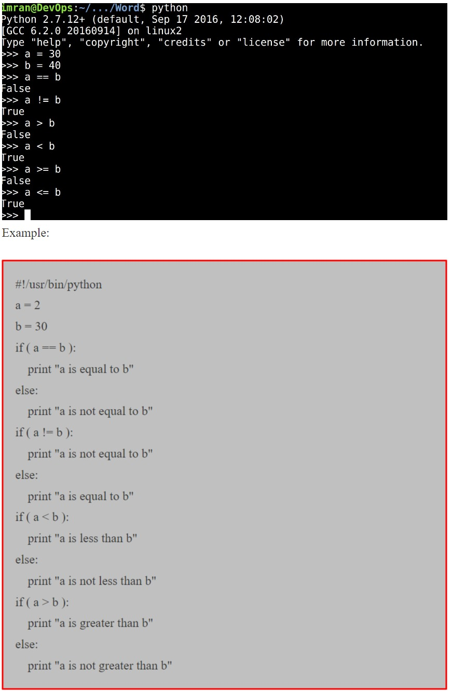

+ Une fois exécuté, il renvoie la sortie ci-dessous : 

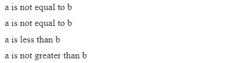

#### Opérateurs logiques python

+ Il existe les opérateurs logiques suivants pris en charge par le langage python.
  + Si la variable `a` contient 40 et la variable `b` contient 50, alors : 
    + Si les deux opérandes sont vrais, la condition devient vraie, `(a et b)` est vrai.
    + Si l'un des deux opérandes est différent de zéro, la condition devient vraie, `(a ou b)` est vrai.
    + `Non(a et b)` est faux.
  
#### Opérateurs d'adhésion python.

+ Les opérateurs d'appartenance de `Python` testent l'appartenance à une séquence, telle que des chaînes, des listes ou des tuples.
+ Il existe deux opérateurs d'appartenance comme expliqué ci-dessous : 
  + prend la valeur `true` s'il trouve une variable dans la `séquence` spécifié et `false` dans le cas contraire.

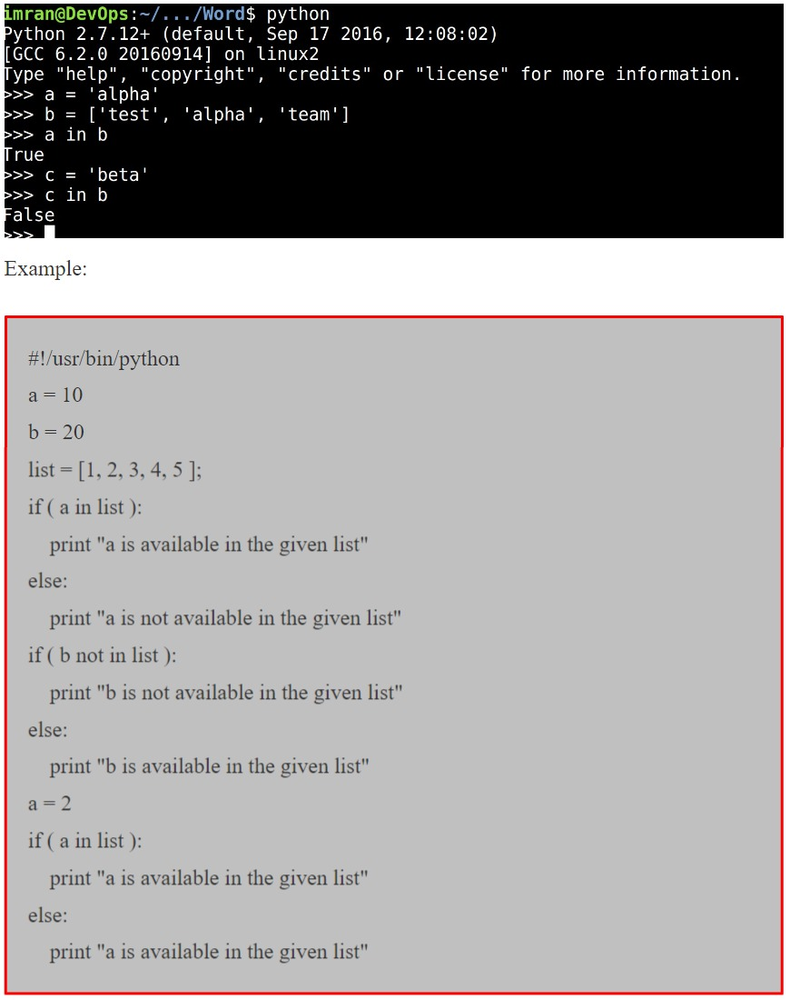

+ Une fois exécuté, le résultat ci-dessous donne : 

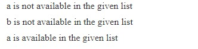

## Prise de décision

+ La `prise de décision` est présente dans chaque langage de programmation.
+ Sur la base d'un scénario de test, le programme décide d'exécuter ou non des instructions/commandes.
+ En python, nous utilisons les mots-clés `if, elif et else` pour prendre des décisions.


#### L'instruction If - Syntaxe

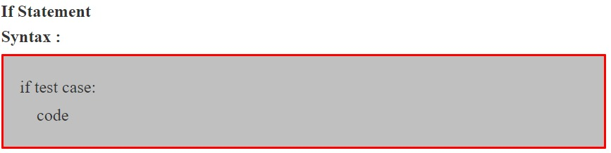

+ Si le scénario de test est vrai, le code du bloc `if` est exécuté.
+ Si l'expression textuelle est fausse, la ou les instructions ne sont pas exécutées.
+ Comme nous l'avons vu précédemment dans la section indentation, pour créer un bloc de code sous toute instruction, nous indentons le code ou lui donnons des espaces.
+ Par exemple, l'instruction `print` se trouve sous le bloc `if`.

```
if True:
  print "Indented three spaces"
```

+ En python, 0 est interprété comme `False` et toute valeur non nulle est `True`.


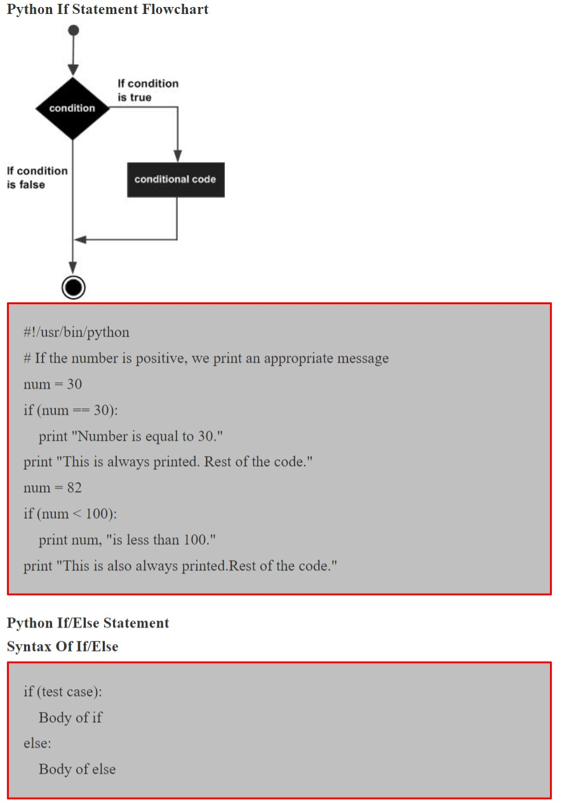

+ L'instruction `if/else` évalue le scénario de test et exécutera le corps de `if` uniquement lorsque la condition de test est vraie.
+ Si la condition est fausse, le corps est exécuté.


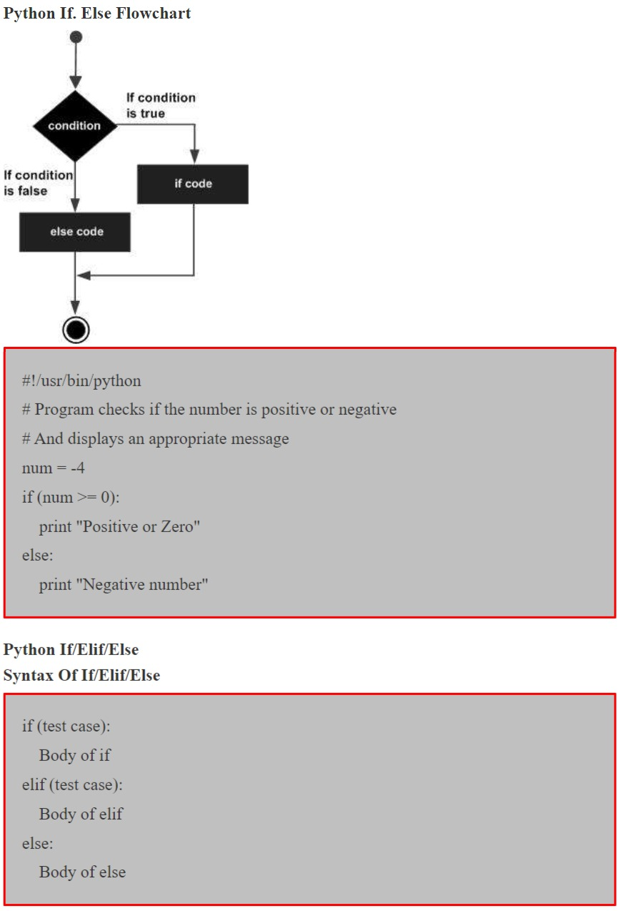

+ Si la condition est fausse, sinon le bloc est exécuté, mais que se passe-t-il si nous voulons évaluer quelques conditions supplémentaires et ensuite décider de l'exécution. 
+ Nous pouvons utiliser `elif` pour mettre plus de conditions dans notre processus de prise de décision, sa forme abrégée `else if`. Si la condition `if` est fausse, il vérifie la condition du prochain bloc `elif` et ainsi de suite.
+ Si toutes les conditions sont fausses, le corps de `else` est exécuté. Le bloc `if` ne peut avoir qu'un seul bloc `else`. Mais il peut avoir plusieurs blocs `elif`.

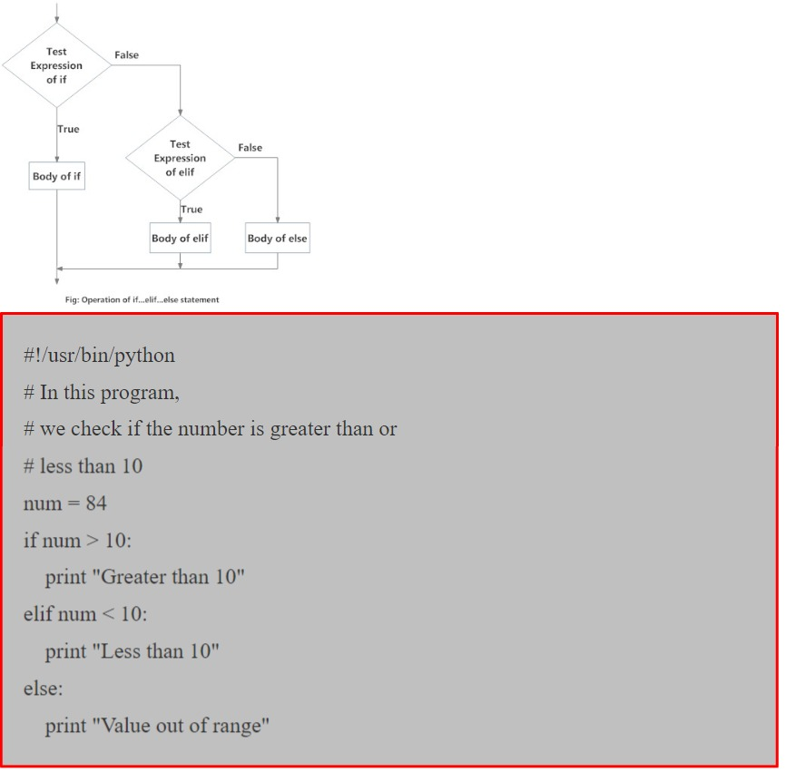

## Boucles Python

+ Les boucles sont utilisées lorsque vous souhaitez répéter un bloc pendant un nombre de fois fixe ou jusqu'à ce qu'une condition ne soit pas satisfaite. Python nous fournit deux boucles.

#### Boucle While

+ Répétez le bloc de code jusqu'à ce que la condition `while` soit vraie.

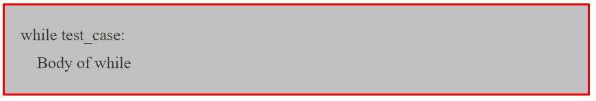

#### Boucle for

+ répétez le bloc de code plusieurs fois.

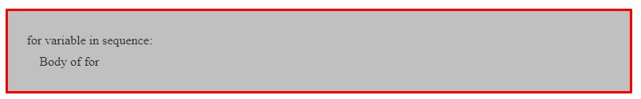

+ Les `boucles for` sont traditionnellement utilisées lorsque vous disposez d'un bloc de code que vous souhaitez répéter un nombre fixe de fois.
+ L'instruction `Python for` parcourt les membres d'une séquence dans l'ordre, exécutant le bloc à chaque fois.
+ Comparez l'instruction `for` avec la `boucle while`, utilisée lorsqu'une condition doit être vérifiée à chaque itération ou pour répéter un bloc de code pour toujours. Par exemple : 

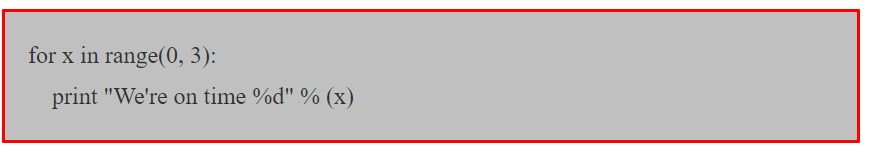

#### Boucle While Infinie
+ Exemple : `Boucle while` de 1 à l'infini, donc exécutée pour toujours.

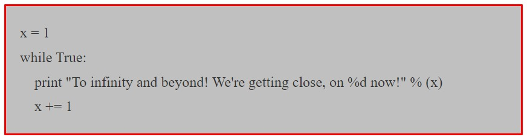

#### Boucles While

+ Dans la `boucle while`, le scénario de test est d'abord évalué, si scénario de test est vrai, le corps de la boucle `while` est exécuté et répété jusqu'à ce que le scénario de test soit évalué comme faux.
+ Après chaque itération, le cas de test est évalué. Python interprète toute valeur non nulle comme `True`. `None` et 0 sont interprétés comme faux.

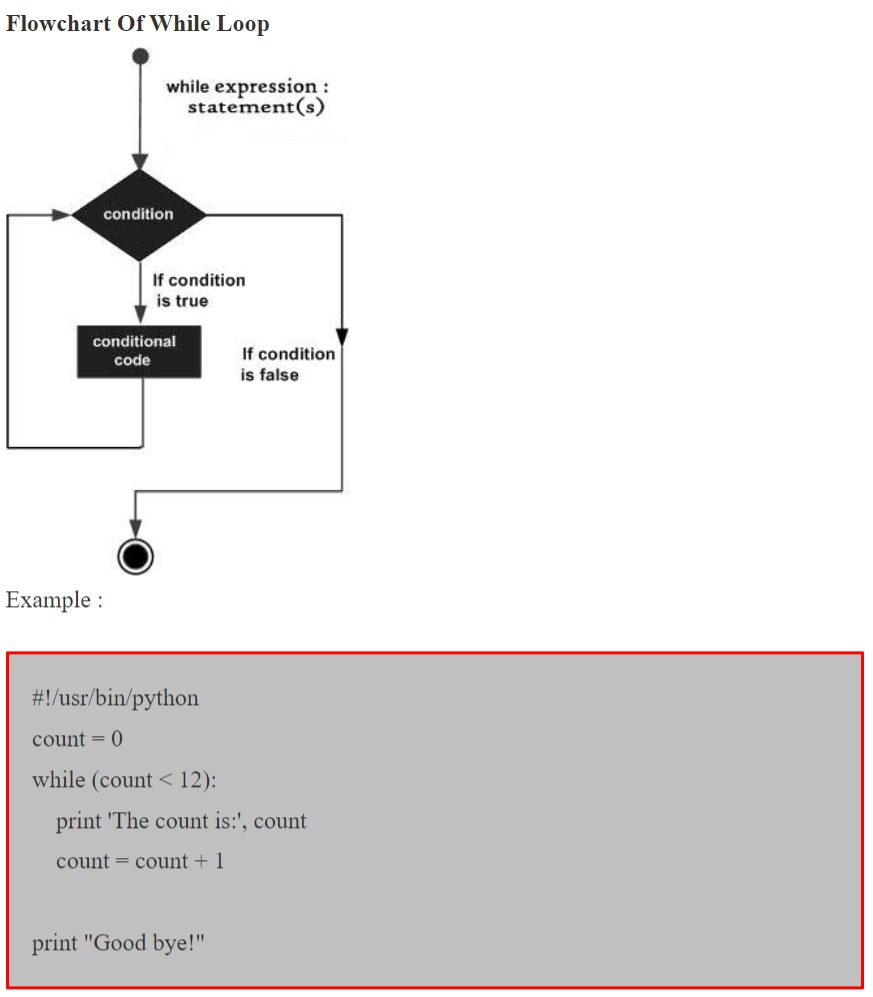

#### Les boucles for

+ La `boucle for` peut parcourir toutes les séquences comme une liste, un tuple pu une chaîne qui sont indexées.
+ Chaque élément de ces types de donnés est indexé et peut être itéré. Ce processus d'itération sur une séquence est appelé `traversée ou traversée dans la nature`.

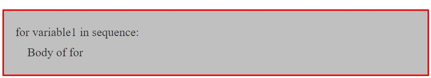

+ Ici, la variable1 est la variable qui prend la valeur de l'élément à l'intérieur de la séquence à chaque itération.
+ La boucle continue jusqu'à ce que nous atteignions le dernier élément de la séquence. Le corps de la `bucle for` est séparé du reste du code par indentation.

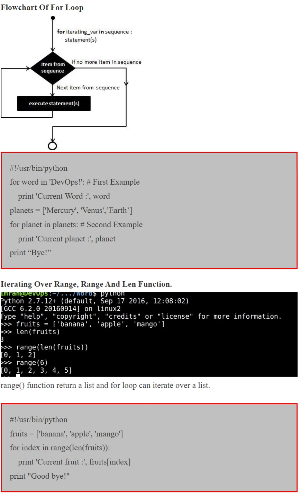

#### Break and continue

+ L'utilisation des `boucles for et while` en Python vous permet d'automatiser et de répéter des tâches de manière efficace.
+ Mais parfois, vous souhaitez intercepter ou modifier le flux ou sortie de la boucle pendant son exécution. 
+ En `Python`, les instructions `break et continue` peuvent modifier le déroulement d'une boucle normale. 
+ Les instructions `break et continue` sont utilisées dans ce cas.

#### Instruction Break De Python

+ L'instruction `break` vous offre la possibilité de sortir d'une boucle lorsqu'une condition externe est déclenchée.
+ Cette condition externe peut être un bloc `if` qui est évalué à vrai quelque part dans l'itération et utilise le mot-clé `break` pour sortir de la boucle.

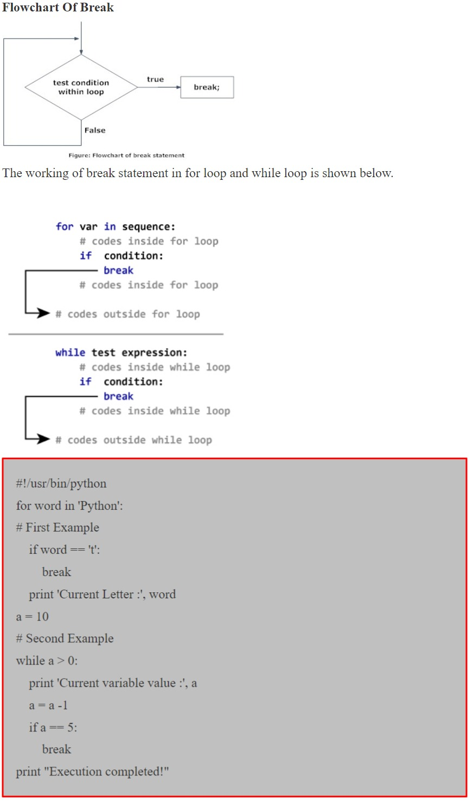
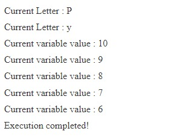

#### Instruction continue Python

+ L'instruction `continue` est utilisée pour ignorer le reste du code dans une boucle pour l'itération en cours uniquement.
+ La boucle ne se termine pas mais `continue` avec l'itération suivante :


#### Organigramme de continue

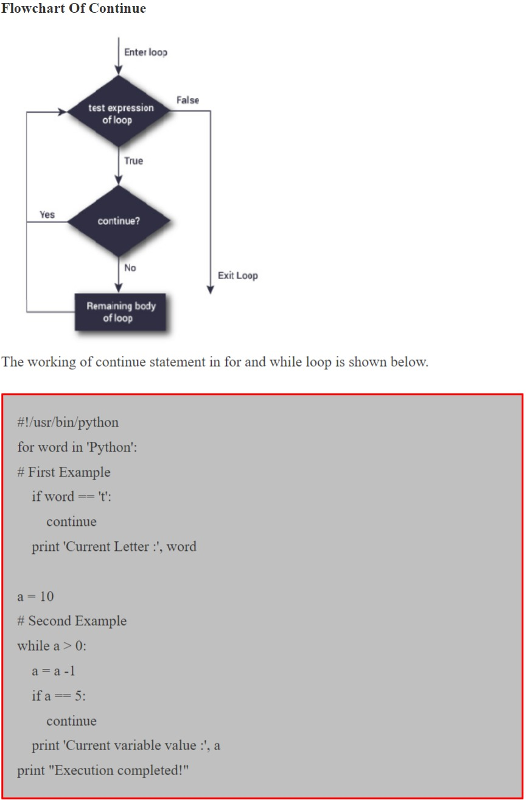
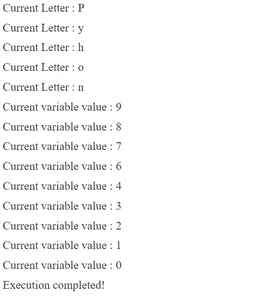

## Méthodes/fonctions intégrées

+ `Python` dispose de nombreuses fonctions intégrées qui étendent ses capacités. Vous trouverez ci-dessus quelques-unes des méthodes intégrées utiles sur tous les types de données.
+ Consultez la documentation `Python` pour la liste de toutes les méthodes et leurs utilisations.

#### Fonctions de chaîne

+ `capitalize` : met en majuscule la première lettre de la chaîne.

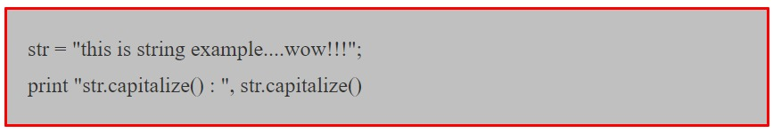

+ `find` : détermine si `str` apparaît dans une chîne ou dans une sous-chaîne.

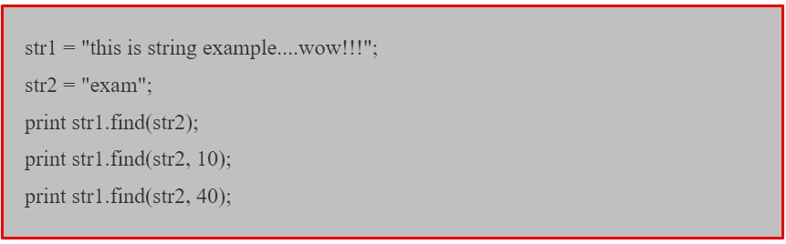

+ `join` : fusionne (concatène) les représentations sous forme de chaîne des éléments de la séquence `seq` en une chaîne, avec une chaîne de séparation.

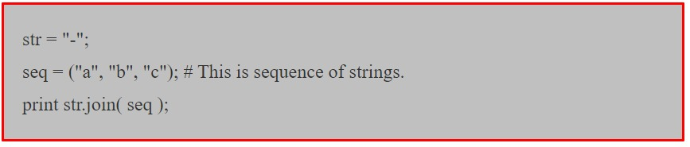

+ `rstrip` : supprime tous les espaces de fin de chaîne.

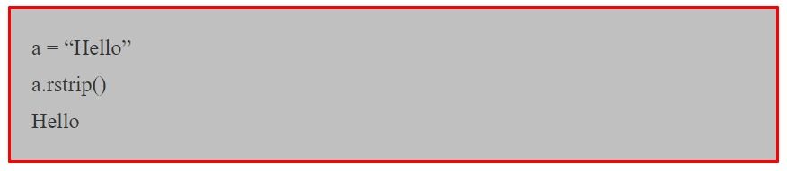

+ `split` : divise la chaîne en fonction du délimiteur `str` (espace s'il n'est pas fourni) et renvoie la liste des sous-chaînes; divisé en au plus nombre de sous-chaînes si donné.

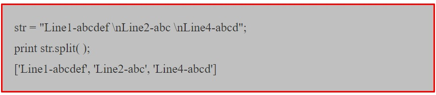

#### Fonctions des listes

+ `append` : ajoute un élément à la fin de la liste.

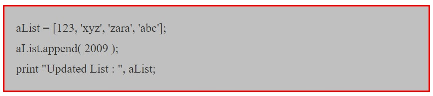

+ `extend` : combiner deux listes ensemble.

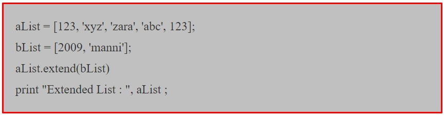

+ `insert` : insère un élément dans la valeur d'index spécifiée.

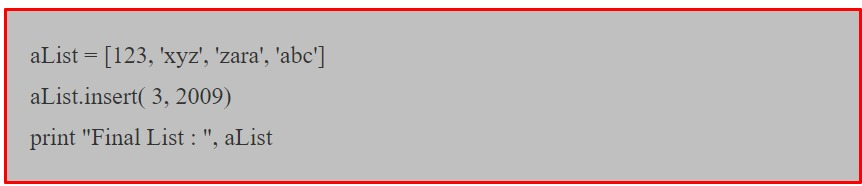

+ `pop` : supprime l'élément de la liste à une valeur d'index spécifié, la valeur par défaut est le dernier élément.

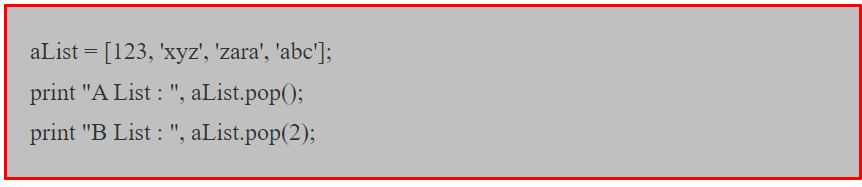

#### Fonctions du dictionnaire

+ Mettre à jour les élements du dictionnaire

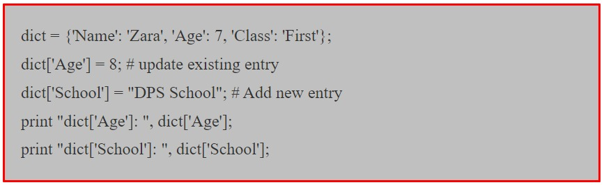

+ Supprimer des éléments du dictionnaire

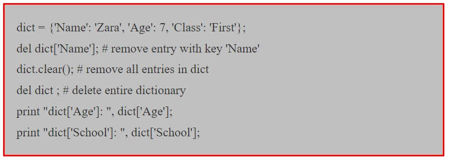


## Fonctions Python

