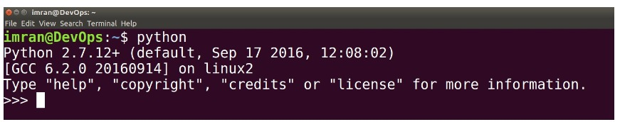
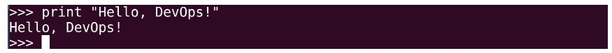
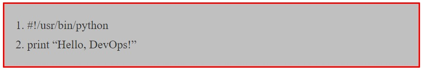

<h1><u>Scripts Python</u></h1>

<h3><u>Introduction A Python</u></h3>

+ `Python` est un langage de script de haut niveau, `interprété, interactif et orienté objet`.
+ `Python` est conçu pou être hautement lisible.

<h4>Alors Pourquoi y a t-il un didacticiel dans ce Livre</h4>

+ Lorsque nous écrivons un `script bash` pour effectuer `l'automatisation` nous avons lentement augmenté la complexité de notre code.
+ Notre code est devenu de plus en plus complexe. De plus, nous n'avons aucune autre fonctionnalité dans le `script bash` en dehors de la simple automatisation des tâches `Linux`.
+ `Python` est l'un des langages de programmation les plus simples du marché.
+ Etant simple, cela nous offre de nombreuses fonctionnalités et bibliothèques qui étendent la puissance de `Python`.
+ `Pyhon` est très extensible. Nous pouvons utiliser `Python` pour exécuter l'automatisation `Linux`, l'automatisation `Windows`, l'automatisation `Cloud` et plusieurs autres. Il est de nature très polyvalent.

<h4>Python est Interprété</h4>

+ `Python` est traité au moment de l'exécution par l'interpréteur. Vous n'avez pas besoin de compiler votre programme avant de l'exécuter. Ceci est similaire à `PERL et PHP`.

<h4>Python est Interactif</h4>

+ Vous pouvez en fait vous asseoir devant une invite `Python` et interagir avec l'interpréteur directement pour écrire vos programmes.

<h4>Python est Orienté Objet</h4>

+ `Python` prend en charge le style ou la technique de programmation orientée objet qui encapsule le code dans les objets.

<h4>Python est un Langage Pour les Débutants</h4>

+ `Python` est un excellent langage pour les programmeurs débutants et prend en charge le développement d'un large éventail d'applications, du simple traitement de texte aux navigateurs `WWW` en passant par les jeux.

<h3><u>Installation de Python</u></h3>

<h4>Installation de Windows</h4>

+ Voici les étapes pour installer `Python` sur une machine `Windows`.

    + Ouvre votre navigateur Web et accéder à [python](http://www.python.org/download/).
    + Suivez le lien vers le fichier `python-XYZ.msi` du programme d'installation de `Windows` où `XYZ` est la version que vous devez installer.
    + Pour utiliser ce programme d'installation `python-XYZ.msi`, le système `Windows` doit prendre en charge `Microsoft Installer 2.0`.
    + Enregistrez le fichier d'installation sur votre ordinateur local, puis exécutez-le pour savoir si votre ordinateur prend en charge `MSI`.
    + Exécutez le fichier téléchargez.
    + Cela fait apparaitre l'installation de `Python`, qui est vraiment simple à utiliser.
    + Acceptez simplement les paramètres par défaut, attendez que l'installation soit terminée.
    + Après installation, nous devons configurer `Python` dans le `PATH` dans la variable d'environnement système.

<h4>Installer Linux</h4>

+ Le système `Linux` est livré par défaut avec `Python` installé, il n'est donc pas nécessaire de prendre des mesures pour le système `Linux`.

<h3><u>Syntaxe de Base</u></h3>

 

<h4>Programmation Interactive Python</h4>

+ Ouvre le `shell Linux` => Tapez `Python` et appuyez sur `Entrée`, cela vous déposera dans le `shell/interpréteur python`.

+ Tapez le texte suivant à l'invite `Python` et appuyez `Entrée`.

 

<h4>Script Python</h4>

+ Créez un fichier nommé `hello.py`, `py` signifie print et est une extension du fichier `python`.
+ Ajoutez le contenu mentionné ci-dessous et enregistrez le fichier.

