# Ansible

+ `Ansible` est un outil d'automatisation open source très puissante.
+ Il entre dans la catégorie des outils de gestion de configuration comme `Puppet, Chef, Salstack, etc`.
+ C'est le plus simple parmi tous les outils de gestion de configuration en termes d'approche facile à lire et à écrire et d'architecture `sans maître/sans serveur.
+ Etant simple à utiliser, il peut gérer les tâches les plus complexes en matière d'orchestration, où vous exécutez des tâches d'automatisation en chaîne et dans l'ordre sur plusieurs serveurs et appareils différents

## Gestion de Configuration

+ En termes simples, les outils qui gèrent la configuration des infrastructures informatiques telles que le système d'exploitation, les périphériques réseau, les applications, les logiciels et les services de cloud sont appelés `outils de gestion de configuration`.
+ La configuration de l'infrastructure informatique, comme les modifications des logiciels et du système d'exploitation, se produit de temps en temps.
+ Nous les ajoutons, les supprimons et les mettons à jour pour de bon.
+ Effectuer de telles modifications sur des centaines de serveurs et d'appareils prend beaucoup de temps et est sujet aux erreurs si vous le faites manuellement.
+ Ces outils vous aident à gérer et automatiser tous ces changements en toute simplicité et depuis un endroit centralisé.

### Certaines Fonctionnalités

#### 1) Configuration Centralisée

+ La configuration des différents serveurs et appareils est gérée à partir d'un serveur central.
+ Comme si vous gérez des serveurs `Web`, des serveurs de base de données ou des consommateurs, toutes leurs configurations telles que les logiciels, les correctifs, les fichiers de configuration, etc. peuvent être configurées sur le serveur central.
+ Lorsque le nœud souhaite mettre à jour les dernières modifications, il peut les récupérer depuis le serveur ou les transmettre au nœud depuis le serveur.

#### 2) Mise en vigueur

+ L'application de la configuration peut être la fonctionnalité la plus importante d'un outil de gestion de configuration.
+ En s'exécutant régulièrement et en s'assurant que la machine est configurée dans l'état souhaité, les outils de gestion de configuration empêchent la désynchronisation de la configuration.
+ La dérive de configuration peut se produire de différentes manières : `mises à jour, de packages, débogage en direct, collègues "utiles", etc`.
+ Quelle qu'en soit la cause, être capable de dire en toute confiance : "C'est ainsi que cette machine est configurée" est un excellent moyen pour raccourcir le temps de résolution des incidents et réduire les surprises.

#### 3)Abstraction

+ Les administrateurs systèmes maintiennent des environnements complètement homogènes.
+ Même si vous êtes une boutique entièrement `Linux`, vous avez probablement plusieurs distributions que vous prenez en charge, ou au moins plusieurs versions d'une distribution.
+ Avec les outils de gestion de configuration, de nombreuses implémentations d'une configuration spécifiques au système d'exploitation sont résumées pour vous.
+ Le même fichier de configuration peut être utilisé pour gérer, par exemple, l'installation d' `Apache HTTPD` sur les systèmes `Red Hat` et `Ubuntu`.

#### 4) Contrôle De Version Convivial.

+ Bien entendu, la meilleure façon de permettre la coopération est de tout avoir dans un système de version.
+ Tous les outils repertoriés ci-dessous utilisent une forme de texte pour la configuration.
+ Cela signifie que vous pouvez profiter des avantages de votre système de contrôle de version.

#### 5) Replication
+ La gestion de la configuration facilite la `réplication` des environnements avec exactement les mêmes logiciels et configurations.
+ Cela vous permet de créer efficacement un écosystème à plusieurs étapes, avec des serveurs de production, de développement et de test.

#### 6) Quelques Outils De Gestion De Configuration

+ `Puppet`
+ `Chef`
+ `Ansible`
+ `Slastack`
+ `CFEngine`

### Quelques Terminologies

#### 1) Gestion Du Changement

+ Il s'agit d'un processus lorsqu'une configuration spécifique de la machine ou du logiciel est modifiée.
+ Ce processus `CM` typique dans l'industrie informatique par un processus d'approbation du client ou de la direction supérieure, nous parlons bien sûr de systèmes de production.
+ Un seul changement sur 1, 10, ou 100 serveurs doit être effectués de manière très précise et efficace.
+ Par exemple, mettre à niveau un progiciel présentant un bug sur des centaines de serveurs ou redémarrer un service tel qu'un service `Web` pour prendre en compte toute nouvelle modification.

#### 2) Approvisionnement

+ En général, le `provisionnement` signifie `fournir ou rendre` quelque chose disponible dans l'infrastructure.
+ Par exemple, provisionner un serveur `Web` signifie installer et configurer des logiciels de service `Web` et leur configuration sur un système d'exploitation.
+ Provisionner une `instance cloud` signifie créer une `machine virtuelle cloud`

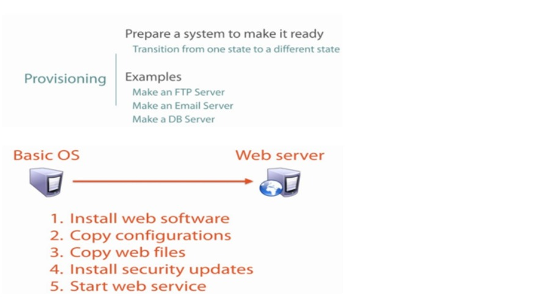

### 3)Orchestration

+ `L'automatisation` consiste à regrouper une liste de tâches et à les exécuter de haut en bas via un script, généralement comme l'installation d'un serveur `Web` via un script.
+ Alors que `l'orchestration` est le processus par lequel nous regroupons plusieurs tâches automatisées et les exécutons dans un ordre.
+ Par exemple, si nous orchestrons la configuration d'une application `Web` à plusieurs niveaux, nous devons configurer tous les services tels que les bases de données, les services `Web`, l'équilibrage à charge et la surveillance dans un ordre afin qu'ils soient validés lorsque toute la configuration est en cours d'exécution.
+ Tout d'abord, nous allons configurer le service de base de données afin que lorsque le service `Web` est configuré, il soit connecté à la base de données et validés.
+ Ensuite, nous pouvons configurer `LoadBalancer` et y ajouter des services `Web`.
+ La surveillance serait mise en place à la toute fin.
+ Désormais, les services de surveillance renverront les bons résultats de l'équilibreur de charge, du service `Web` et du service de base de données.
+ Ce processus est appelé `orchestration`, mais sans s'y limiter, et est effectué pour divers autres processus d'infrastructure informatique tels que le `cloud computing, la configuration du réseau, etc`.

+ Le mot `orchestration` vient du mot `Orchestra` où différents instruments sont joués dans un ordre approprié pour générer la belle mélodie.
+ Tout est question d'ordre, sinon vous n'obtenez pas de musique, tout ce que vous obtenez est du son et probablement pas si bon.

+ De même, `l'orchestration informatique` consiste à automatiser les tâches dans un ordre approprié.

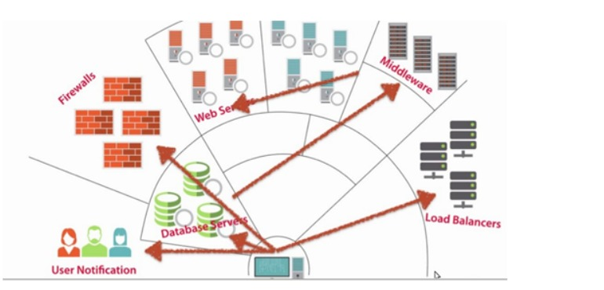

### 4) Comportement Idempotent

+ Les outils de gestion de configuration assurent le suivi de l'état des ressources afin d'éviter de répéter des tâches exécutées auparavant.
+ Si un package était déjà installé, l'outil ne tentera pas de l'installer à nouveau.
+ L'objectif est qu'après chaque exécution de provisionnement, le système atteigne (ou conserve) l'état souhaité, même si vous l'exécute plusieurs fois.
+ C'est ce qui caractérise ces outils comme ayant un comportement idempotent.
+ Un autre exemple serait que si nous essayons de transmettre un fichier à plusieurs serveurs ont déjà le même fichier avec le même conteneu, il ne va pas écraser le fichier, il l'ignorera simplement et le transmettra à leurs serveurs là où il se trouve une inadéquation.

# Introduction à Ansible

+ `Ansible` peut contrôler un grand nombre de serveurs et facilite les tâches d'administration et d'exploitation.
+ `Ansible` peut effectuer une gestion de configuration simple et une orchestration complexe, il possède toutes les fonctionnalités des outils de configuration et il est très facile à apprendre et à mettre en œuvre.
+ Il communique via les canaux `SSH` normaux afin de récupérer des informations sur des machines distantes, d'émettre des commandes et de copier des fichiers.
+ Pour notre `Windows` il utilise `winrm`.

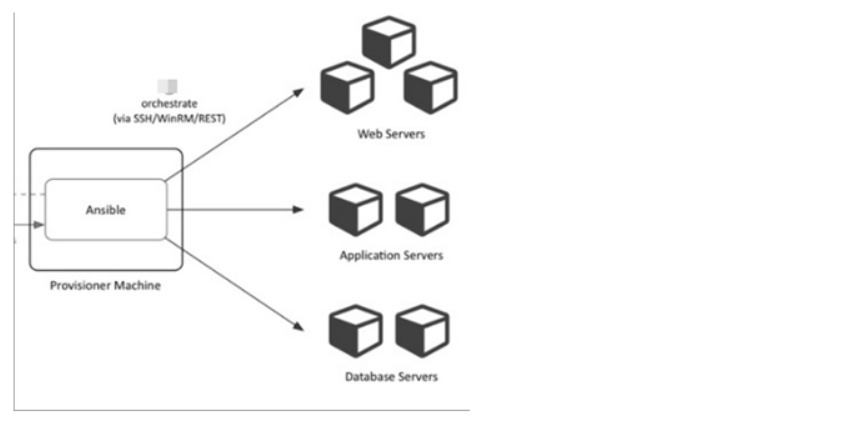

+ Puisqu'il utilise `SSH` pour `Linux et winrm` pour `Windows`, il n'est pas nécessaire de configurer quoi que ce soit du côté de l'agent, car `ssh` est fourni par défaut sur les serveurs `Linux` et donc comme `winrm` sur le serveurs `Windows`.

## Installation d'Ansible

+ `Ansible` gère par défaut les machines via le protocole `SSH`.
+ Une fois `Ansible` installé, il n'ajoutera pas de base de données et il n'y aura aucun daemons à démarrer ou à continuer d'exécuter.
+ Il vous suffit de l'installer sur une seule machine (qui pourrait facilement être un ordinateur portable) et il peut gérer tout une flotte de machines distantes à partir de ce point central.

### 1) Dernière version de yum

+ Les `RPM` sont disponibles auprès de `yum` pour les distributions `EPEL 6, 7` et `Fedora` actuellement prises en charge 

+ `Ansible` lui-même peut gérer les systèmes d'exploitation antérieurs contenant `Python 2.6 ou supérieur` (donc également `EL 6`).
+ Les utilisateurs de `Fedora` peuvent installer `Ansible` directement, mais si vous utilisez `RHEL` ou `CentOS` et l'avez pas déjà fait, configurez `EPEL`.

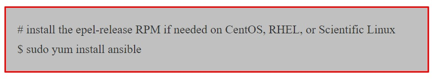

### 2) Dernière version Via Apt (Ubuntu)

+ Les versions `Ubuntu` sont disponibles dans un `PPA` ici. (`Windows` n'est pas pris en charge pour la machine de contrôle).
+ Pour configurer le `PPA` sur votre machine et installer `ansible`, exécutez ces commandes:

### 3) Quelques Notes Rapides :

+ La machine sur laquelle `ansible` est installé est appelée `Control Machine`.
+ `Ansible` est écrit en langage `Python`.
+ Vous devez disposer de python `2.6/2.7` pour installer `ansible` sur la machine de contrôle.
+ `Windows` n'est pas pris en charge pour la machine de contrôle.
+ `Ansible` peut automatiser les tâches sur les machines `Linux et Windows`

## Inventaire/Inventory

+ L'inventaire est un fichier texte dans lequel vous les informations sur l'hôte que vous souhaitez gérer avec `ansible`.
+ L'emplacement par défaut du fichier d'inventaire est `etc/ansible/hosts`.
+ Vous pouvez spécifier un autre fichier d'inventaire à l'aide de l'option `-i <paths>` sur la ligne de commande.
+ Pour cet exercice, nous avons besoin de deux serveurs `Linux`, vous pouvez faire tourner deux instances `centosvm ou ec2` pour vous entrainer.

### 1) Hôtes et Groupes

+ Créez le fichier nommé `inventor-dev` (le nom peut être n'importe quoi) et ajoutez l'entrée mentionnée ci-dessous.

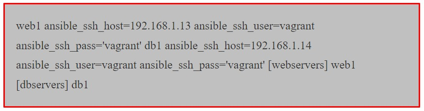

**Explication**

+ `web1` et `db1` sont les noms que nous avons donnés aux hôtes.
+ `ansible_ssh_host` est la variable et sa valeur est `l'addresse IP` du serveur.
+ La variable `ansible_ssh_user` contient le nom de l'utilisateur.
+ `ansible_ssh_password` contient le mot de passe.
+ `[webserver] & [dbservers]` est le nom du groupe qui peut contenir `n` nombre d'hôtes. Les noms de groupe sont mis entre crochets `[]`.

+ **Remarque**

    + Il n'est pas recommandé de mentionner le mot de passe dans le fichier d'inventaire; c'est juste pour un apprentissage initial plus tard, nous effctuerons un échange de clé `ssh`.

## Inventaire des systèmes de production/temps réel

+ Comme nous l'avons vu-dessus, nous mettons également le mot de passe en texte clair et les informations d'adresse IP dans l'inventaire.
+ C'est un vrai souci de sécurité, vous ne pouvez partager cet inventaire cet inventaire avec personne et vous ne pouvez pas non plus le suivre dans `VCS` comme `git`.
+ Nous avons de meilleures façons de gérer cette situation.

    + 1. Etant donné qu'Ansible utilise `SSH`, il est toujours recommandé d'effectuer un échange de clés `SSH` et d'autoriser la connexion du serveur `Ansible` aux noeuds qu'il gère.
        + Remarque : reportez-vous au chapitre `Bash Scripting` pour découvrir l'échange de clés SSH. De cette façon, nous n'avons pas besoin de mentionner le nom d'utilisateur et le mot de passe dans le fichier d'inventaire.
    + La prochaine chose est l'`adresse IP`, nous pouvons la gérer avec le fichier `/etc/hosts`. Mapppez `l'IP` au nom de l'hôte dans le fichier `/etc/hosts` et vous pouvez ensuite mentionner le nom d'hôte directement dans l'inventaire.

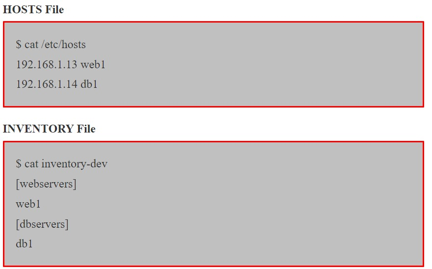

+ Alors maintenant, notre inventaire est très simple et contient uniquement le groupe et le nom d'hôte, ce qui est sûr.

## Commande ponctuelle

+ `Ansible` fournit une méthode rapide pour communiquer et exécuter les commandes sur des machines distantes/locales via des commandes `Adhoc`.

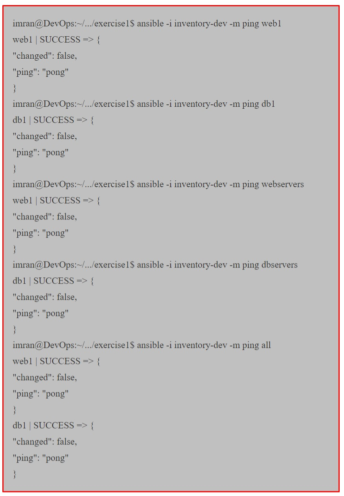

#### Explication

+ 1. Les commandes `ad hoc` sont exécutées en spécifiant la commande `ansible`.
+ 2. `-i <- inventor name>` indique à `ansible` de récupérer les informations sur l'hôte à partir de ce fichier, s'il n'est pas spécifié, `ansible` recherchera les informations sur l'hôte dans `/etc/ansible/hosts`.
+ 3. `-m` signifie le nom du module. `ping` est un module qui se connectera à l'hôte et vérifiera la connectivité.
+ 4. `Web1, db1, webserbvers, dbservers` sont le nom de l'hôte et du groupe sur lequel nous voulons exécuter la tâche, `all` signifie tous les hôtes du fichier d'inventaire.

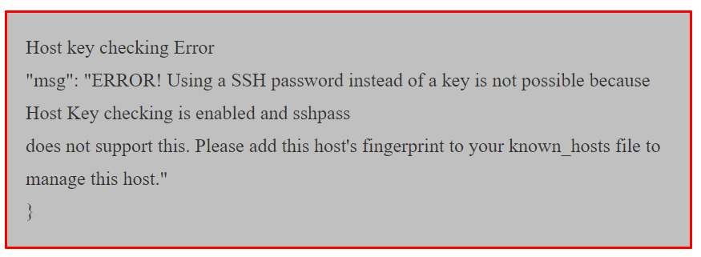

#### Solution :

+ Ouvrez le fichier `/etc/ansible/ansible.cfg` et décommentez `<<#host_key_checking=False` en supprimant `#sudo vi /etc/ansible/ansible.cfg`.

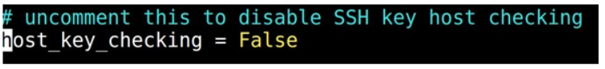

#### Groupe de groupes et variables de groupe

+ Les variables peuvent être appliquées à un groupe entier.

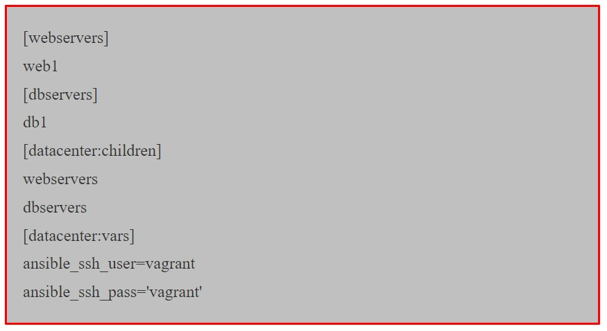

#### Explication

+ 1) [datacenter:children] indique que le `datacenter` est un groupe maître et en dessous nous spécifions d'autres noms de groupe.
+ 2) [datacenter:vars] est utilisé pour définir une variable au niveau du groupe, vous pouvez spécifier une variable sur n'importe quel groupe en spécifiant [gorupname:vars].

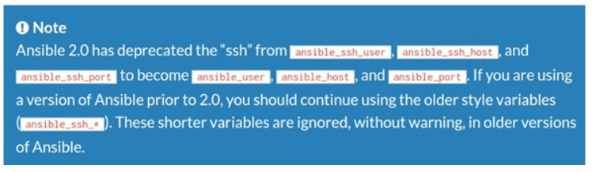

+ Général pour toutes les connexions : 

    + `ansible_host`
  
        + Le nom de l'hôte auquel se connecter, s'il est différent de l'alias que vous souhaitez lui donner.
  
    + `ansible_port`
  
        + Le numéro du port `ssh`, sinon `22`.
    
    + `ansible_user`
  
      + Le nom de l'utilisateur `SSH` par défaut à utiliser. Spécifique à la connexion `SSH`.
      
    + `ansible_ssh_pass`
  
      + Le mot de passe `ssh` à utiliser (ne stockez jamais cette variable en texte brut; utilisez toujours un coffre-fort. Voir variables et coffre-forts).
      
    + `ansible_ssh_private_key_file`
  
      + Fichier de clé privée utilisé par `ssh`. Utile si vous utilisez plusieurs clés et que vous ne souhaitez pas utiliser l'agent `SSH`.
      
## A propos des modules

+ Les `modules` (également appelés `plugins de tâches` ou `plugins de bibliothèque`) sont ceux qui effectuent le travail réel dans `ansible`, ce sont eux qui sont exécutés dans chaque tâche du playbook. Mais vous pouvez également en exécuter un seul à l'aide de la commande `ansible`.

#### Liste de tous les modules

+ [modules](https://docs.ansible.com/ansible/list_of_all_modules.html)

+ Voyons comment nous exécutons trois modules différents à partir de la ligne de commande :

#### Installation du paquet

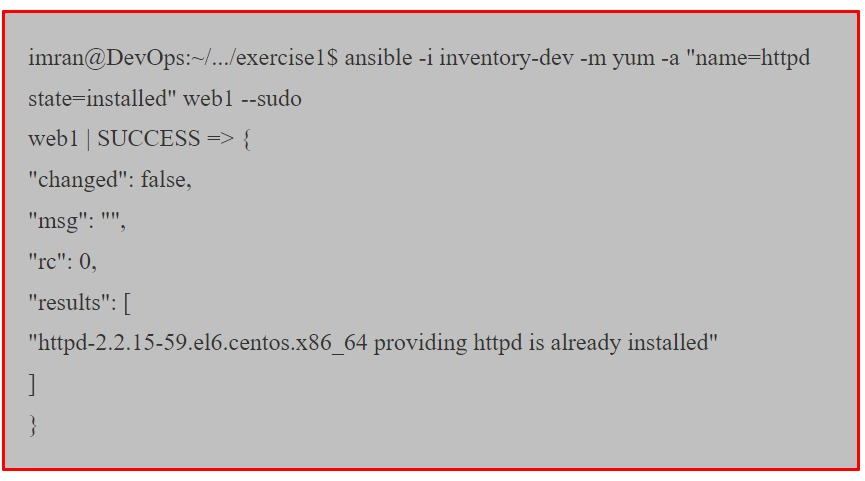

#### Explication

+ 1) `yum` est un module `ansible` qui gère les paquets sur les systèmes basés sur `Red Hat`. Pour les systèmes `Debian`, nous utilisons le module nommé `apt`.
+ 2) `-a` est utilisé pour fournir des arguments pour le module comme `name=httpd(key=value)`. La majorité des modules auront des arguments, certains arguments sont obligatoires comme l'argument `name` pour `yum`. `$ansible-doc yum` vous montrera la liste de tous les arguments du module `yum`.
+ 3) `--sudo` indique à `ansible` d'exécuter le module avec les privilèges `root`, l'utilisateur doit disposer des privilèges `sudo`, sinon le module échouera.

#### Service de démarrage

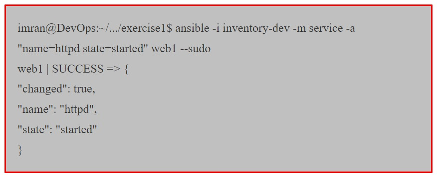

#### Sortie des commandes Ad Hoc

+ La sortie de retour de la commande `ansible` est au format `json`.

+ 1) `web1` est le nom des hôtes sur lesquels le module a été exécuté.
+ 2) Le statut est `SUCCESS`, ce qui signifie qu'il a été exécuté avec succès.
+ 3) `changed : true` signifie que l'exécution du module a apporté des modifications dans `Web 1`.
+ 4) `changed : false` signifie que le système est dans le même état souhaité que celui indiqué ci-dessous.

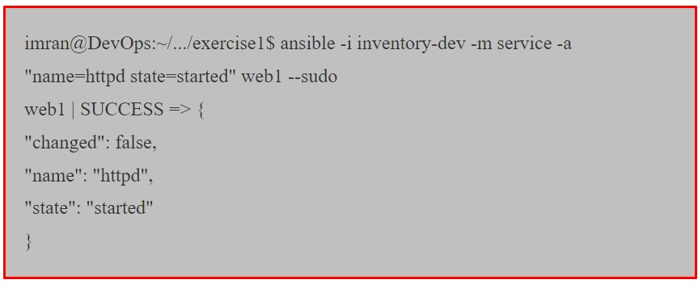

+ Le service `1.httpd` était déjà en cours d'exécution sur `web1`, donc même l'exécution à nouveau de la commande `adhoc` n'apportera aucune modification, c'est ce qu'on appelle le comportement `idempotent`.

#### Quelques exemples supplémentaires de modules avec des commandes Ad Hoc.

+ Pour transférer un fichier directement vers plusieurs serveurs : 

+ Le module de fichiers permet de modifier la propriété et les autorisations sur les fichiers. Ces mêmes options