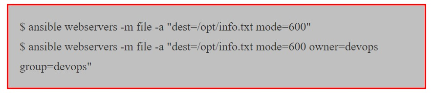

# Ansible

+ `Ansible` est un outil d'automatisation open source très puissante.
+ Il entre dans la catégorie des outils de gestion de configuration comme `Puppet, Chef, Salstack, etc`.
+ C'est le plus simple parmi tous les outils de gestion de configuration en termes d'approche facile à lire et à écrire et d'architecture `sans maître/sans serveur.
+ Etant simple à utiliser, il peut gérer les tâches les plus complexes en matière d'orchestration, où vous exécutez des tâches d'automatisation en chaîne et dans l'ordre sur plusieurs serveurs et appareils différents


## Gestion de Configuration

+ En termes simples, les outils qui gèrent la configuration des infrastructures informatiques telles que le système d'exploitation, les périphériques réseau, les applications, les logiciels et les services de cloud sont appelés `outils de gestion de configuration`.
+ La configuration de l'infrastructure informatique, comme les modifications des logiciels et du système d'exploitation, se produit de temps en temps.
+ Nous les ajoutons, les supprimons et les mettons à jour pour de bon.
+ Effectuer de telles modifications sur des centaines de serveurs et d'appareils prend beaucoup de temps et est sujet aux erreurs si vous le faites manuellement.
+ Ces outils vous aident à gérer et automatiser tous ces changements en toute simplicité et depuis un endroit centralisé.

### Certaines Fonctionnalités

#### 1) Configuration Centralisée

+ La configuration des différents serveurs et appareils est gérée à partir d'un serveur central.
+ Comme si vous gérez des serveurs `Web`, des serveurs de base de données ou des consommateurs, toutes leurs configurations telles que les logiciels, les correctifs, les fichiers de configuration, etc. peuvent être configurées sur le serveur central.
+ Lorsque le nœud souhaite mettre à jour les dernières modifications, il peut les récupérer depuis le serveur ou les transmettre au nœud depuis le serveur.

#### 2) Mise en vigueur

+ L'application de la configuration peut être la fonctionnalité la plus importante d'un outil de gestion de configuration.
+ En s'exécutant régulièrement et en s'assurant que la machine est configurée dans l'état souhaité, les outils de gestion de configuration empêchent la désynchronisation de la configuration.
+ La dérive de configuration peut se produire de différentes manières : `mises à jour, de packages, débogage en direct, collègues "utiles", etc`.
+ Quelle qu'en soit la cause, être capable de dire en toute confiance : "C'est ainsi que cette machine est configurée" est un excellent moyen pour raccourcir le temps de résolution des incidents et réduire les surprises.

#### 3)Abstraction

+ Les administrateurs systèmes maintiennent des environnements complètement homogènes.
+ Même si vous êtes une boutique entièrement `Linux`, vous avez probablement plusieurs distributions que vous prenez en charge, ou au moins plusieurs versions d'une distribution.
+ Avec les outils de gestion de configuration, de nombreuses implémentations d'une configuration spécifiques au système d'exploitation sont résumées pour vous.
+ Le même fichier de configuration peut être utilisé pour gérer, par exemple, l'installation d' `Apache HTTPD` sur les systèmes `Red Hat` et `Ubuntu`.

#### 4) Contrôle De Version Convivial.

+ Bien entendu, la meilleure façon de permettre la coopération est de tout avoir dans un système de version.
+ Tous les outils repertoriés ci-dessous utilisent une forme de texte pour la configuration.
+ Cela signifie que vous pouvez profiter des avantages de votre système de contrôle de version.

#### 5) Replication
+ La gestion de la configuration facilite la `réplication` des environnements avec exactement les mêmes logiciels et configurations.
+ Cela vous permet de créer efficacement un écosystème à plusieurs étapes, avec des serveurs de production, de développement et de test.


#### 6) Quelques Outils De Gestion De Configuration

+ `Puppet`
+ `Chef`
+ `Ansible`
+ `Slastack`
+ `CFEngine`


### Quelques Terminologies

#### 1) Gestion Du Changement

+ Il s'agit d'un processus lorsqu'une configuration spécifique de la machine ou du logiciel est modifiée.
+ Ce processus `CM` typique dans l'industrie informatique par un processus d'approbation du client ou de la direction supérieure, nous parlons bien sûr de systèmes de production.
+ Un seul changement sur 1, 10, ou 100 serveurs doit être effectués de manière très précise et efficace.
+ Par exemple, mettre à niveau un progiciel présentant un bug sur des centaines de serveurs ou redémarrer un service tel qu'un service `Web` pour prendre en compte toute nouvelle modification.

#### 2) Approvisionnement

+ En général, le `provisionnement` signifie `fournir ou rendre` quelque chose disponible dans l'infrastructure.
+ Par exemple, provisionner un serveur `Web` signifie installer et configurer des logiciels de service `Web` et leur configuration sur un système d'exploitation.
+ Provisionner une `instance cloud` signifie créer une `machine virtuelle cloud`


### 3)Orchestration

+ `L'automatisation` consiste à regrouper une liste de tâches et à les exécuter de haut en bas via un script, généralement comme l'installation d'un serveur `Web` via un script.
+ Alors que `l'orchestration` est le processus par lequel nous regroupons plusieurs tâches automatisées et les exécutons dans un ordre.
+ Par exemple, si nous orchestrons la configuration d'une application `Web` à plusieurs niveaux, nous devons configurer tous les services tels que les bases de données, les services `Web`, l'équilibrage à charge et la surveillance dans un ordre afin qu'ils soient validés lorsque toute la configuration est en cours d'exécution.
+ Tout d'abord, nous allons configurer le service de base de données afin que lorsque le service `Web` est configuré, il soit connecté à la base de données et validés.
+ Ensuite, nous pouvons configurer `LoadBalancer` et y ajouter des services `Web`.
+ La surveillance serait mise en place à la toute fin.
+ Désormais, les services de surveillance renverront les bons résultats de l'équilibreur de charge, du service `Web` et du service de base de données.
+ Ce processus est appelé `orchestration`, mais sans s'y limiter, et est effectué pour divers autres processus d'infrastructure informatique tels que le `cloud computing, la configuration du réseau, etc`.


+ Le mot `orchestration` vient du mot `Orchestra` où différents instruments sont joués dans un ordre approprié pour générer la belle mélodie.
+ Tout est question d'ordre, sinon vous n'obtenez pas de musique, tout ce que vous obtenez est du son et probablement pas si bon.


+ De même, `l'orchestration informatique` consiste à automatiser les tâches dans un ordre approprié.


### 4) Comportement Idempotent

+ Les outils de gestion de configuration assurent le suivi de l'état des ressources afin d'éviter de répéter des tâches exécutées auparavant.
+ Si un package était déjà installé, l'outil ne tentera pas de l'installer à nouveau.
+ L'objectif est qu'après chaque exécution de provisionnement, le système atteigne (ou conserve) l'état souhaité, même si vous l'exécute plusieurs fois.
+ C'est ce qui caractérise ces outils comme ayant un comportement idempotent.
+ Un autre exemple serait que si nous essayons de transmettre un fichier à plusieurs serveurs ont déjà le même fichier avec le même conteneu, il ne va pas écraser le fichier, il l'ignorera simplement et le transmettra à leurs serveurs là où il se trouve une inadéquation.


# Introduction à Ansible

+ `Ansible` peut contrôler un grand nombre de serveurs et facilite les tâches d'administration et d'exploitation.
+ `Ansible` peut effectuer une gestion de configuration simple et une orchestration complexe, il possède toutes les fonctionnalités des outils de configuration et il est très facile à apprendre et à mettre en œuvre.
+ Il communique via les canaux `SSH` normaux afin de récupérer des informations sur des machines distantes, d'émettre des commandes et de copier des fichiers.
+ Pour notre `Windows` il utilise `winrm`.


+ Puisqu'il utilise `SSH` pour `Linux et winrm` pour `Windows`, il n'est pas nécessaire de configurer quoi que ce soit du côté de l'agent, car `ssh` est fourni par défaut sur les serveurs `Linux` et donc comme `winrm` sur le serveurs `Windows`.


## Installation d'Ansible

+ `Ansible` gère par défaut les machines via le protocole `SSH`.
+ Une fois `Ansible` installé, il n'ajoutera pas de base de données et il n'y aura aucun daemons à démarrer ou à continuer d'exécuter.
+ Il vous suffit de l'installer sur une seule machine (qui pourrait facilement être un ordinateur portable) et il peut gérer tout une flotte de machines distantes à partir de ce point central.


### 1) Dernière version de yum

+ Les `RPM` sont disponibles auprès de `yum` pour les distributions `EPEL 6, 7` et `Fedora` actuellement prises en charge 

+ `Ansible` lui-même peut gérer les systèmes d'exploitation antérieurs contenant `Python 2.6 ou supérieur` (donc également `EL 6`).
+ Les utilisateurs de `Fedora` peuvent installer `Ansible` directement, mais si vous utilisez `RHEL` ou `CentOS` et l'avez pas déjà fait, configurez `EPEL`.


### 2) Dernière version Via Apt (Ubuntu)

+ Les versions `Ubuntu` sont disponibles dans un `PPA` ici. (`Windows` n'est pas pris en charge pour la machine de contrôle).
+ Pour configurer le `PPA` sur votre machine et installer `ansible`, exécutez ces commandes:


### 3) Quelques Notes Rapides :

+ La machine sur laquelle `ansible` est installé est appelée `Control Machine`.
+ `Ansible` est écrit en langage `Python`.
+ Vous devez disposer de python `2.6/2.7` pour installer `ansible` sur la machine de contrôle.
+ `Windows` n'est pas pris en charge pour la machine de contrôle.
+ `Ansible` peut automatiser les tâches sur les machines `Linux et Windows`


## Inventaire/Inventory


+ L'inventaire est un fichier texte dans lequel vous les informations sur l'hôte que vous souhaitez gérer avec `ansible`.
+ L'emplacement par défaut du fichier d'inventaire est `etc/ansible/hosts`.
+ Vous pouvez spécifier un autre fichier d'inventaire à l'aide de l'option `-i <paths>` sur la ligne de commande.
+ Pour cet exercice, nous avons besoin de deux serveurs `Linux`, vous pouvez faire tourner deux instances `centosvm ou ec2` pour vous entrainer.

### 1) Hôtes et Groupes

+ Créez le fichier nommé `inventor-dev` (le nom peut être n'importe quoi) et ajoutez l'entrée mentionnée ci-dessous.


**Explication**

+ `web1` et `db1` sont les noms que nous avons donnés aux hôtes.
+ `ansible_ssh_host` est la variable et sa valeur est `l'addresse IP` du serveur.
+ La variable `ansible_ssh_user` contient le nom de l'utilisateur.
+ `ansible_ssh_password` contient le mot de passe.
+ `[webserver] & [dbservers]` est le nom du groupe qui peut contenir `n` nombre d'hôtes. Les noms de groupe sont mis entre crochets `[]`.


+ **Remarque**

    + Il n'est pas recommandé de mentionner le mot de passe dans le fichier d'inventaire; c'est juste pour un apprentissage initial plus tard, nous effctuerons un échange de clé `ssh`.

## Inventaire des systèmes de production/temps réel

+ Comme nous l'avons vu-dessus, nous mettons également le mot de passe en texte clair et les informations d'adresse IP dans l'inventaire.
+ C'est un vrai souci de sécurité, vous ne pouvez partager cet inventaire cet inventaire avec personne et vous ne pouvez pas non plus le suivre dans `VCS` comme `git`.
+ Nous avons de meilleures façons de gérer cette situation.

    + 1. Etant donné qu'Ansible utilise `SSH`, il est toujours recommandé d'effectuer un échange de clés `SSH` et d'autoriser la connexion du serveur `Ansible` aux noeuds qu'il gère.
        + Remarque : reportez-vous au chapitre `Bash Scripting` pour découvrir l'échange de clés SSH. De cette façon, nous n'avons pas besoin de mentionner le nom d'utilisateur et le mot de passe dans le fichier d'inventaire.
    + La prochaine chose est l'`adresse IP`, nous pouvons la gérer avec le fichier `/etc/hosts`. Mapppez `l'IP` au nom de l'hôte dans le fichier `/etc/hosts` et vous pouvez ensuite mentionner le nom d'hôte directement dans l'inventaire.


+ Alors maintenant, notre inventaire est très simple et contient uniquement le groupe et le nom d'hôte, ce qui est sûr.


## Commande ponctuelle

+ `Ansible` fournit une méthode rapide pour communiquer et exécuter les commandes sur des machines distantes/locales via des commandes `Adhoc`.


#### Explication

+ 1. Les commandes `ad hoc` sont exécutées en spécifiant la commande `ansible`.
+ 2. `-i <- inventor name>` indique à `ansible` de récupérer les informations sur l'hôte à partir de ce fichier, s'il n'est pas spécifié, `ansible` recherchera les informations sur l'hôte dans `/etc/ansible/hosts`.
+ 3. `-m` signifie le nom du module. `ping` est un module qui se connectera à l'hôte et vérifiera la connectivité.
+ 4. `Web1, db1, webserbvers, dbservers` sont le nom de l'hôte et du groupe sur lequel nous voulons exécuter la tâche, `all` signifie tous les hôtes du fichier d'inventaire.


#### Solution :

+ Ouvrez le fichier `/etc/ansible/ansible.cfg` et décommentez `<<#host_key_checking=False` en supprimant `#sudo vi /etc/ansible/ansible.cfg`.


#### Groupe de groupes et variables de groupe

+ Les variables peuvent être appliquées à un groupe entier.


#### Explication

+ 1) [datacenter:children] indique que le `datacenter` est un groupe maître et en dessous nous spécifions d'autres noms de groupe.
+ 2) [datacenter:vars] est utilisé pour définir une variable au niveau du groupe, vous pouvez spécifier une variable sur n'importe quel groupe en spécifiant [gorupname:vars].


+ Général pour toutes les connexions : 

    + `ansible_host`
  
        + Le nom de l'hôte auquel se connecter, s'il est différent de l'alias que vous souhaitez lui donner.
  
    + `ansible_port`
  
        + Le numéro du port `ssh`, sinon `22`.
    
    + `ansible_user`
  
      + Le nom de l'utilisateur `SSH` par défaut à utiliser. Spécifique à la connexion `SSH`.
      
    + `ansible_ssh_pass`
  
      + Le mot de passe `ssh` à utiliser (ne stockez jamais cette variable en texte brut; utilisez toujours un coffre-fort. Voir variables et coffre-forts).
      
    + `ansible_ssh_private_key_file`
  
      + Fichier de clé privée utilisé par `ssh`. Utile si vous utilisez plusieurs clés et que vous ne souhaitez pas utiliser l'agent `SSH`.
      
## A propos des modules

+ Les `modules` (également appelés `plugins de tâches` ou `plugins de bibliothèque`) sont ceux qui effectuent le travail réel dans `ansible`, ce sont eux qui sont exécutés dans chaque tâche du playbook. Mais vous pouvez également en exécuter un seul à l'aide de la commande `ansible`.


#### Liste de tous les modules

+ [modules](https://docs.ansible.com/ansible/list_of_all_modules.html)


+ Voyons comment nous exécutons trois modules différents à partir de la ligne de commande :


#### Installation du paquet


#### Explication

+ 1) `yum` est un module `ansible` qui gère les paquets sur les systèmes basés sur `Red Hat`. Pour les systèmes `Debian`, nous utilisons le module nommé `apt`.
+ 2) `-a` est utilisé pour fournir des arguments pour le module comme `name=httpd(key=value)`. La majorité des modules auront des arguments, certains arguments sont obligatoires comme l'argument `name` pour `yum`. `$ansible-doc yum` vous montrera la liste de tous les arguments du module `yum`.
+ 3) `--sudo` indique à `ansible` d'exécuter le module avec les privilèges `root`, l'utilisateur doit disposer des privilèges `sudo`, sinon le module échouera.

#### Service de démarrage


#### Sortie des commandes Ad Hoc

+ La sortie de retour de la commande `ansible` est au format `json`.


+ 1) `web1` est le nom des hôtes sur lesquels le module a été exécuté.
+ 2) Le statut est `SUCCESS`, ce qui signifie qu'il a été exécuté avec succès.
+ 3) `changed : true` signifie que l'exécution du module a apporté des modifications dans `Web 1`.
+ 4) `changed : false` signifie que le système est dans le même état souhaité que celui indiqué ci-dessous.


+ Le service `1.httpd` était déjà en cours d'exécution sur `web1`, donc même l'exécution à nouveau de la commande `adhoc` n'apportera aucune modification, c'est ce qu'on appelle le comportement `idempotent`.

#### Quelques exemples supplémentaires de modules avec des commandes Ad Hoc.

+ Pour transférer un fichier directement vers plusieurs serveurs : 


+ Le module de fichiers permet de modifier la propriété et les autorisations sur les fichiers. Ces mêmes options peuvent également être transmises directement au module de copie : 



+ Assurez-vous qu'un package est installé, mais ne le mettez pas à jour :


+ Assurez-vous qu'un package est installé sur version spécifique :


+ Assurez-vous qu'un package est la dernière version :


+ Assurez-vous qu'aucun package n'est installé : 


## Configuration Ansible

+ Certains paramètres dans `Ansible` sont réglables via un fichier de configuration.
+ La configuration d'origine devrait être suffisante pour la plupart des utilisateurs, mais il peut y avoir des raisons pour lesquelles vous souhaiterez la modifier. 
+ Des modifications peuvent être apportées dans le fichier `ansible.cfg` global `/etc/ansible/ansible.cfg` ou vous pouvez créer votre propre `ansible.cfg` (repertoire de travail actuel) qui aura une priorité plus élevée sur le fichier global.


+ Ce fichier `ansible.cfg` se trouve au même endroit où se trouve le fichier d'inventaire.

#### Explication

+ `[default]` est la section principale d'`ansible.cfg`.
+ `hostfile` aura la valeur où se trouve le fichier d'inventaire s'il se trouve dans le repertoire de travail actuel, spécifiez le nom ou bien le chemin complet du fichier doit être spécifié. 
  + Après avoir mentionné le chemin d'inventaire dans `ansible.cfg`, il n'est pas nécessaire de transmettre le chemin d'inventaire avec l'option `-i`.
+ `host_key_checking=False` indique à ansible de ne pas vérifier les empreintes digitales de l'hôte avant d'effectuer `ssh` sur l'hôte. 
  + Il existe une longue liste de paramètres de configuration `Ansible` parmi lesquels vous pouvez choisir.
  + La liste des configurations ansible est spécifiée dans la [documentation Ansible](https:/docs.ansible/ansible/intro_configuration.html).


## Setup -Rassemble des informations sur les hôtes distants

+ Il peut être exécuté directement par `/usr/bin/ansible` pour vérifier quelles variables sont disponibles pour un hôte.
+ `Ansible` fournit automatiquement de nombreuses informations sur le système.


#### Output trimmed


## Playbook

+ Les `playbooks` sont les langages de configuration, de déploiement et d'orchestration d'`Ansible`.
+ Ils peuvent décrire une politique que vous souhaitez que vos systèmes distants appliquent ou un ensemble d'étapes dans un processus informatique général.
+ Si les `modules Ansible` sont les outils de votre atelier, les `playbooks` sont vos manuels d'instructions et votre inventaire d'hôtes est votre manière première.
+ A un niveau de base, les `playbooks` peuvent être utilisés pour gérer les configurations et les déploiements sur des machines distants.
+ A un niveau plus avancé, ils peuvent séquencer des déploiements à plusieurs niveaux impliquant et les équilibreurs de charge en cours de route.
+ Les `playbooks` sont une façon complètement différente d'utiliser `ansible` qu'en mode d'exécution de tâches `ad hoc`, et ce sont particulièrement puissants.
+ Bien que vous puissiez exécuter le programme principal `/usr/bin/ansible` pour diffuser votre configuration ou garantir que les configurations de vos systèmes distants sont conformes aux spécifications.

## Exemple de langage de playbook

+ Les `playbooks` sont exprimés au format `yaml` et ont un minimum de syntaxe, qui tente intentionnellement de ne pas être un langage de programmation ou un script, mais plutôt un modèle de configuration ou de processus.
+ Chaque `playbook` est composé d'une ou plusieurs `plays` dans une liste.
+ Le but d'un `plays` est de mapper un groupe d'hôtes à des rôles bien définis, représentés par des choses qu'`Ansible` appelle des `plays`.
+ A la base, une tâche n'est rien de plus qu'un appel à un module `ansible`.

#### Playbook pour les débutants


## Bases de YAML

+ Pour `Ansible`, presque tous les fichiers `yaml` commencent par une liste.
+ Chaque élément de la liste est une liste de paires `clés/valeur`, communément appelée `hachage` ou `dictionnaire`.
+ Nous devons donc savoir comment écrire des listes et des dictionnaires en `yaml`.
+ Il y a une autre petite bizarrerie dans `yaml`. Tous les fichiers `yaml`(indépendamment de leur association avec `Ansible` ou non) peuvent éventuellement commencer par `---` et se terminer par `...` Cela fait partie du format `yaml` et indique le début et la fin du document.
+ Tous les membres d'une liste sont des lignes commençant au même niveau d'indentation commençant par `"-"` (un tiret et un espace) :

```
# A list of tasty fruits
fruits : 
- Apple
- Orange
- Strawberry
- Mango
....
```

+ Un `dictionnaire` est représenté sous une forme simple `key:value` (les deux points doivent être suivis d'un espace).

```
# An employee record
martin:
name: Martin D'vloper
job: Developer
skill: Elite
```

+ Des structures de données plus compliquées sont possibles, comme des listes de dictionnaires, des dictionnaires dont les valeurs sont des listes ou un mélange des deux :

```
# Employee records
- martin: 
name: Martin D'vloper
job: Developer
skills:
- python
- perl
- pascal
- tabitha : 
name : Tabitha Bitumen
job : Developer
skills : 
- lisp
- fortran
- erlang
```

+ Les dictionnaires et les listes peuvent également être représentés sous une forme abrégée si vous le souhaitez vraiment : 

```
martin : {name: Martin D'vloper, job: Developer, skill: Elite}
fruits: ['Apple', 'Orange', 'Strawberry', 'Mango']
```

## Premier exercice du Playbook

+ Nous avons besoin de deux serveurs `centos 6` pour cet exercice.
+ Nous allons déployer un serveur `Web Apache` sur `web1` avec un exemple de site `Web` et une base de données `MySQL` sur le noeud `db1`.


#### Dossier d'inventaire


#### Fichier de configuration ansible


#### Manuel de jeu


#### Explication

+ `---` n'est pas obligatoire mais spécifie un début de fichier `YAML`.
+ `-hosts` : les serveurs `Web` représentent le nom de `l'hôte/du groupe` où les tâches seront exécutées. C'est le début d'une pièce de théâtre.
+ `become :` oui dire à ansible d'exécuter toutes les tâches avec les privilèges `sudo` l'ancienne version d'ansible avait `sudo:yes`.
+ `tasks :` spécifie la liste des tâches ou des modules qui seront sur le groupe de serveurs `Web`. 
+ `- name :` n'est pas une option obligatoire mais nous aidera toujours à lire le résultat de la tâche une fois exécutée. Si l'option `-name` n'est pas spécifiée, le nom du module doit commencer par un `-` par exemple `- yum`.
+ `yum :` est le nom du module qui sera exécuté avec les arguments `"name=httpd state=present"`. Si l'option `- name` n'est pas fournie, `yum` commencera par un `-` qui représente l'élément dans la liste `yaml` comme spécifié ci-dessous.


#### La documentation ansible donne une très belle description de chaque module avec des exemples.

+ https://docs.ansible/ansible/list_of_all_modules.html
+ https://docs.ansible.com/ansible/yum_module.html
+ https://docs.ansible.com/ansible/file_module.html
+ https://docs.ansible.com/absible/copy_module.html
+ https://docs.ansible.com/ansible/service_module.html
+ https://docs.ansible.com/ansible/iptables_module.html


1. Le module `iptables` modifie la règle du `pare-feu` du système, une connaissance d'`iptables` est requise pour comprendre ses options. Nous autorisons l'accès au port `80/http` de partout.

2. `hosts:dbservers` est le début d'une prochaine lecture qui sera exécuté sur le groupe `dbservers`. Comme mentionné précédemment, le playbook est la liste des `plays`, `os -hosts:dbservers` n'est que que le deuxième `play` du `playbook`. De même, nous pouvons avoir plusieurs jeux dans le même `playbook`.

3. Le module `mysql_db` est utilisé pour `créer/supprimer` des bases de données dans le `service mysql db`. https://docs.ansible.com/ansible/mysql_db_module.html.

4. Le module `mysql_user` est utilisé pour créer un utilisateur dans le `service mysql db`. https://docs.ansible.com/ansible/my_user_module.html.


+ **Remarque :** il est fortement recommandé de lire la documentation du module `ansible` pour en savoir plus sur les modules utilisés dans le `playbook`.

## Exécution du Playbook

+ La commande `ansible-playbook` est utilisée pour exécuter le `pàlaybook` comme indiqué ci-dessous.


#### Explication

1. `Playbook` est exécuté de haut en bas. Le premier jeu est `PLAY[webservers]`.

2. `TASK[Gathering Facts]` est une tâche par défaut qui exécute le module de configuration pour chaque hôte de `play`. Nous pouvons désactiver la collecte de faits en spécifiant `collect_facts` : `False` dans le `playbook`, comme indiqué ci-dessous.

```
---
- hosts : webservers
become : yes
gather_facts : False
tasks :
```

1. Si l'option `-name` est utilisée dans la tâche, elle en affectera le contenu.

2. modifié : `[web1]` est un message d'état pour la tâche, cela signifie que la tâche a apporté des modifications à l'hôte cible.

3. ok : `[web1]` signifie que la tâche n'a apporté aucune modification sur l'hôte cible. Cela pourrait être dû à la nature du module qui pourrait être destiné à la collecte d'informations comme le module de configuration. Cela pourrait également signifier que le système est dans le même état, par exemple `httpd` est déjà installé donc il retournera ok :

4. `PLAY RECAP` affiche le resumé de toutes les tâches exécutées sur tous les hôtes inacessible affcihe le nombre d'hôtes qui ne disposent pas d'une connectivité appropriée avec le serveur `ansible.failed` affiche le nombre de tâches ayant échoué.


## Variabes

#### Variables définies dans un playbook

+ les variables peuvent être définies avec une valeur personnalisée dans le `playbook`, comme indiqué ci-dessous.
+ Ces variables peuvent être utilisés dans le playbook en plaçant le nom de la variable entre `{{varname}}`.


#### Variables dans `Group_vars` et `Host_vars`

+ Ces variables sont spécifiques à l'inventaire et ne sont accessibles que par l'hôte et les groupes à partir de l'inventaire situé dans le repertoire actuel.
+ Vous pouvez avoir plusieurs inventaires dans une structure de repertoires distincte, comme indiqué ci-dessous.
+ Chaque inventaire peut avoir son propre repertoire `group-vars & host_vars` où nous stockons les variables.

#### Disposition du repertoire


+ Les variables peuvent être définies dans une structure. `gourp_vars` contient des variables qui peuvent être utilisées par tous les groupes. `host_vars` contient une variables spécifiques au nom d'hôte.

1. `group_vars/all` contiendra des variables qui pourront être utilisées par tous les hôtes du fichier d'inventaire.

2. Les variables `group_vars/dbservers` ne seront accessibles que pour le groupe `dbservers` et non pour tout autre hôte ou groupe de l'inventaire.

3. Les variables `host_vars/web1` ne seront accessibles que pour l'hôte `web1`et non pour tout autre hôte du fichier d'inventaire.


+ Pour l'hôte `web1`, nous avons créé des variables dans `host_vars/web1`.
+ La variable `host_vars` aura une priorité plus élevée, elle ignorera donc la variable utilisateur du fichier `group_vars/all` et la valeur de récupération du fichier `host_vars/web1`.


## Y compris les playbooks

+ Dans `site.yml`, nous appelons d'autres `playbooks`. Notez que c'est super court, car il inclut simplement d'autres `playbooks`.
+ N'oubliez pas que les `playbooks` ne sont rien de plus que des listes de jeux : 


## Stocker la sortie d'une commande

+ Le module `Register` est utilisé pour stocker la sortie de n'importe quel `module/commande` et la stocker dans une variable.


+ Le module shell est utilisé pour exécuter le registre des commandes shell Linux : le nom d'utilisateur stockera la sortie de commande shell dans la variable de nom d'utilisateur.
+ Le module de fichier attribue ici la propriété au fichier `/tmp/info.txt`.

## Module de débogage

+ Le `module de débogage` est utilisé pour imprimer des messages ou des valeurs de variables pendant l'exécution du playbook.
+ Cela aide à trouver le problème si les valeurs des variables ne sont pas correctement attribuées ou accessibles.


## Demande de saisie

+ Prenez les entrées de l'utilisateur lors de l'exécution du playbook avec `vars_prompt` et stockez-les dans une variable comme indiqué ci-dessous. 


## Gestionnaires

+ Les `gestionnaires` sont des tâches particulières. A première vue, cela ressemblera exactement à n'importe quelle autre tâche, mais la différence réside dans l'exécution.
+ Les tâches que nous avons vues jusqu'à présent sont exécutées au fur et à mesure que nous exécutons notre playbook, mais les gestionnaires se trouvant dans le même playbook ne seront exécutés que lorsqu'ils seront notifiés.
+ Une notification serait envoyée depuis la tâche si l'état de la tâche est modifié : vrai.
+ Par exemple, si nous copions un fichier à l'aide du module de copie, il est copié si le fichier de destination est différent ou absent.
+ Dans ce cas, l'état de la tâche est modifié : vrai, mais si le fichier de destination est identique à la source, le fichier n'est pas écrasé et l'état sera modifié : faux.
+ Ainsi, si nous informons un gestionnaire d'une telle tâche, le gestionnaire ne sera averti que si le fichier est copié, sinon il n'enverra pas de notification.


+ Dans le code ci-dessus, le gestionnaire nommé `Apache Restart` ne sera exécuté que lorsque le fichier `httpd.conf` sera copié, sinon il n'en informera pas le gestionnaire.


## Exécution conditionnelle

+ Parfois, vous souhaitez une tâche particulière à partir du `playbook` uniquement lorsqu'elle répond à certains critères. 
+ Ce serait similaire à la condition `if else` que nous avons dans le langage de programmation.
+ Dans `ansible`, nous avons le module `when` pour vérifier la condition, s'il renvoie vrai, la tâche est exécutée ou bien ignorée.
+ Par exemple, vous écrivez un `playbook` qui doit s'exécuter sur les systèmes `Ubuntu et CentOS`.
+ Comme nous le savons, si nous voulons installer un package dans `Ubuntu OS`, nous utilisons le module `apt`, pour les `CentOS` nous utilisons le module `yum`.
+ Donc, dans ce cas, notre tâche devrait vérifier une condition de la famille du système d'exploitation et exécuter `apt` s'il s'agit d'`Ubutnu et miam` lorsqu'il s'agit de `CentOS`.
+ Nous pouvons utiliser la variable de fait `ansible_os_family` qui stocke la valeur du type de système d'exploitation pour vérifier la condition.


## Modèle

+ Les `modèles` sont similaires au module de copie, il copie le fichier source vers la destination de l'hôte cible.
+ Mais ici, nous n'avons pas de fichiers statiques simples, nous avons un fichier modèle qui contient des variables qui contient des variables prédéfinies.
+ Ces variables peuvent être définies dans `playbook` ou `host-vars` ou `group_vars` etc.
+ Pendant que le module modèle est exécuté, il lira le fichier modèle et modifiera toutes les variables à sa valeur et copiera le fichier sur l'hôte cible.
+ Le fichier modèle se termine par l'extension `.j2` qui signifie modèles `Jinja2`.

<br/>

+ Nous utilisons le modèle pour copier le fichier modèle et la variable utilisée dans le fichier modèle peu être définie dans le `playbook` comme indiqué ci-dessous.


#### Un exemple de playbook avec des variables, des modules, des conditions et des gestionnaires
+ Nous avons besoin d'un noeud `vm centos 6` pour exécuter ce code.


#### Modèle pour le fichier Index.html


#### Détails des variables des modèles à partir du modèle httpd.j2
+ Vous pouvez obtenir le fichier `httpd.conf` après avoir installé `httpd sur centos`, son emplacement est `/etc/httpd/conf/httpd.conf`.
+ Copiez le contenu du fichier `httpd.conf` dans `templates/httpd.j2` et remplacez ses valeurs comme indiqué ci-dessous.
+ Les variables mentionnées ci-dessous sont définies dans le playbook


## Les rôles

+ Bien qu'il soit possible d'écrire un playbook dans un très gros fichier, vous souhaiterez éventuellement réutiliser les fichiers et commencer à organiser les choses.
+ Dans l'exemple ci-dessus, nous avons vu dans notre playbook que nous avons des variables, des tâches, des gestionnaires et modèles.
+ Cela peut croire lentement et finira par devenir difficile à lire et à gérer.
+ Les `rôles` sont une structure de répertoires dans laquelle nous distribuons le contenu de notre playbook principal dans une structure de répertoire appropriée.
+ Structure du répertoire des rôles.


+ Voici à quoi ils servent : 

  + `fichiers` : ce répertoire contient des fichiers qui doivent être transférés vers les hôtes que vous configurez pour ce rôle. Cela peut également inclure des fichiers de script à exécuter.
  + `gestionnaires` : tous les gestionnaires qui figuraient auparavant dans votre playbook peuvent désormais être ajoutés ce repertoire.
  + `méta` : ce repertoire peut contenir des fichiers établissent des dépendances de rôle. Vous pouvez répertorier les rôles qui doivent être appliqués pour que le rôle actuel puisse fonctionner correctement.
  + `modèles` : vous pouvez placer tous les fichiers qui utilisent des variables pour remplacer les informations lors de la création dans ce repertoire.
  + `tâches` : ce repertoire contient toutes les tâches qui seraient normalement dans un playbook. Ceux-ci peuvent référencer des fichiers et des modèles contenus dans leurs répertoires respectifs sans utiliser le chemin.
  + `vars` : les variables pour les rôles peuvent être spécifiées dans ce repertoire et utilisées dans vos fichiers de configuration.
  
+ Au lieu de regrouper tout notre code dans un seul playbook, nous pouvons le distribuer dans différentes structures de répertoires.
+ Par exemple, toutes les tâches de notre `playbook` seront placées dans le fichier `roles/apache:tasks/main.yml`, de même que les `vars` vont dans `vars/main.yml`.

<br/>

+ Nous pouvons créer la structure du répertoire des rôles avec la commande `ansible-galaxy`.

```
$ mkdir roles
$ cd roles/
.../roles$ ansible-galaxy init apache
```


```
$ cd...
```

#### Notre playbook principal appellera simplement le rôle par son nom et n'aura aucune tâche


+ Ce serait une bonne idée d'écrire d'abord un playbook intégré, puis nous pourrons commencer à copier le conte contenu du `playbook` principal dans la structure du répertoire des rôles.
+ A mesure que la complexité augmente, nous pourrons alors gérer la structure des rôles.

#### Exécution du playbook
+ Nous exécutons le playbook principal qui, à son tour, lira la structure du repertoire des rôles et exécutera toutes les tâches et gestionnaires pour nous.

```
$ ansible-playbook webservers.yml
```

+ Remplacer les variables des rôles. Nous avons peu de variables définies dans rôles `Apache` dans le fichier `roles/apache/vars/main.yml`.
+ Lorsque nous exécutons notre playbook, il utilise toutes ces variables définies mais nous pouvons remplacer ces variables sans modifier le contenu du fichier `roles/apache/vars/main.yml`.


+ Comme indiqué ci-dessus, nous transmettons maintenant un dictionnaire {} au lieu du nom du rôle.
+ Le dictionnaire contient des paires `clé=valeur` pour le nom de rôle et les variables que nous souhaitons remplacer.

## Galaxie Ansible

+ Jusqu'à présent, nous avons une idée de ce que sont les `rôles ansible` et de la manière de les créer.
+ Il existe de nombreux rôles prédéfinis sur le site `Web Ansible Galaxy` que nous pouvons télécharger et utiliser librement.
+ Par exemple, si nous voulons configurer le `service MySQL`, nous pouvons créer un rôle `MySQL` à partir dé zéro ou utiliser un rôle existant d'Ansible Galaxy.
+ https://galaxy.ansible.com/list#roles?page=1&page_size=10


#### Téléchargez le rôle de Galaxie Ansible

+ Le rôle par défaut est téléchargé dans le repertoire `/etc/ansible/roles`.
+ Une fois téléchargé, vous pouvez commencer à utiliser ce rôle à partir de votre playbook.
+ Reportez-vous à l'exemple donné dans la section `REDAME` du rôle.

```
$sudo ansible-galaxy install bennojov.mysql
```

+ téléchargement du rôle 'mysql', propriété de bennojoy
+ téléchargement du rôle depuis https://github.com/bennojoy/mysql/archive/master.tar.gz
+ extraction de `bennojoy.mysql` vers `/etc/ansible/roles/bennojoy.mysql`
+ `bennojoy.mysql` (master) a étét installé avec succès

## Ansible Vault - Gestion des secrets avec Ansible Vault.

+ La fonctionnalité de vault peut crypter n'importe quel fichier de données structurées utilisé par `Ansible`.
+ Cela peut inclure des variables d'inventaire `group_vars` ou `host_vars/` des variables par `include_vars` ou `var_files`, ou des fichiers de variables transmis sur la ligne de commande `ansible-playbook` avec `-e@file.yml` ou `e@file.json`.
+ Les variables de rôle et les valeurs par défaut sont également incluses! Nous pouvons stocker nos mots de passe/secrets cryptés dans `ansible-vault`.

+ Nous allons créer un `vault` dans le repertoire `group_vars/all`.


```
mkdir -p group_vars:all
cd group_vars/all
export EDITOR=vim
ansible-vault create vault
```

+ Donnez un mot de passe de vault et placez les variables que vous souhaitez crypter.
+ L'exemple ci-dessous de stockage du mot de passe `Tomcat` est mentionné.

```
---
vault_tomcat_pass : <-Enter password for tolcat here>
```

+ Reportez-vous à `vault_tomcat_pass` dans le fichier `group_vars/all/vars`

```
cd group_var/all/
vi vars

---
tomcatuser tomcat
tomcatpass : "{{vault_tomcat_pass}}"
```


+ Si vous exécutez votre playbook maintenant là où vous utilisez `tomcatpass`, vous devriez obtenir une erreur commise ci-dessous.
+ Par exemple, j'utilise la variable `{{tomcatpass}}` dans mon playbook `tomcat.yml`

```
# ansible-playbook tomcat.yml
ERROR! Decryption failed
ERROR!A vault password must be specified
```

+ Vous pouvez l'option `--ask-vault-pass` lors de l'exécution du playbook qui vous demandera le mot de passe `vault`.

```
# ansible-playbook tomcat.yml --ask-vault-pass
```


+ Vous pouvez également utiliser un fichier dans lequel vous spécifiez le mot de passe `vault`.
+ Disons que `vaultpass` est notre mot de passe `vault`.

```
# echo "vaultpass">~/.vault_pass.txt
# chmod 0600 ~/.vault_pass.txt
```

#### Example d'exécution


#### Modification de vault
+ Pour modifier un fichier chiffré sur place, utilisez la commande `ansible-vault edit`.
+ Cette commande décryptera le fichier dans un fichier temporaire et vous permettra de modifier le fichier, de le sauvegarder une fois terminé et de supprimer le fichier temporaire.

```
ansible-vault edit vault
```

## Boucle dans Ansible

+ Pour économiser un peu de saisie, les tâches répétées peuvent être écrites en raccourci comme ceci : `with_items` est une `boucle for` ansible qui s'exécute sur une liste d'éléments.
+ `with_items` lors de l'exécution de la variable de retour nommée `item` qui contient la valeur de l'élément dans la liste.


+ Si vous avez défini une liste `YAML` dans un fichier de variables, ou la section `vars`, vous pouvez également faire : `with_items : "{{somelist}}` ce qui précède serait l'équivalent de : 


+ Les modules `yum` et `apt` utilisent `with_items` pour exécuter moins de transactions du gestionnaire de packages.


## Configurer Apache à l'aide d'Ansible

#### Introduction

+ `Apache` est l'un des serveurs `Web` les plus populaires actuellement sur Internet.
+ Il est facile à installer et à configurer sur les distributions `Linux` comme `Ubuntu` et `Debian`, car il est fourni dans les référentiels de packages et inclut une configuration par défaut qui fonctionne immédiatement.


#### Conditions Préalables

+ Nous allons installer `Ansible` sur un serveur `Ubuntu` et l'utiliser pour configurer `Apache` sur un deuxième serveur.
+ Pour ce tutoriel, vous aurez besoin de :

    + Deux serveurs `Ubuntu` : un serveur maître avec `Ansible` et un secondaire qui exécutera `Apache` configuré via `Ansible`
    + `Ansible` installé sur le serveur maître
    + Echange des clés `SSH` pour autoriser le maître à se connecter au serveur secondaire. Reportez-vous au chapitre sur les `scripts Bash` pour l'échange de clés `SSH`.
    + Configurez manuellement un fichier d'hôtes locaux sur votre machine locale (en utilisant l'adresse IP de votre serveur secondaire), afin de configurer et d'utiliser les hôtes virtuels qui seront configurés.
  
**Configuration d'Ansible**

+ Créez un nouveau répertoire

```
$mkdir ansible-repo
```

+ Accédez au nouveau répertoire

```
$ cd ~/.ansible-repo/
```

+ Créez un nouveau fichier appelé `ansible.cfg` et ouvrez-le pour le modifier

```
$ vi ansible.cfg
```

+ Dans ce fichier, nous souhaitons ajouter l'option de configuration du fichier hôte avec la valeur des hôtes, dans le groupe `[defaults`. 
+ Copiez ce qui suit dans le fichier `ansible.cfg`, puis enregistrez-le et fermez-le

```
[defaults]
inventory=hosts
```

+ Créez un fichier hosts (inventaire) et ouvrez-le pour le modifier

```
$ vi hosts
```

+ Copiez ce qui suit dans le fichier hosts.


```
[apache]
apache_server_ip ansible_ssh_user=username
```

+ Ceci spécifie un groupe d'hôtes appelé `Apache` qui contient un hôte.
+ Remplacez `apache_server_ip` par le nom d'hôte ou l'adresse IP du serveur secondaire, et le nom d'utilisateur par votre nom d'utilisateur `SSH`.
+ `Ansible` devrait maintenant pouvoir se connecter à votre serveur. Testez la connectivité avec le module `ping`.

```
$ ansible apache -m ping
```

+ Le résultat devrait ressembler à ceci :

```
192.168.1.51 | success >> {

"changed":false;
"ping":"pong"
}
```

+ Un autre module `Ansible` utile pour les tests est le module de commande.
+ Il exécute des commandes personnalisées sur l'hôte et renvoie les résultats.
+ Pour exécuter la commande à l'aide de `echo`, une commande `Unix` qui renvoie une chaîne au terminal, entrez la commande suivante :

```
$ ansible apache -m command -a "/bin/echo hello devops"
```

+ Le résultat devrait ressembler à ceci :

```
192.168.1.51 | success | rc=0 >> 
hello devops
```

**Installation d'apache**

+ Nous allons écrire la tâche pour installer le serveur Web Apache dans le playbook.
+ Pour installer Apache via Ansible, nous utilisons le module d'Ansible. 
+ Le module `Apt` contient de nombreuses options pour les fonctionnalités spécialisées `apt-get`.
+ Les options qui nous intéressent sont : 
    + `name` : Le nom du package à installer, soit un nom de package unique, soit une liste de packages.
    + `state` : Accepte soit le dernier, soit l'absent, soit le présent. `Latest` garantit que la dernière version soit installée, présent verifie simplement qu'elle est installée et absent la supprime si elle est installée.
    + `update_cache` : met à jour le cache (via `apt-get update`) s'il est achevé, pour garantir qu'il est à jour.
  
+ Créons maintenant notre playbook `apache.yml` avec le module `apt`. Ouvrez le fichier `apache.yml` pour le modifier.

```
$ vi apache.yml
```

+ Copiez-y le texte suivant :

```
--- -hosts:apache become:yes tasks:-name:install apache2 apt:name=apache2 update_cache=yes state=latest
```

+ La ligne `apt` installe le package `apache2(name=apache2)` et garantit que nous avons mis à jour le cache `(update_cache=yes)`
+ Maintenant, exécutez le playbook

```
$ ansible-playbook apache.yml --ask-sudo-pass
```

+ L'indicateur `--ask-sudo` vous demandera le mot de passe `sudo` aur le serveur secondaire.
+ Cela est nécessaire, car l'installation nécessite les privilèges `root`; les autres commandes que nous avons exécutées jusqu'à présent ne l'ont pas fait.
+ La sortie devrait ressembler à ceci :


+ Si vous visitez le nom d'hôte ou l'adresse `IP` de votre serveur secondaire dans votre navigateur, vous devez maintenant obtenir une page par défaut `Apache2 Ubuntu` pour vous accueillir.
+ Cela signifie que vous disposez d'une installation `Apache` fonctionnelle sur votre serveur et que vous ne vous y êtes pas encore connecté manuellement pour exécuter une commande.

**Configuration des modules Apache**

+ Maintenant qu'`Apache` est installé, nous devons activer un module pour qu'il soit utilisé par `Apache`.
+ Assurons-nous que le module `mod_rewise` est activé pour `Apache`.
+ Via `SSH`, cela peut être fait facilement en utilisant `a2enmod` et en redémarrant `Apache`
+ Cependant, on peut aussi le faire très facilement avec `Ansible` en utilisant le module `apache_module` est un gestionnaire de tâches pour redémarrer `apache`
+ Le module `apache2_module` prend deux options : 

1. `name` -- le ,om du module à activer, tel que `rewrite`

2. `state` -- Présent ou absent, selon que le module doit être activé ou désactivé.

+ Ouvrez `apache.yml` pour le modifier.

```
$ vi apache.yml
```

+ Mettez à jour le fichier pour inclure cette tâche. Le fichier devrait maintenant ressembler à ceci : 


+ Nous devons redémarrer `Apache2` une fois que le module activé.
+ Une option consiste à ajouter une tâche pour redémarrer `Apache2`, mais nous ne voulons pas qu'elle s'exécute à chaque fois que nous appliquons notre `playbook`.
+ Pour contourner ce problème, nous devons utiliser un gestionnaire de tâches.
+ La façon dont fonctionnent les gestionnaires est qu'une tâche peut être invitée à avertir un gestionnaire lorsqu'elle a changé, et le gestionnaire ne s'exécute que lorsque la tâche a été modifié.
+ Pour ce faire, nous devons ajouter l'option `notify` dans la tâche `apache2_module`, puis nous pouvons utiliser le module de service pour redémarrer apache2 dans un gestionnaire.


+ Maintenant, réexécutez le playbook

```
$ ansible-playbook apache.yml --ask-sudo-pass
```

+ La sortie devrait ressembler à : 


+ Ca a l'air bien jusqu'à présent. Maintenant, exécutez à nouveau la commande et il ne devrait y avoir aucun changement, et la tâche de redémarrage ne sera pas repertoriée.
+ Configuration des options d'`Apache` Maintenant que nous avons une installation `Apache` fonctionnelle, avec nos modules requis activés, nous devons configurer `Apache`.

<br/>

+ Par, défaut `Apache` écoute sur le port `80` tout le trafic `HTTP`.
+ Pour les besoins du didacticiel, supposons que nous souhaitons qu'Apache écoute sur le port `9090`.
+ Avec la configuration `Apache` par défaut sur `Ubuntu x64`, deux fichiers doivent être mis à jour :


+ Pour ce faire, nous pouvons utiliser le module `lineinfile`.
+ Il vous permet d'effectuer toutes sortes de modifications sur un fichier existant sur l'hôte.
+ Pour cet exemple, nous utiliserons les options suivantes : 

  + `dest` --- Le fichier à mettre à jour dans le cadre de la commande.
  + `regexp` -- Expression régulière pour correspondre à une ligne existante à remplacer.
  + `line` -- La ligne à insérer dans le fichier, soit en remplacement de la ligne d'expression rationnelle, soit en tant que nouvelle ligne à la fin.
  + `state` -- Présent ou absent
  
+ Ce que nous devons faire pour mettre à jour le port `80 à 9090`, c'est rechercher les lignes existantes qui définissent le port 80 et les modifier pour définir le port `9090`.
+ Ouvrez le fichier `apache.yml` pour le modifier 

```
$ vi apache.yml
```


+ Il est important de noter que nous devons également redémarrer `Apache2` dans le cadre de ce processus, et que nous pouvons réutiliser le même gestionnaire, mais le gestionnaire ne sera déclencher qu'une seule fois malgré plusieurs tâches modifiées.
+ Maintenant, exécutez le `playbook`


