# Docker

## L'ère des applications

+ Dans le monde d'aujourd'hui, nous sommes tous entouré d'applications et de sites Web.
+ Nous utilisons nos smartphones et nos ordinateurs pour naviguer sur `Internet` et utiliser tous les `services Web` via nos applications mobiles ou nos navigateurs.
+ Tous ces millions ded données basées sur le `Web` proviennent de lieux éloignés de certains ordinateurs situés dans un centre de données.
+ Nous les appelons généralement des serveurs; ces serveurs pourraient être ces machines physiques que nous voyons accumulées dans un centre de données avec toutes ces lumières et câbles clignotants.
+ Si nous prenons quelques exemples comme `Amazon, Google et Netflix, Goibibo etc`, toutes ces entreprises fonctionnent sur des applications ou on peut dire que leurs applications sont leur affaire.
+ Cela souligne un point très important:nous ne pouvons pas séparer leur activité de leur application.

 

+ L'application a besoin de ressources de calcul pour s'exécuter sur lequel elle a hébergé son application.
+ Autrefois, lorsque nous n'avions `ni virtualisation ni cloud computing`, nous les utilisons pour les exécuter directement sur un serveur physique.
+ Ainsi, si je souhaite héberger une application sur 10 serveurs Web, j'ai besoin de 10 serveurs physiques sous équilibreur de charge servant le trafic Web.

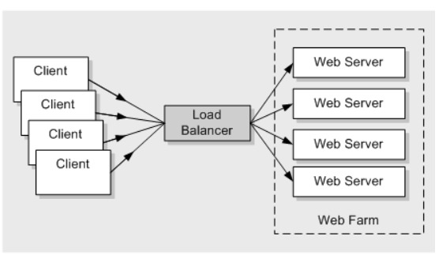

+ Ces serveurs sont très chers et nous devons effectuer beaucoup de maintenance pour eux.

    + Nous devons nous procurer un serveur. Un processus par lequel nous passons une commande pour l'achat.
    + Des dépenses en capital ou `CapEx` sont requises.
    + Il existe des dépenses opérationnelles `(OpeEx)`, comme le refroidissement, l'alimentation, les administrateurs pour maintenir cette batterie de serveurs.
    + Donc, si je souhaite augmenter la capacité et ajouter plus de serveurs, je dois consacrer du temps et de l'argent au processus mentionné ci-dessus.
    + Ceci est très courant car l'entreprise démarre à partir d'une très petite base d'utilisateurs, uis le trafic des utilisateurs/consommateurs augmente si l'entreprise se porte bien.
    + Nous déployons une application par serveur car nous souhaitons que nos applications soient isolées.
    + Par exemple, si nous avons besoin d'une application Web, d'une application de base de données et quelques applications backend.
    + Nous pourrions finir par avoir plusieurs systèmes exécutant chacun une seule instance de cette application.

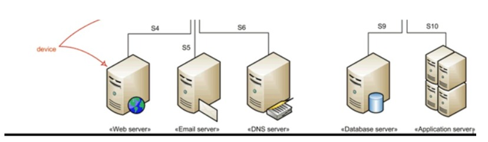

 

+ Ainsi, chaque fois que nous avons besoin d'exécuter une nouvelle application, nous achetons des serveurs, installons le système d'exploitation et configurons sur celui-ci.
+ Et la plupart du temps, personne ne connaissait les exigences de performances de la nouvelle application ! Cela signifiait que le service informatique devait faire des suppositions lors du choix du modèle et de la taille des serveurs à acheter.
+ En conséquence, le service informatique a fait la seule chose raisonnable : il a acheté de gros serveurs rapides et très résilients.
+ Après tout, la dernière chose que quiconque souhaitait - y compris l'entreprise - était des serveurs sous-alimentés.
+ La plupart du temps, les ressources de calcul de ces serveurs physiques seront sous-alimentés.
+ La plupart du temps, les ressources de calcul de ces serveurs physiques seront utilisées, à la hauteur de 5 à 10% de leur capacité potentielle. Un gaspillage du capital et des ressources de l'entreprise.

# Révolution de la Virtualisation

+ `VMware` a donné au monde de la `machine virtuelle` et tout a changé après cela.
+ Nous pourrions désormais isolées dans des systèmes d'exploitation distincts mais sur le même serveur physique.
+ **Dans le chapitre sur la Virtualisation. Nous avons discuté des avantages et des fonctionnalités de la virtualisation, l'architecture de l'hyperviseur.**

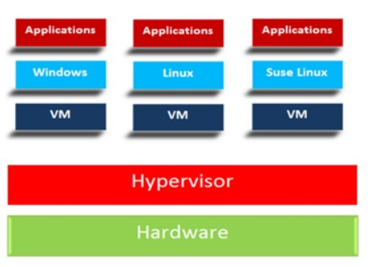

# Problèmes avec l'architecture de l'hyperviseur.

+ Nous savons désormais que chaque `VM` possède son propre `systèmes d'exploitation`, ce qui pose problème.
+ Le système d'exploitation a besoin d'une bonne quantité de ressources telles que le `processeur, la mémoire, le stockage, etc`.
+ Nous maintenons également les licences du système d'exploitation et les soignons régulièrement, comme les correctifs, les mises à niveau et les modifications de configuration.
+ Nous voulions héberger une application mais avons collecté une bonne quantité de graisse sur notre infra, nous gaspillons ici `des OpEx et des CapEx`.
+ Pensez à expédier une machine virtuelle d'un endroit à un autre endroit, cela semble une excellente idée.
+ Si nous pouvons tout regrouper dans une image virtuelle et l'expédier afin que l'autre personne n'ait pas besoin de configurer la machine virtuelle à partir de zéro, elle puisse directement exécuter la machine virtuelle à partir de l'image.
+ Nous l'avons fait dans le chapitre `Vagrant` où nous téléchargeons la machine virtuelle préinstallée et venons de l'exécuter.

 

+ Mais ces images sont lourdes et volumineuses car elles contiennent le système d'exploitation avec l'application.
+ Les démarrer est un processus lent. Donc, étant portable, il n'est pas pratique d'expédier la machine virtuelle à chaque fois.
+ Livraison d'une application bundle avec toutes les dépendances/bibliothèques dans une image sans `OS`.
+ Hmm, on dirait que nous avons résolu un gros là-bas. C'est ce que sont les conteneurs.
+ Pensez à configurer une application dans une `VM ou une machine physique`.
+ Nous avons besoin de la configuration du `système d'exploitation, des dépendances, de l'application déployée` et de quelques modifications de configuration dans `le système d'exploitation, des dépendances, de l'application déployée et de quelques modifications de configuration dans le système d'exploitation`.
+ Nous suivons une serie d'étapes pour configurer tout cela, comme la configuration d'une `pile LAMP`.
+ Si nous pouvions regrouper tous ces étapes dans un seul conteneur et l'expédier, les administrateurs n'auraient alors pas besoin d'effectuer de configuration sur la cible, tout ce que nous avons à faire est d'extraire `une image de conteneur` et de l'exécuter.

# Conteneurs

+ Si les `machines virtuelles` sont une `virtualisation matériele`, alors les `conteneurs` sont une `virtualisation du système d'exploitation`.7
+ Nous n'avons pas besoin d'un véritable système d'exploitation dans le conteneur pour installer notre application.
+ Les applications à l'intérieur des conteneurs dépendent du `noyau du système d'exploitation hôte` sur lequel elles sont exécutées. 
+ Ainsi, si j'ai hébergé une application `Java` comme à l'intérieur du conteneur, elle utilisera toutes les bibliothèques `Java` et les `fichiers de configuration des données du conteneur`, mais pour les ressources de calcul, elle s'appuie sur le `noyau du système d'explotation hôte`.
+ Les conteneurs sont comme les autres processus qui s'exécutent dans un système d'exploitation, mais ils sont isolés, leurs processus, fichiers, bibliothèques et configurations qui s'exécutent dans les limites du conteneur.
+ Les conteneurs ont également leur propre `arborescence de processus` et leur `propre réseau`.
+ Chaque `conteneur` aura une `adresse IP et un port` sur lesquels l'application à l'intérieur du conteneur est exécutée.
+ Cela peut ressembler à une machine virtuelle, mais ce n'est pas le cas, rappelez-vous que la `VM` a son propre `système d'exploitation` et que les `conteneurs n'en ont pas`.

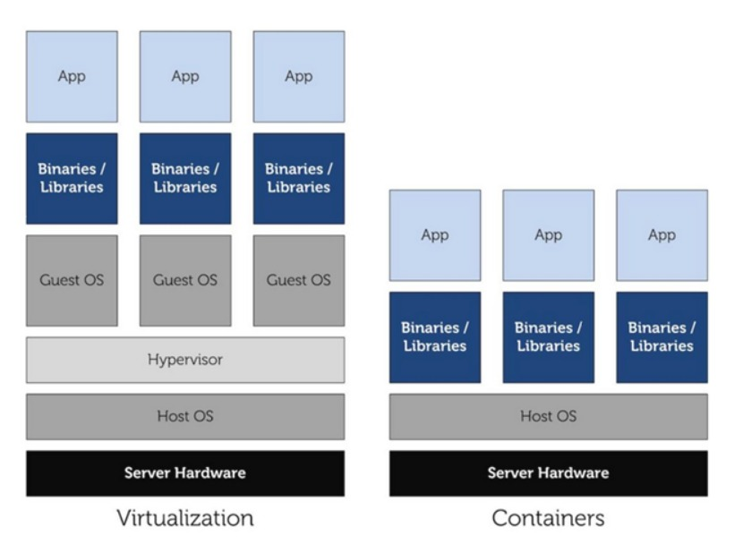

+ Les `conteneurs` sont très `légers` car ils ne contiennent que `les bibliothèques et les applications`. 
+ Cela signifie donc que moins de ressources de calcul sont utilisées et cela signifie plus d'espace libre pour exécuter les conteneurs.
+ Ainsi, en termes de ressources, nous économisons également `CapEx et OpEx`.
+ Les `conteneurs` ne sont pas une technologie moderne, ils existaient autour de nous sous différentes formes et technologies.
+ Mais `Docker` l'amené à un tout autre niveau en matière de `construction, d'expédition et de gestion de conteneurs`.

# Docker

+ `Docker, Inc.` a commencé sa vie en tant que fournisseur de plateforme `service(PaaS)` appelé `dotCloud`.
+ En coulisses, la plateforme `dotCloud` exploitait les `conteneurs Linux`.
+ Pour les aider à créer et à gérer ces conteneurs, ils ont construit un outil interne qu'ils ont surnommé `Docker`. Et c'est ainsi qu'est né `Docker`.
+ En 2013, l'activité `dotCloud Paas` étant en difficulté et l'entreprise avait besoin d'un nouveau souffle.
+ Pour y parvenir, ils ont embauché `Ben Golub` en tant que nouveau `PDG`, ont rebaptisé l'entreprise `Docker, Inc.`, se sont débarrassés de la plateforme `dotCloud PaaS` et ont commencé un nouveau voyage avec pour mission d'apporter `Docker et les conteneurs` au monde.
+ `Docker` s'appuie sur les fonctionnalités du `noyau Linux`, telles que `les espaces de noms et les groupes de contrôle`, pour garantir l'isolation des ressources et pour empaqueter une application avec ses dépendances.
+ Ce regroupement des dépendances permet à une application de s'exécuter comme prévu sur différents `systèmes d'exploitation Linux`.
+ C'est cette portabilité qui a suscité l'intérêt des développeurs et des administrateurs système.

 

+ Mais quand quelqu'un dit `Docker`, il peut faire référence à au moins trois choses :

  + `Docker, Inc.` la société
  + `Docker` la technologie d'exécution et d'orchestration du conteneur
  + `Docker` le projet open source

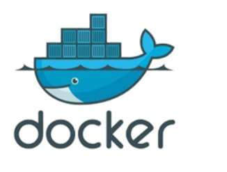

+ Lorsque la plupart des gens parlent de `Docker`, ils font généralement référence au `Docker Engine`.
+ Le `moteur Docker` s'exécute et orchestre les `conteneurs`.
+ A partir de maintenant, nous pouvons penser le `moteur Docker` comme un `hyperviseur`.
+ De la même manière que la technologie d'hyperviseur qui exécute les machines virtuelles, `le moteur Docker` est le moteur d'exécution principal des `contenrus` qui exécute les conteneurs.

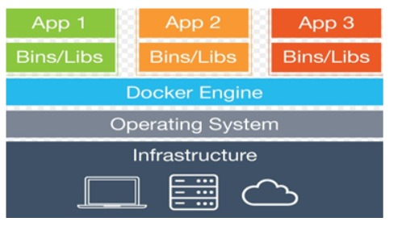

+ Il existe de nombreuses technologies Docker qui sont intégrés au `moteur Docker` pour automatiser, orchestrer ou gérer les `conteneurs Docker`.

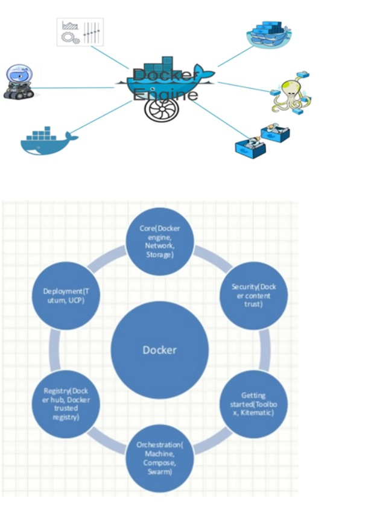

# Installation De Docker

+ Docker peut être installé sur les systèmes d'exploitation `Windows, Mac et Linux`.
+ Nous allons installer `Docker` sur le serveur `Ubuntu 16.04` dans cette partie. `Docker` peut être installé directement à partir des référentiels `Ubuntu`, mais il se peut qu'il ne s'agisse de la dernière version du `moteur Docker`.
+ Pour installer la dernière et la meilleure version, nous l'installerons à partir du référentiel officiel Docker.

 

**Désinstaller les anciennes versions**

+ Les anciennes versions de `Docker` étaient appelées `docker ou docker-engine`. Si ceux-ci sont installés, désinstallez-les :

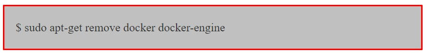

+ Ce n'est pas grave si `apt-get` signale qu'aucun de ces packages n'est installé. Ajoutez la clé `GPG` pour le référentiel `Docker`.

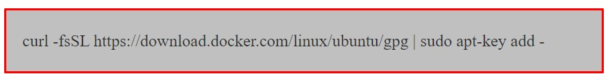

+ Ajouter le référentiel `Docker`

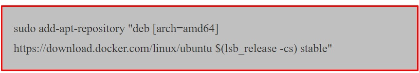

+ Mettre à jour le package

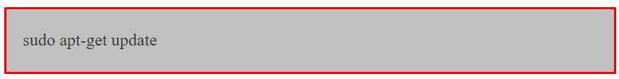

+ Installer `Docker`

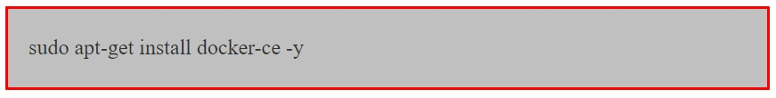

+ `Docker` doit maintenant être installé, le `daemon` et le processus activé pour démarrer au démarrage.
+ Vérifiez qu'il fonctionne :

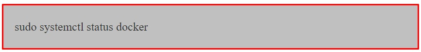

+ Les commandes `Docker` peuvent être exécutées par l'utilisateur `root` ou en fournissant `sudo`.
+ Nous pouvons également exécuter les commandes `docker` avec un utilisateur normal, pour ce faire, nous devons ajouter l'utilisateur dans le `groupe Docker`.

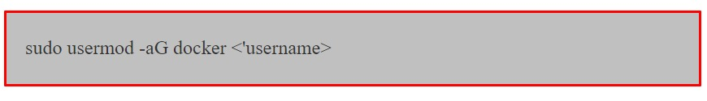

+ Vous devez vous déconnecter et vous connecter pour refléter les modifications. Exécutez la commande `Docker` pour vérifier si elle fonctionne.

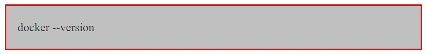

+ Lorsque vous installez le `moteur Docker`, vous obtenez deux composants :

  + Client Docker
  + Moteur Docker
  
# Vue d'ensemble de Docker Engine
+ Ressentons et goûtons rapidement le `moteur Docker` avant de nous y plonger en profondeur.
+ De manière générale, nous opérons dans deux domaines dans le domaine des moteurs de docker.

  + `Images Docker`
  + `Conteneurs Docker`

### Images

+ Désormais, vous pouvez penser les `images` comme des `boîtes vagrand`.
+ C'est très différent des `images vm` mais cela semblera pareil au départ.
+ Les `boîtes vagrant` sont l'état arrêté d'une `VM et des images`  et l'état arrêté des `conteneurs`.
+ Exécutez la commande `Docker Images`.

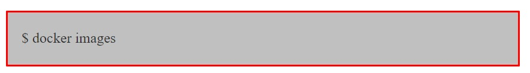

+ Cette commande répertoriera les images téléchargées sur votre ordinateur, vous ne verrez donc rien dans la sortie.
+ Nous devons télécharger quelques images, dans le monde `Docker`, nous l'appelons `image Pullingan`.
+ Alors, doù tire-t-il l'image. Encore une fois, même analogie avec les `boîtes vagrant`. Nous téléchargeons les `boîtes vagrant` depuis le `cloud vagrant`, les `images Docker` sont téléchargées depuis les `registres Docker`, le `registre Docker` le plus célèbre est `DockerHub`.
+ Il existe également depuis d'autres registres de Google, Redhat, etc.

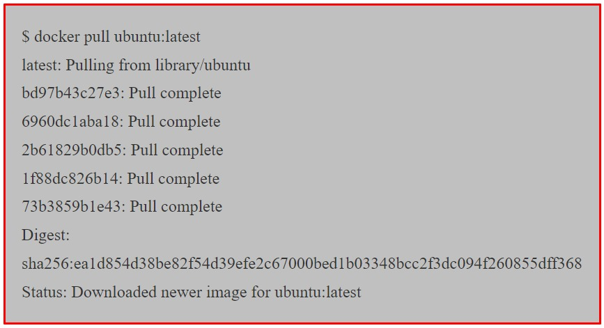

+ Exécutez à nouveau la commande `docker images` pour voir l'`ubuntu:latest image` que vous venez d'extraire.

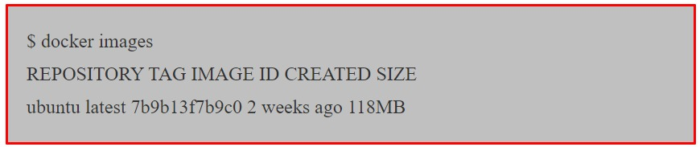

+ Nous entrerons dans les détails de l'endroit où l'image est stockée et de ce qu'elle contient dans le chapitre suivant.
+ Pour l'instant, il suffit de comprendre qu'il contient suffisamment de système d'exploitation (OS), ainsi que tout le code pour exécuter n'importe quelle application pour laquelle il est conçu.
+ `L'image Ubuntu` que nous avons extraite contient une version allégée du système d'exploitation `Ubuntu Linux`, comprenant quelques-uns des utilitaires `Ubuntu` courants.

### Conteneurs

+ Maintenant que nous avons une image extraite localement sur notre `hôte Docker` nous pouvons utiliser la commande `docker run` pour lancer un conteneur à partir de celle-ci.

+ Regardez attentivement le résultat de la commande ci-dessus. Vous devriez remarque que l'invite de votre shell a changé.
+ En effet, votre shell est maintenant attaché à celui du nouveau conteneur - vous êtes littéralement à l'intérieur du nouveau conteneur ! Examinons cette commande `docker run`.
  + `docker run` indique au `Docker daemon` de démarrer un nouveau conteneur.
  + Les options `-it` indiquent au `daemon` de rendre le conteneur interactif et d'attacher notre shell actuel au shell conteneur.
  + Ensuite, la commande indique à `Docker` que nous voulons que le conteneur soit basé sur l'image `ubuntu:latest`.
  + Nous lui disons d'exécuter le processus `/bin/bash` à l'intérieur du conteneur.
  
+ Exécutez la commande `ps` suivante depuis l'intérieur du conteneur pour répertorier du conteneur pour répertorier tous les processus en cours.

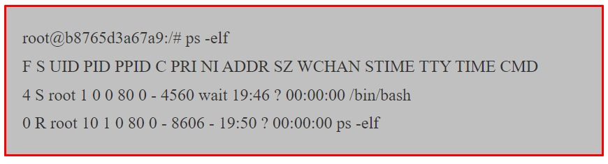

+ Comme vous pouvez le voir sur le résultat de la commande `ps` seuls deux processus s'exécutent à l'intérieur du conteneur :

  + `PID 1`: Il s'agit du processus `/bin/bash` que nous avons demandé au conteneur d'exécuter avec la commande `docker run`.
  + `PID 10`: Il s'agit du processus `ps -elf` que nous avons exécuté pour répertorier les processus en cours d'exécution.
  
+ La présence du processus `ps -elf` dans la sortie ci-dessus pourrait être un peu trompeuse car il s'agit d'un processus de courte durée qui meurt dès que la commande `ps` se termine.
+ Cela signifie que le seul processus de longue durée à l'intérieur du conteneur est le processus `/bin/bash`.
+ Appuyez `Ctrl+PQ`pour quitter le conteneur. Cela vous ramènera dans le shell de votre `hôte Docker`.
+ Vous pouvez le vérifier en consultant l'invite de votre `shell`. Lors d'une étape précédente, vous avez appuyé sur `Ctrl+PQ` pour quitter votre shell du conteneur.
+ En faisant cela depuis l'intérieur d'un conteneur, vous sortirez du conteneur sans le tuer.
+ Vous pouvez voir tous les conteneurs en cours d'exécution d'exécution sur votre système à l'aide de la commande `docker ps`.

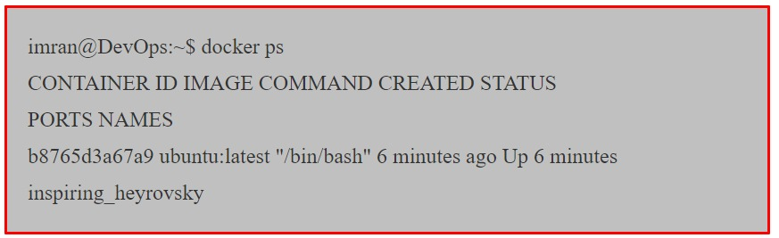

+ La sortie ci-dessus montre un seul conteneur en cours d'exécution. Il s'agit du conteneur que vous avez crée précédemment.
+ La présence de votre conteneur dans cette sortie prouve qu'il est toujours en cours d'exécution. 
+ Vous pouvez également voir qu'il a été créé il y a 6 minutes et qu'il fonctionne depuis 6 minutes.

### Attachement aux conteneurs en cours d'exécution

+ Vous pouvez attacher votre shell aux conteneurs en cours d'exécution.
+ Il s'agit du conteneur que vous avez créé précédemment. La présence de votre conteneur dans cette sortie prouve qu'il est toujours, reconnectons-nous-y.
+ **Remarque :** L'exemple ci-dessus fait reférence à un conteneur appelé `inspiring_heyrovsky`. 
+ Le nom de votre conteneur sera différent, alors n'oubliez pas de remplacer `inspiring_heyrovsky` par le nom ou l'ID du conteneur exécuté sur votre `hôte Docker`.

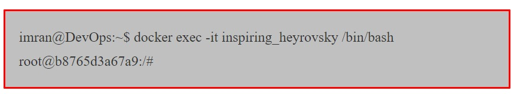

+ Notez que l'invite de votre shell a de nouveau changé. Vous êtes de retour à l'intérieur du conteneur. Le format de la commande de `docker exec` est:
  + `docker exec -options <'container-name or container-id><'command>`
+ Dans notre exemple, nous avons utilisé les options `-it` pour attacher notre shell du conteneur.
+ Nous avons référencé le conteneur par son nom et lui avons demandé d'exécuter le `shell bash`.
+ Quittez à nouveau en appuyant sur `Ctrl+PQ`.
+ Votre invite shell devrait être renvoyée à votre `hôte Docker`.
+ Exécutez à nouveau la commande `docker ps` pour vérifier que votre conteneur est toujours en cours d'exécution.

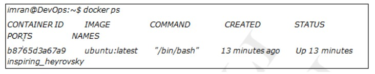

+ Arrêtez le conteneur et tuez-le à l'aide des commandes `docker stop` et `docker rm`.

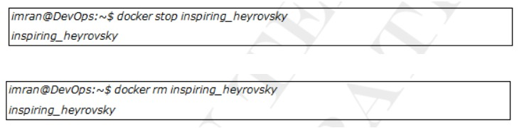

+ Vérifiez que le conteneur a été supprimé avec succès en exécutant une autre commande `docker ps`.

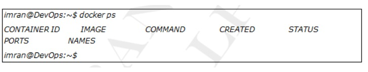

+ Vous auriez maintenant le goût des images et des conteneurs `Docker`. Nous avons extrait une image, exécuté un conteneur, l'avons arrêté et supprimé.
+ Dans la section suivante, nous approfondirons plus en détail les images puis les conteneurs.

# Images

