# Docker

## L'ère des applications

+ Dans le monde d'aujourd'hui, nous sommes tous entouré d'applications et de sites Web.
+ Nous utilisons nos smartphones et nos ordinateurs pour naviguer sur `Internet` et utiliser tous les `services Web` via nos applications mobiles ou nos navigateurs.
+ Tous ces millions ded données basées sur le `Web` proviennent de lieux éloignés de certains ordinateurs situés dans un centre de données.
+ Nous les appelons généralement des serveurs; ces serveurs pourraient être ces machines physiques que nous voyons accumulées dans un centre de données avec toutes ces lumières et câbles clignotants.
+ Si nous prenons quelques exemples comme `Amazon, Google et Netflix, Goibibo etc`, toutes ces entreprises fonctionnent sur des applications ou on peut dire que leurs applications sont leur affaire.
+ Cela souligne un point très important:nous ne pouvons pas séparer leur activité de leur application.

 

+ L'application a besoin de ressources de calcul pour s'exécuter sur lequel elle a hébergé son application.
+ Autrefois, lorsque nous n'avions `ni virtualisation ni cloud computing`, nous les utilisons pour les exécuter directement sur un serveur physique.
+ Ainsi, si je souhaite héberger une application sur 10 serveurs Web, j'ai besoin de 10 serveurs physiques sous équilibreur de charge servant le trafic Web.

+ Ces serveurs sont très chers et nous devons effectuer beaucoup de maintenance pour eux.

    + Nous devons nous procurer un serveur. Un processus par lequel nous passons une commande pour l'achat.
    + Des dépenses en capital ou `CapEx` sont requises.
    + Il existe des dépenses opérationnelles `(OpeEx)`, comme le refroidissement, l'alimentation, les administrateurs pour maintenir cette batterie de serveurs.
    + Donc, si je souhaite augmenter la capacité et ajouter plus de serveurs, je dois consacrer du temps et de l'argent au processus mentionné ci-dessus.
    + Ceci est très courant car l'entreprise démarre à partir d'une très petite base d'utilisateurs, uis le trafic des utilisateurs/consommateurs augmente si l'entreprise se porte bien.
    + Nous déployons une application par serveur car nous souhaitons que nos applications soient isolées.
    + Par exemple, si nous avons besoin d'une application Web, d'une application de base de données et quelques applications backend.
    + Nous pourrions finir par avoir plusieurs systèmes exécutant chacun une seule instance de cette application.

 

+ Ainsi, chaque fois que nous avons besoin d'exécuter une nouvelle application, nous achetons des serveurs, installons le système d'exploitation et configurons sur celui-ci.
+ Et la plupart du temps, personne ne connaissait les exigences de performances de la nouvelle application ! Cela signifiait que le service informatique devait faire des suppositions lors du choix du modèle et de la taille des serveurs à acheter.
+ En conséquence, le service informatique a fait la seule chose raisonnable : il a acheté de gros serveurs rapides et très résilients.
+ Après tout, la dernière chose que quiconque souhaitait - y compris l'entreprise - était des serveurs sous-alimentés.
+ La plupart du temps, les ressources de calcul de ces serveurs physiques seront sous-alimentés.
+ La plupart du temps, les ressources de calcul de ces serveurs physiques seront utilisées, à la hauteur de 5 à 10% de leur capacité potentielle. Un gaspillage du capital et des ressources de l'entreprise.

# Révolution de la Virtualisation

+ `VMware` a donné au monde de la `machine virtuelle` et tout a changé après cela.
+ Nous pourrions désormais isolées dans des systèmes d'exploitation distincts mais sur le même serveur physique.
+ **Dans le chapitre sur la Virtualisation. Nous avons discuté des avantages et des fonctionnalités de la virtualisation, l'architecture de l'hyperviseur.**

# Problèmes avec l'architecture de l'hyperviseur.

+ Nous savons désormais que chaque `VM` possède son propre `systèmes d'exploitation`, ce qui pose problème.
+ Le système d'exploitation a besoin d'une bonne quantité de ressources telles que le `processeur, la mémoire, le stockage, etc`.
+ Nous maintenons également les licences du système d'exploitation et les soignons régulièrement, comme les correctifs, les mises à niveau et les modifications de configuration.
+ Nous voulions héberger une application mais avons collecté une bonne quantité de graisse sur notre infra, nous gaspillons ici `des OpEx et des CapEx`.
+ Pensez à expédier une machine virtuelle d'un endroit à un autre endroit, cela semble une excellente idée.
+ Si nous pouvons tout regrouper dans une image virtuelle et l'expédier afin que l'autre personne n'ait pas besoin de configurer la machine virtuelle à partir de zéro, elle puisse directement exécuter la machine virtuelle à partir de l'image.
+ Nous l'avons fait dans le chapitre `Vagrant` où nous téléchargeons la machine virtuelle préinstallée et venons de l'exécuter.

 

+ Mais ces images sont lourdes et volumineuses car elles contiennent le système d'exploitation avec l'application.
+ Les démarrer est un processus lent. Donc, étant portable, il n'est pas pratique d'expédier la machine virtuelle à chaque fois.
+ Livraison d'une application bundle avec toutes les dépendances/bibliothèques dans une image sans `OS`.
+ Hmm, on dirait que nous avons résolu un gros là-bas. C'est ce que sont les conteneurs.
+ Pensez à configurer une application dans une `VM ou une machine physique`.
+ Nous avons besoin de la configuration du `système d'exploitation, des dépendances, de l'application déployée` et de quelques modifications de configuration dans `le système d'exploitation, des dépendances, de l'application déployée et de quelques modifications de configuration dans le système d'exploitation`.
+ Nous suivons une serie d'étapes pour configurer tout cela, comme la configuration d'une `pile LAMP`.
+ Si nous pouvions regrouper tous ces étapes dans un seul conteneur et l'expédier, les administrateurs n'auraient alors pas besoin d'effectuer de configuration sur la cible, tout ce que nous avons à faire est d'extraire `une image de conteneur` et de l'exécuter.

# Conteneurs

+ Si les `machines virtuelles` sont une `virtualisation matériele`, alors les `conteneurs` sont une `virtualisation du système d'exploitation`.7
+ Nous n'avons pas besoin d'un véritable système d'exploitation dans le conteneur pour installer notre application.
+ Les applications à l'intérieur des conteneurs dépendent du `noyau du système d'exploitation hôte` sur lequel elles sont exécutées. 
+ Ainsi, si j'ai hébergé une application `Java` comme à l'intérieur du conteneur, elle utilisera toutes les bibliothèques `Java` et les `fichiers de configuration des données du conteneur`, mais pour les ressources de calcul, elle s'appuie sur le `noyau du système d'explotation hôte`.
+ Les conteneurs sont comme les autres processus qui s'exécutent dans un système d'exploitation, mais ils sont isolés, leurs processus, fichiers, bibliothèques et configurations qui s'exécutent dans les limites du conteneur.
+ Les conteneurs ont également leur propre `arborescence de processus` et leur `propre réseau`.
+ Chaque `conteneur` aura une `adresse IP et un port` sur lesquels l'application à l'intérieur du conteneur est exécutée.
+ Cela peut ressembler à une machine virtuelle, mais ce n'est pas le cas, rappelez-vous que la `VM` a son propre `système d'exploitation` et que les `conteneurs n'en ont pas`.

+ Les `conteneurs` sont très `légers` car ils ne contiennent que `les bibliothèques et les applications`. 
+ Cela signifie donc que moins de ressources de calcul sont utilisées et cela signifie plus d'espace libre pour exécuter les conteneurs.
+ Ainsi, en termes de ressources, nous économisons également `CapEx et OpEx`.
+ Les `conteneurs` ne sont pas une technologie moderne, ils existaient autour de nous sous différentes formes et technologies.
+ Mais `Docker` l'amené à un tout autre niveau en matière de `construction, d'expédition et de gestion de conteneurs`.

# Docker

+ `Docker, Inc.` a commencé sa vie en tant que fournisseur de plateforme `service(PaaS)` appelé `dotCloud`.
+ En coulisses, la plateforme `dotCloud` exploitait les `conteneurs Linux`.
+ Pour les aider à créer et à gérer ces conteneurs, ils ont construit un outil interne qu'ils ont surnommé `Docker`. Et c'est ainsi qu'est né `Docker`.
+ En 2013, l'activité `dotCloud Paas` étant en difficulté et l'entreprise avait besoin d'un nouveau souffle.
+ Pour y parvenir, ils ont embauché `Ben Golub` en tant que nouveau `PDG`, ont rebaptisé l'entreprise `Docker, Inc.`, se sont débarrassés de la plateforme `dotCloud PaaS` et ont commencé un nouveau voyage avec pour mission d'apporter `Docker et les conteneurs` au monde.
+ `Docker` s'appuie sur les fonctionnalités du `noyau Linux`, telles que `les espaces de noms et les groupes de contrôle`, pour garantir l'isolation des ressources et pour empaqueter une application avec ses dépendances.
+ Ce regroupement des dépendances permet à une application de s'exécuter comme prévu sur différents `systèmes d'exploitation Linux`.
+ C'est cette portabilité qui a suscité l'intérêt des développeurs et des administrateurs système.

 

+ Mais quand quelqu'un dit `Docker`, il peut faire référence à au moins trois choses :

  + `Docker, Inc.` la société
  + `Docker` la technologie d'exécution et d'orchestration du conteneur
  + `Docker` le projet open source

+ Lorsque la plupart des gens parlent de `Docker`, ils font généralement référence au `Docker Engine`.
+ Le `moteur Docker` s'exécute et orchestre les `conteneurs`.
+ A partir de maintenant, nous pouvons penser le `moteur Docker` comme un `hyperviseur`.
+ De la même manière que la technologie d'hyperviseur qui exécute les machines virtuelles, `le moteur Docker` est le moteur d'exécution principal des `contenrus` qui exécute les conteneurs.

+ Il existe de nombreuses technologies Docker qui sont intégrés au `moteur Docker` pour automatiser, orchestrer ou gérer les `conteneurs Docker`.

# Installation De Docker

+ Docker peut être installé sur les systèmes d'exploitation `Windows, Mac et Linux`.
+ Nous allons installer `Docker` sur le serveur `Ubuntu 16.04` dans cette partie. `Docker` peut être installé directement à partir des référentiels `Ubuntu`, mais il se peut qu'il ne s'agisse de la dernière version du `moteur Docker`.
+ Pour installer la dernière et la meilleure version, nous l'installerons à partir du référentiel officiel Docker.

 

**Désinstaller les anciennes versions**

+ Les anciennes versions de `Docker` étaient appelées `docker ou docker-engine`. Si ceux-ci sont installés, désinstallez-les :

+ Ce n'est pas grave si `apt-get` signale qu'aucun de ces packages n'est installé. Ajoutez la clé `GPG` pour le référentiel `Docker`.

+ Ajouter le référentiel `Docker`

+ Mettre à jour le package

+ Installer `Docker`

+ `Docker` doit maintenant être installé, le `daemon` et le processus activé pour démarrer au démarrage.
+ Vérifiez qu'il fonctionne :

+ Les commandes `Docker` peuvent être exécutées par l'utilisateur `root` ou en fournissant `sudo`.
+ Nous pouvons également exécuter les commandes `docker` avec un utilisateur normal, pour ce faire, nous devons ajouter l'utilisateur dans le `groupe Docker`.

+ Vous devez vous déconnecter et vous connecter pour refléter les modifications. Exécutez la commande `Docker` pour vérifier si elle fonctionne.

+ Lorsque vous installez le `moteur Docker`, vous obtenez deux composants :

  + Client Docker
  + Moteur Docker
  
# Vue d'ensemble de Docker Engine
+ Ressentons et goûtons rapidement le `moteur Docker` avant de nous y plonger en profondeur.
+ De manière générale, nous opérons dans deux domaines dans le domaine des moteurs de docker.

  + `Images Docker`
  + `Conteneurs Docker`

### Images

+ Désormais, vous pouvez penser les `images` comme des `boîtes vagrand`.
+ C'est très différent des `images vm` mais cela semblera pareil au départ.
+ Les `boîtes vagrant` sont l'état arrêté d'une `VM et des images`  et l'état arrêté des `conteneurs`.
+ Exécutez la commande `Docker Images`.

+ Cette commande répertoriera les images téléchargées sur votre ordinateur, vous ne verrez donc rien dans la sortie.
+ Nous devons télécharger quelques images, dans le monde `Docker`, nous l'appelons `image Pullingan`.
+ Alors, doù tire-t-il l'image. Encore une fois, même analogie avec les `boîtes vagrant`. Nous téléchargeons les `boîtes vagrant` depuis le `cloud vagrant`, les `images Docker` sont téléchargées depuis les `registres Docker`, le `registre Docker` le plus célèbre est `DockerHub`.
+ Il existe également depuis d'autres registres de Google, Redhat, etc.

+ Exécutez à nouveau la commande `docker images` pour voir l'`ubuntu:latest image` que vous venez d'extraire.

+ Nous entrerons dans les détails de l'endroit où l'image est stockée et de ce qu'elle contient dans le chapitre suivant.
+ Pour l'instant, il suffit de comprendre qu'il contient suffisamment de système d'exploitation (OS), ainsi que tout le code pour exécuter n'importe quelle application pour laquelle il est conçu.
+ `L'image Ubuntu` que nous avons extraite contient une version allégée du système d'exploitation `Ubuntu Linux`, comprenant quelques-uns des utilitaires `Ubuntu` courants.

### Conteneurs

+ Maintenant que nous avons une image extraite localement sur notre `hôte Docker` nous pouvons utiliser la commande `docker run` pour lancer un conteneur à partir de celle-ci.

+ Regardez attentivement le résultat de la commande ci-dessus. Vous devriez remarque que l'invite de votre shell a changé.
+ En effet, votre shell est maintenant attaché à celui du nouveau conteneur - vous êtes littéralement à l'intérieur du nouveau conteneur ! Examinons cette commande `docker run`.
  + `docker run` indique au `Docker daemon` de démarrer un nouveau conteneur.
  + Les options `-it` indiquent au `daemon` de rendre le conteneur interactif et d'attacher notre shell actuel au shell conteneur.
  + Ensuite, la commande indique à `Docker` que nous voulons que le conteneur soit basé sur l'image `ubuntu:latest`.
  + Nous lui disons d'exécuter le processus `/bin/bash` à l'intérieur du conteneur.
  
+ Exécutez la commande `ps` suivante depuis l'intérieur du conteneur pour répertorier du conteneur pour répertorier tous les processus en cours.

+ Comme vous pouvez le voir sur le résultat de la commande `ps` seuls deux processus s'exécutent à l'intérieur du conteneur :

  + `PID 1`: Il s'agit du processus `/bin/bash` que nous avons demandé au conteneur d'exécuter avec la commande `docker run`.
  + `PID 10`: Il s'agit du processus `ps -elf` que nous avons exécuté pour répertorier les processus en cours d'exécution.
  
+ La présence du processus `ps -elf` dans la sortie ci-dessus pourrait être un peu trompeuse car il s'agit d'un processus de courte durée qui meurt dès que la commande `ps` se termine.
+ Cela signifie que le seul processus de longue durée à l'intérieur du conteneur est le processus `/bin/bash`.
+ Appuyez `Ctrl+PQ`pour quitter le conteneur. Cela vous ramènera dans le shell de votre `hôte Docker`.
+ Vous pouvez le vérifier en consultant l'invite de votre `shell`. Lors d'une étape précédente, vous avez appuyé sur `Ctrl+PQ` pour quitter votre shell du conteneur.
+ En faisant cela depuis l'intérieur d'un conteneur, vous sortirez du conteneur sans le tuer.
+ Vous pouvez voir tous les conteneurs en cours d'exécution d'exécution sur votre système à l'aide de la commande `docker ps`.

+ La sortie ci-dessus montre un seul conteneur en cours d'exécution. Il s'agit du conteneur que vous avez crée précédemment.
+ La présence de votre conteneur dans cette sortie prouve qu'il est toujours en cours d'exécution. 
+ Vous pouvez également voir qu'il a été créé il y a 6 minutes et qu'il fonctionne depuis 6 minutes.

### Attachement aux conteneurs en cours d'exécution

+ Vous pouvez attacher votre shell aux conteneurs en cours d'exécution.
+ Il s'agit du conteneur que vous avez créé précédemment. La présence de votre conteneur dans cette sortie prouve qu'il est toujours, reconnectons-nous-y.
+ **Remarque :** L'exemple ci-dessus fait reférence à un conteneur appelé `inspiring_heyrovsky`. 
+ Le nom de votre conteneur sera différent, alors n'oubliez pas de remplacer `inspiring_heyrovsky` par le nom ou l'ID du conteneur exécuté sur votre `hôte Docker`.

+ Notez que l'invite de votre shell a de nouveau changé. Vous êtes de retour à l'intérieur du conteneur. Le format de la commande de `docker exec` est:
  + `docker exec -options <'container-name or container-id><'command>`
+ Dans notre exemple, nous avons utilisé les options `-it` pour attacher notre shell du conteneur.
+ Nous avons référencé le conteneur par son nom et lui avons demandé d'exécuter le `shell bash`.
+ Quittez à nouveau en appuyant sur `Ctrl+PQ`.
+ Votre invite shell devrait être renvoyée à votre `hôte Docker`.
+ Exécutez à nouveau la commande `docker ps` pour vérifier que votre conteneur est toujours en cours d'exécution.

+ Arrêtez le conteneur et tuez-le à l'aide des commandes `docker stop` et `docker rm`.

+ Vérifiez que le conteneur a été supprimé avec succès en exécutant une autre commande `docker ps`.

+ Vous auriez maintenant le goût des images et des conteneurs `Docker`. Nous avons extrait une image, exécuté un conteneur, l'avons arrêté et supprimé.
+ Dans la section suivante, nous approfondirons plus en détail les images puis les conteneurs.

# Images

+ Nous avons vu des éléments très basiques sur les images Docker, nous allons maintenant approfondir les `images Docker.
+ Les images sont construites et distribuées comme des logiciels. 
+ Comme nous l'avons vu dans le chapitre sur `l'intégration continue`, il devrait y avoir un `processus de création et de publication`, nous devons faire de même si nous publions des images.
+ Nous avons mentionné précédemment que les images sont à l'état arrêté du conteneur afin que vous puissiez arrêter un conteneur et créer une nouvelle image à partir de celui-ci.

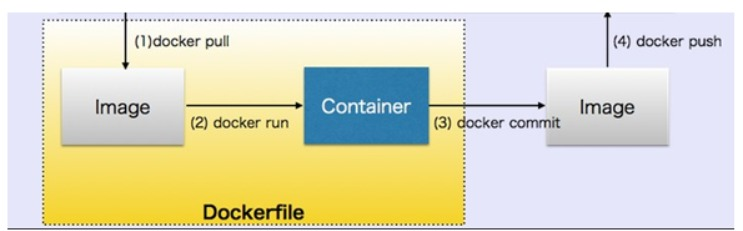

+ Nous voyons sur la figure ci-dessus que nous extrayons une image, exécutons un conteneur, le personnalisons selon nos besoins, validons le conteneur dans une image, puis l'expédions.
+ Cependant, une fois que vous avez démarré un conteneur à partir d'une image, les deux constructions deviennent dépendantes l'une de l'autre et vous ne pouvez pas supprimer l'image tant que le dernier conteneur qui l'utilise n'a pas été détruit.
+ Tenter de supprimer une image sans arrêter et détruire tous les conteneurs qui l'utilisent entraînera des erreurs.
+ Les images que nous expédions doivent être légères et ne doivent contenir que les fichiers et les bibliothèques nécessaires à l'exécution de l'application qu'elles contiennent..
+ Par exemple, si nous expédions une application `Java`, un serveur d'application comme `Tomcat` et des fichiers pour exécuter sur notre application et rien d'extra.

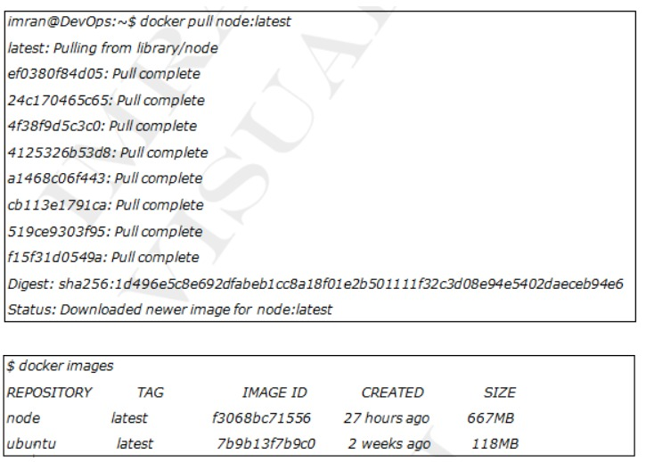

+ Comme vous pouvez le voir maintenant, nous avons deux images téléchargées sur notre moteur `Docker`.

### Registres D'images

+ Les `images Docker` sont stockées dans les `registres d'images`.
+ Les `registres d'images` le plus courant est [Docker Hub](https://hub.docker.com/).
+ D'autres registres existent, notamment des registres tiers et des registres sécurisés sur site, mais `Docker Hub` est la valeur par défaut et c'est celui que nous utiliserons dans cette partie.

+ Les `registres d'images` contiennent plusieurs référentiels d'images.
+ Les `référentiels d'images` contiennent des `imaes`.
+ Cela peut être déroutant, c'est pourquoi la figure ci-dessous montre une image d'une registre d'images contenant 3 référentiels, et chaque référentiel contient quelques images.

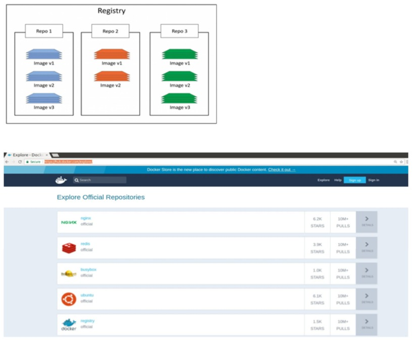

+ `Docker Hub` contient des `référentiels officiels et non officiels`.
+ Les référentiels officiels proviennent de `Docker, Inc.`
+ Ce sont des images sûres et sécurisées avec le dernier logiciel à jour.
+ Les `reférentiels non officiels` sont téléchargés par n'importe qui et ne sont pas vérifiés par `Docker, Inc.`.
+ La liste ci-dessous contient quelques-uns des référentiels et montre leurs `URL` qui existent au niveau supérieur de l'espace de noms `Docker Hub`:

  + **nginx - https://hub.docker.com/_/nginx/**
  + **busybox - https://hub.docker.com/_/busybox/**
  + **redis - https://hub.docker.com/_/redis/**
  + **mongo - https://hub.docker.com/_/mongo/**
  
+ Nos images personnelles vivent dans des `référentiels non officiels`. 

### Balises D'images

+ Lors de l'extraction d'une image, nous donnons le nom de l'image: `TAG` et `Docker` atteindra par défaut le registre `DockerHub` et trouvera l'image avec le `TAG` que nous avons spécifié.

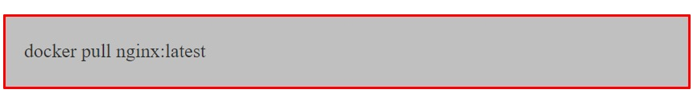

+ La **balise** fait généralement référence à la version de l'image du référentiel.
+ Si nous recherchons une autre version comme la `1.12.0`, nous pouvons utiliser la commande ci-dessous.

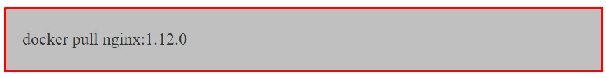

+ Si nous ne spécifions aucune balise, la balise par défaut est la plus récente.
+ La dernière balise ne signifie pas que les images sont la dernière version, c'est juste le nom de la balise et c'est tout.

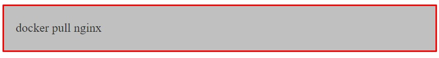

+ La commande ci-dessus téléchargera l'`image nginx` avec la dernière balise.

### Images Et Calques

+ Toutes les `images Docker` sont construites d'un ou plusieurs calques en lecture seule, comme indiqué ci-dessous.

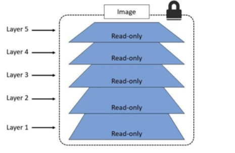

+ Il existe plusieurs façons de voir et d'inspecter les calques qui composent une image, et nous en avons déjà vue une.
+ Jetons un deuxième coup d'oeil au résultat de la commande `docker pull node:latest` de plus tôt.

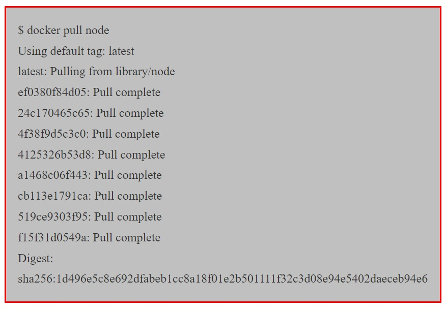

+ Chaque ligne de la sortie ci-dessous qui se termine par `Pull Complete` représente un calque de l'image qui a été extrait.
+ Comme nous pouvons le voir, cette image comporte 5 calques.

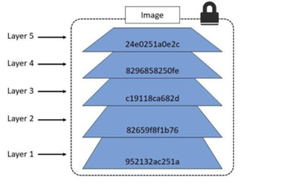

+ Chaque calque n'est qu'un ensemble de différences par rapport au calque qui le précède.
+ Lorsque vous créez un nouveau `conteneur`, vous ajoutez un nouveau calque inscriptible au-dessus des calques sous-jacents.
+ Cette couche est souvent appelée `couche conteneur`. 
+ Toutes les modifications apportées au conteneur en cours d'exécution, telles que l'écriture de nouveaux fichiers, la modification de fichiers existants et la suppression de fichiers, sont écrites sur cette fine couche de conteneur inscriptible.
+ Le diagramme ci-dessous montre un conteneur basé sur l'image `Ubuntu 15.04`.

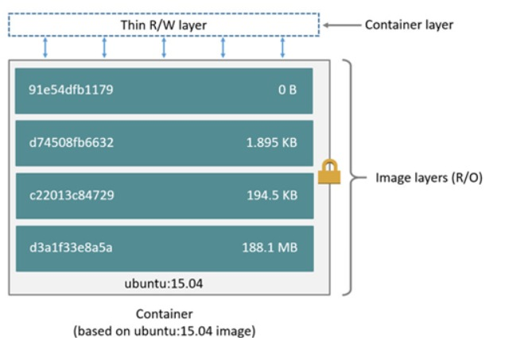

### Conteneur Et Couches

+ La principale différence entre `un conteneur et une image` réside dans la couche supérieure inscriptible.
+ Toutes les écritures dans le conteneur qui ajoute de nouvelles données ou modifient des données existantes sont stockées dans cette couche inscriptible.
+ Lorsque le conteneur est supprimé, la couche inscriptible est également supprimée.
+ L'image sous-jacente reste inchangé tout en ayant leur propre état de données.
+ Le diagramme ci-dessus montre plusieurs conteneurs partageant la même image `Ubuntu 15.04`.

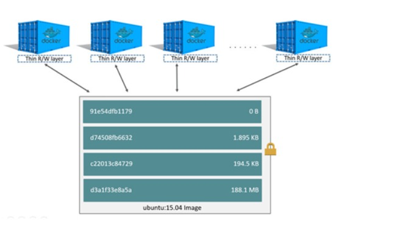

+ Docker utilise des pilotes pour gérer le contenu des couches d'images et de la couche conteneur inscriptible.
+ Chaque pilote de stockage gère la mise en œuvre différemment, mais tous les pilotes utilisent des couches d'images empilables et la stratégie de copie sur écriture `(CoW)`.
+ Une autre façon de voir les calques qui composent une image consiste à inspecter l'image avec la commande `docker inspect`.
+ L'exemple ci-dessous inspecte la même image `ubuntu:latest`.

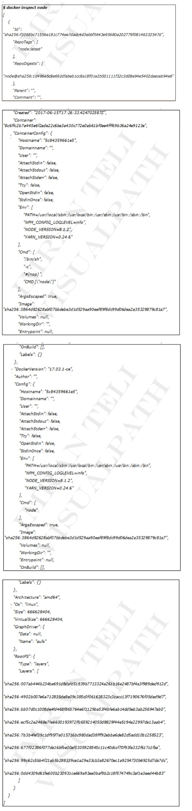

### Supression d'images

+ Lorsque vous n'avez plus besoin d'une image, vous pouvez la supprimer de vôtre hôte `Docker` avec la commande `docker rmi`.
+ `rmi` est l'abbreviation de supprimer l'image.
+ Supprimez l'image du noeud extraite à l'étape précédente avec la commande `docker rmi`.
+ L'exemple ci-dessous adresse l'image par son `ID`.

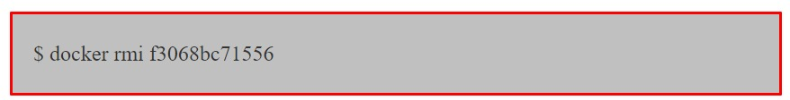

# Conteneurs

+ Le `conteneur` est l'instance d'exécution d'une image comme si nous démarrions une machine virtuelle à partir d'une `boîte vargrant`.
+ Nous pouvons démarrer plusieurs conteneurs à partir d'une seule image.
+ Nous créeons un conteneur à partir d'une image en donnant la commande `ducker run`.
+ Les conteneurs s'exécutent jusqu'à ce que les processus qui s'y exécutent existent.
+ Il doit y  avoir au moins un processus en cours d'exécution à l'intérieur du conteneur avec le `PID 1`.
+ Si ce processus meurt, les conteneurs meurent également.

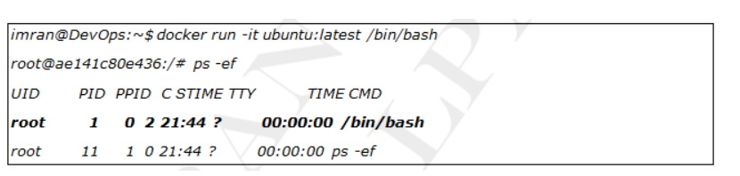

+ Dans le conteneur ci-dessus `/bin/bash` a le `PID 1`, ce processus sera tué si nous appuyons sur la commande `exit`.

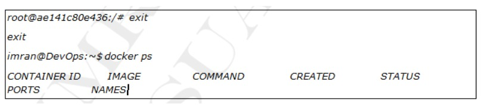

+ Comme la sortie se déconnectera et tuera le `shell` actuel et c'est notre `PID 1`, notre conteneur a également été tué avec lui.
+ `docker ps -a` affichera les conteneurs en cours d'exécution ou sortis.

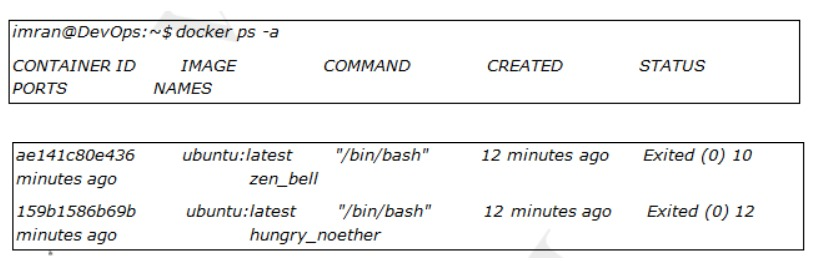

+ Nous pouvons démarrer un conteneur quitté en donnant `<docker start containerid>`.

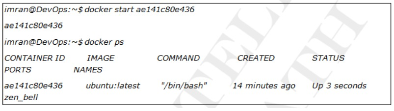

+ `docker stop` arrêtera un conteneur en cours d'exécution.

+ `docker rm` supprimera le conteneur avec ses données.

+ Exécuter un `webservice` dans un conteneur.

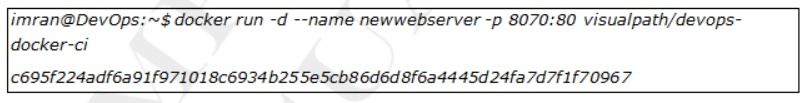

+ Nous avons démarré le conteneur ci-dessus en arrière-plan par l'option `-d`.
+ Nous avons également donné le nom à nôtre conteneur par l'option `--name`.
+ L'image ci-dessus est `service Web Apache` qui s'exécute sur le port `80` des conteneurs.
+ Le port hôte `8070` est mappé au port `80` des conteneurs.
+ Cela signifie que si nous accédons à l'`IP` des machines hôtes sur le port `8070`, nous obtiendrons un service exécuté sur le port `80` à partir des conteneurs.
+ Les conteneurs ne sont pas directement accessibles par leurs addresses `IP` car les adresses `IP` des conteneurs ne sont pas permanentes.
+ Nous en discuterons en détail dans la section réseau.
+ Nous accédons au service exécuté dans le conteneur à partir du port hôte qui est redirigé vers le port du conteneur, c'est ce qu'on appelle une `redirection de port`.

+ `-p 8070:80` signifie que le port hôte `8070` est mappé au port `80` du conteneur. Vérifiez le service Web du conteneur en y accédant à partir du navigateur sur `http://hostip:8070`.

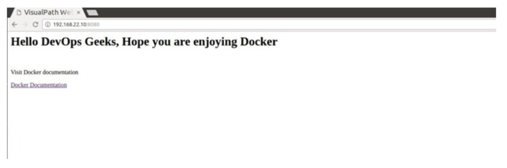

+ Vérifie les registres `nginx, apache et jenkins` depuis `dockerhub` et exécutez-les pour en savoir plus.

+ Ici, nous mappons deux ports `8080 et 5000`, les ports hôtes et conteneur sont identiques, ce qui est correct si vos ports hôte ne sont pas occupés.
+ Les données des conteneurs ne sont pas persistantes, ce qui signifie que si nous supprimons le conteneur, ses données sont également perdus, ce qui est évident.
+ Mais si nous voulons garder ces données en sécurité sur la machine hôte, nous pouvons utiliser l'indicateur `-v` qui concerne les volumes.
+ Le côté gauche est le chemin du repertoire de la machine hôte et le côté droit est le chemin du repertoire des conteneurs que vous souhaitez enregistrer sur la machine hôte.
+ C'est similaire à nos répertoires de `synchronisation vagrant`.
+ Désormais, même si nous supprimons le conteneur, ses données dans `/var/jenkins_home` seront en sécurité sur la machine hôte dans le repertoire `/your/home`.

### Inspection Des Conteneurs

+ Dans l'exemple précédent, vous avez peut-être remarqué que nous n'avions pas spécifié de commande pour le conteneur lorsque nous avons exécuté l'exécution du `docker`.
+ Pourtant, le conteneur exécutait un simple service Web. Comment est-ce arrivé ? Lors de la création d'une `image Docker`, il est possible d'intégrer une commande ou un processus par défaut que vous souhaitez que les conteneurs utilisant l'image exécutent.
+ Si nous exécutons une commande `docker inspect` sur l'image que nous avons utilisée pour notre conteneur, nous pourrons voir la commande/le processus que le conteneur exécutera au démarrage.

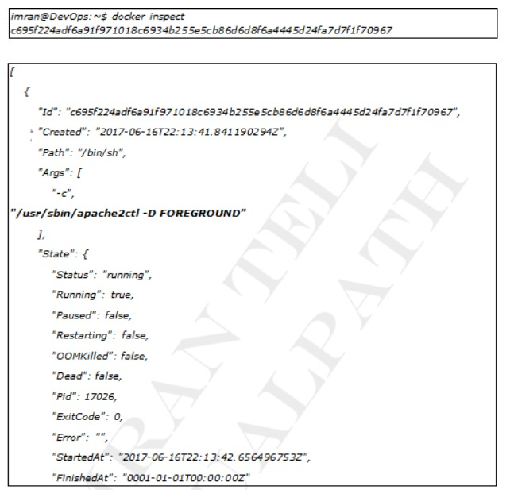

# Images de construction et d'expédition

+ `Docker` peut créer des images automatiquement en lisant les instructions d'un `Dockerfile`, un fichier texte qui contient toutes les commandes, dans l'ordre, nécessaires pour créer une image donnée.
+ Les `Dockerfiles` adhèrent à un format spécifique et utilisent un ensemble d'instructions spécifique.
+ `Dockerfile` définira ce qui se passe dans l'environnement à l'intérieur de votre conteneur.
+ L'accès aux ressources telles que les interfaces réseau et les lecteurs de disque est virtualisé à l'intérieur de cet environnement, qui est isolé du reste de votre système.
+ Vous devez donc mapper les ports vers le monde extérieur et être précis sur les fichiers que vous souhaitez `copier` vers cet environnement.
+ Cependant, après cela, vous pouvez vous attendre à ce que la version de votre application définie dans ce fichier `Docker` se comporte exactement de la même manière partout où elle s'exécute.

### Fichier Docker

+ Créez un répertoire vide et placez-y ce fichier, avec le nom `Dockerfile`.
+ Prenez note des commentaires qui expliquent chaque affirmation.

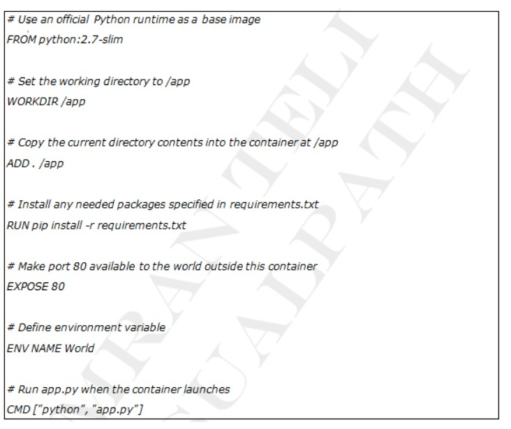

+ Ce `Dockerfile` fait référence à quelques éléments que nous n'avons pas encore créés, à savoir `app.py et requirements.txt`. Mettons-les en place ensuite.
+ L'application elle-même récupère ces deux fichiers et placez-les dans le même dossier que `Dockerfile`.
+ Ceci complète notre application qui, comme vous pouvez le voir, est assez simple.
+ Lorsque le `dockerfile` ci-dessus est intégré dans une image, `app.py et requirements.txt` seront présents en raison de la commande `ADD` de ce `dockerfile`, et la sortie de `app.py` sera accessible via `HTTP` grâce à la commande `EXPOSE`.

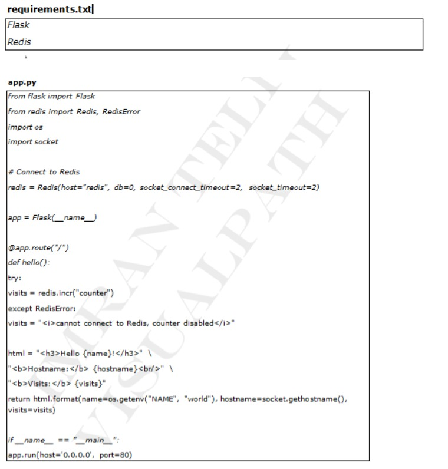

+ Nous voyons maintenant que `pip install -r requirements.txt` installe les bibliothèques `flask et redis` pour `Python` et que l'application imprime la variable d'environnement `NAME` ainsi que la sortie d'un appel à `socket.gethostname()`.
+ Enfin comme `Redis` n'est pas en cours d'exécution (car nous avons uniquement installé la bibliothèque `Python`, et non `Redis` lui-même), nous devons nous attendre à ce que la tentative de l'utiliser ici échoue et produise le message d'erreur.

**Remarque :** L'accès au nom de l'hôte à l'intérieur d'un conteneur récupère `l'ID` du conteneur, qui est comme `l'ID` de processus pour un exécutable en cours d'exécution.

### **Créer L'application**

+ C'est ça! Vous n'avez pas besoin de `Python` ou de quoi que ce que ce soit dans le fichier `requirements.txt` sur votre système, et la création ou l'exécution de cette image ne les installera pas non plus sur votre système.
+ Il ne semble pas que vous ayez vraiment configuré un environnement avec `Python et Flask`, mais c'est le cas.

+ Voici ce que cela devrait montrer

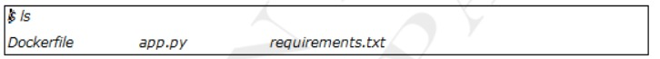

+ Exécutez maintenant la commande `build`. Cela crée une `image docker` que nous allons baliser en utilisant `-t` pour qu'elle ait un nom convivial.

+ Où est votre image construite ? Ilse trouve dans le registre d'images docker local de votre machine:

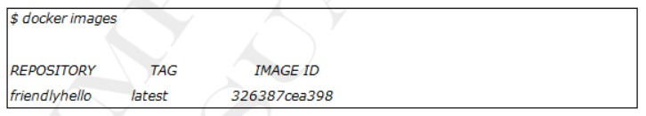

### Exécutez l'application

+ Exécutez l'application en mappant le `port 4000` de votre machine sur le port `EXPOSE 80` du conteneur à l'aide de `-p`.

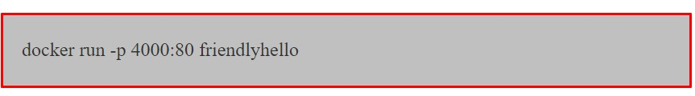

+ Vous devriez voir un avis indiquant que `Python` diffuse votre application à l'adresse `http://0.0.0.0:80`.
+ Mais ce message vient de l'intérieur du conteneur, qui ne sait pas que vous avez mappé le `port 80` de ce conteneur sur `4000`, créant ainsi `l'URL` correcte `http://localhost:4000`.
+ Accédez dans un navigateur Web pour voir le contenu affiché sur une page Web, y compris le texte `Hello World`, `l'ID` du conteneur et le message d'erreur `Redis`.

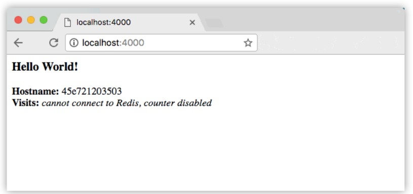

+ Vous pouvez également utiliser la commande `curl` dans un `shell` pour afficher le même contenu.

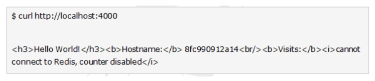

**Remarque :**

+ Ce remappage de port de `4000:80` vise à démontrer la différence entre ce que vous exposez dans le fichier docker et ce que vous publiez à l'aide de `docker run -p`.
+ Dans les étapes ultérieures, nous mapperons simplement le `port 80` de l'hôte au `port 80` du conteneur et utiliserons `http://localhost`.
+ Appuyez sur `CTRL+C` dans votre terminal pour quitter. Exécutons maintenant l'application en arrière-plan, en mode détaché :

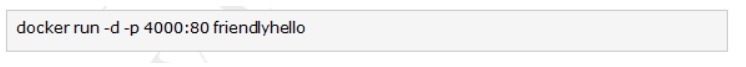

+ Vous obtenez le long `ID` de conteneur pour votre application, puis êtes renvoyé vers votre terminal.
+ Votre conteneur s'exécute en arrière-plan. Vous pouvez également voir `l'ID` abrégé du conteneur avec `docker ps` (et les deux fonctionnent de manière interchangeable lors de l'exécution de commandes):

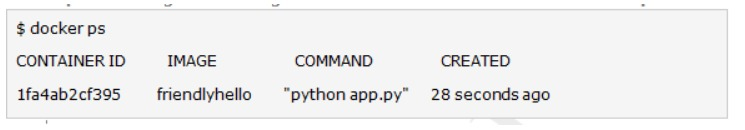

+ Vous verrez que `CONTAINER ID` correspond à ce qui se trouve sur `http://localhost:4000`.
+ Utilisez maintenant `docker stop` pour terminer le processus, en utilisant `l'ID du CONTAINER`, comme ceci :

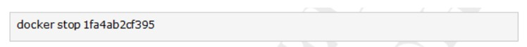

### Partagez votre image

+ Pour démontrer la portabilité de ce que nous venons de créer, téléchargeons notre image construite et exécutons-la ailleurs.
+ Après tout, vous devrez apprendre à pousser vers les registres, lorsque vous souhaiterez déployer des conteneurs en production
+ `Un registre` est une collection de référentiels, et un `référentiel` est une collection d'images, un peu comme un référentiel `Github`, sauf que le code est déjà construit.
+ Un compte sur un registre peut démontrer de nombreux référentiels.
+ Le `dockerCLI` utilise le registre public de `Docker` par défaut.

 

+ **Remarque :** Nous utiliserons le registre public de `Docker` simplement parce qu'il est gratuit et préconfiguré, mais il existe de nombreux registres publics parmi lesquels choisir, et vous pouvez même configurer votre propre registre privé à l'aide de `Docker Trusted Registry`.

### Connectez-vous avec votre identifiant Docker

+ Si vous n'avez pas de compte `Docker`, créez-en un sur un `cloud.docker.com`.
+ Notez votre nom d'utilisateur. Connectez-vous au registre public `Docker` sur votre ordinateur local.

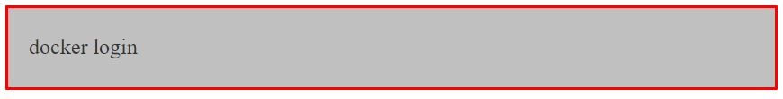

### Marquer l'image

+ La notation pour associer une image locale à un référentiel sur un référentiel est `username/repository.tag`.
+ La balise est facultative, mais recommandée, car c'est le mécanisme que les registres utilisent pour donner une version aux images `Docker`.
+ Donnez au référentiel et à la balise des noms significatifs pour le contexte, tels que `get-started-part1`.
+ Cela placera à l'image dans le référentiel de démarrage et la marquera comme part1.
+ Maintenant, rassemblez le tout pour marquer l'image.
+ Exécutez l'image de balise `docker` avec votre nom d'utilisateur, votre référentiel et les noms de balises afin que l'image soit téléchargé vers la destination souhaitée.
+ La syntaxe de la commande est :

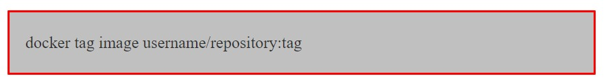

+ Par exemple :

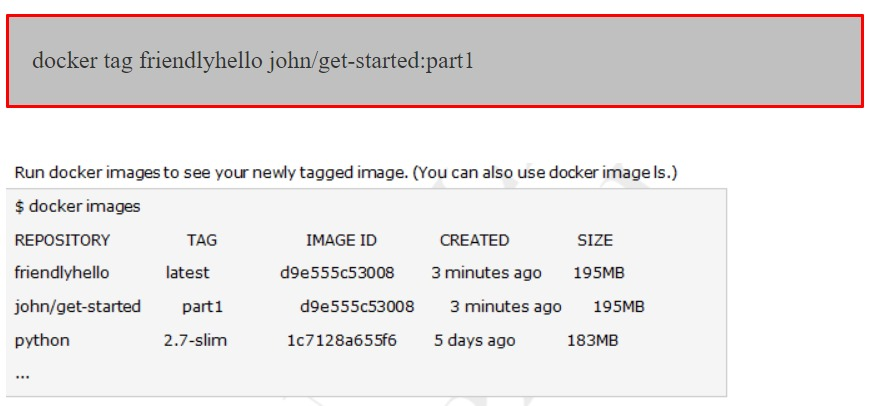

### Publier l'image

+ Téléchargez votre image taguée dans le référentiel :

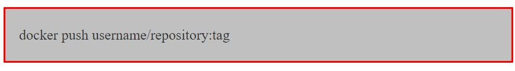

+ Une fois terminé, les résultats de ce téléchargement sont accessibles au public.
+ Si vous vous connectez à `Docker Hub`, vous y verrez la nouvelle image, avec sa commande `pull`.

### Extrayez et exécutez l'image à partir du référentiel distant

+ Désormais, vous pouvez utiliser `docker run` et exécuter votre application sur n'importe quelle machine avec cette commande : 

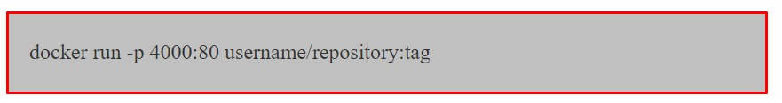

+ Si l'image n'est pas disponible localement sur la machine, `Docker` pourrait l'extraire du référentiel.

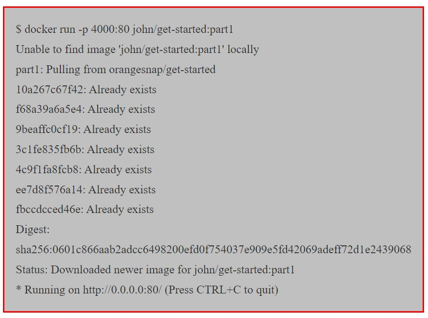

+ **Remarque :** 
  + si vous ne spécifiez pas la partie : `tag` de ces commandes, la balise `:latest` sera prise en compte, à la fois lorsque vous créez et lorsque vous exécutez des images.
  + `Docker` utilisera la dernière version de l'image exécutée sans balise spécifiée (pas nécessairement l'image la plus récente).
  + Quelque soit l'endroit où `docker run` s'exécute, il extrait votre image, ainsi que `python` et toutes les dépendances du fichier `requirements.txt`, et exécute votre code.
  + Tout est transporté ensemble dans un petit paquet soigné, et la machine hôte n'a pas besoin d'installer autre chose que `docker` pour l'exécuter.
  + `Instructions Dockerfile` : Nous avons vu dans la section précédente que `Dockerfile` est utilisé pour créer des images `Docker`.
  + Il contient la liste des instructions lues par `Docker` pour configurer une image.
  + Il existe une douzaine d'instructions que nous pouvons utiliser dans notre `Dockerfile`.

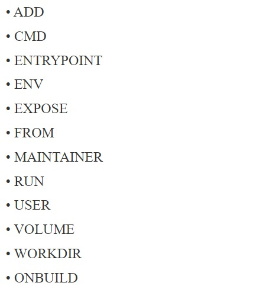

### FROM

+ Cette instruction est utilisé pour définir l'image de base pour les instructions ultérieures.
+ Il est obligatoire de définir ceci dans la première ligne d'un `Dockerfile`.
+ Vous pouvez cependant l'utiliser plusieurs fois. Exemple :

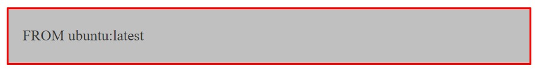

### MAINTAINER

+ Il s'agit d'une instruction non exécutable utilisée pour indiquer l'auteur du `Dockerfile`. Exemple :

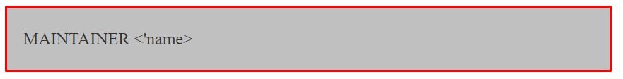

### RUN

+ Cette instruction vous permet d'exécuter une commande au-dessus d'un calque existant et de créer un nouveau calque avec les résultats de l'exécution de la commande.
+ Par exemple, s'il existe une condition préalable pour installer `PHP` avant d'exécuter une application, vous pouvez exécuter les commandes appropriées pour installer `PHP` au-dessus de l'image de base (par exemple `Ubuntu`), comme ceci :

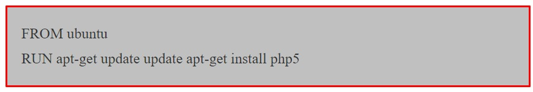

### CMD

+ La principale différence entre `CMD et RUN`, est que `CMD` n'exécute rien pendant la construction.
+ Il spécifie simplement la commande prévue pour l'image. Alors que `RUN` exécute la commande pendant le temps de construction.
+ **Remarque :** il ne peut y avoir qu'une seule instruction `CMD` dans un `Dockerfile`, si vous en ajoutez d'autres, seule la dernière prend effet. Exemple :

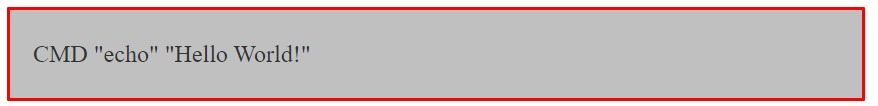

### EXPOSE

+ Lors de l'exécution de votre service dans le conteneur, vous souhaiterez peut-être que votre conteneur écoute sur les ports spécifiés.
+ L'instruction `EXPOSE` vous aide à le faire. Exemple :

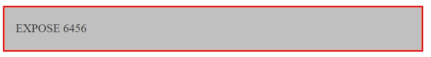

### ENV

+ Cette instruction peut-être utilisée pour définir les variables d'environnement dans le conteneur. Exemple :

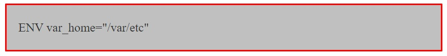

### COPY

+ Cette instruction permet de copier des fichiers et répertoires d'une source spécifiée vers une destination (dans le système de fichiers du conteneur). Exemple :

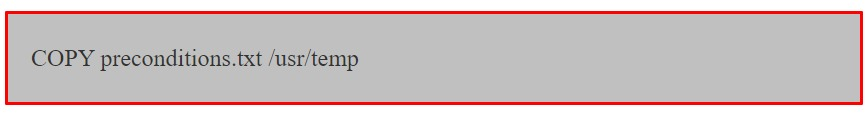

### ADD

+ Cette instruction est similaire à l'instruction `COPY` avec quelques fonctionnalités supplémentaires telles que la prise en charge des `URL` distantes dans le champ source et l'extraction `tar` en local uniquement.
+ Mais si vous n'avez pas besoin d'une fonctionnalité, il est suggéré d'utiliser `COPY` car il est plus lisible. Par exemple :

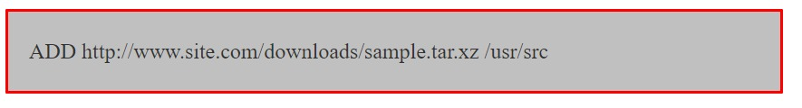

### ENTRYPOINT

+ Vous pouvez utiliser cette instruction pour définir la commande principale de l'image.
+ Par exemple, si vous n'avez installé qu'une seule application dans votre image et vous souhaitez qu'elle s'exécute à chaque instruction de l'image, `ENTRYPOINT` est l'instruction qu'il vous faut.
+ **Remarque :** les arguments sont facultatifs et vous pouvez le transmettre pendant l'exécution avec quelque chose comme `docker run<'image-name>`.
+ De plus, tous les éléments spécifiés à l'aide de `CMD` seront remplacés, à l'exception des arguments. 
+ Ils seront transmises à la commande spécifiées dans `ENTRYPOINT`. Exemple : 

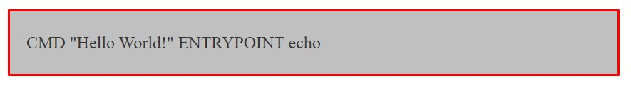

### VOLUME

+ Vous pouvez utiliser l'instruction `VOLUME` pour activer l'accès à un emplacement sur le système hôte à partir d'un conteneur.
+ Passez simplement le chemin de l'emplacement auquel vous souhaiterez accéder. Exemple :

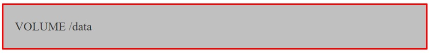

### USER

+ Ceci est utilisé pour définir `l'UID(ou le nom de l'utilisateur)` à utiliser lors de l'exécution de l'image. Exemple : 

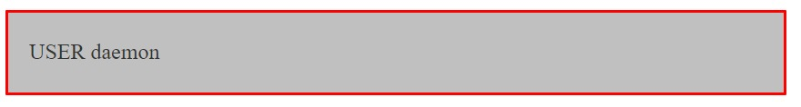

### WORKDIR

+ Ceci est utilisé pour définir le répertoire actuellement actif pour d'autres instructions telles que `RUN, CMD, ENTRYPOINT, COPY et ADD`.
+ Notez que si un chemin relatif est fourni, la prochaine instruction `WORKDIR` le prendra comme relatif au chemin de l'instruction `WORKDIR` précédente. Exemple :

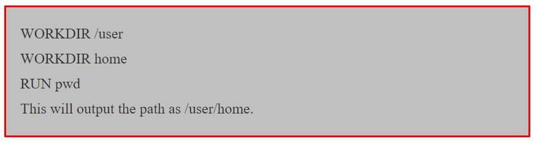

### BUILD

+ Cette instruction ajoute une instruction de déclenchement à exécuter lorsque l'image comme base pour une autre image.
+ Il se comporte comme si une instruction `RUN` était insérée immédiatement après l'instruction `FROM` du `Dockerfile` en aval.
+ Ceci est généralement utile dans les cas où vous avez besoin d'une image statique avec une valeur de configuration dynamique qui change chaque fois qu'une nouvelle image doit être crée (au-dessus de l'image de base). Exemple :

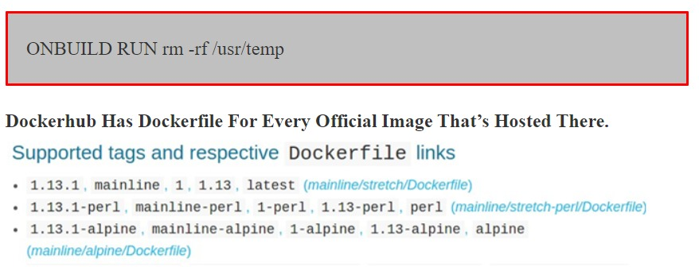

+ La capture d'écran ci-dessus provient du référentiel officiel `nginx` de `Dockerfile`.
+ Si vous voyez, il existe das liens vers `Dockerfile` pour chaque version de l'image. Les liens pointent vers `Dockerfile` hébergé dans `github`.

+ Ces `Dockerfiles` 

