### **Virtualisation**

+ `La Virtualisation` n'est pas une nouveauté dans l'industrie informatique.
+ La `Virtualisation` a pris un essor considérable grâce à `VMWare`, car elle a résolu le problème de l'exécution de plusieurs systèmes d'exploitation et applications sur un ordinateur physique.
+ Mais ce n'est que la pointe de l'iceberg, `VMWare` et d'autres fournisseurs de virtualisation ont offert d'excellentes fonctionnalités telles que le `clustering de machines physiques virtualisées, la mise en commun des ressources de calcul, la mise en commun du stockage, la haute disponibilité, la migration en direct des machines virtuelles et bien plus encore`.
+ Dans ce chapitre, nous comprendrons la `virtualisation`, ses avantages et comment l'utiliser pour nos opérations `DevOps` quotidiennes.

#### **1. La vie sans virtualisation**

+ Dans l'industrie du logiciel, nous créons et livrons des logiciels ou, comme on dit aujourd'hui, des applications.
+ L'application gère les entreprises ou vice versa. Si l'application ne fonctionne pas ou présente des performances insuffisantes. l'entreprise en souffrira.

+ Les applications s'exécutent sur des serveurs. Nous déployons une application par serveur car nous souhaitons que nos applications soient isolées.
+ Par exemple, si nous avons besoin d'une application `Web`, d'une application de base de données et quelques applications backend.
+ Nous pourrions finir par avoir plusieurs systèmes physiques exécutant chacun une seule instance de cette application.

+ Ainsi, chaque fois que nous avons besoin d'exécuter une nouvelle application, nous achetons des serveurs, installons le système d'exploitation et configurons notre application sur celui-ci.
+ Et la plupart du temps, personne ne connaissait les exigences de performance de la nouvelle application ! Cela signifiait que le service devriat faire des suppositions lors du choix du modèle et de la taille des serveurs à acheter.
+ En conséquence, le service informatique a fait la seule chose raisonnable : il a acheté de gros serveurs et dotés d'une grande résilience.
+ Après tout, la dernière chose que quiconque voulait- y compris l'entreprise- était des serveurs sous-alimentés.

+ La plupart du temps, les ressources informatiques de ces serveurs physiques seront sous-utilisées jusqu'à 5 à 10% de leur capacité potentielle. Un gaspillage tragique du capital et des ressources de l'entreprise.

#### **2. Entrez le VMWare**
+ Au milieu de tout cela, `VMare`, `Inc.` a donné au monde la `machine virtuelle (VM)`.
+ Et presque du jour au lendemain, le monde est devenu bien meilleur !
+ Enfin, nous disposions d'une technologie qui nous permettrait d'executer plusieurs applications métier sur un seul serveur en toute sécurité. 

#### **3. La machine virtuelle**
+ Un système informatique virtuel est appelé `machine virtuelle (VM)`: un conteneur logiciel étroitement contenant un système d'exploitation et une application.
+ Chaque `VM` autonome et complètement indépendante.
+ Placer plusieurs machines virtuelles sur un seul ordinateur permet à plusieurs systèmes d'exploitation et applications de s'exécuter sur un seul serveur physique, ou `hôte`.

#### **4. Propriété clés des machines virtuelles**

+ Comme généralement, nous installons le système d'exploitation sur le serveur physique, puis installons nos applications dessus.
+ En configurant `Hypervisor` sur le serveur physique, nous pouvons créer plusieurs `VM`, chacune avec son propre système d'exploitation.

+ Il existe deux types d'hyperviseurs:

    + **Type 1**
  
        + Les hyperviseurs s'exécutent directement sur le matériel du système.
        + Ils sont souvent appelés hyperviseurs `natifs` ou `bare métal`.
        + Ils sont installés sur un ordinateur physique comme système d'exploitation.
        + Ainsi, au lieu d'installer le système d'exploitation, nous installons `Hypervisor` pour réaliser la `virtualisation`.
        + Exemple :
            + Microsoft Hyper-V
            + VMware ESX/ESXI.
            + Xen Hypervisors.
        + Ces hyperviseurs sont utilisés sur des machines virtuelles de niveau production offrant d'excellentes performances.
          + Les `hyperviseurs de type 1` peuvent être regroupés (clusters) et gérés de manière centralisée par un logiciel comme `VMware Vcenter pour Esxi`.
          
    + **Type 2**
  
        + Les `Hyperviseurs de Type 2` s'exécutent sur un système d'exploitation hôte.
        + Dans ce genre, nous installons un hyperviseur sur les `OS` comme `Linux ou Windows`.
        + Exemple :
            + Vmware server/workstation/player
            + Oracle Virtualbox

 
        

#### **5. Votre choix d'hyperviseur**

+ Les hyperviseurs de type 1 sont excellentes et vous offrent des fonctionnalités étonnantes telles que le `clustering de machines physiques virtualisées, la mise en commun des ressources de calcul, la mise en commun du stockage,la haute disponibilité, la migration en direct de la machine virtuelle et bien plus encore`.
+ Il est généralement utilisé pour virtualiser des centres de données entiers ou un pool de serveurs. Ceci est géré par des logiciels très coûteux comme `VMware Vcenter`.
+ Comme ces didacticiels se concentrent sur les outils `DevOps`, nous n'entrerons pas dans les hyperviseurs de `type 1`.
+ Nous allons nous concentrer sur les `hyperviseurs de type 2` comme `Oracle Virualbox` que nous pouvons installer sur nos ordinateurs portables/de bureau et utiliser les machines virtuelles.
+ Nous devons exécuter plusieurs machines virtuelles sur notre système pour tester/exécuter nos outils et scripts.
+ Nous devons également configurer des logiciels d'application Web sur plusieurs systèmes d'exploitation et nous le ferons en utilisant `Oracle virtualbox Hypervisor`.

#### **6. Quelques terminologies**

+ Lorsqu'il s'agit de virtualisation (et également pour comprendre les chapitres suivants de cette documentation), il est utile de se familiariser avec un peu de terminologie cruciale, en particulier avec les termes suivants:

    + **Systèmes D'exploitation Hôte (OS Hôte)**
        + Il s'agit du système d'exploitation de l'ordinateur physique sur lequel `Virtualbox` est installé. Il existe des versions de virtualBox pour les hôtes `WXindows, Mac OS X, Linux et Solaris`.

    + **Système D'exploitation Invité (OS invité)**
        + Il s'agit du système d'exploitation qui s'exécutent à l'intérieur de la machine virtuelle.

### **Configuration de la machine virtuelle**

+ **Nous pouvons donc pratiquer `Linux` dans la section suivante. Nous allons donc créer deux machines virtuelles Linux dans cette section.**

    + **`L’un est CentOS, l’autre est Ubuntu`.**

+ **Ce sont deux versions très populaires du système d’exploitation Linux. Et nous en parlerons. Leurs différences sont détaillées dans la section Linux. Il existe donc deux méthodes pour créer des VM.**

    + **L’un est manuel. Où nous verrons chaque étape pour créer et installer un système d'exploitation sur cela. Ce sera la base des assistants où nous sélectionnons plusieurs options afin de créer des VM.**

    + **La deuxième option est automatisée. Vous pouvez également créer automatiquement des VM, qui seront très similaires.**

+ **`Une automatisation consiste simplement à assembler toutes ces étapes de manière logique en utilisant un outil ou un script ou n'importe quel langage de programmation`.**

  + **Vous avez besoin de `vagrant et c'est l'outil qui créera automatiquement des VM` pour nous en émettant très simplement commandes, ce que nous verrons.**

    + **La première consiste à configurer manuellement, vous avez besoin de VirtualBox où vous allez créer une VM en suivant certains étapes, puis vous allez télécharger un fichier ISO. Et installez le système d’exploitation sur cette VM.**

    + **Le deuxième laboratoire est automatiquement l'endroit où vous créez un fichier vagrant avec le nom de la boîte et vous émettez la commande: `vagrant`.**

#### **1. Règle empirique**
+ ***Si vous souhaitez automatiser quelque chose, assurez-vous de savoir comment le faire manuellement.***

#### **3. Exigences**
+ **Votre ordinateur**
    + ordinateur 64 bits
    + Internet haute vitesse
    + Windows 10/11, puce MacOS Intel/M1 et distributions Linux
    + Section Prérequis

#### **3. Manual : STEPS/TOOLS**

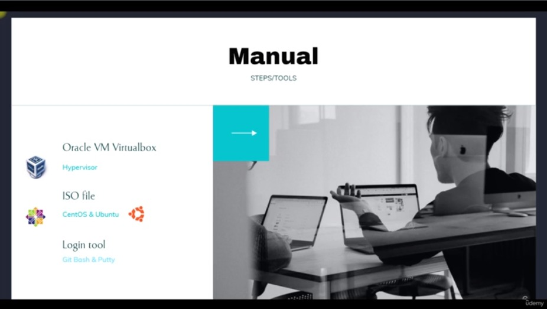

#### **4. Automated : STEPS/TOOLS**

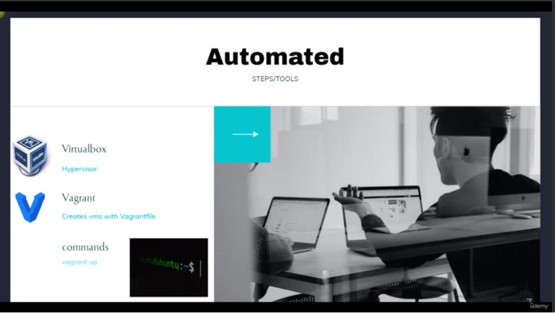

#### **5. LAB :VM SETUP MANUALLY**

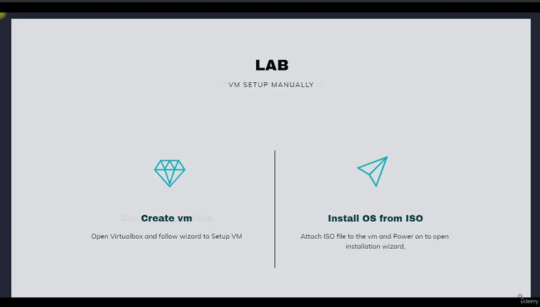

#### **6. LAB :VM SETUP AUTOMATICALLY**

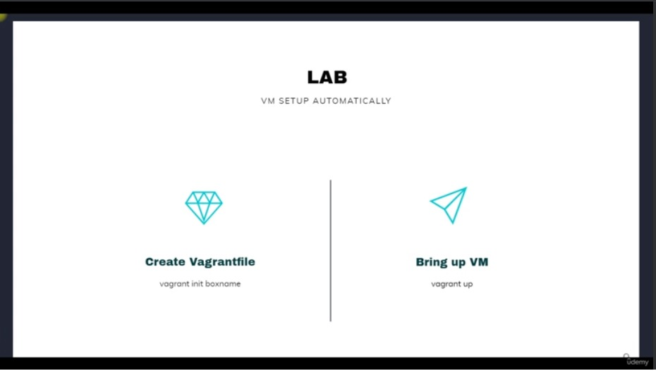

### **VM-Manually(Windows)**

+ Deux choses sont nécessaires pour configurer la machine virtuelle : 

    + La première consiste à créer le matériel de la VM. Les noms choisis sont : centosvm et ubuntuvm.
    + La seconde consiste à installer le système d'exploitation dessus.

#### **1. Première étape**

+ centosvm

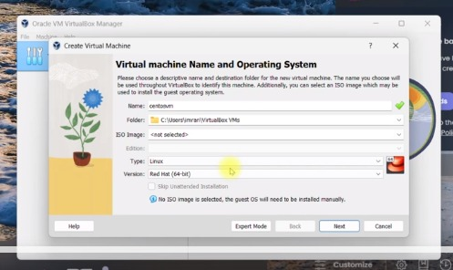
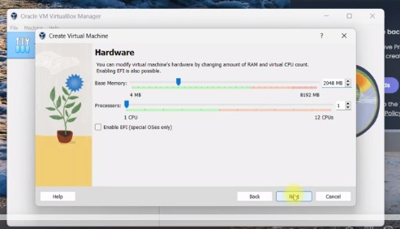
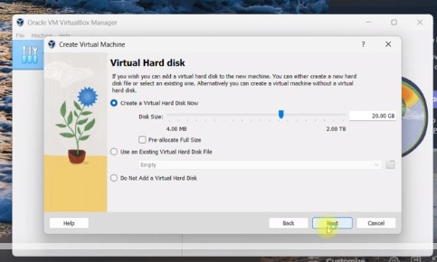
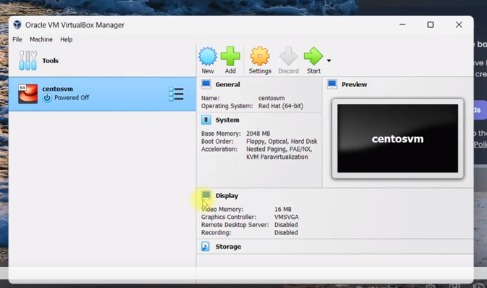

+ ubuntuvm

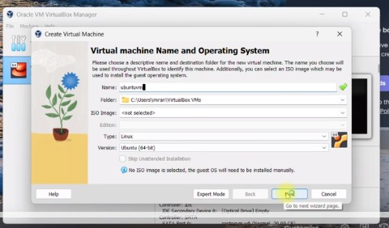
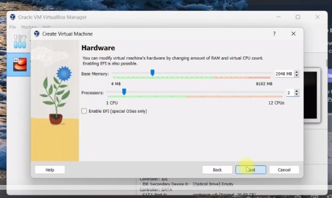
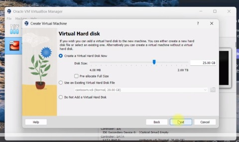
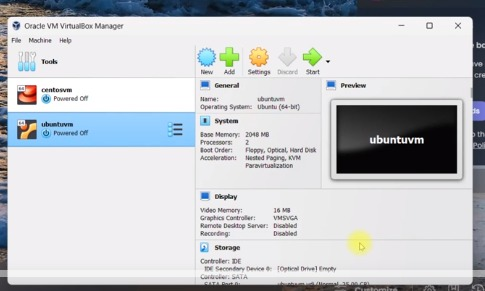

#### **Deuxième étape**

+ [CentOS](https://repo.almalinux.org/almalinux/9/isos/x86_64/AlmaLinux-9.3-x86_64-boot.iso)

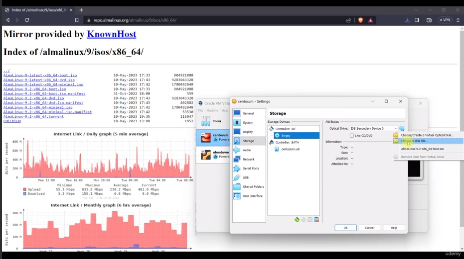
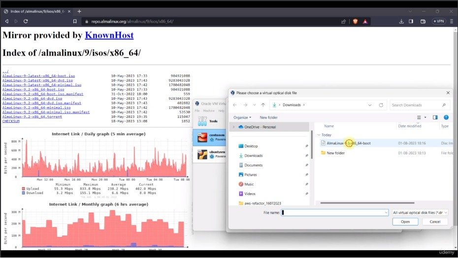
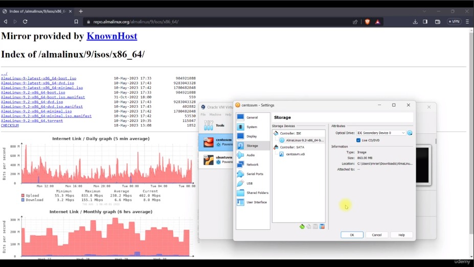

+ Passer ensuite aux configurations suivantes :
    + Installation Destination
    + Network & Host Name : Deux adaptateurs : NAT et Bridge (selectioner) et Host Name : centosvm (apply) puis cliquer sur done.
    + Root Password : entre un mot de passe puis cliquer sur done.
    + cliquer sur `Begin installation`
    + centosvm => storage = > `remove disk from virtual drive`.

+ CMD

            ipconfig
+ Git 
    
            ssh centouser@ipaddress
            password : 
            ip addr show

+ [Ubuntu](https://releases.ubuntu.com/jammy/ubuntu-22.04.3-live-server-amd64.iso)

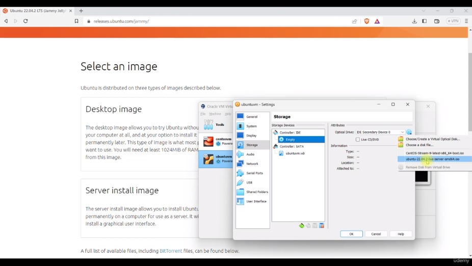
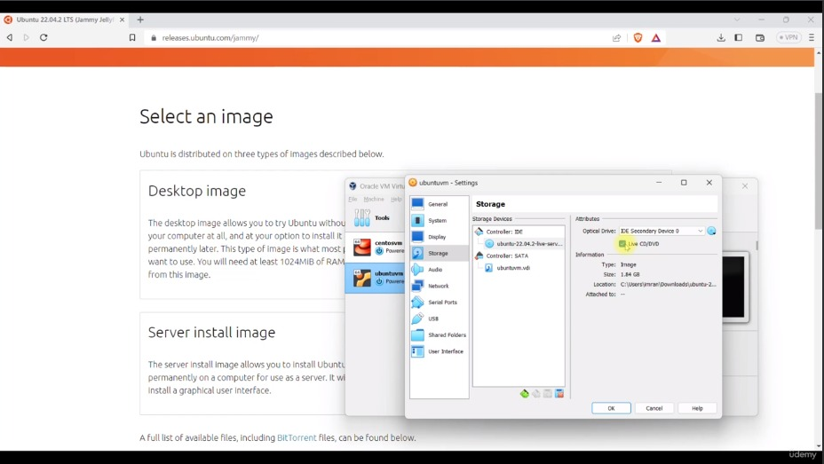
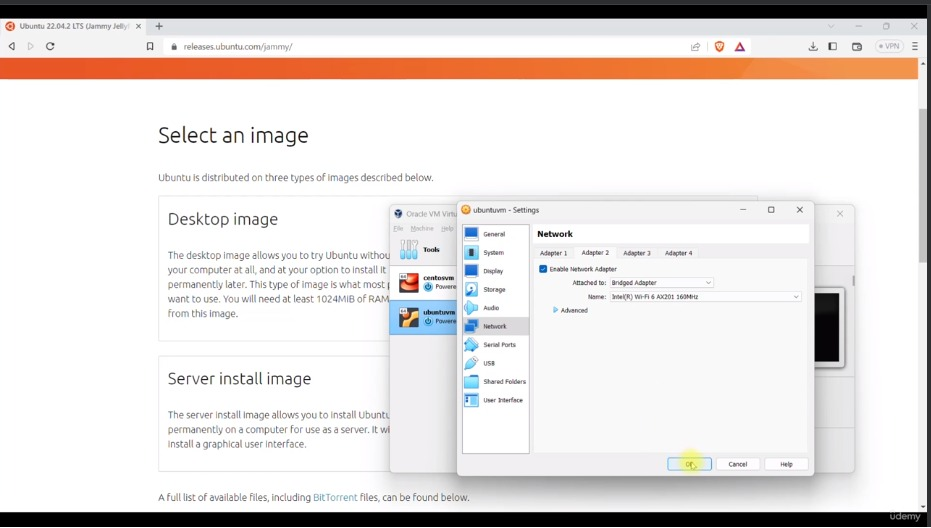

    Sélectionner la langue
    cliquer sur `continue without updating`
    puis `Done` ...

        complete : you name , your server's name, pick a username, choose a password and confirm your password.
        select `install OpenSSH server`
        `Done`....

+ Une fois que l'installation est finie aller dans storage et cliquer sur `Remove Disk from Virtual Drive`.

### **VM-Automatiquement (puce Intel Windows et MacOS)**

#### **1. Vagrant gère/automatise le cycle de vie des VM**

+ outil d'automatisation vm

#### **2. Problème de gestion de VM**

+ installation du système d'exploitation
+ Conseil en temps
+ Manuel => Erreur humaine
+ Difficile de répliquer plusieurs vms
+ Besoin de documenter l'ensemble de la configuration

#### **3. Vagrant pour les VM**

+ Aucune installation du système d'exploitation
    + Images de VM/Boîte
    + Box gratuite disponible sur vagrant cloud
    + 
+ Fichier vagrant
    + Gérer tous les paramètres vm dans un fichier
    + Changement de VM via Vagrantfile
    + Approvisionnement

#### **4. Simple commande**
+ `vagrant init boxname`
+ `vagrant up`
+ `vagrant ssh`
+ `vagrant halt`
+ `vagrant destroy`

#### **Vagrant architecture**

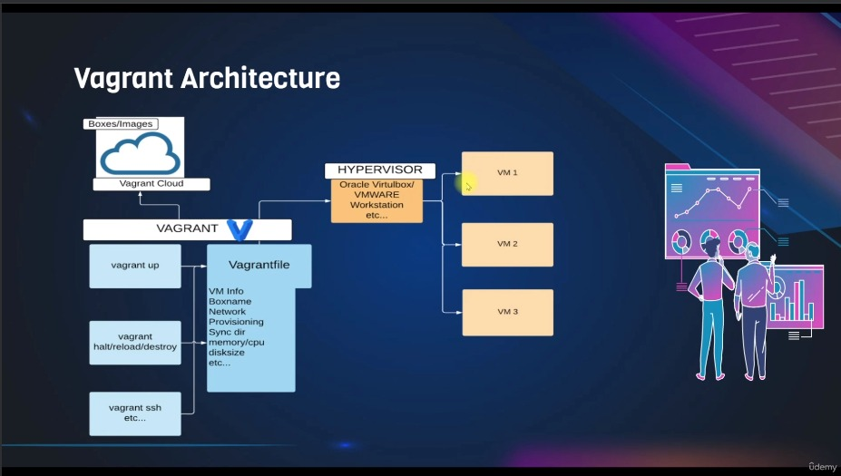

#### **Steps**

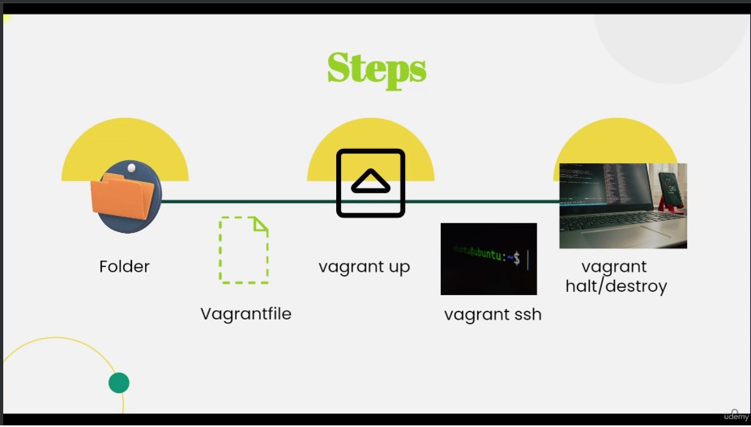

### **Chatgpt**

### **1. VM**

+ **Une machine virtuelle (VM) est une émulation logicielle d'un ordinateur physique. Il vous permet d'exécuter plusieurs systèmes d'exploitation et applications sur une seule machine physique, créant ainsi des environnements isolés et indépendants pour diverses tâches. Chaque machine virtuelle fonctionne comme s'il s'agissait d'un ordinateur physique distinct, doté de ses propres composants matériels virtualisés.**

+ **Voici un aperçu des aspects clés des machines virtuelles :***

    + **`Système d'exploitation` : Une VM peut héberger son propre système d'exploitation invité, indépendant du système hôte. Cela signifie que vous pouvez exécuter Windows sur un hôte Linux ou vice versa.**

    + **`Matériel virtuel` : les machines virtuelles émulent des composants matériels tels que les processeurs, la mémoire, le stockage, les cartes réseau et les cartes graphiques. Ces composants sont mappés aux ressources matérielles physiques mais fonctionnent dans un environnement virtualisé.**

    + **`Isolation` : les machines virtuelles sont isolées les unes des autres et du système hôte. Cet isolement empêche les activités au sein d’une VM d’affecter les autres. Il assure également sécurité et stabilité.**

    + **`Allocation de ressources` : vous pouvez allouer des quantités spécifiques de cœurs de processeur, de mémoire, de stockage et d'autres ressources à chaque `VM`, en les ajustant en fonction des exigences de la `VM`.**

    + **`Disque virtuel` : Chaque `VM` possède son propre disque dur virtuel ou image disque. Ce fichier simule un disque dur physique et contient le système d'exploitation invité, les applications et les données.**

    + **`Snapshots` : les machines virtuelles prennent en charge la création d'instantanés, qui capturent l'intégralité de l'état de la VM à un moment précis. Les instantanés sont utiles pour la sauvegarde, les tests et le retour à un état connu.**

    + **`Mise en réseau` : les machines virtuelles peuvent être connectées à différents types de réseaux, notamment `NAT (Network Address Translation), Bridged Networking et Host-Only Networking`, permettant la communication avec d'autres machines virtuelles et le réseau externe.**

    + **`Gestion du cycle de vie` : les machines virtuelles peuvent être démarrées, arrêtées, mises en pause, reprises et réinitialisées, tout comme les ordinateurs physiques. Vous pouvez créer, cloner et supprimer des machines virtuelles en fonction de vos besoins.**

    + **`Portabilité `: les `VM` peuvent être facilement transportées entre différents systèmes. Vous pouvez déplacer les fichiers de la machine virtuelle vers un autre hôte prenant en charge la même plate-forme de virtualisation.**

    + **`Tests et développement` : les machines virtuelles sont couramment utilisées pour le développement et les tests de logiciels. Les développeurs peuvent configurer rapidement différents environnements, garantissant ainsi des résultats cohérents sur différents systèmes.**

    + **`Virtualisation de serveur` : dans les environnements de serveur, les machines virtuelles permettent la consolidation de plusieurs serveurs virtuels sur une seule machine physique, optimisant ainsi l'utilisation des ressources.**

    + **`Cloud Computing` : De nombreux services cloud utilisent la virtualisation pour fournir des serveurs virtuels aux utilisateurs, leur permettant ainsi de faire évoluer les ressources en fonction de la demande.**

    + **`Hyperviseurs de type 1 et de type 2` : les machines virtuelles peuvent être gérées par des hyperviseurs de type 1 (bare metal) qui s'exécutent directement sur le matériel (par exemple, VMware vSphere, Hyper-V) ou par des hyperviseurs de type 2 (hébergés) qui s'exécutent sur le dessus. d'un système d'exploitation (par exemple, Oracle VM VirtualBox, VMware Workstation).**

+ **Les machines virtuelles offrent flexibilité, efficacité et isolation, ce qui en fait des outils essentiels dans divers domaines, notamment le développement, les tests, l'administration système et le cloud computing.**

#### **2.VirtualBox**

+ **`Une machine virtuelle (VM) VirtualBox` est un système informatique simulé qui s'exécute sur une machine hôte à l'aide du logiciel Oracle VM VirtualBox. VirtualBox vous permet de créer et de gérer ces machines virtuelles, vous permettant d'exécuter plusieurs systèmes d'exploitation et applications sur une seule machine physique. Chaque machine virtuelle est isolée du système hôte et des autres machines virtuelles, offrant ainsi un environnement contrôlé et indépendant.**

+ **Voici un aperçu des aspects clés des machines virtuelles VirtualBox :**

    + **`Isolation` : Chaque machine virtuelle fonctionne comme une entité isolée, distincte du système hôte et des autres machines virtuelles. Cette isolation garantit que les activités et les problèmes au sein d'une VM n'affectent pas les autres ou l'hôte.***

    + **`Systèmes d'exploitation invités` : au sein d'une machine virtuelle VirtualBox, vous pouvez installer et exécuter différents systèmes d'exploitation invités. Ceux-ci peuvent inclure différentes versions de Windows, des distributions Linux, macOS, BSD, etc.***

    + **`Virtualisation matérielle` : VirtualBox émule une gamme de composants matériels virtuels pour chaque VM, notamment les processeurs, la mémoire, les périphériques de stockage, les cartes réseau et les cartes graphiques. Ces composants sont virtualisés et mappés sur le matériel physique sous-jacent.**

    + **`Images de disque virtuel` : les machines virtuelles utilisent des images de disque virtuel (fichiers) qui simulent des disques durs physiques. Ces images disque stockent le système d'exploitation invité, les applications et les données.**

    + **`Snapshots` : VirtualBox vous permet de prendre des instantanés d'une  machine virtuelle à un moment précis. Les instantanés capturent l'intégralité de l'état de la VM, y compris le disque, la mémoire et d'autres paramètres. Vous pouvez revenir à un instantané si nécessaire.**

    + **`Mise en réseau` : VirtualBox propose diverses options de mise en réseau, notamment NAT (Network Address Translation), Bridged Networking et Host-Only Networking. Ceux-ci permettent aux machines virtuelles d’interagir entre elles et avec le réseau externe.**

    + **`Allocation de ressources` : VirtualBox vous permet d'allouer des cœurs de processeur, de la mémoire et d'autres ressources à chaque VM. Cette allocation peut être ajustée pour répondre aux exigences de la VM.**

    + **`Fonctionnalités d'intégration` : VirtualBox propose des ajouts d'invités (pour les invités Windows) et des extensions (pour tous les invités) pour améliorer l'intégration entre les systèmes hôte et invité. Cela inclut des fonctionnalités telles que les dossiers partagés, l’intégration transparente de la souris, et bien plus encore.**

    + **`Portabilité` : les VM créées avec VirtualBox peuvent être facilement transportées entre différents systèmes. Vous pouvez copier les fichiers et les configurations de la VM sur d'autres machines exécutant VirtualBox.**

    + **`Virtual Machine Manager` : VirtualBox fournit une interface utilisateur graphique (GUI) et une interface de ligne de commande pour gérer les machines virtuelles. L'interface graphique vous permet de créer, configurer, démarrer, arrêter et gérer des machines virtuelles.**

    + **`Environnements multi-machines` : VirtualBox prend en charge la création de plusieurs machines virtuelles sur un seul système hôte. Ceci est utile pour des scénarios tels que tester des configurations réseau ou des applications multiniveaux.**

+ **La capacité de VirtualBox à créer et à gérer des machines virtuelles en fait un outil précieux pour divers cas d'utilisation, notamment le développement de logiciels, les tests, l'administration système et la création d'environnements isolés pour l'expérimentation.**

#### **3. Vagrant**

+ **`Vagrant` est un outil open source utilisé pour créer, configurer et gérer des environnements de développement virtualisés. Il vise à simplifier le processus de configuration et de maintenance d’environnements de développement cohérents sur différentes machines. Que vous soyez développeur, administrateur système ou que vous travailliez sur un projet d'équipe, Vagrant peut vous aider à éviter les problèmes « ça fonctionne sur ma machine » en fournissant un environnement standardisé facilement partageable.***

+ **Voici un aperçu du fonctionnement de Vagrant et de ses principales fonctionnalités :**

    + **`Plateforme de virtualisation` : Vagrant prend en charge diverses plates-formes de virtualisation telles que VirtualBox, VMware, Hyper-V, etc. Ces plateformes vous permettent de créer et de gérer des machines virtuelles (VM) sur votre ordinateur local.**

    + **`Vagrantfile` : Au cœur de Vagrant se trouve le « Vagrantfile », qui est un fichier de configuration écrit en Ruby. Le Vagrantfile définit comment installer et configurer les machines virtuelles, y compris des éléments tels que le boîtier de base, la mise en réseau, les scripts de provisionnement, etc.**

    + **`Boîtes de base` : une boîte de base est une image de VM préconfigurée avec un système d'exploitation et tous les logiciels nécessaires. Vagrant utilise des boîtes de base comme modèles pour créer de nouvelles instances de VM.**

    + **`Approvisionnement` : Vagrant permet un approvisionnement automatisé à l'aide de divers outils tels que des scripts shell, Puppet, Chef et Ansible. Cela garantit que vos machines virtuelles sont configurées de manière cohérente et peuvent être facilement reproduites.**

    + **`Configuration facile` : avec une commande simple comme vagrant up, Vagrant lit le fichier Vagrant, télécharge ou importe la boîte de base spécifiée et crée une nouvelle instance de VM en fonction de la configuration.**

    + **`Mise en réseau` : Vagrant prend en charge diverses options de mise en réseau, notamment les réseaux privés, les ports transférés, etc., vous permettant d'accéder à vos machines virtuelles comme s'il s'agissait de machines distinctes sur votre réseau.**

    + **`Partage` : Vagrant vous permet de packager et de partager votre environnement de développement avec d'autres à l'aide d'outils comme Vagrant Cloud ou en partageant le Vagrantfile et le boîtier de base.**

    + **`Gestion du cycle de vie` : Vagrant fournit des commandes telles que vagrant halt, vagrant suspend, vagrant resumeet vagrant destroypour contrôler le cycle de vie de vos VM.**

    + **`Environnements multi-machines` : Vagrant vous permet de définir et de gérer plusieurs machines virtuelles dans un seul fichier Vagrant, permettant des configurations multi-machines complexes pour les tests et le développement.**

    + **`Système de plugins` : Vagrant dispose d'un système de plugins robuste qui vous permet d'étendre ses fonctionnalités. Il existe des plugins pour les fournisseurs supplémentaires, la mise en réseau, etc.**

+ **Vagrant est particulièrement utile dans les scénarios dans lesquels vous devez travailler avec différentes technologies ou configurations, collaborer avec d'autres ou répliquer un environnement spécifique sur différents systèmes. Il permet de rationaliser le processus de configuration et de réduire les incohérences, conduisant à des flux de travail de développement plus efficaces et plus fiables.**

