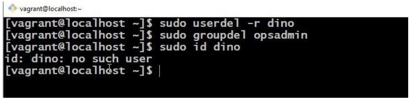

# **Courses**

## **1. Introduction**

### **Open source**

+ Un « logiciel Open Source » est un logiciel dont le code source peut être inspecté, modifié et amélioré par n'importe qui.

### **Historique Linux**

+ Origines Linux
  + 1984 : Le projet GNU et la Free Software Foundation
    + Crée une version open source des utilitaires « UNIX »
    + Crée la Licence Publique Générale (GPL)
      + licence logicielle appliquant les principes open source
  + 1991 : Linus Torvalds
    + Crée un noyau open source, de type `UNIX`, publié sous `GPL`
    + Portage de certains utilitaires `GNU`, sollicite de l'aide en ligne
  + Aujourd'hui :
    + `Noyau Linux` + `Utilitaires GNU` = système d'exploitation complet, open source, de type UNI X.
      + Forfait pour publics ciblés comme distribution

### **Principes Linux**
+ Tout est un fichier (y compris le matériel)
+ Petits programmes à objectif unique
+ Capacité à enchaîner des programmes pour des opérations complexes
+ Évitez l'interface utilisateur captive
+ Données de configuration stockées dans un fichier texte.

### **Pourquoi Linux**
+ Open Source
+ Soutien communautaire
+ Prend en charge une grande variété de matériel
+ Personnalisation
+ La plupart des serveurs fonctionnent sous Linux.
+ Automatisation
+ Sécurité

### **Architecture of Linux**

### **Distributions Linux populaires**
+ Système d'exploitation Linux de bureau populaire
  + Ubuntu-Linux
  + Linux Mint
  + Arch Linux
  + Fedora
  + Debian
  + OpenSuse

### **Système d'exploitation Linux pour serveur populaire**
+ Red Hat Entreprise Linux
+ Serveur Ubuntu
+ Centos
+ SUSE Entreprise Linux.

  + https://en.wikipedia.org/wiki/List_of_Linux_distributions

### **Distributions Linux les plus utilisées actuellement dans le secteur informatique**

+ **Basé sur le RPM:  `RHEL, Centos, Oracle Linux`**
+ **Basé sur Debian: `Serveur Ubuntu, Kali Linux`**

### **Quelques répertoires importants**

+ **Répertoires personnels :**
  + `/root, /home, /username`
  
+ **Exécutable utilisateur :**
  + `/bin, /usr/bin, /usr/local/bin`
  + 
+ **Exécutable système :**
  + `/sbin, /usr/sbin, /usr/local/sbin`

+ **Autres points de montage :**
  + `/media, /mnt`
  
+ **Configuration :**
  + `/etc`
  
+ **Fichiers temporaires :**
  + `/tmp`
  
+ **Noyaux et chargeur de démarrage:**
  + `/boot`
  
+ **Données du serveur :**
  + `/var, /srv`
  
+ **Informations système :**
  + `/proc, /sys`
  
+ **Bibliothèques partagées :**
  + `/lib, /usr/lib, /usr/local/lib`

## **2. Commandes de base**

+ **Ouvrir le terminal**

➔ **Tu sais où tu es ? Répertoire de travail actuel**

➔ **Créez un répertoire/dossier dans votre répertoire personnel**

➔ **Changez votre répertoire de travail actuel en linux-practices (Allez sur dossier linux-practices).**

➔ **Créez quelques répertoires supplémentaires et répertoriez-les avec la commande « ls ».**

➔ **Créez des fichiers vides avec la commande `touch` et répertoriez-les.**

➔ **Reconfirmez votre emplacement dans votre système.**

### **Chemin absolu et chemin relatif**

### **Qu'est-ce qu'un chemin ?**

+ **`Un chemin(path)`: est un emplacement unique vers un fichier ou un dossier dans un système de fichiers d'un système d'exploitation. Un chemin d'accès à un fichier est une combinaison de caractères / et alphanumériques.***

### **Qu'est-ce qu'un chemin absolu ?**

+ **`Un chemin absolu` est défini comme spécifiant l'emplacement d'un fichier ou d'un répertoire à partir du répertoire racine (/). En d’autres termes, nous pouvons dire que le chemin absolu est un chemin complet depuis le début du système de fichiers réel à partir du répertoire /.***

### **Quelques exemples de chemin absolu :**

+ `/home/imran/linux-pratiques/`
+ `/var/ftp/pub`
+ `/etc/samba.smb.conf`
+ `/boot/grub/grub.conf`

+ **Si vous voyez tous ces chemins démarrés à partir du répertoire / qui est un répertoire racine pour toutes les machines Linux/Unix.**

#### **Quel est le chemin relatif ?**

+ **`Le chemin relatif` est défini comme le chemin lié au répertoire de travail actuel `(pwd)`. Supposons que je me trouve dans `/home/imran` et que je souhaite changer de répertoire en `/home/imran/linux-practices`. Je peux utiliser le concept de chemin relatif pour changer de répertoire en pratiques Linux et également en répertoire devopsdir.**

+ **Si vous voyez que tous ces chemins ne commencent pas par le répertoire /.**

**➔ Création de répertoires dans le répertoire `devopsdir` avec chemin absolu et relatif.**

**➔ Copie des fichiers dans le répertoire.**

**➔ Copie de répertoires d'un emplacement à un autre.**

**➔ Déplacer des fichiers d'un emplacement à un autre.**

**➔ Suppression de fichiers et de répertoires.**

#### **ÉDITEUR VIM**
**➔ Installez l'éditeur vim.**

**➔ Ouvrez un fichier dans l'éditeur `vim`**

**➔ Appuyez sur i pour entrer en mode insertion**

**=> tapez quelques lignes => appuyez sur `Echap`**

**=> tapez :`wq`**

**=> Entrez.**

**➔ Lisez le fichier avec la commande `cat`.**

## **ÉDITEUR VIM**
### **VI Éditeur d'affichage visuel**
#### **Éditeur d'affichage visuel VIM amélioré**
+ **Il s'agit d'un éditeur en mode commande pour les fichiers. Les autres éditeurs sous Linux sont emacs, gedit l'éditeur vi est le plus populaire**
+ **Il dispose de 3 modes :**
  + **1 mode commande**
  + **2 Mode insertion (mode édition)**
  + **3 modes de commande étendus**

+ **Remarque**: lorsque vous ouvrez l'éditeur vim, il sera en mode commande par défaut.

#### **Mode commande :**

|          ||
|----------|-----|
| `gg`     | Pour aller au début de la page|
| `G`      | Pour aller en fin de page|
| `w`      | Pour avancer le curseur, mot par mot|
| b`       | Pour déplacer le curseur vers l'arrière, mot par mot|
| `nw`     | Pour déplacer le curseur vers n mots (SW)|
| `nb`     | Pour reculer le curseur sur n mots {SB)|
| `u`      | Pour annuler la dernière modification (mot)|
| `U`      | Pour annuler les modifications précédentes (ligne entière)|
| `Ctrl+R` | Pour refaire les modifications|
| `VY`     | Pour copier une ligne|
| `nyy`    | Pour copier n lignes (Syy ou 4yy)|
| `p`      |Pour coller une ligne sous la position du curseur|
| `P`      | Pour coller une ligne au-dessus de la position du curseur|
| dw`      | Pour supprimer le mot lettre par lettre {likeBackspace}|
| `X`      | Pour supprimer le monde lettre par lettre (comme la touche DEL) I·,|
| `dd      | Pour supprimer la ligne entière \' --|
| `ndd`    | Supprimer n no. de lignes à partir de la position du curseur{Sdd) ,|
| `I`      | Pour rechercher un mot dans le fichier|

#### **Mode étendu : (mode côlon)**
+ ***Le mode étendu est utilisé pour enregistrer et quitter ou enregistrer sans quitter en utilisant la touche "Esc" avec : "***

|||
|-----|-----|
|`Esc+:w`| pour enregistrer les modifications|
|`Esc+:q`| Pour quitter (Sans sauvegarder)|
|`Esc+:wq`| Pour enregistrer et quitter|
|`Esc+:w!`| Pour sauvegarder avec force|
|`Esc+wq !`| Pour sauvegarder et quitter avec force|
|`Esc+:x`| Pour enregistrer et quitter|
|`Esc+:X`| Pour donner le mot de passe ou d au fichier et supprimer le mot de passe|
|`Esc+:20(n)`| Pour aller à la ligne n°20 ou n|
|`Esc+: se nu`| Pour définir les numéros de ligne du fichier|
|`Esc+:se nonu`| Pour supprimer les numéros de ligne définis|

#### **Options de commande `ls`**

| Options | Descriptif|
|---------|------------|
| `-l`    | Format de liste longue de fichiers et de répertoires, un par ligne |
| `-a`    | Liste tous les fichiers et répertoires cachés commençant par '.'|
| `-F`    |Ajouter une classification '/' à la fin de chaque répertoire|
| `-g`    | Répertoriez tous les fichiers et répertoires portant le nom du groupe |
| `-i     |Imprimer le numéro d'index de chaque fichier et répertoire|
| `-m`      | Répertoriez tous les fichiers et répertoires séparés par une virgule ','|
| `-n`      | Répertorier l'UID et le GID numériques du propriétaire et des groupes |
| `-r`      | Répertorier tous les fichiers et répertoires dans l'ordre inverse |
| `-R`      | présélectionner tous les répertoires |
| `-t`      | Trié par heure de modification, démarré avec le fichier le plus récent |

#### **Types de fichiers sous Linux**

|Type de fichier| Premier caractère dans la description de la liste des fichiers                                                          |
|--------------|------------------------------------------------------------------------------------------------------|
|Fichier normal `~`| Fichiers normaux tels que du texte, des données ou des fichiers exécutables                                             |
|Répertoire `d`| Fichiers qui sont des listes d'autres fichiers                                                                          |
|Lien `l`| Un raccourci qui pointe vers l'emplacement du fichier réel                                                              |
|Fichier spécial `c`| Mécanisme utilisé pour l'entrée et la sortie, tel que les fichiers dans `/dev`                                          |
|Socket `s`| Un fichier spécial qui fournit une mise en réseau inter-processus protégée par le contrôle d'accès du système de fichiers |
|Pipe `p` | Un fichier spécial qui permet aux processus de communiquer entre eux sans utiliser la sémantique des sockets réseau     |

#### **Liens symboliques**
+ **Les liens symboliques sont comme les raccourcis sur le bureau que nous utilisons dans Windows.**
+ **Créez un lien symbolique pour le répertoire `/var/log` dans notre répertoire de travail actuel.**

## **4. Commande de filtrage et de redirection IO**

### **Grep**

+ **La commande `grep` est utilisée pour rechercher des textes à partir de n'importe quelle saisie de texte.**
+ **`Passwd file` : stocke des informations sur tous les utilisateurs du système.**

**➔ Recherche d'une ligne contenant le mot `root` du fichier `/etc/passwd`.**

**➔ Linux respecte la casse, root est différent de cette racine. Ignorer la casse dans grep avec l'option -i.**

**➔ Pour afficher des éléments à l'exception du mot donné, utilisez l'option -v**

### **Commandes de filtre**

#### **1. Less**

+ **`less` : affiche le contenu du fichier par page ou par ligne.**
  + Ex : `less /etc/passwd`

+ Note :

  + appuyez sur la touche « Entrée » pour faire défiler vers le bas ligne par ligne (ou)
  + Utilisez `d` pour accéder aux pages suivantes
  + Utilisez `b` pour accéder à la page précédente 
  + Utilisez `/` pour rechercher un mot dans le fichier
  + Utilisez `v` pour passer en mode `vi` où vous pouvez éditer le fichier et une fois que vous l'aurez enregistré, vous reviendrez à la commande less.

#### **2. More**

+ **`more` est exactement la même chose que `less`**

  + Ex : `#more /etc/passwd`
  
    + appuyez sur la touche `enter` pour faire défiler vers le bas ligne par ligne (ou)
    
    + Utilisez `d` pour accéder aux pages suivantes
  
    + Utilisez `b` pour accéder à la page précédente
  
    + Utilisez `/` pour rechercher un mot dans le fichier
  
    + Utilisez `v` pour passer en mode vi où vous pouvez éditer le fichier et une fois que vous l'aurez enregistré, vous reviendrez à la commande less.
  
#### **3. head**

+ **Il est utilisé pour afficher les 10 premières lignes du fichier.**
  
  + Ex : `#head /etc/passwd`
    

#### **4. tail**

+ **Il permet d'afficher les 10 dernières lignes du fichier.**

  + Ex : `#tail /etc/passwd`
    

#### **5. Cut**
+ `#cut -d -f filename` (où `d` représente le délimiteur ex. :, " " etc et `f` représente le champ)
  

+ **Pour délimiter les espaces et imprimer le champ**

  + `#cut -d " " -f1 filename`
  

#### **6. Sed**
+ **`sed` signifie éditeur de flux, qui est utilisé pour rechercher un mot dans le fichier et le remplacer par le mot qui doit figurer dans la sortie.**

+ **Remarque: cela modifiera uniquement la sortie, mais il n'y aura aucun changement dans le fichier original.**

  + **`#sed 's/searchfor/replacewith/g' filename`**
    

#### **Redirection d'E/S**

+ **La redirection est un processus par lequel nous pouvons copier la sortie de n'importe quelle(s) commande(s), fichier(s) dans un nouveau fichier. Il existe deux manières de rediriger la sortie vers un fichier. En utilisant `>` ou `>>` filename après la commande, et ...**

**➔ Créez un fichier nommé devopstools avec le contenu ci-dessous.**

**➔ Recherchez le texte « tech », remplacez-le par « tools » et redirigez la sortie vers un nouveau fichier.**

+ **Remarque : si le nom du fichier n'est pas disponible, un nouveau fichier sera créé automatiquement. Si le fichier existe déjà, il écrasera le contenu de ce fichier.**

**➔ Ajout d'une autre sortie dans le même fichier avec « >> ».**

**➔ Redirection uniquement de l'erreur vers un fichier « 2>> ».**

**➔ Redirection de toutes les sorties vers un fichier « &>> ».**

#### **Piping**
+ **Jusqu'à présent, nous avons traité de l'envoi de données vers et depuis des fichiers. Nous allons maintenant examiner un mécanisme permettant d'envoyer des données d'un programme à un autre. C'est ce qu'on appelle la tuyauterie et l'opérateur que nous utilisons est (|). Qu'est-ce que cet opérateur du programme de gauche comme entrée du programme de droite.**

#### **find**
+ **La commande `find` est utilisée pour rechercher des fichiers ou le chemin d'un répertoire, c'est exactement comme l'option de recherche dans Windows où vous pouvez rechercher un fichier.**

+ Options pouvant être utilisées avec la commande `find` :

|Options| Utilisation|
|--------------|------------|
|`-name`| Pour rechercher un fichier avec son nom|
|`-inum`|Pour rechercher un fichier avec un numéro d'inode particulier|
|`-type`| Pour rechercher un type particulier de fichier|
|`-user`|Pour les fichiers dont le propriétaire est un utilisateur particulier|
|`-group`|Pour les fichiers appartenant à un groupe particulier|

## **5. Utilisateurs et groupes**

### **UTILISATEURS**

+ **Quelques points importants liés aux Utilisateurs :**
  + **Les utilisateurs et les groupes sont utilisés pour contrôler l'accès aux fichiers et aux ressources.**
  + **Les utilisateurs se connectent au système en fournissant leur nom d'utilisateur et leur mot de passe**
  + **Chaque fichier du système appartient à un groupe et ne peut accéder qu'aux ressources auxquelles son propriétaire ou son groupe peut accéder.**
  + **Chaque utilisateur du système se voit attribuer un numéro d'identification d'utilisateur unique (l'UID)**
  + **Le nom de l'utilisateur et l'UID sont stockés dans `etc/passwd`**
  + **Le mot de passe de l'utilisateur est stocké dans `etc/shadow` sous forme cryptée**
  + **Les utilisateurs se voient attribuer un « répertoire personnel » et un programme qui est exécuté lorsqu'ils se connectent (généralement un shell)**
  + **Les utilisateurs ne peuvent pas lire, écrire ou exécuter les fichiers des autres sans autorisation.**

### **Type d'utilisateur**

+ **Sous Linux, il existe trois types d'utilisateurs**
  + **1) Super utilisateur ou utilisateur root.**
    + **Le super utilisateur ou l'utilisateur root est l'utilisateur le plus puissant. Il est l'administrateur.**

  + **2) Utilisateur du système**
    + **Les utilisateurs du système sont des utilisateurs créés par le logiciel ou l'application. Par exemple, si nous installons Apache, cela créera un utilisateur Apache. Ces types d'utilisateurs sont appelés utilisateurs du système.**

  + **3) Utilisateur normal**
    + **Les utilisateurs normaux sont les utilisateurs créés par l'utilisateur root. Ce sont des utilisateurs normaux comme « Etienne, François » etc. Seul l'utilisateur « root » a la permission de créer ou de supprimer un utilisateur.**

+ **Chaque fois qu'un utilisateur est créé sous Linux, les éléments sont créés par défau***t :
  + **Un répertoire `home` est créé (/home/username)**
  + **Une boîte mail est créée (/var/spool/mail)**
  + **`UID et GID` uniques sont attribués à l'utilisateur**

#### **Fichier de mot de passe**
+ **1) /etc/mot de passe**

+ **Les fichiers ci-dessus sont**

  + **`root` = nom**
  + **`x` = lien vers le fichier de mot de passe, c'est-à-dire `/etc/shadow`**
  + **`0 ou 1` = UID (ID utilisateur)**
  + **`0 ou 1` = GID (ID de groupe)**
  + **`root` ou `bin` = commentaire (brèves informations sur l'utilisateur)**
  + **`/root` ou `/bin` = répertoire personnel de l'utilisateur**
  + **`/bin/bash` ou `/sbin/nologin` = shell**

#### **Fichier de groupe***

+ ***2) /etc/groupe***

+ ***Le fichier /etc/group stocke les informations sur le groupe. Chaque ligne de ce fichier stocke une entrée de groupe.***

  + ***Nom du groupe, mot de passe du groupe, GID, membres du groupe***

+ **AJOUTER UN UTILISATEUR, UN GROUPE ET UN UTILISATEUR DANS LE GROUPE**

+ **SUPPRIMER L'UTILISATEUR ET LE GROUPE**

#### **3. Le fichier /etc/shadow**

+ ***Ce fichier stocke le mot de passe des utilisateurs et les informations relatives au mot de passe. Tout comme le fichier `/etc/passwd`, ce fichier utilise également une ligne individuelle pour chaque entrée.***

  + **1. Nom d'utilisateur**
  + **2. Mot de passe crypté**
  + **3. Nombre de jours pendant lesquels le mot de passe a été modifié pour la dernière fois**
  + **4. Nombre de jours avant que le mot de passe puisse être modifié**
  + **5. Nombre de jours après que le mot de passe doit être modifié**
  + **6. Nombre de jours avant la date d'expiration du mot de passe pour afficher le message d'avertissement**
  + **7. Nombre de jours pour désactiver le compte après l'expiration du mot de passe**
  + **8. Nombre de jours depuis que le compte est désactivé**
  + **9. Champ réservé**

#### **Aide-mémoire UTILISATEURS ET GROUPES**

|COMMANDES |DESCRIPTION|
|----------------------|----------------------|
|useradd| Crée un utilisateur dans RedHat|
|adduser| Crée un utilisateur dans Ubuntu |
|id| Affiche les informations utilisateur |
|groupadd| Crée un groupe|
|usermod -G grpnam usrname |Ajoute un utilisateur au groupe|
|passwd |définir/réinitialiser le mot de passe|
|utilisateurdel -r| supprime l'utilisateur avec le répertoire personnel|
|groupdel| supprime le groupe|
|last|affiche la dernière connexion au système|
|who| qui est connecté au système |
|whoami |nom d'utilisateur|
|lsof -u user| Liste des fichiers ouverts par l'utilisateur |

## **6.Autorisations de fichiers**

### **Affichage des autorisations à partir de la ligne de commande**

+ Les autorisations de fichiers peuvent être consultées en utilisant `ls -l`

      $ ls -l /bin/login
      -rwxr -xr -x 1 root root 19080vApr 1 18:26 /bin/login

+ Quatre symboles sont utilisés lors de l'affichage des autorisations :
  + `r : ` autorisation de lire un fichier ou de lister le contenu d'un répertoire
  + `w : ` autorisation d'écrire dans un fichier ou de créer et supprimer des fichiers d'un répertoire.
  + `x : ` autorisation d'exécuter un programme ou de se déplacer dans un répertoire et de faire un long listing de répertoire.
  + `- : `pas d'autorisation (à la place du `r, w ou x`)

### **Modification de la propriété du fichier**
+ Seul root peut changer le propriétaire d'un fichier
+ Seul root ou le propriétaire peut modifier le groupe d'un fichier
+ La propriété est modifiée avec `chown` :
  + `chown [-R] nom_utilisateur fichier|répertoire...`
+ La propriété du groupe est modifiée par `chgrp` :
  + `chgrp [-R] nom_groupe champ|répertoire...`

#### **Modification des autorisations - Méthode symbolique***
+ **Pour modifier les modes d'accès :**

  + `chmod [-OPTION] ... mode[,mode] filel directory...`

+ **Le mode comprend :**
  + `u,g ou o` pour l'utilisateur, le groupe et autres
  + `+ - ou =` pour accorder, refuser ou définir
  + `r, w ou x` pour lire, écrire et exécuter

+ **Les options incluent :**
  + `- R` : Récursif
  + `-v ` : verbeux
  + `--reference`: Référence un autre fichier pour son mode

+ **Exemples:**
  + **`chmod ugo+r file` : accorder l'accès en lecture à tous pour le fichier**
  + **`chmod o-wx dir` : refuser l'écriture et l'exécution à d'autres pour le répertoire**
---

### **Modification des autorisations - Méthode numérique**

+ **Utilise un numéro de mode à trois chiffres**
  + **le premier chiffre spécifie les autorisations du propriétaire**
  + **le deuxième chiffre spécifie les autorisations du groupe**
  + **le troisième chiffre représente les autorisations des autres**

+ **Les autorisations sont calculées en ajoutant :**
  + **4 (pour lire)**
  + **2 (pour écrire)**
  + **1 (pour exécuter)**

+ **Exemple:**
  + `chmod 640 myfile`

---

## **7. Sudo**
+ **`sudo` donne le pouvoir à un utilisateur normal d'exécuter des commandes appartenant à l'utilisateur `root`.**

### **Exemple ci-dessous :**

+ **Si un utilisateur dispose déjà du privilège sudoers complet, il peut devenir un utilisateur root à tout moment.**

**➔ `sudo -i` passe d'utilisateur normal à utilisateur root**

+ **Remarque : l'utilisateur imran était déjà un utilisateur sudo avec tous les privilèges.**

**➔ Ajout de l'utilisateur sam dans la liste des sudoers**

**➔ Comme un utilisateur, un groupe peut également être ajouté à la liste des sudoers.**

**➔ Chaque fois que vous entrez la commande sudo, elle vous demande votre propre mot de passe. Pour désactiver cela, utilisez `NOPASSWD` dans le fichier sudoers.**

**➔ Passer à n'importe quel autre utilisateur avec la commande «su -».**

**➔ Devenez un utilisateur root à partir de la connexion de l'utilisateur Sam.**

## **8. Software Management**

**➔ Téléchargez le package depuis Internet.**

+ **Pour `CentOS`**

  + Pour installer `tree`

        # curl https://rpmfind.net/linux/centos/7.9.2009/os/x86_64/Packages/tree-1.6.0-10.el7.x86_64.rpm -o tree-1.6.0-10.el7.x86_64.rpm

        # rpm -ivh tree-1.6.0-10.el7.x86_64.rpm

### **Pour installer httpd**

      # curl https://rpmfind.net/linux/centos/7.9.2009/os/x86_64/Packages/httpd-2.4.6-95.el7.centos.x86_64.rpm -o httpd2.4.6-95.el7.centos .x86_64.rpm

      # tr/min -ivh httpd-2.4.6-95.el7.centos.x86_64.rpm

+ **En raison des dépendances, il échoue et il sera installé une fois que nous installerons toutes les dépendances. Mais et si nous avions
  Des centaines de dépendances, et cela peut être facilement résolu par d'autres gestionnaires de packages comme `YUM`.**

+ **`repos. d/` répertoire. Il lit chaque fichier de configuration du référentiel YUM pour obtenir les informations requises pour
  télécharger et installer un nouveau logiciel, résoudre les dépendances logicielles et installer le package `RPM` requis
  des dossiers.**

+ **Les fichiers de configuration du référentiel `YUM` doivent : être situés dans `/etc/yum.repos.d`**

+ **ls /etc/yum.repos.d/**

#### **Montre l'utilisation de la commande YUM avec des options**

+ **# yum --help**

#### **Pour mettre à jour tous vos packages**

+ **# yum update**

#### **Pour installer httpd**

+ **# yum install httpd -y**

#### **Pour supprimer httpd**

+ **# yum remove httpd -y**

### **Pour Ubuntu**

    # wget http://archive.ubuntu.com/ubuntu/pool/universe/t/tree/tree_1.7.0-3_amd64.deb -o tree_1.7.0-3_amd64.deb

    # dpkg -i tree_1.7.0-3_amd64.deb

+ **Nous avons vu `YUM` Comme ça pour `Ubuntu`, nous avons un gestionnaire de paquets `apt`.**

+ **Les sources. Le fichier list est un facteur clé dans l’ajout ou la mise à niveau d’applications vers votre installation Ubuntu. C'est également utilisé par votre système pour les mises à jour du système. Le fichier est essentiellement la feuille de route permettant à votre système de savoir où il peut télécharger des programmes pour l'installation ou la mise à niveau.**

+ **# cat /etc/apt/sources.list**

#### **Montre l'utilisation de la commande apt avec des options**

+ **# apt --help**

#### **Pour mettre à jour toutes vos listes de packages**

+ **#apt update**

#### **POUR rechercher un apache2**

+ **# apt search apache2**

#### **Pour installer apache2**
+ **# apt install apache2 -y**

#### **Pour supprimer Apache2**
+ **# apt remove apache2 -y**

| Commands                                         | Description                                                                                                                         | ... |
|--------------------------------------------------|-------------------------------------------------------------------------------------------------------------------------------------|-----|
| `wget link`                                      | Pour télécharger le fichier à partir du lien.                                                                                       |     |
| `curl link`                                      | Accéder au fichier à partir du lien.                                                                                                |     |
| `curl link -o outputfile`                        | Accéder au fichier et stocker les o/p dans un fichier.                                                                              |     |
| **REDHAT RPM COMMANDS**                          |                                                                                                                                     |     |
| `rpm -ivh {rpm-file}`                            | rpm -ivh mozilla-mail-1.7.6-12.i586.rpm   rpm -ivh --test mozilla-mail-1.71.6-12.i586.rpm                                       |     |
| `rpm -Uvh {rpm-file}`                            | rpm -Uvh mozilla-mail-1.7.6-12.i586.rpm   rpm -Uvh --test mozilla-mail-1.71.6-12.i586.rpm                                       |     |
| `rpm -ev {package}`                              | rpm -ev mozilla-mail                                                                                                                |     |
| `rpm -ev --nodeps {package}`                     | rpm -ev --nodeps mozilla-mail                                                                                                       |     |
|                                                  | **dependencies**                                                                                                                    |     |
|                                                  |                                                                                                                                     |     |
| `rpm -qa`                                        | rpm -qa                                                                                                                             |     |
| `rpm -qi {package}`                              | rpm -qi mozilla-mail                                                                                                                |     |
| `rpm -qf {/path/to/file}`                        | rpm -qf /etc/passwd   rpm -qf /bin/bash                                                                                         |     |
| `rpm -qc {package-name}`                         | rpm -qc httpd                                                                                                                       |     |
| `rpm -qcf {path/to/filee}`                       | rpm -qcf /usr/X11R6/bin/xeyes                                                                                                       |     |
| `rpm -qa --last`                                 | rpm -qa --last   rpm -qa --last  less`                                                                                          |     |
| `rpm -qpR {.rpm-file}`   `rpm -qR {package}` | rpm -qpR mediawiki-1.4rc1-4.i586.rpm   rpm -qR bash                                                                             |     |
| **Centos_8 Commands***                           |                                                                                                                                     |     |
| **DNF Commands Cheatsheet**                      | https://www.linuxtechi.com/dnf-command-examples-rpm-management-fedora-linux                                                         |     |
| `dnf --help`                                     | montrer l'aide                                                                                                                      |     |
| `dnf search PACKAGE`                             | recherche dans les référentiels disponibles.                                                                                        |     |
| `dnf install PACKAGE -y`                         | pour installer le paquet.                                                                                                           |     |
| `dnf install httpd -y`                           | pour installer le package `httpd`.                                                                                                  |     |
| `dnf install vim -y`                             | pour installer l'éditeur `VIM`.                                                                                                     |     |
| `dnf reinstall PACKAGE`                          | pour réinstaller le PACKAGE.                                                                                                        |     |
| `dnf remove PACKAGE`                             | pour supprimer le package.                                                                                                          |     |
| `dnf update`                                     | mettre à jour tous les packages.                                                                                                    |     |
| `dnf update PACKAGE`                             | mettre à jour un package spécifique.                                                                                                |     |
| `dnf grouplist`                                  | lister tous les forfaits de groupe disponibles.                                                                                     |     |
| `dnf groupinstall "GROUPNAME"`                   | installe tous les packages dans un groupe.                                                                                          |     |
| `dnf repolist`                                   | liste des référentiels `dnf` activés.                                                                                               |     |
| `dnf clean all`                                  | nettoyer le cache `dnf`.                                                                                                            |     |
| `dnf epel-release`                               | Référentiel de packages supplémentaire offrant un accès facile à l'installation de packages pour les logiciels couramment utilisés. |     |
| `dnf history`                                    | Afficher l'historique de `dnf`.                                                                                                     |     |
| `dnf info package name`                          | Affiche les informations du package telles que la version, la taille, la source, le référentiel, etc.                               |     |
| **YUM Commnds Cheatsheet**                       | http://access.redhat.com/sites/default/files/attachementsrh_yum_cheatsheet_1214_jcs_print-1.pdf                                     |     |
| `yum -help`                                      | montrer l'aide                                                                                                                      |     |
| `yum search PACKAGE`                             | recherche dans les référentiels disponibles.                                                                                        |     |
| `yum install PACKAGE -y`                         | pour installer le package.                                                                                                          |     |
| `yum install httpd -y`                           | pour installer le package `httpd`.                                                                                                  |     |
| `yum install vim -y`                             | pour installer l'éditeur `VIM`.                                                                                                     |     |
| `yum reinstall PACKAGE`                          | pour réinstaller le PACKAGE.                                                                                                        |     |
| `yum remove PACKAGE`                             | pour supprimer le package.                                                                                                          |     |
| `yum update`                                     | mettre à jour tous les packages.                                                                                                    |     |
| `yum update PACKAGE`                             | mettre à jour un package spécifique.                                                                                                |     |
| `yum grouplist`                                  | lister tous les forfaits de groupe disponibles.                                                                                     |     |
| `yum groupinstall "GROUP Name"`                  | installe tous les packages dans un groupe.                                                                                          |     |
| `yum repolist`                                   | liste des référentiels `YUM` activés.                                                                                               |     |
| `yum install epel-release`                       | Référentiel de packages supplémentaire offrant un accès facile à l'installation de packages pour les logiciels couramment utilisés. |     |
| `yum clean all`                                  | nettoyer le cache `yum`.                                                                                                            |     |
| `yum history`                                    | afficher l'historique de `yum`.                                                                                                     |     |
| `yum info PACKAGE NAME`                          | Affiche les informations du package telles que la version, la taille, la source, le référentiel, etc.                               |     |
| **UBUNTU20 COMMANDS**                            |                                                                                                                                     |     |
| **apt commands cheatsheet**                      | https://itsfoss.com/apt-command-guide/                                                                                              |     |
| `apt search PACKAGE`                             | recherche dans les référentiels disponibles.                                                                                        |     |
| `apt install PACKAGE -y`                         | pour installer les package.                                                                                                         |     |
| `apt install aache2 -y`                          | pour installer apache2.                                                                                                             |     |
| `apt reinstall PACKAGE`                          | pour réinstaller apache2.                                                                                                           |     |
| `apt remove PACKAGE`                             | pour supprimer le package.                                                                                                          |     |
| `apt update`                                     | mettre à jour tous les packages.                                                                                                    |     |
| `apt update PACKAGE`                             | mettre à jour uniquement un package                                                                                                 |     |
| `apt grouplist`                                  | lister tous les forfaits de groupe disponibles.                                                                                     |     |
| `apt groupinstall "GROUPNAME"`                   | installe tous les packages dans un groupe.                                                                                          |     |
| `apt repolist`                                   | liste les référentiels `apt` activés.                                                                                               |     |
| `apt clean all`                                  | nettoyer le cache `apt`.                                                                                                            |     |
| `apt history`                                    | afficher l'historique de `apt`.                                                                                                     |     |
| `apt show package name`                          | Affiche les informations du package telles que la version, la taille, la source, le référentiel, etc.                               |     |

## **9. SEARCH**

| Commandes              | Description                                                                     |
|------------------------|---------------------------------------------------------------------------------|
| `$ grep pattern files` | Recherchez un modèle dans les fichiers (vous utiliserez souvent cette commande). |
| `grep -r pattern dir`  | Recherchez de manière récursive un motif dans le répertoire.                    |
| `locate`               | Rechercher toutes les instances de fichiers.                                    |
| `find /home/tom -name` | Recherchez les noms de fichiers commençant par « index ». |
| `find /home -size`     | Recherchez des fichiers supérieurs à +10 000  10 000 Ko dans /home.|

## **10. LOGIN(SSH AND TELNET)**

|Commandes| Description                                                                                      |
|---------|--------------------------------------------------------------------------------------------------|
|`$ ssh user@host`| connectez-vous à l'hôte en tant qu'utilisateur (commande de communication de données sécurisée). |
|`$ ssh -p port`| Connectez-vous à l'hôte à l'aide du port spécifique user@host.                                   |
|`telnet host`| connectez-vous au système en utilisant le port telnet                                              |

## **11. FILE TRANSFER**

| Commandes                                    | Description                                                                                                       |
|----------------------------------------------|-------------------------------------------------------------------------------------------------------------------|
| **SCP**                                      |                                                                                                                   |
| `$ scp file.txt user@remote:/temp/`          | sécurisez le fichier.txt dans le dossier /tmp de l'hôte distant.                                                  |
| `$ scp nixsavy@server2:/www/*.html /www/tmp` | copiez les fichiers `*.html` de l'hôte distant vers le dossier `/www/tmp` du système actuel.                      |
| `$ scp -r nixsavy@server2:/www  /www/tmp`    | Copiez tous les dossiers et de manière récursive du serveur distant vers le dossier `/www/tmp` du système actuel. |
| **rsync**                                    |                                                                                                                   |
| `$ rsync -a /home/apps /backup/`             | Synchronisez la source avec la destination.                                                                       |
| `$ rsync -avz /home/apps`                    | Synchronisez les « fichiers/répertoires » entre le système local et distant avec la compression activée.          |

## **12. DISK USAGE**

| Commandes                       | Descriptions                                                                                                                                                                  |
|---------------------------------|-------------------------------------------------------------------------------------------------------------------------------------------------------------------------------|
| `df`                            | Afficher des informations sur l'utilisation de l'espace disque sur les systèmes de fichiers montés.                                                                           |
| `df -i`                         | Cette commande affiche des informations sur les inodes (nombre d'inodes utilisés et disponibles) sur chaque système de fichiers.                                              |
| `fdisk -l`                      | Informations sur la partition de disque                                                                                                                                       |
| `du`                            | Utiliser pour estimer l'utilisation de l'espace fichier                                                                                                                       |
| `du -sh`                        | Résumez l'utilisation du disque dans le répertoire actuel                                                                                                                     |
| `mount device-path mount-point` | Remplacez `device-path` par le chemin d'accès au périphérique que vous souhaitez monter et `mount-point` par le répertoire dans lequel vous souhaitez monter le périphérique. |
| `ncdu`                          | Utilisation du disque NCurses                                                                                                                                                 |

## **13. DIRECTORY TRAVERSE**

| Commandes                               | Descriptions                                                                                                                                                                                             |
|-----------------------------------------|----------------------------------------------------------------------------------------------------------------------------------------------------------------------------------------------------------|
| `cd ..`                                 | Remonter d'un répertoire                                                                                                                                                                                 |
| `cd /path/to/directory`                 | Changer de répertoire                                                                                                                                                                                    |
| `pwd`                                   | Imprimer le répertoire de travail actuel                                                                                                                                                                 |
| `mv source destination`                 | Déplacer ou renommer des fichiers ou des répertoires                                                                                                                                                     |
| `find /path/to/search -name "filename"` | Rechercher des fichiers ou des répertoires                                                                                                                                                               |
| `cd`                                    | Remplacez le répertoire de travail actuel par le répertoire personnel de l'utilisateur `cd`   Remplacez le répertoire de travail actuel par le répertoire personnel de l'utilisateur: `cd ~username` |
| `ls`                                    | Liste des fichiers et répertoires   Répertoriez le contenu du répertoire actuel: `ls /path/to/directory`   Répertorie le contenu d'un répertoire spécifique : `ls -l`                            |

## **14. Services**

#### **1. Centos8**

| Commandes                           | Descriptions                              |
|-------------------------------------|-------------------------------------------|
| $ sudo systemctl start `httpd`      | # Démarre `httpd` sur centos              |
| $ sudo systemctl stop `httpd`       | # Arrête `httpd` sur centos               |
| $ sudo systemctl restart `httpd`    | # Redémarrer les services                 |
| $ sudo systemctl status `httpd`     | # montrer l'état actuel                   |
| $ sudo systemctl reload `httpd`     | # Recharger la conf                       |
| $ sudo systemctl enable `httpd`     | # Démarre `httpd` au démarrage            |
| $ sudo systemctl disable `httpd`    | # Arrête `httpd` au démarrage             |
| $ sudo systemctl is-active `httpd`  | # Indique si le service est actif ou non  |
| $ sudo systemctl is-enabled `httpd` | # Indique si le service est activé ou non |

#### **2. Ubuntu20**

| Commandes                             | Description                                |
|---------------------------------------|--------------------------------------------|
| $ sudo systemctl start `apache2`      | # Démarre `apache2` sur ubuntu             |
| $ sudo systemctl stop `apache2`       | # Arrête `apache2` sur ubuntu              |
| $ sudo systemctl restart `apache2`    | # Redémarrer les services                  |
| $ sudo systemctl status `apache2`     | # montrer l'état actuel                    |
| $ sudo systemctl reload `apache2`     | # Recharger la conf                        |
| $ sudo systemctl enable `apache2`     | # Démarre `apache2` au démarrage           |
| $ sudo systemctl disable `apache2`    | # Arrête `apache2` au démarrage            |
| $ sudo systemctl is-active `apache2`  | # Indique si le service est actif ou non   |
| $ sudo systemctl is-enabled `apache2` | # Indique si le service est activé ou non  |

## **15. Compression/Archives**

| Commandes                    | Description                                                                                                                                                                                                                                                                                                                                                                                                 | Examples                                                                                                                                                                          |
|------------------------------|-------------------------------------------------------------------------------------------------------------------------------------------------------------------------------------------------------------------------------------------------------------------------------------------------------------------------------------------------------------------------------------------------------------|-----------------------------------------------------------------------------------------------------------------------------------------------------------------------------------|
| **`$ tar cf home.tar home`** | créer une archive `tar` nommée `home.tar` contenant le contenu du répertoire `home`.   `tar`: La commande pour manipuler les archives tar.   `cf` : Options pour créer un nouveau fichier d'archive (`c` signifie créer et `f` spécifie le fichier d'archive).   `home.tar` : Le nom du fichier d'archive tar à créer.   `home` : Le répertoire dont le contenu sera inclus dans l'archive. | Si vous souhaitez compresser l'archive à l'aide de gzip: `tar czf home.tar.gz home`                                                                                               |
| **`$ tar xf`**               | La commande `tar xf`  est utilisée pour extraire le contenu d'une archive `tar`. Voici une répartition de la commande :   `tar`: La commande pour manipuler les archives tar.   `xf` : Options d'extraction de fichiers d'une archive (`x` signifie extraire et `f` spécifie le fichier d'archive).                                                                                                 | Si vous souhaitez extraire le contenu d'une archive `tar` nommée `archive.tar`, vous utiliserez : `tar xf archive.tar`                                                            |
| **`$ tar czf`**              | La commande `tar czf` est utilisée pour créer une archive `tar` compressée. Voici une répartition de la commande :   `tar` : La commande pour manipuler les archives `tar`.   `czf`: Options de création d'un nouveau fichier d'archive (`c` signifie créer, `z` spécifie la compression `gzip` et `f` spécifie le fichier d'archive).                                                              | Si vous souhaitez créer une archive `tar` compressée nommée `archive.tar.gz` contenant le contenu d'un répertoire nommé source, vous utiliserez : `tar czf archive.tar.gz source` |
| **`$ gzip`**                 | compression uniquement                                                                                                                                                                                                                                                                                                                                                                                      | Pour compresser un fichier avec gzip : `gzip filename`   Pour décompresser un fichier gzip : `gzip -d filename.gz`                                                            |
| **`$ zip`**                  | Pour créer une archive `zip`, vous pouvez utiliser la commande `zip` dans un terminal.                                                                                                                                                                                                                                                                                                                      | Pour créer une archive zip : `zip archive.zip files/directories`     Pour extraire une archive zip : `unzip archive.zip`                                                      |

## **16. Processes Related**

| Commandes        | Description                                                                                                                                                                                                                                                                                                                                      | Examples                                                                                                                                                                                                                                                                                                                                             |
|------------------|--------------------------------------------------------------------------------------------------------------------------------------------------------------------------------------------------------------------------------------------------------------------------------------------------------------------------------------------------|------------------------------------------------------------------------------------------------------------------------------------------------------------------------------------------------------------------------------------------------------------------------------------------------------------------------------------------------------|
| **`$ ps`**       | Afficher des informations sur les processus                                                                                                                                                                                                                                                                                                      | Afficher des informations sur les processus en cours d'exécution : `ps aux`   Afficher une arborescence des processus : `pstree`                                                                                                                                                                                                                 |
| **`$ pmap`**     | La commande `pmap` sous Linux est utilisée pour afficher la carte mémoire d'un processus, montrant l'utilisation de la mémoire par régions de mémoire individuelles. Voici la syntaxe de base : `pmap [options] <pid>`.   `[options]` : Diverses options pour personnaliser la sortie.   `<pid>` : L'ID de processus du processus cible. | Cette commande affichera la carte mémoire du processus avec le Process ID `12345` : `pmap 12345`. Les options courantes incluent :   `x` : Afficher les détails dans un format plus détaillé.   `d` : Afficher les informations sur le périphérique.   q: Mode silencieux, affichant uniquement les lignes de total et de total général. |
| **`$ top`**      | Surveillance du système en temps réel                                                                                                                                                                                                                                                                                                            | Affichez des statistiques système dynamiques en temps réel et une liste de processus : `top`                                                                                                                                                                                                                                                         |
| **`$ htop`**     | Visionneuse de processus interactive                                                                                                                                                                                                                                                                                                             | Similaire à `top` mais avec une interface plus conviviale et interactive :  `htop`                                                                                                                                                                                                                                                                   |
| **`$ kill`**     | Terminer un processus                                                                                                                                                                                                                                                                                                                            | Terminez un processus en spécifiant son PID (Process ID) : `kill PID`     Envoyer un signal spécifique à un processus (par exemple, SIGTERM) : `kill -15 PID`                                                                                                                                                                                    |
| **`$ killall`**  | Terminer les processus par nom                                                                                                                                                                                                                                                                                                                   | Terminez tous les processus portant un nom spécifique : `pkill -SIGTERM process_name`                                                                                                                                                                                                                                                                |
| **`$ pgrep`**    | répertorier les ID de processus en fonction du nom                                                                                                                                                                                                                                                                                               | Répertoriez les ID de processus en fonction de leur nom : `pgrep process_name`                                                                                                                                                                                                                                                                       |
| **`$ renice`**   | Modifier la priorité d'un processus en cours d'exécution                                                                                                                                                                                                                                                                                         | Changez la priorité (belle valeur) d'un processus en cours d'exécution : `renice priority_value -p PID`                                                                                                                                                                                                                                              |
| **`$ nohup`**    | Exécutez une commande immunisée contre les blocages                                                                                                                                                                                                                                                                                              | Exécutez une commande qui persiste même si le terminal est fermé : `nohup your_command &`                                                                                                                                                                                                                                                            |
| **`$ bg et fg`** | mettre un processus en arrière-plan ou au premier plan                                                                                                                                                                                                                                                                                           | Déplacer un processus en arrière-plan : `bg`   Déplacer un processus en arrière-plan au premier plan : `fg`                                                                                                                                                                                                                                      |
| **`$ jobs`**     | Liste des tâches en arrière-plan                                                                                                                                                                                                                                                                                                                 | Répertoriez toutes les tâches en arrière-plan : `jobs`                                                                                                                                                                                                                                                                                               |

+ **`$ ps aux  grep 'telnet'`** 
    + la commande `ps aux` pour répertorier tous les processus, puis redirige `(| )` la sortie vers `grep` pour filtrer les résultats pour les processus contenant la chaîne « telnet ».

## **17. System**

| Commandes                        | Description                                                                                                                                                                                                                        | Examples                                                                                                                                                                                                                     |
|----------------------------------|------------------------------------------------------------------------------------------------------------------------------------------------------------------------------------------------------------------------------------|------------------------------------------------------------------------------------------------------------------------------------------------------------------------------------------------------------------------------|
| **`$ uname`**                    | Afficher les informations système                                                                                                                                                                                                  | Affichez les informations système telles que le nom du noyau, le nom d'hôte du nœud réseau, la version du noyau, la version du noyau, le nom du matériel de la machine et le type de processeur : `uname -a`                 |
| **`$ uptime`**                   | Afficher la disponibilité du système                                                                                                                                                                                               | Afficher depuis combien de temps le système fonctionne : `uptime`                                                                                                                                                            |
| **`$ hostname`**                 | Afficher ou définir le nom d'hôte                                                                                                                                                                                                  | Affichez le nom d'hôte du système : `hostname`   Définissez le nom d'hôte du système (nécessite sudo) : `sudo hostname new_hostname`.   Pour afficher l'adresse IP associée au nom d'hôte du système : `hostname -i` |
| **`$ date`**                     | Afficher ou définir la date et l'heure du système                                                                                                                                                                                  | Afficher la date et l'heure actuelles : `date`   Définissez la date et l'heure du système (nécessite sudo) : `sudo date MMDDhhmm[[CC]YY][.ss]`                                                                           |
| **`$ cal`**                      | La commande `cal` sous Linux permet d'afficher un simple calendrier dans le terminal                                                                                                                                               | Lorsqu'il est exécuté sans aucun argument, il affiche le calendrier du mois en cours. Voici comment l'utiliser : `cal`                                                                                                       |
| **`$ last`**                     | La commande `last` sous Linux peut être utilisée pour afficher des informations sur les derniers redémarrages du système et les connexions des utilisateurs                                                                        | Pour afficher spécifiquement des informations sur les redémarrages, vous pouvez utiliser : `last rebbot`                                                                                                                     |
| **`$ finger`**                   | La commande `finger` sous Linux est utilisée pour afficher des informations sur un utilisateur, notamment son nom de connexion, son vrai nom, le nom du terminal, le temps d'inactivité, l'heure de connexion et d'autres détails. | `finger username`                                                                                                                                                                                                            |
| **`$ w`**                        | Afficher qui est connecté et ce qu'il fait                                                                                                                                                                                         | Afficher des informations sur les utilisateurs actuellement connectés et leurs activités : `w`                                                                                                                               |
| **`$ who`**                      | Afficher qui est connecté                                                                                                                                                                                                          | Afficher des informations sur les utilisateurs actuellement connectés : `who`                                                                                                                                                |
| **`$ whoami`**                   | La commande `whoami` sous Linux est utilisée pour imprimer le nom d'utilisateur de l'utilisateur actuel sur le terminal.                                                                                                           | Il affiche simplement le nom de l'utilisateur actuellement connecté. Voici comment l'utiliser : `whoami`                                                                                                                     |
| **`$ df`**                       | Afficher l'utilisation de l'espace disque.                                                                                                                                                                                         | Afficher l'utilisation de l'espace disque pour tous les systèmes de fichiers montés : `df -h`                                                                                                                                |
| **`$ du`**                       | Afficher l'utilisation de l'espace du répertoire                                                                                                                                                                                   | Afficher l'utilisation du disque d'un répertoire : `du -h /path/to/directory`                                                                                                                                                |
| **`$ free`**                     | Afficher la mémoire libre et utilisée                                                                                                                                                                                              | Afficher des informations sur la mémoire libre et utilisée : `free -h`                                                                                                                                                       |
| **`$ cat /etc/redhat-release`**  | Montre quel version de  redhat est installé                                                                                                                                                                                        | ...                                                                                                                                                                                                                          |

## **18. HARDWARE**

| Commandes                    | Description                                                                                                                                                                                                                                                                         | Examples                                                                                                                                                                                                                     |
|------------------------------|-------------------------------------------------------------------------------------------------------------------------------------------------------------------------------------------------------------------------------------------------------------------------------------|------------------------------------------------------------------------------------------------------------------------------------------------------------------------------------------------------------------------------|
| **`$ dmseg`**                | commande sous Linux est utilisée pour afficher les messages du tampon en anneau du noyau. Il fournit des informations sur divers événements survenus dans le noyau pendant le processus de démarrage du système ou pendant l'exécution du système.                                  | Surveillez les messages en temps réel au fur et à mesure de leur génération : `dmesg -w`   Effacez le tampon en anneau du noyau : `dmesg -c`                                                                             |
| **`$ cat /proc/cpuinfo`**    | Le fichier `/proc/cpuinfo` sous Linux fournit des informations sur le(s) processeur(s) de votre système. Vous pouvez utiliser la commande `cat` pour afficher le contenu de ce fichier.                                                                                             | ...                                                                                                                                                                                                                          |
| **`$ cat /proc/meminfo`**    | Le fichier `/proc/meminfo` sous Linux fournit des informations sur l'utilisation de la mémoire et les statistiques du système                                                                                                                                                       | ...                                                                                                                                                                                                                          |
| **`$ cat /proc/interrupts`** | Le fichier `/proc/interrupts` sous Linux fournit des informations sur les interruptions actuellement utilisées par les périphériques de votre système.                                                                                                                              | ...                                                                                                                                                                                                                          |
| **`$ lscpu`**                | Afficher les informations sur le processeur                                                                                                                                                                                                                                         | Afficher des informations détaillées sur le(s) processeur(s) : `lscpu`                                                                                                                                                       |
| **`$ lsblk`**                | Afficher les informations sur le périphérique de blocage.                                                                                                                                                                                                                           | Afficher des informations sur les périphériques de bloc (disques et partitions) : `lsblk`                                                                                                                                    |
| **`$ lshw`**                 | Liste des informations sur le matériel                                                                                                                                                                                                                                              | `sudo lshw`                                                                                                                                                                                                                  |
| **`$ lspci`**                | Afficher les périphériques PCI                                                                                                                                                                                                                                                      | `lspci`                                                                                                                                                                                                                      |
| **`$ lsusb`**                | Afficher les périphériques USB                                                                                                                                                                                                                                                      | `lsusb`                                                                                                                                                                                                                      |
| **`$ dmidecode`**            | Afficher les informations SMBIOS/DMI                                                                                                                                                                                                                                                | `sudo dmidecode`                                                                                                                                                                                                             |
| **`$ badbslock`**            | La commande `badblocks` sous Linux est utilisée pour rechercher des blocs défectueux sur un périphérique de stockage tel qu'un disque dur ou un SSD. Il est souvent utilisé pour effectuer un test de surface afin d'identifier tout secteur endommagé ou défectueux sur le disque. | Cette commande effectuera un test de lecture-écriture non destructif, affichant la progression `( -s)` et fournissant une sortie détaillée `( -v)` incluant la lecture et l'écriture  `(-w)`: `sudo badblocks -wsv /dev/sda` |
| **`$ disk sda`**             |                                                                                                                                                                                                                                                                                     |                                                                                                                                                                                                                              |
| **`$ hwinfo`**               | interroger les informations sur le matériel (installez-le d'abord)                                                                                                                                                                                                                  | Afficher des informations détaillées sur divers composants matériels : `sudo apt-get install hwinfo  # For Debian/Ubuntu`   `sudo hwinfo`                                                                                |
| **`$ hdparm`**               | La commande `hdparm` sous Linux est utilisée pour configurer et interroger les paramètres des disques durs `SATA/IDE`                                                                                                                                                               | Afficher des informations sur un disque spécifique (remplacer `/dev/sdX` par votre identifiant de disque réel): `sudo hdparm -I /dev/sdX`   Vérifiez la vitesse de lecture d'un disque : `sudo hdparm -tT /dev/sdX`      |

## **19. Statistics**

| Commandes                     | Description                                                                                                                                                                                                                                                   | Examples                                                                                                                                                                                                      |
|-------------------------------|---------------------------------------------------------------------------------------------------------------------------------------------------------------------------------------------------------------------------------------------------------------|---------------------------------------------------------------------------------------------------------------------------------------------------------------------------------------------------------------|
| `$ top`                       | Surveillance du système en temps réel                                                                                                                                                                                                                         | `top`                                                                                                                                                                                                         |
| `$ mpstat`                    | La commande `mpstat` sous Linux est utilisée pour afficher et analyser les statistiques d'utilisation du processeur. Il fournit des informations sur l'utilisation individuelle du processeur et les statistiques globales du système.                        | `mpstat 1`                                                                                                                                                                                                    |
| `$ vmstat`                    | Statistiques de la mémoire virtuelle                                                                                                                                                                                                                          | `vmstat 1`                                                                                                                                                                                                    |
| `$ iostat`                    | Statistiques d'entrée/sortie                                                                                                                                                                                                                                  | `iostat 2`                                                                                                                                                                                                    |
| `$ tail -p 500`               |                                                                                                                                                                                                                                                               |                                                                                                                                                                                                               |
| `$ tcpdump -i`                | `tcpdump` est un puissant analyseur de paquets en ligne de commande pour le dépannage du réseau et l'analyse des protocoles.                                                                                                                                  | Capturez des paquets sur une interface spécifique : `sudo tcpdump -i <interface>`.   Remplacez- <interface>le par le nom de l'interface réseau que vous souhaitez surveiller (par exemple, `eth0, wlan0`) |
| `$ tcpdump -i eth0 'port 80'` | `tcpdump` est un puissant analyseur de paquets en ligne de commande pour le dépannage du réseau et l'analyse des protocoles                                                                                                                                   | Capturez des paquets avec un numéro de port spécifique : `sudo tcpdump -i <interface> port <port_number>`.   Remplacez <port_number> par le numéro de port spécifique que vous souhaitez capturer.        |
| `$ lsof -u`                   | La commande `lsof` sous Linux est utilisée pour répertorier les fichiers ouverts et les processus qui les ont ouverts. Pour répertorier les fichiers ouverts pour un utilisateur spécifique, vous pouvez utiliser l' option `-u` suivie du nom d'utilisateur. | `lsof -u <username>`. Remplacez `<username>` par le nom d'utilisateur réel pour lequel vous souhaitez répertorier les fichiers ouverts.                                                                       |
| `$ free -m`                   | La commande `free` sous Linux est utilisée pour afficher des informations sur l'utilisation de la mémoire système. L' option `-m` est utilisée pour afficher l'utilisation de la mémoire en mégaoctets.                                                       |                                                                                                                                                                                                               |
| `$ watch`                     | La commande `watch` sous Linux est utilisée pour exécuter une commande à plusieurs reprises et afficher sa sortie en temps réel. La syntaxe de base est la suivante : `watch <command>`                                                                       | Ainsi, si vous souhaitez surveiller en permanence l'utilisation de l'espace disque à l'aide de `df -h`, vous pouvez utiliser : `watch df -h`                                                                  |
| `$ lsof`                      | Pour répertorier tous les fichiers ouverts pour tous les processus actifs sur un système Linux, vous pouvez utiliser la commande `lsof (List Open Files)`.                                                                                                    | `sudo lsof`                                                                                                                                                                                                              |