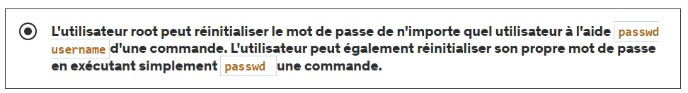
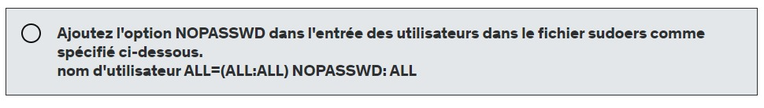
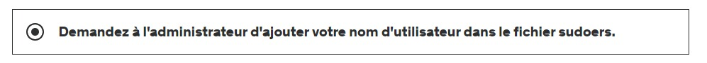
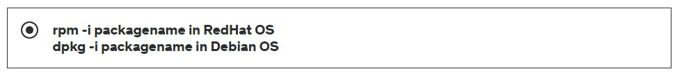
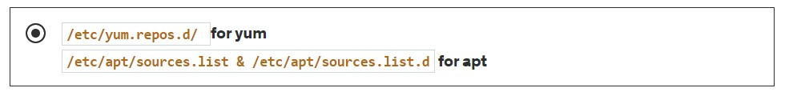
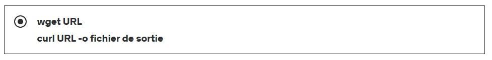
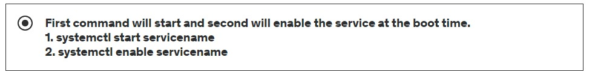
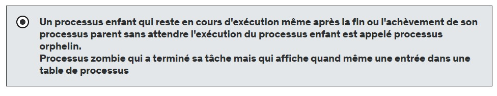
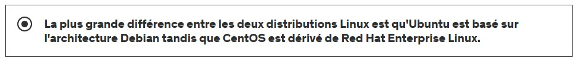
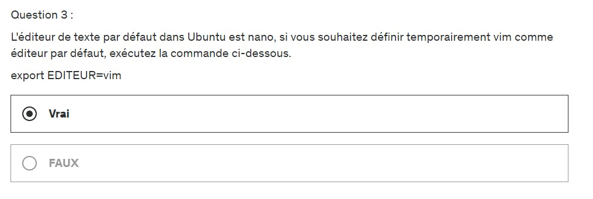

# **SECTION 4: LINUX**

| PLAN                                                  |
|-------------------------------------------------------|
| **23. Introduction à Linux**                          |
| **24. Commandes et systèmes de fichiers**             |
| **25. Plus de commandes (mkdir, cp, mv, touch etc.)** |
| **26. Éditeur Vim**                                   |
| **27. Types de fichiers**                             |
| **28. Filtres**                                       |
| **29. Redirections**                                  |
| **30. Utilisateurs et groupes**                       |
| **31. Autorisations de fichiers**                     |
| **32. Sudo**                                          |
| **33. Gestion des packages**                          |
| **34. Prestations**                                   |
| **35. Processus**                                     |
| **36. Archivage**                                     |
| **37. Commandes Ubuntu**                              |
| **38. Commandes Linux**                               |
| **39. Sortie**                                        |

---

### **Quiz 3 : Questions d'introduction à Linux**

#### **Question 1 :**
+ **Qu'est-ce qu'un logiciel open source ?**
    + **Un logiciel open source est un logiciel dont le code peut être inspecté, modifié et amélioré par n'importe qui**

#### **Question 2**
+ **Linux est un noyau de type Unix, publié sous licence GPL, crée par**
    + **`Linus Torvalds`**
---

#### **Question 3**

+ **Les données de configuration sont stockés dans les fichiers texte et ces fichiers de configuration se trouve dans le chemin ____ sous Linux ?**
    + `/etc`

#### **Question 4**
+ **Les données du serveur situés dans `var armd /srv`.**
    + `VRAI`

#### **Question 5**
+ **`RHEL et Centos` sont des systèmes d'exploitation basés sur `RPM` et `Ubuntu` est un système d'exploitation basé sur `Debian`.**
    + `VRAI`
---

### **Quiz 4 : Tester la commande de base sous Linux**

#### **Question 1 :**
+ **Comment trouver le nom et la version du système d'exploitation à partir de la CLI**
    + **`cat /etc/os-release`**
        + **Ce fichier sera présent dans tous les systèmes d'exploitation Linux**

#### **Question 2 :**
+ **La commande `whoami` est utilisée pour connaître le nom d'utilisateur actuellement connecté**
    + ***VRAI***

#### **Question 3 :**
+ **Le répertoire personnel de l'utilisateur root est ____.**
    + **`/root`**
---

### **Quiz 5 : Tester l'éditeur vim**

#### **Question 1 :**
+ **Il existe trois modes dans VIM Editor.**

    + **`mode commande - mode insertion- mode étendu`**

        + **VRAI**

#### **Question 2 :**
+ **Comment copier-coller dans l'éditeur vim.**
    + **`En mode commande(esc dans l'éditeur vim) yy et p`**

#### **Question 3 :**
+ **Comment rechercher un texte dans l’éditeur vim ?**
    + **Appuyez sur la barre oblique `/` en mode commande, tapez le texte que vous recherchez et appuyer sur entrée**
---

### **Quiz 6 : Tester les types de fichiers**

#### **Question 1 :**
+ **Quelle commande est utilisée pour trouver le type de fichier**
    + **`file<filepath>`**

#### **Question 2 :**
+ **La commande `ln -s <orignalFilePath> <LinkFilePath>` est utilisée pour créer un lien symbolique.**
    + **VRAI**

---

### **Quiz 7 : Commande Tester les filtres**

#### **Question 1 :**
+ **`grep <text> * -R` La commande recherchera le texte dans tout le fichier, dans tous les sous-répertoires.**
    + **VRAI**

#### **Question 2 :**

+ **Quelle est la commande pour trouver les 20 dernières lignes du fichier**
    + **`tail -20 <filepath>`**

#### **Question 3 :**
+ **Sélectionnez la commande pour imprimer la troisième colonne à partir du contenu du fichier CSV**

      John , Doe , 120 rue Jefferson , Riverside , NJ , 08075
      Jack , McGinnis , 220 Hobo Ave. , Phila , PA , 09119
      "John "" Da Man """ , Repici , 120 Jefferson St. , Riverside , NJ , 08075  
      Stephen , Tyler , "7452 Terrace ""At the Plaza"" road" , SomeTown , SD , 91234  , Blankman ,, SomeTown , SD , ​​00298
      "Joan "" l'os "", Anne" , Jet , "9th, at Terrace plc" , Desert City , CO , 00123

+ **`cut -d, f3 <csvfile>`**
---

### **Quiz 8 : Test Redirection**
#### **Question 1 :**
+ **Le symbole de redirection de sortie est ___**
    + **`>`**

#### **Question 2 :**

+ **Le symbole de redirection d’entrée est ___**
    + ***`<`***

#### **Question 3 :**

+ **Comment ajouter la redirection de sortie à un fichier ?**
    + ***`>>filepath`***

#### **Question 4 :**
+ **`2>>` consiste à ajouter une sortie standard à un fichier.**
    + **`FAUX`**
        + **`2 >>` consiste à ajouter une `ERREUR` standard et non une sortie**

#### **Question 5 :**
+ **`&>>` consiste à rediriger et à ajouter toute la sortie au fichier (sortie et erreur toutes les deux)**
    + **`VRAI`**
---

### **Quiz 9 : Tester les utilisateurs et le groupe**

#### **Question 1 :**
+ **Le fichier d’informations sur l’utilisateur est `/etc/group` et le fichier d’informations sur le groupe est `/etc/passwd`**
    + **`FAUX`**
        + **Le fichier d’informations utilisateur est `/etc/passwd` et le fichier d’informations de groupe est `/etc/group`**

#### **Question 2 :**
+ **`lsof -u username` listera les fichiers ouverts par l'utilisateur**
    + **VRAI**

#### **Question 3 :**
+ **Comment réinitialiser le mot de passe d'un utilisateur ?**

#### **Question 4 :**
+ **Comment basculer entre les utilisateurs dans Linux cli ?**
  + ***`su - username`***

#### **Question 5 :**
+ **Le mot de passe des utilisateurs est stocké (crypté) dans le fichier `/etc/shadow`.**
  + **VRAI**
---

### **Quiz 10 : Test File Permissions**
#### **Question 1 :**

+ **Quelle est la commande pour donner l'accès mentionné ci-dessous à un répertoire.**

  + **accès en lecture, écriture et exécution à l'utilisateur**

  + **accès en lecture et en exécution au groupe**

  + **Pas d'accès aux autres**

    + **`chmod 750 dirpath`**

#### **Question 2 :**
+ **La commande `chmod +x filepath` donnera l’autorisation d’exécution à tous les utilisateurs sur le chemin du fichier.**
  + **VRAI**

#### **Question 3 :**
+ **La commande `chown` consiste à changer le mode d'un fichier. `chmod` consiste à changer la propriété du fichier.**
  + **`FAUX`**
    + **C'est tout le contraire**
---

### **Quiz 11 : Quiz Sudo**

#### **Question 1 :**

+ **`sudo -i` la commande peut être utilisée par n’importe quel utilisateur pour passer à l’utilisateur `root`**
  + **`FAUX`**
    + **Seul l'utilisateur du fichier `/etc/sudoers` ou du répertoire `/etc/sudoers.d` peut utiliser la commande `sudo -i` pour passer à l'utilisateur `root` comme mentionné ci-dessous.**

#### **Question 2 :**
+ **Si l'utilisateur ne souhaite pas saisir son mot de passe après avoir exécuté la commande sudo, alors**

#### **Question 3 :**
+ **Si l'utilisateur normal souhaite exécuter des commandes root et que l'administrateur ne peut pas partager le mot de passe root conformément à la conformité. Que devrais tu faire?**

---

### **Quizz 12 : sur la gestion des packages**
#### **Question 1 :**
+ **Comment installer un seul paquet dans les systèmes d'exploitation `RedHat et Debian` ?**

#### **Question 2 :**
+ **Où se trouvent les fichiers de dépôt `yum et apt` ?**

#### **Question 3 :**
+ **Avant d'installer le package dans `Ubuntu` avec la commande `apt`, nous devons exécuter `apt update` pour actualiser l'index du référentiel `apt`.**
  + **VRAI**

#### **Question 4 :**
+ **Quelle est la commande pour télécharger un fichier depuis Internet ou via un réseau.**
  
---

### **Quiz 13 : Quiz sur les services**

#### **Question 1 :**
+ **Comment vérifier si un service est activé ?**
  + **`systemctl is-enable servicename`**

#### **Question 2**

+ **Comment s'assurer que le service est en cours d'exécution et apparaît après le redémarrage.**
  
+ 
---

### **Quiz 14 : Processes quiz**

#### **Question 1 :**
+ **Comment vérifier tout le processus avec leur identifiant de processus parent ?**
  + **`ps -ef`**

#### **Question 2 :**
+ **La commande `kill -9 PID` consiste à arrêter le processus avec force et `kill PID`  à arrêter le processus en douceur, les processus enfants seront également arrêtés si le processus parent est arrêté en douceur.**
  + **`VRAI`**

#### **Question 3 :**
+ **Différence entre les processus `zombie et orphelin`**
  

---

### **Quiz 15 : Quiz sur le système d'exploitation Linux**

#### **Question 1 :**
+ **Différence entre `CentOS et Ubuntu Linux`**
  

#### **Question 2 :**
+ Commande `apt dans Ubuntu` et `yum dans Centos` pour gérer les packages
  + **VRAI**

