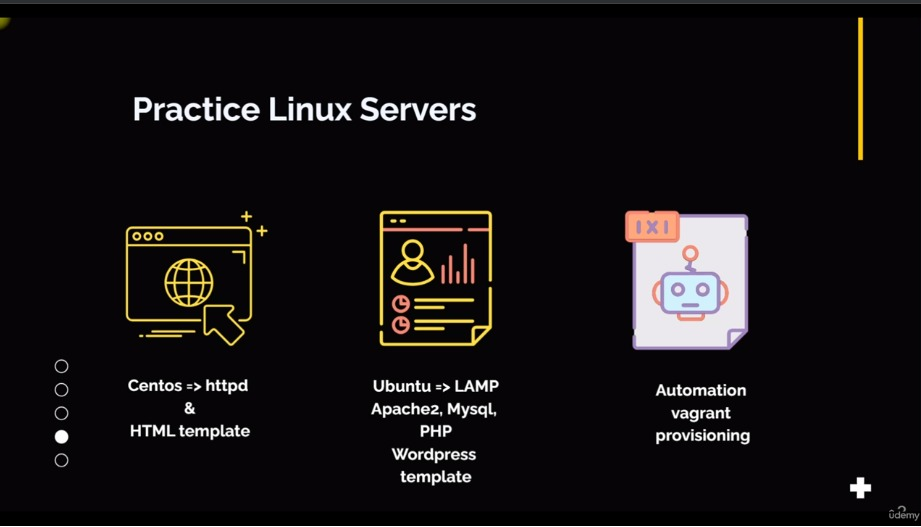

# **SECTION 5 : Vagrant & Linux Servers**

---

| PLAN                                          |
|-----------------------------------------------|
| 40. Vagrant-VMS                               |
| 41. IP, RAM et CPU vagrant                    |
| 42. Répertoires de synchronisation vagrant    |
| 43. Approvisionnement                         |
| 44. Configuration du site Web                 |
| 45. Configuration de Wordpress                |
| 46. Automatisez la configuration du site Web  |
| 47. Automatiser la configuration de Wordpress |
| 48. Fichier Vagrant multi-VM                  |

---

+ **Dans cette section du cours, nous aborderons un peu plus `vagrant`. Mais il ne s’agit pas seulement de l’outil Vagrant.**

+ **Il s'agit des concepts que vous apprendrez avec `vagrant`. Cela servira de base au lancement du `cloud computing AWS`.**

+ **Vous en apprendrez également davantage sur `vagrant`. Vous pourrez mieux gérer votre machine virtuelle avec vagrant.**

+ **Ainsi, avant la section Linux, nous avons configuré une machine virtuelle et y avons abordé quelques sujets Vagrant tels que par exemple, qu'est-ce que `Vagrant Cloud`, n'est-ce pas ?**

+ ***Là où nous avons des images de machines virtuelles, ou en vagabond, nous les appelons des boîtes. Nous avons vu le fichier vagrant dans lequel vous pouvez mentionner les paramètres de la machine virtuelle ou l'objectif principal de cette section sera sur ce dossier `vagrant`.***

+ ***Nous avons également appris les commandes vagrant telles que `vagrant up, status, ssh, halt, destroy, etc`.***

+ **Dans cette section, nous découvrirons les réseaux  `vagrant`.**

+ **Nous verrons comment nous pouvons alerter sur les `adresses IP de nos machines virtuelles en utilisant vagrant`.**

+ **Nous allons découvrir `le provisioning, qui est l'exécution automatique de commandes via le fichier vagrant`, lorsque la machine virtuelle apparaît. Dans d’autres concepts, cela s’appelle le bootstrapping.**

+ **Nous verrons `comment ajuster la RAM, le CPU et quelques autres éléments sur la machine virtuelle de dossier sur Vagrant`. Ensuite, nous verrons également comment créer plusieurs machines virtuelles via un seul fichier vagrant. Ensuite, nous examinerons également la documentation vagrant. Alors commençons.**

---

## **41. IP, RAM et CPU vagabonds**

### **Configuration Fichier Vagrant**

---

        ###################### Ubuntu ##################################
        $ cd c/vagrant-vms/ubuntu
        $ ls
        $ ls -a
        $ ls ~/.vagrant.d/

        $ cat vagrantfile
        # -*- mode: ruby -*-
        # vi: set ft=ruby :

        # Learning Vagrant

        # All Vagrant configuration is done below. The "2" in Vagrant.configure
        # configures the configuration version (we support older styles for
        # backwards compatibility). Please don't change it unless you know what
        # you're doing.
        Vagrant.configure("2") do |config|  <=== config et config.box.vm permet d'assigner un nom à notre boîte
        # The most common configuration options are documented and commented below.
        # For a complete reference, please see the online documentation at
        # https://docs.vagrantup.com.

        # Every Vagrant development environment requires a box. You can search for
        # boxes at https://vagrantcloud.com/search.
        config.vm.box = "ubuntu/jammy64"

        # Disable automatic box update checking. If you disable this, then
        # boxes will only be checked for updates when the user runs
        # `vagrant box outdated`. This is not recommended.
        # config.vm.box_check_update = false

        # Create a forwarded port mapping which allows access to a specific port
        # within the machine from a port on the host machine. In the example below,
        # accessing "localhost:8080" will access port 80 on the guest machine.
        # NOTE: This will enable public access to the opened port
        # config.vm.network "forwarded_port", guest: 80, host: 8080

        # Create a forwarded port mapping which allows access to a specific port
        # within the machine from a port on the host machine and only allow access
        # via 127.0.0.1 to disable public access
        # config.vm.network "forwarded_port", guest: 80, host: 8080, host_ip: "127.0.0.1"

        # Create a private network, which allows host-only access to the machine
        # using a specific IP.
        config.vm.network "private_network", ip: "192.168.56.14"                      <===== A décommenter. Puis Modifier l'addresse IP (composé de 4 octects)

        # Create a public network, which generally matched to bridged network.
        # Bridged networks make the machine appear as another physical device on
        # your network.
        config.vm.network "public_network"                                            <=== Cette partie est génralement en commentaire il est important de modifier. Reseau public signifie Interface de Pont. Permet de récupérer l'addresse IP de votre routeur.

        # Share an additional folder to the guest VM. The first argument is
        # the path on the host to the actual folder. The second argument is
        # the path on the guest to mount the folder. And the optional third
        # argument is a set of non-required options.

        # Windows path
        # config.vm.synced_folder "C:\\scripts\\shellscripts", "/opt/scripts"

        # MacOS path
        # config.vm.synced_folder "/Users/etienne/Desktop/scripts", "/opt/scripts"

        # Provider-specific configuration so you can fine-tune various
        # backing providers for Vagrant. These expose provider-specific options.
        # Example for VirtualBox:
        #
        config.vm.provider "virtualbox" do |vb|                  <== deécommenter cette ligne, il s'agit d'un fournisseur de points de configuration et le nom est VB
        #   # Display the VirtualBox GUI when booting the machine
        #   vb.gui = true
        #
        #   # Customize the amount of memory on the VM:
            vb.memory = "1600"                                  <=== Ajustemnt de la RAM, la valeur par défaut est 1024
            vb.cpus = "2"                                       <====== 2 CPU sont par défaut attribuer à la RAM. Vous pouvez augmenter au maximum à 3.
        end
        #
        # View the documentation for the provider you are using for more
        # information on available options.

        # Enable provisioning with a shell script. Additional provisioners such as
        # Ansible, Chef, Docker, Puppet and Salt are also available. Please see the
        # documentation for more information about their specific syntax and use.
        config.vm.provision "shell", inline: <<-SHELL
                apt-get update
                apt-get install -y apache2
            SHELL
        end

---

## **42. Répertoires de synchronisation vagrant**

+ Quelques points:
  + l'hôte est notre ordinateur portable ou de bureau.
    + l'invité est notre VM.

### **Configuration Fichier Vagrant: Paramétrage du repertoire de synchronisation**

+ Que comprendre dans cette configuration?

  + Le dossier de la machine hôte doit être crée manuellement. (Windows: double barre oblique)
  + Le dossier de la machine invitée sera crée automatiquement.
  
---

        # Windows path
        # config.vm.synced_folder "C:\\scripts\\shellscripts", "/opt/scripts"

        # MacOS path
        # config.vm.synced_folder "/Users/etienne/Desktop/scripts", "/opt/scripts"
---

+ Remarques:
    + Vous pouvez avoir autant de repertoire de synchronisation.
    + Les deux objectifs de l'utilisation du repertoire de synchronisation.
        + La première consiste à conserver les fichiers `VM` dans la machine hôte. Ainsi, si votre `VM` est abandonnée ou corrompue, vos fichiers sont en sécurité sur la machine hôte.
        + La deuxième consiste à écrire vos scripts, vos programmes dans la machine hôte en utilisant votre éditeur préféré.

## **43. Approvisionnement**

+ **Le provisionnément en vagrant** signifie exécuter des commandes ou des scripts quand la `VM` apparait ou des scripts quand la `VM` apparait pour la première fois ou si la `VM` est déjà en cours d'exécution.

### **Exemple de Provisionnement : Ubuntu**

    # -*- mode: ruby -*-
    # vi: set ft=ruby :

    # Learning Vagrant

    # All Vagrant configuration is done below. The "2" in Vagrant.configure
    # configures the configuration version (we support older styles for
    # backwards compatibility). Please don't change it unless you know what
    # you're doing.
    Vagrant.configure("2") do |config|
    # The most common configuration options are documented and commented below.
    # For a complete reference, please see the online documentation at
    # https://docs.vagrantup.com.

    # Every Vagrant development environment requires a box. You can search for
    # boxes at https://vagrantcloud.com/search.
    config.vm.box = "ubuntu/jammy64"

    # Disable automatic box update checking. If you disable this, then
    # boxes will only be checked for updates when the user runs
    # `vagrant box outdated`. This is not recommended.
    # config.vm.box_check_update = false

    # Create a forwarded port mapping which allows access to a specific port
    # within the machine from a port on the host machine. In the example below,
    # accessing "localhost:8080" will access port 80 on the guest machine.
    # NOTE: This will enable public access to the opened port
    # config.vm.network "forwarded_port", guest: 80, host: 8080

    # Create a forwarded port mapping which allows access to a specific port
    # within the machine from a port on the host machine and only allow access
    # via 127.0.0.1 to disable public access
    # config.vm.network "forwarded_port", guest: 80, host: 8080, host_ip: "127.0.0.1"

    # Create a private network, which allows host-only access to the machine
    # using a specific IP.
    config.vm.network "private_network", ip: "192.168.56.14"

    # Create a public network, which generally matched to bridged network.
    # Bridged networks make the machine appear as another physical device on
    # your network.
    config.vm.network "public_network"

    # Share an additional folder to the guest VM. The first argument is
    # the path on the host to the actual folder. The second argument is
    # the path on the guest to mount the folder. And the optional third
    # argument is a set of non-required options.

    # Windows path
    config.vm.synced_folder "C:\\scripts\\shellscripts", "/opt/scripts"

    # MacOS path
    # config.vm.synced_folder "/Users/etienne/Desktop/scripts", "/opt/scripts"

    # Provider-specific configuration so you can fine-tune various
    # backing providers for Vagrant. These expose provider-specific options.
    # Example for VirtualBox:
    #
    config.vm.provider "virtualbox" do |vb|
    #   # Display the VirtualBox GUI when booting the machine
    #   vb.gui = true
    #
    #   # Customize the amount of memory on the VM:
        vb.memory = "1600"
        vb.cpus = "2"
    end
    #
    # View the documentation for the provider you are using for more
    # information on available options.

    # Enable provisioning with a shell script. Additional provisioners such as
    # Ansible, Chef, Docker, Puppet and Salt are also available. Please see the
    # documentation for more information about their specific syntax and use.
    config.vm.provision "shell", inline: <<-SHELL
            apt-get update
            apt-get install -y apache2
        SHELL
    end

### **Exemple de Provisionnement : CentOS**

    # -*- mode: ruby -*-
    # vi: set ft=ruby :
    
    # All Vagrant configuration is done below. The "2" in Vagrant.configure
    # configures the configuration version (we support older styles for
    # backwards compatibility). Please don't change it unless you know what
    # you're doing.
    Vagrant.configure("2") do |config|
    # The most common configuration options are documented and commented below.
    # For a complete reference, please see the online documentation at
    # https://docs.vagrantup.com.
    
    # Every Vagrant development environment requires a box. You can search for
    # boxes at https://vagrantcloud.com/search.
    config.vm.box = "eurolinux-vagrant/centos-stream-9"
    
    # Disable automatic box update checking. If you disable this, then
    # boxes will only be checked for updates when the user runs
    # `vagrant box outdated`. This is not recommended.
    # config.vm.box_check_update = false
    
    # Create a forwarded port mapping which allows access to a specific port
    # within the machine from a port on the host machine. In the example below,
    # accessing "localhost:8080" will access port 80 on the guest machine.
    # NOTE: This will enable public access to the opened port
    # config.vm.network "forwarded_port", guest: 80, host: 8080
    
    # Create a forwarded port mapping which allows access to a specific port
    # within the machine from a port on the host machine and only allow access
    # via 127.0.0.1 to disable public access
    # config.vm.network "forwarded_port", guest: 80, host: 8080, host_ip: "127.0.0.1"
    
    # Create a private network, which allows host-only access to the machine
    # using a specific IP.
    config.vm.network "private_network", ip: "192.168.56.16"
    
    # Create a public network, which generally matched to bridged network.
    # Bridged networks make the machine appear as another physical device on
    # your network.
    config.vm.network "public_network"
    
    # Share an additional folder to the guest VM. The first argument is
    # the path on the host to the actual folder. The second argument is
    # the path on the guest to mount the folder. And the optional third
    # argument is a set of non-required options.
    # config.vm.synced_folder "../data", "/vagrant_data"
    
    # Provider-specific configuration so you can fine-tune various
    # backing providers for Vagrant. These expose provider-specific options.
    # Example for VirtualBox:
    #
    # config.vm.provider "virtualbox" do |vb|
    #   # Display the VirtualBox GUI when booting the machine
    #   vb.gui = true
    #
    #   # Customize the amount of memory on the VM:
    #   vb.memory = "1024"
    # end
    #
    # View the documentation for the provider you are using for more
    # information on available options.
    
    # Enable provisioning with a shell script. Additional provisioners such as
    # Ansible, Chef, Docker, Puppet and Salt are also available. Please see the
    # documentation for more information about their specific syntax and use.
    config.vm.provision "shell", inline: <<-SHELL
            yum install httpd wget unzip git -y
            mkdir /opt/devopsdir
            free -m
            uptime
        SHELL
    end

## **44. Configuration du site Web**

+ **Nous parlerons davantage de Linux. Jusqu'à présent, nous avons appris les bases de Linux.**

+ **Nous avons vu des `systèmes de fichiers, des filtres, des utilisateurs et des groupes, la gestion de pseudo-programmes, des services et les processus`.**

+ **Dans cette partie, nous parlerons de la gestion des serveurs. Comment `installer et gérer un serveur ou un service sur un système d'exploitation Linux ?` Il s’agit de renforcer votre confiance.**

+ **Vous obtenez plus de pratique, puis nous ferons quelque chose de similaire dans le cloud. Et bien d’autres sections à venir. Nous allons d’abord configurer `le service Httpd sur CentOS et déployer quelques modèles HTML`. Il s'agit d'un site Web très basique.**

+ **Le site Web terminé sera téléchargé à partir d'Internet et exécuté sur un système d'exploitation CentOS. Ensuite, nous utiliserons le système d'exploitation Ubuntu et créerons une pile de lampes.**

+ **Sa version longue est `Linux, Apache, MySQL et PHP`. Il existe de nombreuses applications qui fonctionnent avec une pile de lampes, nous allons donc créer une machine virtuelle Ubuntu sur laquelle nous installerons une lampe pile et nous déploierons le modèle WordPress.**

+ **`WordPress est une application de blog très populaire que vous pouvez exécuter sur vos machines Linux` et nous le ferons d'abord manuellement, puis nous automatiserons ces paramètres à l'aide d'un provisionnement vagrant.**

+ **Donc, à la fin, nous aurons deux fichiers vagrant : un pour configurer automatiquement les modèles HTML et l'autre pour configurer automatiquement les modèles HTML pour la configuration de modèles WordPress.**

## **45. Configuration de Wordpress**

|PLAN DE CONFIGURATION WORDPRESS|
|----|
|Aperçu|
|Installer les dépendances|
|Installer WordPress|
|Configurer Apache pour WordPress|
|Configurer la base de données|
|Configurer WordPress pour se connecter à la base de données|
|Configurer WordPress|
|Écrivez votre premier message|
|C'est tout!|

 