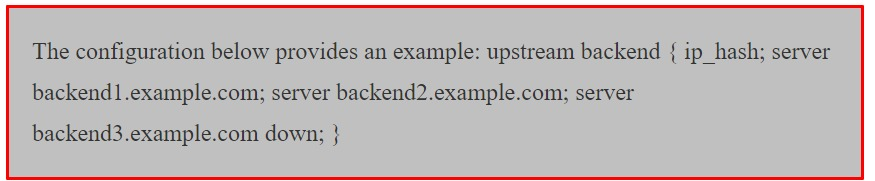

## **Architecture Des Applications Web**

+ Le but de ce chapitre est de clarifier la conception et la creation d'architectures d'infrastructures pour améliorer votre efficacité lors de la création d'applications Web.
+ Le public principal est constitué d'architectes de solutions et de responsables du développement.
+ Le guide fournit des conseils au niveau de la conception pour l'architecture et la conception d'applications `Web` basés sur `AWS et Containers`.
+ L'accent est mis sur le partitionnement de l'application en différents niveaux tels que le `niveau Web, le niveau Base de données et l'équilibrage de charge, etc`.
+ Le cœur d'une application `Web` est sa logique côté serveur et nous avons besoin qu'elle reste sécurisée et hautement disponible.

+ L'application doit être à plusieurs niveaux et non sur une seule machine.

<h1 style="color: red;">Ne mettez pas vos œufs dans le même panier.</h1>

+ Moyens:

    + **Ne faites pas tout dépendre d'une seule chose.**
    + **Ne mettez pas toutes ressources dans une seule chose.**
    + **Ne dépendez pas de votre réussite sur un seul plan.**
    + **Ne concentrez pas vos tous efforts dans un seul domaine.**

+ `La couche d'application Web` elle-même peut être composés de nombreuses couches distinctes.
+ L'exemple typique est une `architecture à trois couches` composée de présentation, de gestion et de données.
+ La figure illustre `l'architecture d'une application Web` avec des composants communs regroupés par différents domaines de préoccupation.

+ Ce chapitre traite de quelques conceptions architecturales utilisés pour les applications Web. 
+ Chaque conception fournit un ou plusieurs exemples de solutions architecturales pour une application Web moderne.

## **ARCHITECTURE DES APPLICATIONS WEB 1**

### **1. Le Concept Client et Serveur**

+ `Le développement Web` est une question de communication et de partage d'informations. Dans ce cas, communication entre deux parties, via le protocole `HTTP`:

  + `Le serveur` : Cette partie est responsable du service des pages.
  + `Le client` : Cette partie demande des pages au serveur et affiche à l'utilisateur. Dans la plupart des cas, le `client` est un navigateur `Web`.
  + `L'Utilisateur` : L'utilisateur utilise le `Client` pour surfer sur le `Web`, remplir des formulaires, regarder des vidéos en ligne, etc.

### **2. Equilibrage de Charge**

+ `L'équilibrage de charge` fait référence à une répartition efficace et habile du trafic réseau entrant sur un groupe de serveurs `back-end`, également appelé `batterir de serveurs ou pool de serveurs`.
+ Les sites `Web` modernes à fort traffic doivent répondre à des centaines de milliers, voire des millions, de requêtes simultanées d'utilisateurs ou de clients et renvoyer le texte, les images, la vidéo ou les données d'applications correctes, le tout de manière rapide et fiable.
+ Pour évoluer de manière rentable afin de répondre à ces volumes élevés, les meilleures pratiques informatiques modernes nécessitent généralement l'ajout de serveurs supplémentaires.

#### **2.1 Equilibreur de Charge**

+ Un `équilibreur de charge` agit comme un `agent du trafic` qui agi agit comme un contrôleur de trafic devant vos serveurs et achemine les demandes des clients sur tous les serveurs capables de répondre à ces demandes d'une manière qui maximise la vitesse et l'utilisation de la capacité et garantit qu'aucun serveur n'est surchagé ou surmené,ce qui dégrader les performances du serveur ou laisser tomber l'ensemble du serveur.
+ Si un seul serveur tombe en panne l'équilibreur redirige le trafic vers les serveurs en ligne restants. 
+ Lorsqu'un nouveau serveur est ajouté au groupe de serveurs, l'équilibreur de charge commence automatiquement à lui envoyer des requêtes.
+ De cette manière, un équilibreur de charge remplit les fonctions suivantes :
  + Distribue efficacement les requêtes des clients ou la charge réseau sur plusieurs serveurs.
  + Assure une haute disponibilité et fiabilité en envoyant des requêtes uniquement aux serveurs en ligne.
  + Offre la flexibilité d'ajouter ou de soustraire des serveurs comme la demande l'exige.

#### **2.2 Algorithmes d'équilibrage de charge**

+ Il existe différents algorithmes d'équilibrage de charge disponibles et chacun offre des avantages différents; le choix de la méthode d'équilibrage de charge dépend de vos besoins :

  + `Round Robin` : Les requêtes sont réparties séquentiellement sur le groupe de serveurs.
  + `Moins de connexions` : Une nouvelle demande est envoyée au serveur avec le moins de connexions actuelles aux clients. La capacité informatique relative de chaque serveur est prise en compte pour déterminer celui qui a le moins de connexions.
  + `Hachage IP` : L'`adresse IP` du client est utilisé pour déterminer quel serveur reçoit la demande.

#### **2.3 Configuration Dynamique des Groupes de Serveurs**

+ Pour une application en évolution rapide, de nouveaux serveurs doivent être ajoutés ou supprimés de manière constante.
+ Ceci est courant dans les environnements tels qu'`Amazon Elastic Compute Cloud (EC2)`, qui permet aux utilisateurs de payer uniquement pour la capacité de calcul qu'ils utilisent réellement, tout en garantissant que la capacité augmente en réponse aux pics de trafic.
+ Dans de tels environnements, il est très utile que l'équilibreur de charge puisse ajouter ou supprimer dynamiquement des serveurs du groupe sans interrompre les connexions existantes. 

#### **2.4 Equilibrage de Charge Matériel et Logiciel**

+ Les fournisseurs de solutions matérielles chargent des logiciels propriétaires sur la machine qu'ils fournissent, qui utilise souvent des processeurs spécialisés.
+ Pour faire face à l'augmentation du trafic sur votre site `Web`, vous devez acheter des machines plus nombreuses ou plus grandes auprès du fournisseur.
+ Les solutions logicielles fonctionnent généralement du matériel standard, ce qui les rend moins coûteuses et plus flexibles.
+ Vous pouvez installer le logiciel sur le matériel de votre choix ou dans des environnements cloud comme `AWS EC2`.

<h4 style="color: red;"> Remarque : Nous incluons ici Nginx comme équilibreur de charge</h4>

#### **2.5 NGINX/ NGINX plus comme Equilibreur de Charge**

+ `NGINX+ et NGINX` sont utilisés par de nombreux développeurs pour les solutions d'équilibrage de charge pour les sites `Web` à fort trafic tels que `Dropbox,Netflix, Zynga,NGINX+ et NGINX` pour diffuser le contenu de manière rapide, fiable et sécurisée.
+ Lorsque vous incluez `NGINX+` comme équilibreur de charge devant vos batteries d'applications et de serveurs `Web`, cela augmente l'efficacité, les performances et la fiabilité de votre site `Web`.
+ `NGINX+` vous aide à maximiser à la fois la satisfaction client et le routeur sur vos investissements informatiques.

#### **2.6 Comment Configurer Nginx Comme Equilibreur de Charge ?**

+ Les étapes nécessitent que l'utilisateur dispose des privilèges `root` sur votre serveur privé virtuel `(VPS)`.
+ Avant de configurer l'équilibrage de charge `nginx`, vous devez avoir installé `nginx` sur votre `VPS`. 
  + Vous pouvez l'installer rapidement avec `apt-get`:
  

#### **2.7 Module Upstream**

+ Afin de mettre en place un équilibreur de charge `round robin`, nous devons utiliser le module `mount nginx`.
+ Nous intégrerons la configuration dans les paramètres `nginx`.
+ Allez-y et ouvrez la configuration de votre site `Web`(utilisation de l'hôte virtuel générique par défaut):
  

+ Nous devons aussi ajouter la configuration d'équilibrage de charge au fichier. Nous devons d'abord inclure le module `Upstream` qui ressemble à ceci :
  

### **2.8 Redémarrer Nginx**

+ Tant que tous les serveurs privés virtuels sont en place, vous devriez maintenant constater que l'équilibreur de charge commencera à repartir également les visiteurs sur les serveurs liés.

#### **2.9.1 Directives**

+ La section précédente expliquait comment répartir équitablement la charge sur plusieurs serveurs virtuels.
+ Cependant, il existe de nombreuses raisons pour lesquelles cette méthode n'est peut-être la plus efficace pour travailler avec des données.
+ Il existe plusieurs directives que nous utiliser pour diriger plus efficacement les visiteurs du site.

#### **2.9.2 Les poids**

+ Une façon de commencer à attribuer les utilisateurs avec plus de précision consiste à attribuer un poids spécifique à certaines machines.
+ `Nginx` nous permet d'attribuer un numéro spécifiant la proportion de trafic qui doit être dirigée vars chaque serveur.
  

+ Le `poids` par défaut est `1`. Avec un `poids` de `2`, le `backend 2` recevra par exemple plus de  trafic que le `backend 1` et le `backend 3`, avec un `poids` de `4`, traitera deux fois plus de trafic que le `backend 2` et 4 fois autant que le `bacend 1`.

#### **2.9.3 Hachage**

+ Le `Hachage IP` permet aux serveurs de répondre aux clients en fonction de leur `adresse IP`, renvoyant les visiteurs vers le même `VPS` à chaque visite(sauf si ce serveur est en panne).
+ Si un serveur est inactif, il doit être marqué comme étant inactif. 
+ Toutes les `adresses IP` censés être acheminées vers le serveur en panne sont ensuite redirigées vers un autre serveur.
  

#### **2.9.4 Nombre Maximum d'échecs**
+ Sur la base des paramètres de `round robin` par défaut, `nginx` continuera à envoyer des données aux serveurs privés virtuels, même si les serveurs ne répondent pas.
+ Les échecs maximum peuvent automatiquement empêcher cela en rendant les serveurs qui ne répondent pas inopérants pendant une durée définie.
+ Il existe deux facteurs associés au nombre maximal d'échecs : `max_fails` et `fail_timeout`.
+ Le nombre maximum d'échecs fait référence au nombre maximum de tentatives infructueuses de connexion à un serveur avant qu'il ne soit considérécomme inactif.
+ `Fail_timeout` spécifie la durée pendant laquelle le serveur est considéré comme inopérant.
+ Une fois le délai expiré, de nouvelles tentatives pour accéder au serveur recommenceront.
+ La valeur du délai d'expiration par défaut est de 10s.
  

## **3. Serveur HTTP Apache**

+ Le serveur `HTTP Apache`est un logiciel de serveur `Web` multiplateforme gratuit et open source, publié selon les termes d'`Apache`.
+ `Apache` est developpé et maintenu par une communauté ouverte de développeurs sous l'`Apache Software Foundation`.
+ Le projet développe et maintient `HTTP Open Source` pour les systèmes d'exploitations modernes, notamment `UNIX et Windows`.
+ Le serveur `Web Apache HTTP` reste le serveur `Web` le plus utilisé au monde.

#### **Windows d'installation du Serveur HTTP Apache :**

+ Télécharger le serveur `HTTP Apache` du programme d'installation ici :
 + [Téléchargement](http://httpd.apache.download.cgi)
+ Assurez-vous de télécharger : `apache_2.2.16-win32-x86-no_ssl MSI`.
+ Remarque : la version du serveur `HTTP Apache` peut être différente au moment de votre installation.

#### **Installation du Serveur HTTP Apache Linux(Ubuntu)**
+ Sur `Ubuntu`, vous pouvez installer le serveur `HTTP Apache` avec la commande suivante.
  

### **4. Serveur Tomcat**
+ `Tomcat` 